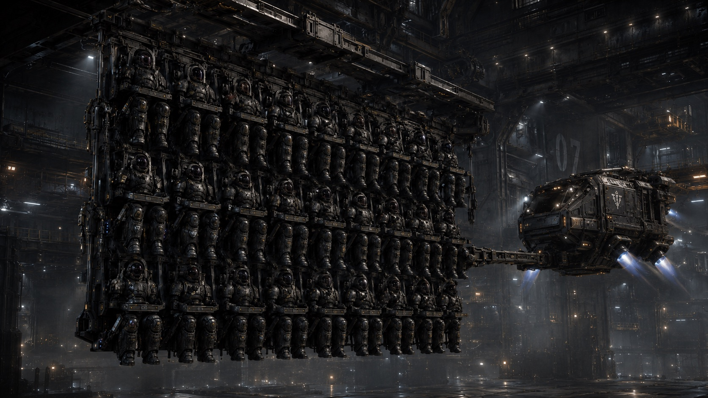

Сигнал до зборів застав Івана прямо під штангою. Огидний писк та різкий перехід сирени до своєї мелодії мало не скинув гриф прямо на груди термінатору.

— Три страхуєш!? — руки Івана тремтіли і ніяк не могли поставити штангу на держак.

Його напарник, Кирило, такий же термінатор як і він, нарешті підхопив штангу. Погляд обох зосередився на червоній лампі, яка блимала у такт сирени, але вже трохи тихіше.

— Давай до куреня, побачимо, що нам куріний за новини приніс.

Іван Донець уже другий рік проводив службу в секторі Дике Поле, куди їх ударно-штурмовий полк направили разом із декількома іншими загонами сердюків. В службу входило просте базування сил Федерації Гетьманату. Сектор знаходився глибоко в тилу космосу, куди наврядчи могла залетіти армада Імперії Сонця або ж Корпоративної Республіки. Весь полк харчувався на планеті, де розташовувалась козацька паланка та вся адміністрація. Так як цих планет уже було добіса, то і назву отримала чисто формальну – Паланка 323. Просто порядковий номер планети в секторі, та в рівень її значимості попереду нього. Паланка була заснована декілька десятків років тому, уже повністю вийшла на самозабезпечення цивільного населення. Велика кількість рабів дозволяла швидко піднімати промисловість, агропродукцію і інші необхідні для самозабезпечення речі. Єдине, що жодна з паланок не могла сама робити без дозволу Великої Ради Січі, так це виготовлення зброї та космічних кораблів. Для цього існували інші планети, які займалися створенням корпусів для кораблів, силової броні для сердюків, ковкою зброї ближнього бою, або ж варінням плазми.

Іван Федорович Донець служив термінатором, як і його батько Федір Михайлович. Батько ж Федора — старий [[../../Всесвіт/Імперії/Федерація Гетьманату/Військова Справа/Обшитований козак|Обшитований]] сердюк Михайло Кирилович Донець, був першим в їх роду, хто дослужився до найпрестижнішої спеціалізації — [[../../Всесвіт/Імперії/Федерація Гетьманату/Військова Справа/Термінатор|Термінатор]] ударно-штурмового полку космічних сердюків.

Тренування козаків, які хотіли служити в таких загонах, починалося з 6 років. Батько Івана, Федір, за свою службу сердюком мав право відправити одного сина безоплатно в курінь пластунів, що і зробив, як тільки тому прийшов свій час. Впродовж трьох років вони займались фізичним розвитком, опановували механічних бот-коней. Щоб у дітей-пластунів взагалі дах не поїхав, на літо їх відправляли на два місяці додому. Іван ще застав живого діда Михайла, що було не такою і рідкістю для термінаторів, адже в ті чачи спалахували лише місцеві конфлікти, та локальні територіальні сутички із іншими імперіями, про які, звісно, ніхто не афішував.

В десять років всі, хто здавав вступний тест, уже зараховувався до кадрових сердюків і мав доступ до навчання користуваннями всіма вогневими засобами. Свій перший вихід на другу космічну швидкість рідної планети "Збараж" Іван здійснив в дванадцять років. Пробувши в космосі разом із такими ж підлітками добу, вдало спустились на землю, навіть не заригавши тісне приміщення їхнього десятку. Для загартовування тіла, такі польоти здійснювали кожен місяць, щоб майбутні справжні космічні сердюки-термінатори уже не боялися ніяких перельотів, висадок на місяці, планети або ж абордаж кораблів харцизів. Саме в період з 12 до 15 років, якщо постійно тренуватись польоти з переаантаженням та невагомістю, можна практично нівелювати майбутні складнощі і проблеми зі здоровям.

— Може знову харцизи вилізли? — Іван в голос подумав про себе, біжучи разом з товарищами до свого куреня.

— Та чорт його, минулий раз ми ж стратили їхнього ватажка, невже вони змогли знову обєднатися? — друг Кирило не відставав поруч.

— Так, думаю, це кляті харцизи.
  
Щодо цих харцизів, це були злочинці та дезертири, які років десять тому розплодилися в сусідній планетній системі та перехоплювали вантажні і військові кораблі. Один раз навіть випадково хотіли вийти на абордаж корабля пластунів, але якимось судом ухилилися від торпед, що випустив сторожовий корабель і швидко уйшли у варп, прикриваючись планетою.
Перший свій бойовий не-варп виліт Іван здійснив в пятнадцять років у якості джури одного з ветеранів свого куреня. Він хоч і не виходив у космос разом із абордажно-ударною групою для захоплення корабля харцизів, але на своєму тілі відчув справжні перевантаження, безлад за декілька хвилин до виходу капсул та передчуття тривоги перед атакою. Як джура, він був слугою у старшого сердюка, [[Нотатки/Кирило Гнатович Скеля|Кирила Гнатовича Скелі]]. Кирило Гнатович вибрав його під час отримання звання Термінатор IV, який дається за 20 років служби сердюком. І нарешті, кожен з таких сердюків міг взяти собі по джурі в помічники. Згідно уставу сердюків, з цього дня лише старший козак міг віддавати накази своєму джурі і ніхто більше. Одного разу, інший термінатор, але із слабшим званням Термінатор ІІ, викинув Івана із душовою кабіни, і той розсік собі лоба над бровою об плитку на стіні. Кирило Гнатович це помітив, коли взнав, що сталося, почервонів як рак і кулею вилетів до коридору, де уже нападник повертався до себе після перемоги над джурою. Маючи ідеальну атлетичну форму, не дарма генетично має прізвище Скеля, він за два удари повалив кривдника, потім схопив за чуба та руку і з усієї сили пробив в стінці дірку його головою. Лише коли на нього насіли втрьох інші термоси, вони змогли вирвати жертву із його рук. В той же вечір всіх трьох заарештували та вранці поставили перед полковою суддею. Нападник отримав обнулення як покарання, йому тут же оббрили чоло до гола і зняли два ступення звання, перетворивши його з Термінатора ІІ на термоса нульового ступеня, тобто того, якого щойно прийняли в кадрові сердюки. Фактично це означало кінець службі в елітних щавелях піхотинців. Кирило Гнатович отримав 14 діб ями. Куди дозволялося лише двічі в день опускати і піднімати відро.

Іван весь свій вільний час сидів біля ями із своїм термінатором, щоб хоч якось розважити старшого. Гнатович колись служив з його батьком, Федором, то ж їм було про що побалакать. Кожен ранок Іван опускав чисте відро із їжею та водою вниз. Їжу купляв у всіх підряд, діставав як міг, бо в столовій видавали суто свою пайку і все. Благо, бариг під їх куренем вистачало, треба було лише непомітно вислизнути з куреня і купити хліба та відбивних...Всі знали, що робить джура, то ж вартові робили вигляд, що не бачать дупу Івана у тепловізор, який перелазить черех паркан. Сторожа тюрьми теж закривали на це очі, лише перевіряли, чи немає небезпечних речей у відрі і пропускали малого до старшого. Через 14 діб, рівно в 00:00 йому дозволили вийти з ями. Гнатович зміг зробити лише декілька кроків, як його ноги скрутили судоми - від того, що яма була дуже вузька, не можливо було протягнути нормально ноги.

Разом із Гнатовичем Іван прослужив пять років та отримав свій перший ступінь із званням Термінатор І. Кирило ж закінчив свою кар'єру в сердюках та обшитовався в цю ж колонію, де декілька років тому завів свою сім'ю. Винагорода за довгу службу була доволі об'ємна: повне звільнення від податків, забезпеченням їжею від колонії до кінця життя або ж отримання земельного наділу на вибір, та можливість безоплатно відправити одного з синів в пластунський полк на навчання.

— Добре, що твій Гнатович уже обшитовався, зараз оце б старому бігти за нами в курінь було б важко. — Кирило, напарник Івана чомусь згадав за його опікуна.

— Та він в такій формі досі, що і нам фору дасть. Хоча і пройшло вже три роки, як я його бачив останній раз.

Вони саме добігли до великого майдану з витоптаною травою посередині. Навколо майдану були трибуни, де і розміщалися сердюки по своїх підрозділах. Іван з Кирилом зайняли свої місця поруч з іншими і стали чекати на інформацію. Куріний [[Нотатки/Дмитро Величко (куріний)|Дмитро Величко]] уже стояв посеред майдану в чекав, коли всі зберуться.

Різький хлопок через динаміки швидко припиниа балаган сумбурного збору сердюків. Всі притихли.

— Добрі мої сердюки. — Почав курінний. — Прийшов наказ на виступ всього нашого полку для орбітально-штурмових дій на шахтарській колонії Дике Поле-17. Вона у двох стрибках від нас. Деякі з вас чули, що зв'язок з нею зник тиждень тому. Щойно, повернулись два кораблі наших пластунів, які були відправлені на розвідування ситуації навколо колонії. — Куріний ще раз хлопнув біля мікрофона на грудях, щоб збити буботіння сердюків, які почали шепотітися між собою. — УВАГА. Продовжую. Пластуни принесли страшну новину. На колонію здійснили напад війська Імперії Сонця.

Гомір між сердюками вибухнув з новою силою. Всі почали здивовано між собою перемовлятися. Куріний взяв паузу, даючи козакам виговоритись.

— Так от. — Продовжив він. — Рада Паланки відсилає наш корпус на колонію 17 для знищення військ загарбників. І, що добре, і ви цього точно не очікували, так це те, що...на нас напали ще і війська Корпоративної Республіки.

Весь стадіон та майдан вибухнули хвилею неконтрольованої агресії. З усіх сторін понеслася лайка, сердюки посхоплювались зі своїх місць, неначе уже готові були стрибати у варп і летіти до кривдників.

Куріний, добре знаючи своїх сердюків, дав їм з пів хвилини наговоритись і на цей раз різьким свистом осадив всіх на свої місця. Його ліва рука тепер лежала на довгому хлисті запханому за поясний ремінь, і кожен сердюк на своїй спині знав його смак.

— Продовжую. Колонія в повній блокаді. Вони висадили лінійні війська та ведуть штурм вулика-міста. Між корпами та свинооками була люта заруба, яка і врятувала колонію, поки що. — Куріний розвернувся на всі 360 градусів, очікуючи хоч на найменший звук чи голос. Його хлист чекав жертви, але дурних не було.

— Перший стрибок через шість днів. Через два дні всі мають бути в курені, наразі можете провідати рідних і зайнятися своїми справами.
# Старий друг

Два дні промайнули як одна хвилина. Уже вся планета знала, що їх полки відбувають в стрибок відбивати колонію від рук нападників. Біля Івана крутилась вся дітвора їх станиці, він був єдиним сердюком, який мав звання Термінатор І. То ж всі хотіли подивитися на свого козака, який всього-навсього через тиждень пролетить декілька сотень міліардів кілометрів, щоб в темній безодні зустрітися з ворожими військами і розбити їх.

Рівно через два дні Донець відбув назад, до паланки. В ілюмінатор транспортного зорельоту він бачив весь натовп, який зібрався проводжати одностаничників. Згодом, вони перетворились на цяточки, а потім і взагалі зникли. Зорельот вийшов на балістичну траєкторію і направив свій вантаж, у вигляді сотні сердюків різних звань та спеціальностей на іншу сторону планети, де і стояла сама паланка.

На плацу, де сердюки розбрідалися по своїх куренях і сотнях стояв дикий гамір та хаос. Іван з напарником Кирилом стояли і роздивлялись прапори, які висіли на височених стовпах, щоб розгледіти свій герб куреня — череп тавра із золотими рогами.

— Іване, Кириле! — раптом хтось закричав до них, перебиваючи весь гамір навколо. — Агов, ви що, сліпі?
На плацу, розмахуючи руками із мішком за плечима, стояв його атабай (старший батько, наставник), Кирило Гнатович. Обидва сердюки миттю підбігли до свого старого наставника і дуже кріпко обнялись.
— Свята Січ, як ви тут опинились? Ви ж обшитувались років з 7 тому? — Іван опустив свого трохи постарілого отагу, але його залізні мязи могли ще з легкістю дати прочухана молодшим.
— Вузькоокі напали, а я буду сидіти? У мене син уже в пластунах, ще двоє доростають. Як я можу пропустити першу міжкосмічну війну? — Гнатович легенько пробив в корпус кулаком, перевіряючи тонус свого останнього джури.
— То Вас полковник запише в курінь? Чи ви так, прошмигните зайцем? — Кирило, той що молодий побратим Івана, спитав у Гнатовича.
— Та уже вписали, ще і знайшли мій власний бойовий сердюцький термінаторський костюм. От зараз піду отримувати, як тільки зберетьсч наша сотня обшитованих.

Виявляється, як тільки в станицях взнали, що місцевий Кіш в паланці збирається встряти в протистояння з вузькооками та корпами, то всі обшитовані, та навіть пластуни на останніх рокав навчання всі як один помчали до реєстру, щоб взяли і їх. Так як кількість місць в транспорті для стрибків у варп, та і самого озброєння та броні не вистачало на всіх, то взяли лише обшитованих, у яких були на місцях кінцівки та декілька десятків пластунів, для здобуття досвіду. Старшина уже розуміла, що почалась довга війна, і перша хвиля сердюків, скоріш за все, буде вибита за рік, ну максимум два і треба уже зараз витягати і готувати наступних повноціних сердюків із новим, справжнім досвідом Великої Війни.

Біля бунчуків із гербами куренів та полків уже не було такого хаосу. Але оце відчуття якогось романтичного воєнізму зашкалювало на тисячу відсотків. То тут, то там син знаходив батька, десь цілі сімї із пяти ато і семи сердюків стояли купкою і точили ковбасу з яйцями, які їм з собою надавали їх жінки. Біля бунчука з тавром із золотими рогами Гнатович відєднався від своїх учнів та перейшов до сотні обшитованих. Загартовані в десятках боїв, абордажів, придушенню повстань дизертів та харцизів, та навіть у деяких приграничних боях з імперцями...Це був справжній ударний кулак їхнього сектору, який готовий був вибити штучні білі сапфірові зуби будь-якому корпорату-піндосу, або ж вирвати обскубані вусики сонячника і продавити їх гидотні жовті очі до мозку.

## Збори

Наступний дні всі провели за отриманням спорядження та його перевіркою, до відправки. Для варп переходу треба було вийти на транспортних суднах на другу космічну швидкість, там пересісти на транзит до колосальних човнів класу [[../../Всесвіт/Імперії/Федерація Гетьманату/Зоряна Справа/Кораблі/Кораблі класу ДАРЬЯ|ДАРЬЯ]]. А звідти уже стрибнути у варп, на допомогу.
Всі сердюки, яких перевозили у варп стрибок, сиділи в залізних кріслах в повних бойових костюмах. Зверху через голову опускався на плечі і груди великий залізний тримач, як на атракціонах швидких гірках. Кожен десяток сидів поруч, купкою. Їх одним за одним, як виноградний плод перемістили із орбітального корабля до [[../../Всесвіт/Імперії/Федерація Гетьманату/Зоряна Справа/Кораблі/Кораблі класу ДАРЬЯ|Дарья]]. Вантажне відділення не мало кисню, адже мало просто колосальні розміри. Весь корабель класу Дарья був сорок два кілометри довжиною, та 9 висоту і ширину. Величезна сосиска, всередині якої як виноград по-троху розпихували повантажувачі сердюків, заповнюючи простір як тетріс, ззовні була неначе обмотона великими направляючи рельсами. По цих рельсах їздили велики щити, до десятка кілометрів радіусом. Під час переходу у варпі саме вони за руханок обертальних рухів навколо ствола корабля створювали варп коридор і все, що було всередині циліндру, який утворювався під час руху варп-щитів, могло безпечно перестрибувати у простір із однієї точки в іншу. Наразі стрибку ще не було, то ж варп-щити стояли непохитно, лише трішки погойдувались на магнітних подушках, що проходили по рельсах. Іван лише краєм ока помітив це чудо Гетьманської космічної інженерії. Щойно щуп схопив відсік із кріслами, де сидів його десяток разом із всім інвентарем, як непомітна сила перемістила їх із внутрощів відкритого вантажного корабля до варп-колоса [[../../Всесвіт/Імперії/Федерація Гетьманату/Зоряна Справа/Кораблі/Кораблі класу ДАРЬЯ|Дарья]]. В щілину люка, куди їх затягував буксир він одним оком побачив зорю, яка світила червоно-білими променями на всю силу - саме навколо цього тіла крутилися три планети із колоніями. Світлофільтр на його бойовому скафандрі миттєво спрацював і затемнив візор, не даючи осліпнути від прямих сонячних променів. Температура за бортом стрибнула від 120С на сонці до -134С всього за пару секунд. Буксир, який керувався віддалено якимось вантажником, що сидів в декількох кілометрах в холодному офісі, легенько переніс під сотню тон сердюків, їх бойових скафандрів-костюмів, озброєння та набоїв із запасом мельти. Все було надійно запаковано ще на поверхні паланки у стандарт-ящики. Дві хвилини знадобилось, щоб десяток сердюків доставили до їх місця у трюмі та прикріпили до стінки корабля. Напроти них, так само висіло ще з пару сотень інших сердюків. Виглядало це як грона винограду, яких туди-сюди совали буксири. Радіо не дозволялося користуватися, щоб не захламляти ефір. Тож, сердюки лише мотали руками та ногами, наскільки це було можливо в їх залізній клітці, яка міцно утримувала воєнів в повних бойових скафандрах.
Нарешті буксир відчепився від них та полетів за наступним десятком сердюків. Прямо перед їх обличчям інший буксир, побільше, тягнув одночасно два атмосферних танки, які мали десантувати на поверхню Дике Поле 17. Позаду танків висів їх екіпаж. Іван підняв праву руку і помахав їм. Ті помахали у відповідь.

Погрузка всіх зайняла ще дві години. Нарешті, очікування скінчилося. Всі буксири кудись зникли. Над кожною гроною сердюків чи стандарт-контейнерами світилась зелена велика лампа. Теоретично, якщо б вона засвітилась червоним, то це б означало, що вантаж погано закріплений. Іван покрутив головою вліво та право. Скрізь, куди сягав його погляд виднілись сотні таких ламп. І всі зелені.
— Коли уже буде стрибок? Як це довго. — Про себе пробуркотів сердюк.
Як відповідь на його питання, світло у величезному відсікі їх трюму стало слабшим. У вокс передавач роботизований голос почав відлік до старту варп стрибку. При переході в просторі люди всередині взагалі нічого не відчували. Лише невелика вібрація доходила до них від величезних варп-щитів, які прямо в цю мить почали розкручуватись навколо ствола їх корабля [[../../Всесвіт/Імперії/Федерація Гетьманату/Зоряна Справа/Кораблі/Кораблі класу ДАРЬЯ|ДАРЬЯ]]. 
— ДВАДЦЯТЬ. — Голос у воксі сказав спокійним голосом.
Насправді, прямо зараз варп двигун вийшов на найбільшу потужність, яка спалювала декілька тон варп-пального в секунду, розганяючи варп-щити, щоб утворити безперервний кокон навколо корабля і здійснити прокол простору.
— ДЕСЯТЬ.
Іван, на всякий випадок, випрямив ноги, прижав, наскільки це було можливо у скафандрі, підборіддя до грудей, як це їх всіх навчили робити при балістичних та атмосферних переходах та при десантуваннях.
— П'ЯТЬ.
"Чому останні п'ять секунд робот не відбиває відлік посекундно, як це завжди робилось в інших випадках.", прокрутив Іван в своїй голові, і, схоже, початок думки ще був в системі паланки, а її кінець пройшов сотні міліардів кілометрів і закінчився в зовсім іншій системі 17.
— ПЕРЕХІД ВИКОНАНО.
Тисячі сердюків загупали своїми броньованими чоботами по своїх кріслах, як це було прийнято після варп переходів. Звісно ж, в трюмі не було повітря,  то ж все відбувалось абсолютно беззвучно. [[../../Всесвіт/Технології/Варп/Варп|Варп]]-переходи уже давно були абсолютно враховуючи те, що скрізь по системах Дикого Поля стояли [[../../Всесвіт/Технології/Варп/Варп-маяк|Варп-маяки]] і навігація працювала відміно.
— ВИХІД І ЗБІР ДО КУРЕНІВ ЧЕРЕЗ ТРИДЦЯТЬ ХВИЛИН. - У воксі пролунав роботизований голос. 

До активних бойових дій цієї армади залишались лічені години.

## Збори

Маленький буксирчик весело тягнув  Івана та ще сотню сердюків як виноградне гроно кудись в інший відсік, де величезні десантні кораблі були пристібнуті на магнітних якорях до внутрішніх ребер варп-човна. Колосальні розміри кожного із десантних і бойових кораблів були ніщо в порівнянні із безкінечним ангаром [[../../Всесвіт/Імперії/Федерація Гетьманату/Зоряна Справа/Кораблі/Кораблі класу ДАРЬЯ|маточного корабля для варп-переходів]]. Пару десятків тисяч сердюків, сотні кораблів, тисячі винищувачів, вантажників...весь трюм копошився як величезний мурашник. Лише люди в ньому сиділи намертво зафіксовані в своїх залізних кріслах і не здатними встати, чи походити. Чому не відбувались аварії під час активного переміщення кілометрів вантажів і тисяч людей, знав лише центральний комп'ютер та оператори, що керували цим всим.

Нарешті, їх контейнер, до якого були приліплені декілька десятків сердюків виноградне гроно у винограднику, причепили до величезного десантного корабля їхнього полку і затягли в буферну камеру. Лампочки на умовній стелі заблимали жовтим світлом, це означає, що в шлюз накачується кисень та скоро можна буде нарешті вилізти з цих залізних крісел. Насосам вистачило всього двадцяти хвилин, щоб підняти тиск повітря в шлюзі до потрібного і лампочки змінили колір на зелений. 

— Ура. Нарешті! - Іван проговорив про себе і відстібнув залізну раму, піднявши її над головою. Трішки відштовхнувшись від стінки крісла він розвернувся і зробив гарненькі потягуші. Тіло за ці майже двадцять годин сидіння в заклякло і дуже просилося до руху. Його прикладу послідували інші сердюкі.

— Вокс відкрито. Розминайтесь, спілкуйтесь, зливайте ваші контейнери з лимонадом. — Голос курінного не можна було сплутати навіть по вокс зв'язку, який не міг похвалитися високою якістю. — Варп перехід пройшов на сто балів із ста. Навіть нікого не загубили в космосі і не стукнули гроном по танку. Втрати відсутні. Полкова старшина уже вийшла на зв'язок із силами гайдуків, які мужньо тримають оборону уже майже як місяць.

Іван, все ще розминаючись помітив скафандр курінного, який пролітав поруч з ним. Єдиною відмінністю броні курінного та інших сердюків був силовий наріст броні посеред шолому, який був чимось схожий на чуб. Товста лінія плавно переходило в такий же "плавник" на спині броні. В цих ущільненях містилась вокс-антена, яка дозволяла передавати сигнали на велику дистанцію і одночасно приймати більше сигналів від інших сердюків. Такий-собі літаючий хаб-маршрутизатор.

— Ми прямо з корабля на вечорниці. Човни уже прямують до супутника "Дике Поле-17". Це варп радіостанція. Має прямий зв'язок із Січчю, який нападники і заглушили. Тому ніхто і не знав, що тут іде буґурт повним ходом. Для нашого полку була виділена задача по очищенню поверхні місяця та орбіти від військ [[../../Всесвіт/Імперії/Імперія Сонця/Імперія Сонця|Імперії Сонця]]. Перехоплювачі, важкі бомбери, штурмові орбітальні літуни - уже всі виходять на маршрути і починають бій. Коли зменшать для нас загрози бути збитим на підході до місяця, висуваємося ми.

Курінний продовжував літати по великому трюмі, роздивляючись свій курінь та зупиняючись ненадовго біля сотників. Іван та Кирило підлетіли до "тичинки" - клапана у вигляді тичинки рослини, куди треба було вставляти свої контейнери із сечею для утилізації. 

— Ти знав, що готують декілька груп? — Сказав Кирило, щойно залізний тубус проковтнула "тичинка" сечоприймача. — Нас готують до висадки на місяць. А інші два полки підуть на допомогу осадженому вулику-місту, там взагалі повна м'ясорубка, всі три імперії зійшлися в одному місці...Навіть не знаю, за що нам така честь? І що їм тут треба?
— Та уже пішли чутки, що на цій колонії наші робили якісь штуки для варпу, типу знайшли новий двигун, який не потребує спеціалістів від [[../../Всесвіт/Європа Юпітерна/Європа Юпітерна|Європи Юпітерної]]. Тому іншим це не сподобалося, а особливо Юпітерній і ось маємо напад.
— Як вони так далеко залетіли через варп? Тут дійсно пахне змовою із Юпітерною, без її допомоги так далеко варпануть ударні корпуси не можливо, це ж тисячі вантажних варп-барж та літаків. — Кирило вирішив доповнити свою нову пляшку для сечі і тут же висцякав ще з пів літра в неї і тут же здав в сечоприймач тичинки. Такі радощі, як заміна виведень сердюків, завжди рідки і краще користуватись моментом.
— Так, я тобі кажу це Юпітерна провела їх через маяки. Спочатку [[../../Всесвіт/Імперії/Імперія Сонця/Імперія Сонця|Імперія Сонця]] влетіла, як виявилося. А потім, через пару тижнів і [[../../Всесвіт/Імперії/Корпоративна Республіка/Корпоративна Республіка|Корпоративна Республіка]] прибула на бал. Не здивуюсь, що хитрожопі політики з [[../../Всесвіт/Європа Юпітерна/Європа Юпітерна|Європи Юпітерної]] спеціально чолом зіштовхнули нас всіх в одному місці, щоб вибити одночасно всіх із гри. 
— З іншого боку, удар [[../../Всесвіт/Імперії/Корпоративна Республіка/Корпоративна Республіка|Корпоративної Республіки]] прийшовся в тил [[../../Всесвіт/Імперії/Федерація Гетьманату/Різне/Сонячник|Сонячникам]] і вони жорстко одне одного посікли як в космосі, так і на планеті. — Підхопив Іван та рукою показав Кирилові шлях до їхнього точки збору. — Уявляєш, у тебе під двісті варп-кораблів. Ти уже спустився на планету і штурмуєш цитадель. А тут тобі в тил прилітає таке ж саме угруповування. Я думаю, втрати у них колосальні.

Їхні перемовини по особистому воксу перервав голос курінного Дмитра Величка, який наказав розходитися по своїх номерних комірках і готуватися до виходу на штурм місяця.

Іван з Кирилом залетіли до ангару з номером їх сотні, де уже деякі сердюки позаходили в комірки з повітрям та нормальним тиском для того, щоб привести себе до ладу і вдягнути бойові внутрішні скафандри. Біля дверей до кабінок почала формуватися черга з інших сердюків. Іван побачив [[Нотатки/Кирило Гнатович Скеля|Скелю]], який зі своїми [[../../Всесвіт/Імперії/Федерація Гетьманату/Військова Справа/Обшитований козак|обшитованими]] козаками стояли в черзі на перевдягання в бойове і помахав їм рукою. Іван Гнатович разом з іншими ветеранами помахав у відповідь і щось голосно кричачи в скло свого візора, але Іван та Кирило нічого не почули у воксі.

Шлюзи для перевдягання до безатмосферного бою мали вхід з однієї сторони та вихід з іншої. Кожен сердюк залітали із своїм десятком до шлюзу, чекали одну-дві хвилин на подачу тиску та кисню, після цього скидали з себе станційний герметичний скафандр для перельотів та перевдягались в бойові скафандри. В цьому їм допомогали куріні зброяри, які знали кому яка іде зброя, скафандр та особиста холодна зброя. Навколо сердюків постарше, які досягли IV рівня крутилися їхні джури, які допомогали вдягнути броню, закріпити плазмові заряди, перевірити вокс та батареї, та багато чого іншого. У Івана з Кирилом не було ще джур, то ж приходилося допомогати одне одному. Першими вдягалися синтетичний костюм на голе тіло, який мав декілька отворів для біологічних потреб. Його завдання було виводити піт та регулювати температуру шкіри. Поверх вдягався герметичний скафандр, що мав уже захищати від безодні космосу та незначних уражень. В такому скафандрі можна було вільно пересуватися в безатмосферному середовищі. Іван та Кирило по черзі встановили одне одному внутрішній візор-шолом. Спереду він був прозорим, із товстою стінкою на потилиці, через яку проходили всі конектори до скафандру для керування воксом. Сам шолом міг витримати постріли із слабких лазерів або удари шаблі. Після того, як всі сердюки були вдягнені в свої внутрішні бойові скафандри, зброярники один за одним викотили в шлюз величезні обладунки космічного сердюка-термінатора. Широкі, масивні, до чотирьох метрів заввишки це були справжні витвори мистецтва від ковалів з [[../../Всесвіт/Імперії/Федерація Гетьманату/Космічна Географія/Система Мюрид|Системи Мюрид]]. Самі обладунки були в коробах, що були закріплені до стелі шлюзу, щоб не літали в невагомості туда-сюда, шанс бути придавленим такою штукою був не малим та зазвичай летальним. Іван пізнав свій костюм по трішки потертому тризубу на лівому плечі та не докінця дофарбованій емблемі їх полку - перехресні списи. 

— Ну от і все, вороття назад немає. — Тихо про себе сказав Іван Донець, відштовхнувся від стінки, за яку тримався та залетів прямо в свій скафандр.

В невагомості вдягати такі бойові силові скафандри було набагато легше, ніж на планетах із гравітацією. Ти просто вставляв ноги всередину, трішки відштовхувався руками від задньої кришки, тобто спини обладунку, щоб ноги зафіксувалися в стопах броні, потім по одній просовував руки в рукава і за тобою закривали кришку. Комп'ютер броні автоматично розпізнавав сердюка, який в нього заліз та під'єднував візор для виводу інформації на екран.

— Раз, раз. Чуєш? — Через вокс-канал силової броні до нього звернувся зброярник, що закрив за ним кришку, замуровавши його на декілька днів в цій бляшанці.
— Чую. Сигнал 100%. 
— Система подачі кисню.
— Справна, кисень 100%.
— Система відведення життєдіяльності.
— Справна, бак 0%.
— Статус вокс-передавача.
— Локальний вокс зелений. Особистий вокс - зелений. Вокс десяти - зелений. Вокс сотні - зелений.
— Чудово. Удачі і перемоги.

Зброяр клацнув тумблером на стелі шлюху і Івана разом з Кирилом та Гнатовичем, як ляльок на жорсткій сцепке потягнули до виходу. Для безпеки всіх навколо, в таких приміщенням не дозволялося самовільно літати в бойовому силовому костюмі, щоб не задавити зброярів чи погнути якісь механізми.

Іван з радістю згадав, що висцявся за пів години до входу в силовий скафандр, тому ця неприємна процедура відкладеться надовго. З шлюзу відкачали повітря, їх двері, що вели на вихід відкрилися, натомість двері позаду них запустили наступний десяток для одягання і підготовки до бою.

В останньому шлюзі інші зброярі видали їм їх зброю, відповідно до заявок в системі, яку склали ще в паланці. Обшитовані сердюки, а з ними і Гнатович отримали своїх бойові щити, плазмові шаблі із [[../../Всесвіт/Імперії/Федерація Гетьманату/Космічна Географія/Система Мюрид|мюридської]] сталі та короткі самопали на стегно. На спину важкі термінатори повісили по декілька [[../../Всесвіт/Імперії/Федерація Гетьманату/Озброєння/Спис-джавелін|Списів-джавелінів]]. Їх магнітні тримачі ще прийняли декілька запасних [[../../Всесвіт/Імперії/Федерація Гетьманату/Озброєння/Протипіхотна Міна 15 (ПП-15)|Протипіхотних Мін]]. 

Івану та Кирилу, як термінаторам поменше дісталися важкі лазерні самопали, які здатні пропалити наскрізь легкий транспортник. На магнітні тримачі на спині приліпили чотири запасні батареї до основної зброї, один балон кисню та їжі. На ліве стегно з помітним клацанням через скафандр приліпились важкі чечуги-шаблі. Вони не було такі грізні, як у обшитованих термінаторів IV рівня: вихід плазми здійснювався лише на самому вершечку шаблі, а не майже по всьому лезу. Але і цього було достатньо: [[../../Всесвіт/Імперії/Федерація Гетьманату/Космічна Географія/Система Мюрид|мюридська]] сталь здатна була пробити силову броню ворога, а плазма лише допомогала розм'якшити сталь та проломити її. 

Після цього їх десяток, знову як гроно винограду потяг якийсь буксирок до їхньої десантної капсулі. Це був здоровений грушеподібний човен, в якому вміщалося декілька десятків сердюків та трохи техніки. Буксир передав їх гроно до внутрішнього маніпулятора, що затягнув їх всередину та прикріпив до стінки коридору, з якого через годину-дві вони всі висиплються на голови вузькооким. На великих екранах, що висіли навколо, крутився брифінг їхньої атаки, а через вокс десантної капсулі сотник розповідав про план висадки.

— Пластуни уже зв'язалися із сотнею гайдуків, які обороняють варп-станцію. — Голос сотника звучав досить хрипло як для якості воксу капсульного рівня. — Вузькоокі насіли на ворота шлюзу, хоча і зробили декілька засверлів на саму станцію, але гайдуки змогли відбитися. Вони втратили під половину своїх людей і справи у них дуже кепські. Але вони зможуть зробити фінальну атаку паралельно з нами, щоб розтягнути увагу нападників. 

Іван переглянувся із Кирилом, що сидів поруч і нервово стукав сталевим чоботом силової броні об своє залізне крісло, хоча це і не видавало ніяких звуків у відкритому космосі. Капсулю кудись відчутно потягли, скоріш за все до корабля, з якого їх всі і запустять вниз.

— Висаджуємося силами трьох сотень термінаторів. Першими ідуть обшитовані, ви і так уже старі як дуби, вас не жалко втратити першими. — Всі знали, що сотник і сам обшитований і піде в перших рядах, то ж ніяких дівчачих образ не пролунало у відповідь, лише гигіт деяких сердюків, який звісно ніхто не почув. — Проти нас будуть стояти [[../../Всесвіт/Імперії/Імперія Сонця/Військова Справа/Саманаки|Саманаки]], нарешті достойний противник, а не всяка [[../../Всесвіт/Імперії/Федерація Гетьманату/Військова Справа/Харцизи|Харцизня]]. План простий як дупа віслюка: відкриваються ворота, ви висипаєтесь згідно черги. ВСІ, кого ви бачите - це вороги. Наших гайдуків буде обмаль і ви їх пізнаєте по обладунках, та і будуть вони з іншого флангу відволікати сонячників. Біжете вперед, убиваєте всіх. Треба прорвати їх зовнішнє кільце оборони і зайти всередину, поближче до шлюзу. У них є танки. У нас теж буде два на допомогу. Але головне, що з нами буде три "[[../../Всесвіт/Імперії/Федерація Гетьманату/Військова Справа/Сколот|Сколоти]]". Це сюрприз від курінного. І їм і вам.

— Тобто плану немає. Кудись закинуть, там і будемо битися. — Кирило включив приватний вокс до Івана.
— Так, які можуть бути плани? Начебто, наші літуни теж будуть там, то ж прорідять трішки їх ряди, я сподіваюсь. А потім і ми зверху бамцнемся.
