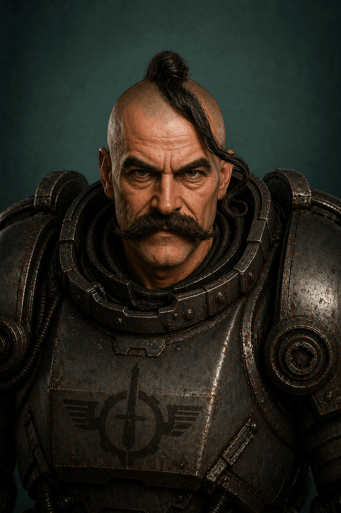

Обшитований сердюк-[[../../../Всесвіт/Імперії/Федерація Гетьманату/Військова Справа/Термінатор|Термінатор]]. Учитель та наставник Івана Донця. 

Досяг четвертого щавеля термінаторської броні.

Звання: Сердюк-Термінатор IV.

Участь в бойових діях: розгром банди харцизів в гравітаційному полі паланки "Дике Поле 17". Декілька десятків абордажів кораблів харцизів та короткі сутички із розвідниками [[../../../Всесвіт/Імперії/Імперія Сонця/Імперія Сонця|Імперії Сонця]].

Брав участь у звільнення варп-станції на місяці "Дике Поле 17" у якості охочого сердюка. Першим ступив на поверхню місяця та повів за собою сотню важких сердюків-термінаторів.