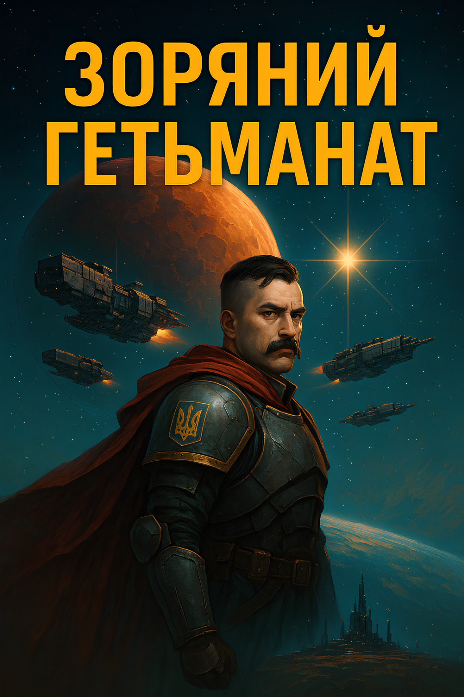
# Глава 0\. Вступ до всесвіту «Дике Поле  Sci Fi».

Здоров, щоголе\! Радий, що ти вирішив завітати до фантастичного всесвіту **«Дике Поле Sci-Fi»**\! Це — перша книга в історії української бойової космічної фантастики. У цій главі ти дізнаєшся про основні історичні події нашого всесвіту.  
Щоб тобі було легше орієнтуватися, уяви, що до приходу до влади гетьмана Івана Остаповича Виговського в 1657 році історія у нас і в «Дикому Полі Sci-Fi» була абсолютно ідентичною. Але він не лише зберіг Гетьманат, а й розширив його вплив і території. Згодом інші гетьмани завоювали всю Східну Європу та Балкани.  
У XIX столітті сформувалися три імперії, які захопили майже всю Землю. Перша — **Імперія Сонця**. Вона контролювала весь Азійський континент і Тихий океан (за винятком Австралії). Друга — **Корпоративна Республіка**. Її влада охоплювала обидві Америки, а Австралія була її васалом. І, нарешті, наша рідна імперія — [[../../Всесвіт/Імперії/Федерація Гетьманату/Федерація Гетьманату|Федерація Гетьманату]]. Вона утримувала під контролем усю Європу, Північну Африку, Близький Схід і Малу Азію. Приблизно у XX столітті імперії розпочали війну за контроль над Африкою. Це призвело до взаємних ядерних ударів по угрупованнях на континенті, що зрештою повністю знищило його та зробило непридатним для життя. З метою порятунку ситуації та деескалації конфлікту імперії підписали **Мирний ядерний договір**, який унеможливлював застосування ядерної зброї на території Землі. Наприкінці XX століття всі три імперії вийшли у космос і почали колонізацію навколишніх планет та супутників.

У 2143 році, або у нульовому році [[../../Всесвіт/Історія/Зоряна Ера|Зоряна Ера|Зоряної Ери (ЗЕ)]], було винайдено варп-двигун, який дозволив подорожувати Сонячною системою за декілька годин, а не за роки чи десятиліття. Надважкий метал Нобелій або Лоренцій став необхідним для здійснення варп-стрибків. Щоб унеможливити війни в космосі, всі три імперії поділили всесвіт — як досліджений, так і недосліджений (чорний космос) — на три сектори. Кожна імперія отримала свій сектор у вічне володіння шляхом жеребкування. Про це розповімо пізніше.  
Варп-двигун був винайдений спільно на супутнику Юпітера — Європі. [[../../Всесвіт/Європа Юпітерна/Європа Юпітерна|Європа Юпітерна]] — це дослідницька станція, де вчені з різних імперій та планет разом працювали над створенням варпу. Для стрибка необхідно було мати велике тіло з гравітацією (Юпітер), що могло розігнати реактор з лоренцієм або нобелієм і зім'яти простір, утворивши коридор до іншої точки простору.  
Першими трьома міжзоряними гостями були голови відділів розробки варп-двигуна — представники кожної з земних дозоряних імперій. До запуску людей відбулося близько сорока вдалих запусків тварин, рослин та просто предметів. Подорож була запрограмована так, що після двох діб перебування по той бік варпу корабель запускав варп-перехід назад до Пустоші Юпітера. Зібравши достатньо доказів про безпечність варп-переходу та те, що час синхронізований (тварини поверталися не молодшими і не старшими), вирішили відправити перших міжзоряних космонавтів.  
Перехід був запрограмований на три доби перебування біля Альфа Центавра з автоматичним поверненням корабля назад. Але у разі вдалого варпу з людьми вони мали повернутися через дві земні доби.  
Момент запуску корабля транслювали на всі чотири заселені тіла Сонячної системи: Землю, Марс, Європу та перший штучний супутник Землі. Близько 20 мільярдів людей з усіх імперій стали свідками, як корабель відійшов від Європи Юпітерської та направився до Пустоші Юпітера для стрибка у варп. В самій Пустоші космонавти відправили останній сигнал — «Гайда\!» — і зникли з радарів Сонячної системи. Гравітаційна хвиля переходу сколихнула планети, хоча й була зафіксована лише приладами.

Через дві земні доби чергова гравітаційна хвиля вдарила по сенсорах, розставлених навколо Пустоші. І всього за декілька годин Європа Юпітерська отримала відеосигнал із космонавтами. Астрономічний час повернення з варпу і став початком відліку нової Зоряної Епохи, або ЗЕ. Людство отримало доступ до будь-якої зірки.

## [[../../Всесвіт/Історія/Марсіанський Поділ Світу|Марсіанський Поділ Світу та Тіґарденський інцидент]]

Кожен член Європейської (Юпітерської) Міжнародної Дослідницької Станції (ЄМДС) отримував доступ до всіх розробок цієї лабораторії. У двадцять третьому році Зоряної Епохи кожна з імперій уже заснувала по одній колонії в найближчій сонячній системі — Альфа Центавра. Пошук наступних систем, здатних приймати людей, показав, що їх доволі мало, а систем із корисними копалинами — ще менше. Також стрибки у варпі були досить дорогими, адже лоренцій та нобелій нестабільні, і їх потрібно тримати лише під мікроядерними вибухами в стані спокою. Між імперіями почалися дискусії щодо того, хто має право розробляти астероїди, комети та планети і створювати там колонії.  
У 31 році Зоряної Епохи відбулася перша збройна сутичка під час дослідження системи Зорі Тіґардена — а саме на планетах, придатних для розміщення людей: Тіґарден B та C. Згідно з правилами, хто першим висаджувався на планету, той і отримував її у власність. Китайці з «Імперії Сонця» захопили Тіґарден B, де виявили великі поклади важких металів і планету, більш-менш придатну для життя. Американці з «Корпоративної Республіки» висадилися на Тіґарден C, який виявився абсолютно непридатним для освоєння шматком скелі розміром із півтори Землі. Тому під шумок корпорати захопили беззахисних колоністів на Тіґарден B, убивши їх усіх. Після цього вони сповістили Європу Юпітерську, що зайняли планету Тіґарден B. У той же час Імперія Сонця, зі свого боку, повідомила Європу, що корпорати напали на їхні кораблі в цій системі й захопили пункт керування варпом, фактично вигнавши сонячників.  
Цей інцидент увійшов в зоряну історію під назвою «Тіґарденський інцидент». Він спровокував заворушення в Сонячній системі — всі три імперії перейшли в стан неоголошеної війни. Війська Гетьманату, Корпоратів та Імперії Сонця направилися до Європи Юпітерської, щоб захопити керування та розробку варп-переходів. Входження до зони гравітації Європи означало початок першої Сонячної світової війни, адже зона Європи Юпітерської була демілітаризованою.  
Голови розробок варп-переходів з Європи Юпітерської — а саме Михайло Сагайдак, Джек Мо (马云) та Річард Столман — виступили із заявою, що будь-який подальший рух з боку будь-якої з імперій з метою захоплення варп-лабораторії спричинить колапс цивілізацій. Працівники дослідницької станції погрожували запустити варп-двигун безпосередньо на Європі Юпітерській, що викличе гравітаційний розрив і знищить супутник разом зі станцією.  
Три ударні корпуси імперій зупинилися на кордоні Європи Юпітерської, вагаючись продовжити рух. Для початку перемовин було вирішено провести конференцію на Марсі — щоб остаточно вирішити питання поділу всесвіту та узгодити умови отримання варп-двигунів.  
24 липня, 33 року зоряної епохи відбувся [[../../Всесвіт/Історія/Марсіанський Поділ Світу|Марсіанський Поділ Світу]].  
Весь всесвіт поділили на три сектори — кожен становив третину умовної сфери, що символізувала просторовий поділ. Розподіл відбувався шляхом жеребкування: кожен імператор витягував квиток із назвою сектора. Як тільки хтось витягував третій квиток певного сектора, той автоматично закріплювався за його імперією у вічне користування.  
Першим три квитки витягнув Нік Ріос, імператор Корпоративної Республіки. Вони отримали верхній правий сектор. Між соняшниками та гетьманатами спалахнула запекла боротьба — кожен прагнув отримати "лівий" сектор, адже на "нижньому" розташоване велетенське провалля Великого Пса, майже повністю позбавлене ресурсів. Імператор-Кошовий Тарас Величко та імператор сонячників Ван Ман (王莽) ніяк не могли витягнути третій квиток з "лівим" сектором — п’ять разів поспіль кожен витягував квитки з уже зайнятим космосом. Нарешті, Ван Ман витягнув "лівий" сектор, тим самим надавши своїй імперії право володарювати там, а гетьманати автоматично отримали "нижній" сектор. Хоч гети й були у розпачі, але домовленість була домовленістю.

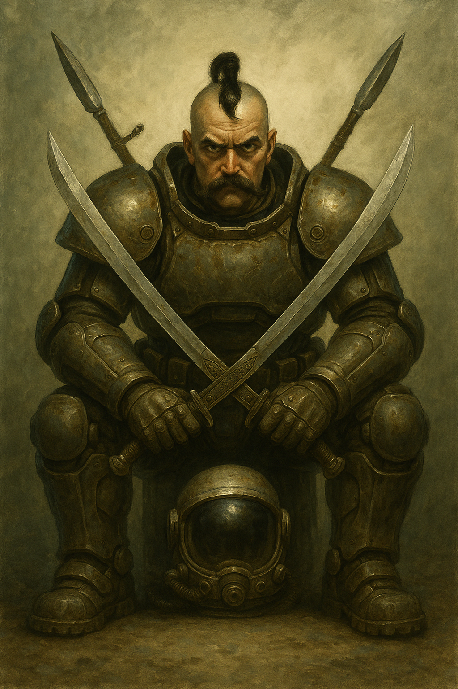
## Результати Марсіанського Поділу Всесвіту 33 року

Основні положення договору про поділ всесвіту.  
— Відповідний сектор надавався імперіям у вічне володіння.  
— Сонячна система мала стати демілітаризованою, без присутності військ будь-якої з імперій у 100-му році ЗЕ.  
— Кожна з імперій зобов’язувалася сплачувати податок на науку Європі Юпітерській для продовження розробок.  
— Імперії мали виселитися із Сонячної системи до своїх секторів.  
— Імперіям заборонялося вести розробку власних варп-двигунів.  
— Уся варп-технологія належала Європі Юпітерській.  
— Сонячна система стала демілітаризованою, з населенням близько 5–8 мільярдів.  
— Порядок підтримувався Мирними Військами, які підпорядковувалися лише трьом головам лабораторії на Європі Юпітерській.  
— Кожна з імперій мала групу представників на Європі Юпітерській.  
— Закони імперій не діяли в Сонячній системі.  
— Європі Юпітерській заборонялося проводити дослідження чи розробку будь-яких військових технологій.  
— Європі Юпітерській заборонялося віддавати перевагу будь-якій з імперій.  
Настав час двохсот років безперервного розширення варп-станцій та освоєння космосу трьома імперіями. Людство завоювало всесвіт\!  
Гетьманат остаточно виселився у 91 році ЗЕ. Зоряна Січ була заснована в надскупченні Діви. Корпорати залишили Сонячну систему у 96 році ЗЕ — «Зоряний Вашингтон» було засновано в надскупченні Кентавра. Імперія Сонця виїхала у 87 році ЗЕ, заснувавши «Зоряний Шанхай» у надскупченні Риби-Кита.  
Гетьманат вирушав у численні експедиції до різних зоряних систем і галактик у пошуках рідкісних елементів та для дослідження можливості його синтезу. У 281 році Зоряної Епохи (2424 рік Старої Епохи) було засновано колонію «Дике Поле 17» — в одній із найвіддаленіших систем галактики, що носила ту ж саму назву. Сектор отримав її через майже повну відсутність зірок, планет чи інших тіл — зонди фіксували суцільну темряву. На мапах цей регіон виглядав як чорна пляма в нескінченному просторі. Номер «17» був порядковим — Гетьманат так вперто прагнув знайти щось у цій порожнечі, що заснував сімнадцять колоній за надзвичайно короткий час.  
Дослідження на «Дикому Полі 17» були засекречені, а колонію на постійній основі охороняли три полки Космічних Гайдуків.

 У 323 році Зоряної Епохи зв’язок із колонією обірвався.

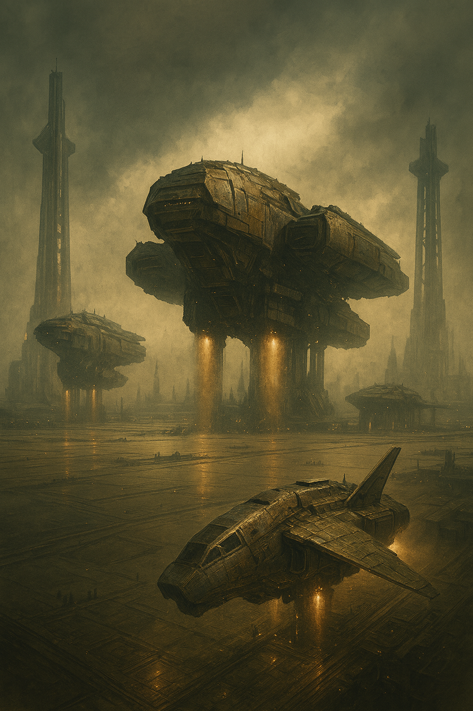
# Глава 1\. Сигнал

*Відправка повідомлення. Небажані гості з варпу.*

Мухнар, черговий зв'язківець, напівлежачи у кріслі, стежив за варп-радаром та гравітаційним уловлювачем. Він був вдягнений в світлосірий станційний костюм із срібною емблемою тризуба на обох плечах. В правій руці він крутив радіогарнітуру, прокручуючи її то вперед то назад. Червоне світло на правому навушнику свідчило про те, що гарнітуру слід було б дозарядити. Зазвичай зміни на віддалених планетах проходили взагалі без будь-яких пригод. Із розваг було лише спілкування зі своїм напарником, якого ти бачиш кожну зміну, рідкісні походи в столову або ж спілкування із зорельотами, що прямували до поверхні планети. Раз в тиждень, якщо повезе, міг прийти запит на варп[^1] перехід кораблів із новими поселенцями, або відправкою важких вантажних зорельотів класу «Чумак» в іншу систему. Місяць, на якому і розташовувався пункт варп-зв’язку, обертався навколо планети «Дике Поле 17», де знаходилося лише одне місто-вулик, а всю іншу територію континенту займали або гори, або безкрайній степ. Сама колонія була гірничодобувною — в надрах планети знайшли ледь не всю таблицю Менделєєва, то ж роботи для шахтарів Гетьманату було до кінця свого віку.  
Єдине, що було незрозуміле Мухнару, так це те, що колонію «Дике Поле 17» охороняло аж три полки космічних гайдуків[^2]. Номер «17» був суто порядковим, а приставка «Дике Поле» походило від назви темної плями в космосі, де лише зовсім недавно почали з’являтися кораблі гетів[^3]. Дальні розвідувальні зонди звітували про повну пустку. Результати варп-сканування не показували ні планет, ні зірок. Не було навіть чорних дір. Але все змінилося близько ста років тому, коли перші пластуни[^4] гетів почали повертатися із вилазок в цю пустку і звітували про зовсім іншу картину. Замість космічної пустелі тут було надзвичайно багато зоряних скупчень, від старих зірок, які от-от гепнуться, так і до щойно утворених, молодих. Коли повернулась п’ята експедиція, яка підтвердила дані всіх попередніх, рішенням Космічної Січі[^5] було прийнято почати колонізувати «Дике Поле». Сама назва була дана від назви земель, звідки почалась історія Федерації Гетьманату в далекі часи (в шостому столітті дозоряної епохи[^6]), коли гети ще жили на Землі та займали лише маленький клаптик в степах.  
В саме цей сектор і був розподілений полк «Збаражські Списи» 1589-ого корпусу гайдуків. Три роки служби пройшли взагалі без всяких пригод. Доволі швидко інженери-пластуни привели атмосферу і рослинний світ планети до стану, коли по поверхні можна було ходити і бігати без скафандрів. А зовсім скоро колонія вийшла на 60% показник самозабезпечення їжею та водою. Льодовози колосальних розмірів, деякі з яких доходили до 10 кілометрів завдовжки, ходили по дальній орбіті планети та збирали лід, який залишила за собою якась комета, що пролітала тут всього-навсього декілька міліонів років тому. Саме один з таких льодовозів цього ранку Мухнар опустив на нижчу орбіту, де кораблі поменше уже могли перемістити десятки тисяч тон льоду вниз до колонії.  
Прямо напроти робочого місця Мухнара висіли монітори, які показували трафік польотів як дальної орбіти, так і нижньої. З десяток льодовозів як човни на річці шугали туди-сюди від поверхні до колосального корабля «Мрія», розвантажуючи його замерзлий вміст. Сьогодні заявки були дуже одноманітними — передавання варп-повідомлень між паланками та дозволи на старт і швартування льодовозів на колонії «Дике Поле 17». До кінця зміни залишалося ще два дні, і потім їхній курінь[^7] зможе нарешті потрапити на поверхню й відпочити. Жити на місяці посеред білої пустелі було ще тим задоволенням. Інша ж справа відпочинок на поверхні колонії, де ти міг майже цілий тиждень займатися своїми справами, а щойно збудований комплекс відпочину на березі океану ось-ось мав відкритися для всіх.  
Майже кимарячи, Мухнар повернувся до роздумів про колонію. Величезні шпилі радіозв'язку, десятки кілометрів швартувальних та посадкових модулів — вона могла приймати надважкі космічні вантажні кораблі класу «Зоряний Чумак». Що саме виробляла колонія, Мухнар так і не зрозумів, але кількість гірничодобувних артелей та валок була вище звичайного. Поруч із вуликом-фортецею знаходився гігантський кар'єр, де працювали механічні автоматизовані роботи, здатні функціонувати за будь-яких умов, головне — подавати їм енергію. Всю руду чи породу, яку вони видобували з надр планети, транспортували по конвеєру до самої колонії, і Січ-зна, що з нею робили там.  
Щодо енергії, колонія мала чотири підземні атомні реактори. Вони були захищеними величезними коконами з плекс-бетону[^8] завтовшки кілька десятків метрів. Навіть орбітальний удар ядерними торпедами чи скидання планетарних плазмових бомб не змогли б пробити цей кокон. Швидше б планета розкололась, ніж удар досяг би атомних станцій.  
Мухнар кожну зміну повертався назад на поверхню Дикого Поля до свого куреня. Великий Отаман Космічних Гайдуків Всевід Чайковський, який керував усією колонією та трьома полками, любив гратися в козаків і постійно муштрував особовий склад. Насправді, Мухнару подобалася муштра. Висадки з «Віз-113»[^9] для зачистки кар'єру, стрибки з літаків на глайдерах через височенний паркан колонії-вулика разом із реактивними ранцями... Курінь хоч і був зв'язковим, але загальна підготовка стосувалася всіх. Великих воєн імперія не вела, хіба що сутички на суміжних секторах, бої з корсарами або придушення повстань. Та й то в цих конфліктах брала участь обмежена кількість козаків. Ти міг прослужити все життя і так і не побувати в гарячій точці. Ну і, на додаток, війни з аборигенами-тваринами, адже планети інколи підкидають цікаві варіанти еволюції, які доводиться викорчовувати плазмою...  
Мрію про відпочинок разом із друзями на поверхні перервав різкий звуковий сигнал з панелі керування. Гравітаційний уловлювач тривожно заблимав червоним світлом і вивів повідомлення: «Увага\! Зареєстровано вихід з варп-простору. Ударна хвиля – рівень крейсера». Мухнар різко випрямився та одягнув гарнітуру орбітального зв'язку. Гарнітура тричі коротко пискнула, нагадуючи про необхідність заряджання батареї. Ще трохи перебуваючи в напівсонному стані, з мріями про море, Мухнар намагався згадати, що ж він мав зробити в цей час і чи нічого не пропустив. Але жодних заявок на варп-перехід не було, або ж він про них ще не знав.  
— «Поверхня-17», це черговий орбітальної станції, код «Станція 02». Прийнято удар від варп-хвилі. Рівень хвилі — «крейсер».  
— «Станція 02», у нас не було заявок на варп-перехід, очікуйте вхідний сигнал від корабля.  
— «Поверхня 17», дайте дозвіл на переведення перехоплювачів на дальню орбіту.  
— «Станція 02», відмова. Спостерігайте за сигналом ініціації. Скоріше за все, повернулися пластуни з варп-переходу, вони не завжди попереджають.  
— «Поверхня 17», прийняв. Очікую на сигнал ініціації, — Мухнар поклав гарнітуру зв’язку на термінал.  
Сигнал на гравітаційному уловлювачі продовжував блимати, але уже не червоним кольором, а через три хвилин і зовсім перестав подавати признаки життя.  
Раптово, прямо в гарнітуру Мухнара увірвався радист з поверхні колонії.  
— «Станція 02», «Станція 02». Наказ відкрити варп-канал на Січ. Негайно доповісти про відкриття. Кодування рівня «Січ-3». — команда пролунала з планетарного вузла зв’язку без будь-яких попередніх розмов чи установки зв’язку.  
У Мухнара одночасно похололи і спітніли долоні. Липкими пальцями він поправив гарнітуру, яка ще раз нагадала йому про низький заряд батареї.  
— «Отаман 01», приступаю. — Мухнар почав швидко набирати команди на терміналі, завантажуючи програму передавання повідомлення. Він знав, що лише особистий зв’язківець наказного отамана Всевіда Чайковського мав право ось так, без попередження, увірватися до нього в гарнітуру.  
«Січ-3»? Весь його курінь зв’язку ніколи в житті не відкривав канали з вищим кодом, ніж «Паланка». Він перезирнувся з Деметром — колегою, який до цього дрімав на лаві в кутку й уже займав свій бойовий пост. Деметр відкрив ящик з ампулами, що містили голографічні коди, і простягнув одну з них Мухнару. На етикетці ампули світився напис: «Код доступу до рівня «Січ-3»». Код «Паланка» використовувався для перемов між сонячними системами. Коди категорії «Січ» же... мали прямий зв’язок із Космічною Січчю-Матір’ю. Мухнар з третьої спроби відколов кришку капсули й дістав невеличкий дисплей із кодом доступу. Він під’єднав ключ-код до термінала старшого по станції та ввів свій особистий набір цифр для дешифрування.  
— «Отаман 01», ВВЕДІТЬ КЛЮЧ ДОСТУПУ ДО КОДУВАННЯ «СІЧ». Мій ключ «Станція 02» готовий до синхронізації з вами, — Мухнар поправив гарнітуру зв’язку та відзвітував перед отаманом. Щоб уникнути помилкової відправки даних, повідомлення категорії «Січ» завжди вимагали деблокування на рівні головної варп-вежі та безпосередньо зв'язківцем наказного отамана.  
— «Станція 02», ключі синхронізовано. Починайте відсилати повідомлення, — на екрані керування варп-антеною замиготів сигнал про очікування ще одного ключа, а статусний рядок замиготів зеленим, що свідчило про достатню кількість енергії для відкриття варп-каналу.  
 Мухнар ввів 32-байтну послідовність синхронізованого ключа, ще раз перевірив її разом з Деметром, і разом натиснули педаль для початку транзакції. Раптом на його варп-радарі висвітлилося понад 40 сигналів від удару після виходу з варпу.  
— 40 одночасних виходів з варпу? Це що, сам Гетьман до нас прибув? — Мухнару вже доводилося супроводжувати перекидання гайдуків між паланками, але щоб ось так, без попередження, на радарі з’явилося сорок точок виходу з варпу — це було зовсім несподівано. — «Поверхня 17», скільки пластунів мало повернутися? Я щойно отримав 40 сигналів про варп-перехід.  
— «Станція 02», перевір сигнал. Проведи перезапуск радара, — стисло відповів планетарний зв’язківець.  
— «Поверхня 17», неможливо, радар зайнятий передачею повідомлення, — у Мухнара з'явилося тривожне відчуття, ніби щось пішло не так.  
— «Станція 02», перезапусти радар після відправлення...  
Мухнар не зміг дослухати речення, від раптового писку сигналу тривоги, який влетів в їх кімнату, як стрибок варпу. Чотири червоні лампи, прикріплені до стелі, замиготіли діодами та почали видавати ще більш огидний писк. Радар ближнього діапазону зафіксував понад 200 торпед-постановників варп-вад, що автоматично запустило сигнал тривоги. Торпеди рухалися у формі напівмісяця, оточуючи планету «Дике Поле 17» з усіх секторів космосу.  
— Треба негайно сповістити старшину — на нас напали\! — кинув Мухнар, і разом із Деметром почав гарячково набирати команди на клавіатурах, розсилаючи попередження черговим орбітальним перехоплювачам і системам планетарної оборони. Згідно розрахунків, у перехоплювачів гетів ще залишалося кілька десятків хвилин, аби встигнути вийти за орбіту та зустріти торпеди — а з ними й імовірні капсули десанту.  
— «Отаман 01». Станція варп-зв’язку щойно отримала сигнал про масовий вихід із варпу та наближення великої кількості торпед-постановників варп-вад. Загроза з космосу: орієнтовно сорок кораблів і кілька сотень торпед. Орбітальні винищувачі попереджені, — доповідав Мухнар, продовжуючи вводити команди на підняття тривоги для всіх зорельотів та вузлів орбітального захисту.  
— «Станція 02». Запускаємо код «Цитадель» до з’ясування, що це за кораблі до нас прямують. Три полки гайдуків підняті по тривозі. Продовжуйте передавати повідомлення «Січ-3». — Мухнар і Деметр чули переполох, що панував на центральному вузлі зв’язку на планеті.  
— Що це може бути? — риторично спитав Деметр свого старшого по званню Мухнара.  
— Не знаю, я таке вперше бачу. Можливо, якийсь учбовий прикол від пластунів? Вирішили перевірити нас? — Мухнар знизав плечима і продовжив відсилання команд орбітальним перехоплювачам.  
У голові в нього крутилися десятки думок — що це ще могло бути? Космічна атака невідомих корпусів? Нашестя інопланетян? Можливо, якась із паланок збунтувалася і вирішила захопити їхню колонію? Про війни цілими корпусами з варп-переходами козаки знали хіба що з дідових казок або з уроків історії Січі в епоху до Відходу.  
— Зв’язок через варп неможливий. Ворог виставив вади. Передача повідомлення «Січ-3» майже зупинена, — сповістив Деметр Мухнару, головному по станції.  
Мухнар взяв гарнітуру зв'язку з поверхнею на колонії.  
— «Отаман 01», передача варп-повідомлення не можлива, ворог блокує 90% пропускної потужності радару, стільки торпед із вадами ніхто не може подолати.  
— «Станція 02» \- , які ще варп-торпеди...Дідько... «Станція 02»...  
Зв’язок не був обірваний і Мухнар почув, як хтось вирвав гарнітуру у зв'язківця з поверхні колонії.  
— «Станція 02», це Великий Отаман Космічних Гайдуків Всевід Чайковський. Наказую вашому куреню передати БУДЬ-ЯКОЮ ЦІНОЮ, — отаман виділив останні слова і промовив їх ледь не по літерах, — варп повідомлення «Січ-3». Торпеди не можуть висіти вічність у просторі. Тримайте радар і контроль над ним допоки сигнал не буде відправлений.  
Мухнар краєм ока побачив шину зв'язку і як по ній розлетілися повідомлення до закриття колонії і переходу у режим «Цитадель». Код означав, що на колонію здійснюється атака з космосу і вона переходить на режим самовиживання. Десятки тисяч робітників, жителів та військових колонії викликались назад до вулика-цитаделі.  
— Товариш Чайковський. Наказ буде виконано. Нас три зв'язківця та три гайдуки. У випадку десанту на нашу варп-станцію ми не протримаємося і години. Прошу відправити нам підмогу.  
— «Станція 02», до вас прямує два кораблі гайдуків. Це все, що є на орбіті на чергуванні. Після їх висадки закрити станцію і тримати облогу допоки не буде відправлено сигнал. Торпеди не можуть ставити вади вічність. повторюю. Передавання сигналу має бути завершеним будь-якою ціною. У випадку десанту і захоплення варп-вежі необхідно знищити станцію. Збережи вас Січ-Мати, дай сили вам Луг-Батько. — Всевід Чайковський обірвав зв’язок.

* Ти чув голос Чайковського? Не схоже, що це прикол пластунів і нас якось перевіряють. — Мухнар повернувся до Деметра, у якого був помітний легкий тремор рук, коли він їх клав на клавіатуру.

— Деметре, наказую включити запасну жилу від генераторів та привести ШІ-турелі[^10] до бойової готовності. Також розшукай інших на станції і попередь, — промовив Мухнар до гайдука-зв’язківця, а сам продовжував відсилати сповіщення про атаку на віддалені від основного вулика невеличкі форт-хуторки.  
Деметр вискочив з кімнати та побіг коридорами шукати гайдуків-охоронців, які завжди десь просто вештались і ще треба було знайти Остапа, їх однокуріника. Його зміна заступала за декілька годин, тому, скоріш за все, він десь спав. По коридорах Деметр зупинявся біля консолей, які відповідали за ШІ-турелі.  
У Мухнара індикатор запитів на стикування із шлюзом запілікав двома сигналами.  
— «Станція 02», старшина гайдуків човна 1808Х готовий до швартування, відкрий шлюз.  
— «Станція 02», старшина гайдуків човна 1202П, ми будемо у вас на місяці через 5 хв....  
Раптово місяць затрясло. Мухнар  побачив на радарі сотні маленьких цяточок-перехоплювачів гайдуків та невідомих кораблів, які щойно вступили в бій на орбіті. Декілька десятків ракет уже досягли цілі і ударили по баштам зв'язку на місяці. Над поверхнею височіли деякі допоміжні вежі орбітального зв'язку, але все цінне обладнання було заховане глибоко під поверхнею місяці, куди навряд чи може добити торпеда. Цяточка з номером 1202П, яка наближалась до станції, раптово зникла з радару. Біля шлюзу був лише десантний корабель 1808Х.  
— 1202П, вийти на зв'язок. — Мухнар ще сподівався на якусь відповідь від корабля.  
— «Станція 02», це 1808Х, в їх двигун влучила торпеда. Вони тепер космічний пил,  збережи їх душу Луг. Ми уже в шлюзі, негайно закрий його і запускай турелі в режим авто ШІ. — Отаман десантного корабля гайдуків, який саме під’єднувався до станції, розвіяв останні сподівання у Мухнара. На його очах під сотню найкращих синів Січі були розсипані на триліони атомів разом з їх кораблем. Хоча б смерть була миттєва.  
— «Отаман 01», це «Станція 02». До нас приєднався ваш човен 1808Х. Займаємо оборону й виконуємо наказ — будь-якою ціною. Корабель 1202П втрачено, — зв’язківець коротко відзвітував на поверхню, не чекаючи на відповідь.  
Мухнар перекотив своє крісло до терміналу керування оборонними ШІ-турелями станції і став активувати їх одна за одною. Як тільки Деметр включав живлення на ШІ турелі, відповідний кружечок з’являвся і на екрані у Мухнара. Одним тицьком пальця Мухнар оновлював дані сертифікатів турелей та завантажував до них поточні криптографічні ключі. На дешифровку запиту у ворогів пішло б декілька хвилин, за які ШІ турель уже б знищила їх.  
Мухнар включив підсилювач сигналу, термінал показував 69%...і не рухався далі. Торпеди варп-вад поставили щільний щит, який не міг пробити навіть їх орбітальний радар. Торпеди оминали колонію з усіх сторін і постійно випромінювали сигнал-сміття в ефір. Хто б це не атакував, він мав колосальні можливості, якщо міг запустити декілька сотень торпед варп-вад.  
На орбітальному радарі зв'язківці «Дикого Поля 17» спостерігали за героїчними дуелями перехоплювачів гайдуків та нападників. Сотні точок, деякі зникали, деякі переставали летіти по траєкторії і поступово спускалися у атмосферу та згодом згоряли... Мухнар згадував космічну гімназію, як маленькі перехоплювачі формували формації напівмісяць, трикутник та шаблеподібну формацію. Кожен з цих тактичних прийомів слугував різним цілям, як-то перехоплення торпед, або заманювання та оточення десантних модулів. Але тоді це була симуляція бою, а наразі — гинули їх товариші-літуни.  
До кімнати зайшов Остап. Весь цей час він спав в кімнаті відпочинку, і лише сигнал «Цитадель» розбудив його.  
— Остапе, запускай перехоплювач сигналів і спробуй декодувати перемовини ворога. Візьми з собою ще чотири енергожили й активуй допоміжний ШІ. На нас іде атака\!  
Остап перестав розтирати запухле праве око й відкрив рота, спершу подумавши, що це чийсь пранк. Але десятки, навіть сотні точок на радарі, що формували різні тактичні формації, почали зникати то тут, то там. Сигнали тривоги лунали з усіх боків — і картина вимальовувалась зовсім невесела.  
Мухнар відкрив термінал керування станцією Варп-Передавача, зайшов у розділ озброєння та активував арсенал. У сусідній кімнаті щось заворушилось — було чутно, як з гуркотом відкриваються важкі двері сейфу зі зброєю. Мухнар здивовано озирнувся, зрозумівши, що Остап проігнорував його наказ. Той так і стояв посеред кімнати, поглинаючи очимами монітори орбітального зв’язку. Позаду нього зненацька з’явився Деметр, який уже встиг оббігти лівий сектор станції.  
— Деметре та Остапе, наказую: знайти інших гайдуків і забрати свою зброю із сейфа. Усім вдягнути бойові станційні скафандри — на випадок розгерметизації станції. По дорозі коридорами активуйте ШІ-турелі. Зустрічаємось у центральному холі — там чекатимемо на отамана гайдуків. До виконання — негайно\!  
Деметр штовхнув Остапа в плече, щоб вивести його з оціпеніння, і разом з ним побіг у кімнату відпочинку шукати гайдуків, які досі десь тинялися. По дорозі, просто перед їхньою кімнатою зв’язку, вже були відчинені двері до збройної комори.  
— Ти що, досі спиш? Давай швидше вдягайся та бери зброю. — Деметр похапцем вдягав скафандр та відчитував Остапа, який ніяк не міг зняти свій захисний костюм з вішалки. Сам же Деметр встиг запустити майже всі ШІ-турелі, але залишалось під’єднати страховочний канал з генератором, щоб станція буде готова відбивати орбітальні удари.  
— Це…це дійсно війна?  — Остап нарешті ледь вичавив із себе хоч щось.  
— Там під двісті варп-торпед ставлять нам вади. Я думаю, це не просто війна, а якась клята, здоровена як волові трясця величезна війна. І ми перші, хто має влупити по ним. — Мухнар взяв лазерний короткий самопал та перевірив заряд.  
Остап защебнув захисну сферу-шолом, перевірив подачу кисню та локальний вокс[^11]\-зв’язок. Його товариш прихопив два комплекти кисню й лазерних зарядів і причепив їх на магнітну стрічку на спині скафандра. Вийшовши зі збройової кімнати, вони обидва кинулися шукати гайдуків — і відразу натрапили на них за найближчим рогом. Бойова охорона зв’язківців уже була вдягнена в повні бойові станційні костюми, а за кожною спиною висів автоматичний лазерний самопал.  
— Ми отримали наказ тримати радар увімкненим будь-якою ціною — аж до відправки повідомлення. А будь-яка ціна — це ціна нашого куреня зв’язку й кількох дюжин гайдуків, які вже виходять зі шлюзу. Наказую зайняти оборону. Приготуватися і зарядити плазмгармати на випадок десанту. ШІ-турелі активовані, — пролунав голос Мухнара через станційний вокс-зв’язок.  
— Що ж це за сигнал такий? Ми ще можемо стрибнути на поверхню.., \- невпевнено сказав один з гайдуків.  
— Ніяких можемо. Моя Хата з Краю…  
— ПЕРШИМ ВОРОГА ЗУСТРІЧАЮ\!  
Всі, як один, відповіли його товариші та новоприбулі гайдуки, які щойно зайшли в станційний центральний відсік. Їх важкий крок в броньованих костюмах зівпав у такт із приказкою. До них на зустріч вискочив Мухнар.  
— Мухнар, я Іван Січнік. Командир загону космічних гайдуків. Отримав наказ підсилити рубку варп-радіо зв'язку. Командування переходить тобі, відповідно до наказу Наказного Отамана.  
Поверхню Місяця затрясло — зі стелі посипався пил. ШІ-турелі відкрили вогонь по торпедах або ракетах, що мали пробити шлюз і захисний щит. Десятки тонн уламків та вибухівки почали гатити просто по обшивці станції. Мухнар уважно розглядав обладунки підкріплення, яке щойно прибуло на оборону станції. Це були їхні побратими з полку «Збаражські Списи». Двоє з них, які саме ввійшли до центральної кімнати, мали на собі важку гайдуцьку броню — призначену для боїв у безатмосферних умовах, таких як поверхня Місяця. На лівому боці в кожного висіла важка піхотна шабля. Легке миготіння лампочки посередині гарди свідчило про наявність плазмових вкраплень у лезі — такі додавки дозволяли рубати метал і плоть одним рухом руки. Статури важких гайдуків були на дві-три голови вищі за людські, а масивні броньовані пластини на плечах і грудях робили їх схожими на бойових велетів. Сам костюм підсилювався гідравлічними модулями, що дозволяли рухати захищені суглоби за допомогою м’язового зусилля. Шолом кожного з гайдуків лежав на плечах — передня і верхня півсфери були прозорими, але могли затемнюватися залежно від умов. На потилиці виднілися кілька оптичних окулярів і допоміжних сенсорів.  
Розглядання велетнів перервала чергова черга ШІ-турелей, після якої станцію знову добряче струснуло. Поверхня місяця здригнулася, зі стелі посипався пил. Турелі відкрили вогонь по торпедах і ракетах, що намагалися пробити шлюз та броню укріплення. Тонни уламків і вибухівки глухо гримнули по зовнішній обшивці станції.  
Іван Січнік став розглядати пил, що осипався зі стелі, ніби сумніваючись, чи витримає станція наступний удар з орбіти.  
— Це плекс-бетон, найкраща марка. Може витримати до ядерного удару...тому слід боятися лише десанту з їх плазмогенами. Займаємо кругову оборону. Їжі на...два тижні. Навряд чи нам стільки світить прожити...набоїв...мало, — Мухнар нарешті відповів Січніку,  стискаючи свій укорочений лазерний самопал.  
— Мухнар, наш десантний корабель має достатньо набоїв і батарей для плазми та лазерів. Також є три набори бот-джур[^12]. Прорвемося. — Іван Січнік недовірливо посміхнувся до зв'язківця. — Також ми не якісь розвідники. А ватага швидкого реагування, у мене під керівництвом три загони важких гайдуків, які можуть дати відсічь ворогу.  
— Скільки вас точно? Для передачі сигналу необхідно тримати під контролем генератор, шпиль зв'язку та центральну рубку. Сама станція велика, але якщо деякі відсіки захоплять, нічого не станеться. — Мухнар та Деметр значно звеселились, коли почули наскільки потужний загін до них прибув.  
— Зі мною шістдесят гайдуків, є три відділення з надважким піхотним обладнанням та озброєнням. Також ще є п’ять шанцевих джури. Пропоную випустити надважких на поверхню місяця, там від них буде більше толку. Інші гайдуки уже носять комплект до вас, — видав Іван Січнік через внутрішній зв'язок.  
— Чудово, заносьте обладнання до центральної кімнати, там є відсік із госпіталем, ніколи ним не користувались, але все обладнання проходило перевірку. — Мухнар ще більше повеселішав від такої новини. Разом із ШІ-турелями та важкими піхотинцями вони здатні тримати облогу станції та навіть не давати прилунитися можливому десанту.  
Січнік мовчки кивнув своїм гайдукам, і ті миттєво зникли в нього за спиною. Через кілька хвилин вони повернулися зі стандартними ящиками амуніції: від бойових дронів до мельт-мін, а також занесли три важкі кулемети «Вепр-3».  
— Оце так чортівня\! — здивовано вигукнув Остап. — На навчаннях я стріляв лише з «Вепр-1»\!  
— «Вепр-1» — потужний комбі-скоростріл, але «Вепр-3» — це вже справжня пісня\! — гордо відгукнувся один із гайдуків, які принесли зброю. — До речі, мене звати Мирон Многогрішний.  
Козаки потисли один одному руки, наскільки це було можливо в громіздкому скафандрі гайдука-кулеметника й легкому станційному комбінезоні Остапа. Мирон помітив, що Остап буквально пожирав очима новенький скоростріл.  
— «Вепр-3» має низку покращень, — продовжив Мирон. — По-перше, вбудований гравітометр: не треба самому розраховувати гравітацію. Кулемет автоматично підлаштує траєкторію для кожної кулі. По-друге, можна під'єднати одразу два короби: один із голчастими розривними боєприпасами — проти піхоти чи натовпу дикунів, а другий — із плазмою для пробивання броні. Боєприпаси можна чергувати по черзі, для більшого ефекту. По-третє, кулеметом можна керувати дистанційно через ШІ-канал, сидячи в безпеці, поки він робить фаршмак із корпів чи вузькооких — дивлячись, хто саме на нас напав. До речі, що відомо про ворога? Це свинокорпи[^13], чи свиноокі[^14]?  
— Чорт його знає. Поки що до нас летіли тільки торпеди, а на них не написано, чиї вони, — відповів Остап, усе ще з захопленням роздивляючись «Вепр-3».  
Станцію знову струсонуло від вибухів залпів ШІ-турелей і уламків, які падали на обшивку.  
— Схоже, це сонячники[^15]. У них менші торпеди — майже не світяться на радарі, зате влучають з точністю до метра. У корпів же трохи грубші ракети й торпеди: такі собі здоровезні болванки, але якщо вже долетять, то рознесуть усе довкола, — Мухнар оголосив уже по станційному зв’язку. Доступ до запису мали лише він та Остап, проте чути повідомлення могли всі.  
— Січнік, я не бойовий гайдук, як ти, — продовжив Мухнар. — Я не зможу командувати твоїми хлопцями, та й навряд чи вони мене слухатимуть. Для виконання наказу Наказного Отамана Космічних Гайдуків «Дикого Поля 17», мені потрібні дві речі: антена варп-зв’язку і генератор, який знаходиться за кілометр від неї. Усі комунікації прокладені під поверхнею, їх практично неможливо розбомбити. Але якщо ворог висадить десант безпосередньо на станцію, антену чи генератор… у нас виникнуть серйозні проблеми, і ми не зможемо передати сигнал до кінця.  
Промову Мухнара перервала серія потужних поштовхів — кілька торпед влучили прямо в поверхню над генератором. Через монітори спостереження гайдуки побачили величезні стовпи пилу, каміння та білого диму, що здіймалися після безкисневого вибуху. Світло на мить блимнуло.  
— Не сцяти\! — весело гигикнув Остап. — Там до генераторів ще кілька десятків метрів. Це вони потрапили у вентиляційні шахти, але тих шахт розкидано по всій поверхні. Пару таких виходів є аж на дальніх схилах.  
Наче підтверджуючи його слова, освітлення припинило блимати й знову рівномірно засяяло. Гайдуки повернулися до своєї роботи, продовжуючи заносити боєприпаси на станцію. Кожен зайнявся своєю справою. Мухнар, Січнік та кілька його помічників вирушили до рубки зв'язку.  
— Остапе, виведи схему станції на стелю. Дякую, — промовив Мухнар.  
Найбільший монітор під стелею, на якому досі транслювався космічний бій, що поступово вщухав і зміщувався ближче до поверхні планети, переключився на схему варп-станції.  
— Отже, нам потрібно утримати антену та генератори. До генераторів можна дістатися через центральний хол або через вентиляційні шахти. До антени веде єдиний шлях — підземний тунель, який теж починається з центрального холу. В принципі, якщо ми утримаємо цей хол, то контролюватимемо всю станцію. Саме звідси, немов промені зорі, розходяться всі комунікації.  
— А що з вентиляцією? В яких місцях шахти виходять на поверхню? Де противник зможе засвердлитися плазмою? — уточнив Січнік, уважно вивчаючи схему й занотовуючи потрібну інформацію рухами пальців у голографічний записник на візорі свого шолома. За протоколом «Цитадель»,» кожен гайдук чи козак мав перебувати в скафандрі й мати при собі щонайменше два додаткові набори кисню.  
— Через вентиляційні шахти цілий танк «Булат»[^16] пройде, ще пролізе і стінок не помітить. Але всі виходи ретельно замасковані під поверхню. Всього таких великих віддушин три. Можливо, їх варто замінувати? У крайньому разі генератор зможе працювати без зовнішнього охолодження за рахунок власних холодокамер до чотирнадцяти днів… — Остап саме вивів на екран фотографії віддушин. Вони дійсно були величезними, близько трьох-чотирьох зростів гайдука. Найвразливіше місце станції — шлюз. І ще є можливість, що ворог спробує засвердлитися з поверхні прямо в один із коридорів, хоча це вже значно складніше.  
— Я наказую двом загонам важовиків вийти на поверхню й негайно облаштувати шанці, — правиця Січніка швидко рухала пальцями, передаючи команди підлеглим гайдукам. — Вони встановлять там два скоростріли й прикриватимуть шлюз від висадки десанту. Підходи до вентиляційних шахт генераторів замінуємо. Третій загін важовиків оборонятиме генератор із середини станції. До виконання\!  
Гайдуки миттєво розійшлися станцією, виконуючи накази отамана. Мухнар разом із Остапом та Деметром вирушили перевіряти стан ШІ-турелей. Поки що турелі ефективно стримували удари.

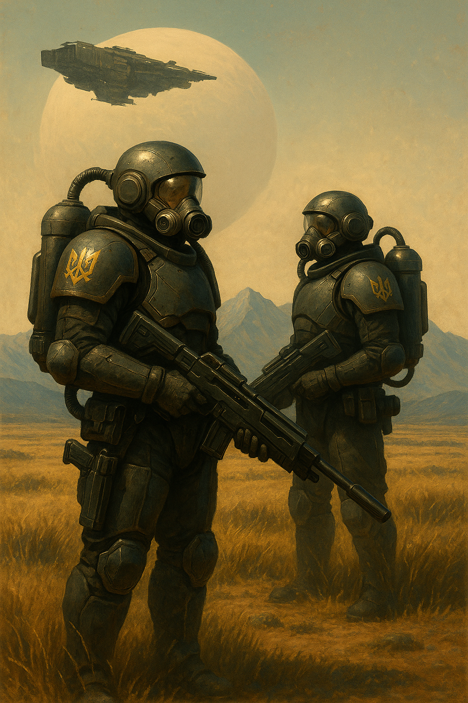
# Глава 2\. Перший Штурм

*Відпочинок.Підготовка до нових штурмів.*

Іван Калина, важкий гайдук-піхотинець — або простіше кажучи, «важовик», — переносив ящики з провізією та батареями від свого десантного шлюязу прямо до станції центрального холу, передаючи їх джурам. Його подвійний скафандр із зовнішніми бронепластинами надавав фігурі винятково масивного та грізного вигляду. Зв’язківці, не звиклі до присутності таких велетнів поруч, інстинктивно розступалися в коридорі, хоч проходи були спроєктовані так, щоб навіть два\-три важовики могли проходити одночасно.  
Калина, у передчутті бою, занурився в спогади минулих боїв та продовжував тягати амуніцію на станцію. Він та його відділення використовували скоростріл «Вепр-3», що відзначився винятковою ефективністю під час придушення повстання мюридів у системі Азов. Уся рота складалась із трьох відділень важовиків, інженерів, розвідників, кількох снайперів і десятків джур-ботів.  
Йому допомагав Данило — один із термінаторів[^17]. На станції величезний обладунок термоса[^18] був не дуже зручним, то ж Данило просто ходив в стандартному піхотному бронекостюмі. Для нього переноска «Вепра» й комплектів до нього була звичною справою. Під час цієї передбойової метушні Данило згадав знайому сцену з планети «Багдад-14» тієї ж системи Азов. Тоді отаман Іван Січнік, як головний розрахунку, зайняв вигідну позицію на піщаній поверхні, замаскувавши кулемет серед каміння. Механізована кавалерія мюридів планувала обійти гайдуків із тилу й вирізати їхню роту силовими шаблями. Та перша ж черга зі «Вепра-3» зірвала цей зухвалий маневр. Голчасті вибухові набої «Вепра» детонували за кілька метрів до цілі, розкидаючи сотні уражаючих елементів. Плазмові заряди прорізали броню коней і вершників, а титанові голки рвали плоть і дробили кістки. За пів години бою вся кавалерія мюридів була знищена. Навіть бот-коні не врятували ситуацію: маленькі голки проникали в штучні суглоби, виводили з ладу гідравліку та розривали дроти керування.  
За ту перемогу їхній полк отримав жовтий стяг із бот-конем, у черево якого врізався падаючий сокіл. Майже всі, хто нині ступив на поверхню варп-станції, носили ці нові відзнаки на броні. Перенісши ще три ящики із зарядами до плазми, Данило пішов в комору вдягати обладунки для виходу на поверхню.  
— Калина, — прохрипів у навушнику голос Січніка, — наказ: вийти на поверхню й установити «Вепр» для оборони шлюзу від десанту. Збирай усе своє відділення й починайте рити шанці. Ймовірно, сонячники вже на підльоті.  
— Прийняв. Приступаємо, — відповів Іван. Січнік мав великий бойовий досвід і незаперечний авторитет, тож Калина навіть не думав зволікати з виконанням наказу.  
Передавши коробку з консервами першому боту-джурі, він одразу надіслав повідомлення своєму відділенню: збір біля десантного корабля. Вихід на поверхню здійснювався через шлюз — спочатку потрібно було завантажити платформу всім необхідним: боєкомплектом для плазмової й лазерної зброї, ящиками з дронами, запасними бронепластинами, контейнерами з киснем.  
Зайшовши до арсенальної кімнати, Калина застав своїх гайдуків-термінаторів за процесом вбирання в силову броню. Це була складна справа, що вимагала досвіду й витривалості. Один із них — молодий гайдук Данило — щойно завершив носити амуніцію і уже починав вдягати скафандр термінатора. У свої неповні двадцять один він мав бойові відзнаки за придушення повстання на планеті Мюридів[^19]. Поруч інші гайдуки розпаковували бокси з обладнанням.  
Данило зняв із гачка стандартний скафандр, трохи підсилений у ділянці колін та ліктів. Розстібнув спинний замок, сів на лавку, засунув ноги в штанини. Магнітні фіксатори в стопах з'єдналися з характерним клацанням. Після цього він підвівся, натягнув обидва рукави, схопив довгий хлястик блискавки за спиною, підняв руку вгору й герметично закрив скафандр.  
— Майже готово. Раджу брати менший візор — у ньому зручніше сидіти в броні й не стукатись об неї, — порадив Данило, підходячи до великого ящика, де під лейблами з іменами термінаторів лежали їхні особисті візори.  
Поруч копирсався Михайло — його рідний брат, на два роки молодший. Він шукав свій візор серед ящиків, розставлених по кутках. Кожен з них виглядав як прозора сфера, а з тильного боку містилась коробочка з усіма процесорами та програмами, потрібними термінатору, з якої стирчали дроти. Нижня частина візора була зрізана й обрамлена металевим хомутом, що підходив до будь-якого скафандра.  
Данило знайшов свій візор, зняв його з полиці, надів на голову, трохи провернув ліворуч. Після характерного клацання всередині — відпустив.  
— Все, я повністю в скафандрі. Тепер можна залазити в бронекостюм.  
Процес входу до термінаторського костюма, звісно ж, був значно складніший. Броня складалася з масивних сегментів для рук, ніг і тулуба, з’єднаних між собою надміцною мембраною. Задня частина відкривалась на рівні копчика й піднімалась угору — паралельно до підлоги — через вісь під шиєю. Саме туди мав залізти гайдук.  
Костюм стояв вертикально на підлозі, броньовані руки розведені в боки під кутом у дев’яносто градусів. Обладунок утримувався стабільним завдяки двом тросам, пропущеним через кріплення на плечах і привареним до стелі роздягальні.  
Данило підійшов до нього ззаду, смикнув за маленьку ручку на поясі — броня клацнула. Пневмоприводи допомогли підняти важку задню кришку й зафіксували її у верхньому положенні. Гайдук підставив підніжку, зупинився на ній, задер ліву ногу й обережно просунув її всередину обладунку, потім те саме зробив із правою — ледь тримаючись руками за підняту броньовану кришку.  
— Як же я ненавиджу це залазання і вилазання... — пробурчав Данило через гучномовець свого скафандра.  
Цю проблему знали всі гайдуки-термінатори: входити й виходити з броні було незручно, боляче, але чомусь костюм так ніколи й не модернізували. У кожного досвідченого термоса копчик був буквально чорний — від постійних ударів об підлогу при вилізанні із броні.  
— Може, підтримати? — Михайло вже було підступив до брата, щоб той міг спертися на нього спиною.  
— Ні, — втрутився Таврид, — кожен термінатор має сам залізти і вилізти, якщо не поранений.  
Обидві ноги Данила вже були в броні. Залишалося найважче — одночасно втиснути тіло й руки в сегменти обладунку. Він тримався за підняту кришку, наче за турнік, і поволі опускався вниз, чекаючи, коли ноги нарешті торкнуться внутрішньої платформи. Відчувши під собою опору, він вигнув спину й почав занурювати тулуб глибше. Як тільки сідниця майже ввійшла, він різко відштовхнувся від кришки й швидко проштовхнув руки в рукави.  
Тулуб увійшов легко, а руки довелося буквально просунути силою — ніби натягував тісний светр. Данило хитнувся вправо, щоб звільнити ліве плече, і таки проштовхнув обидві руки до кінця. У цю мить бортовий комп’ютер увімкнувся, розпізнав гайдука за персональним ключем і активував систему пневмопідтримки.  
Все тіло ніби стало легшим — екзоскелет ожив. На візорі з’явилася панель керування. Сфокусувавши погляд на іконці «Закриття люку», Данило ворухнув пальцями в рукавичці — система зчитала команду, і задня кришка майже беззвучно почала опускатись. Як тільки вона стала в паз, автоматично активувалась система герметизації й вирівнювання тиску.  
— Нарешті. Майже готово, — промовив Данило у внутрішній вокс із полегшенням.  
Він озирнувся, рушив до зброярських ящиків, почав діставати зброю, батареї, спорядження й складати все на платформу, що мала вирушити разом з ним на поверхню.  
Михайло вже вдягнув внутрішній скафандр, коли до кімнати зайшов Аполлон Калина — рідний брат Івана Калини. Він був бойовим медиком і першим завантажив свої речі на платформу: бот-евак, додаткові кисневі балони, окиснювачі, купу запасних захисних пластин — усе необхідне для допомоги пораненим на поверхні місяця.  
Бій у безатмосферному середовищі був значно небезпечнішим, ніж у звичайних умовах, та за останні п’ятдесят років наука й технології просунулись настільки, що шанси на виживання зросли з п’яти до шістдесяти відсотків. Головне — вчасно залити пробоїну плекс-гелем, ввести ліки через спеціальний порт на скафандрі й передати пораненого бот-еваку[^20]. Той доставить козака до шлюзу або у герметичний медичний шатер.  
За десять хвилин увесь загін термінаторів був готовий до виходу, а все спорядження уже лежало на самопересувній бот-платформі.  
— Рушаємо до шлюзу, — коротко скомандував Калина й жестом скерував гайдуків на вихід.  
Данило й Михайло тягли на коліщатках «Вепр-3». Скоростріл був надзвичайно важким — понад триста кілограмів — і його можна було транспортувати лише в силовій броні, причому вдвох. Два короби з плазмопострілами вже були закріплені.  
— Чорт забери, і навіщо таку дуру придумали... — пробурчав Михайло у вокс-канал.  
Калина йшов попереду. На його правому стегні вже висіла важка піхотна силова шабля — курінний був шульгою. На гарді зброї видно було дві глибокі зазубрини — згадка про Багдад. Тоді двоє мюридів усе ж прорвали шквал вогню зі «Вепра» й дістались рукопашної.  
— Готуємось. Відсилаю запит на вихід на поверхню, — сказав Іван, окинувши оком своє відділення з восьми гайдуків. Важка броня, кілька ботів-носіїв, коробки з дронами, мельт-бомби[^21] — загін виглядав рішуче.  
Згідно з доктриною військових сил Січі, навіть медики та інженери мали носити важку броню — хоч і не завжди повноцінну термінаторську, але досить наближену. Із усієї компанії найбільш вражаючим був Данило. Як термінатор, він не носив важкого вогнепального арсеналу — лише короткий плазмовий самопал. Натомість на лівому плечі, під пахвою, висіла шабля з активним плазмовим покриттям, а кожен кулак його силової броні був озброєний величезними адамантовими шипами. За спиною — бойовий щит і важкий рогач. Усі елементи його обладунку були масивніші, ніж у будь-кого з товаришів.  
Головним завданням термінатора було не допустити прориву ворога в ближній бій із відділенням — своєрідний живий бастіон, особистий охоронець куреня. Шолом Данила кардинально відрізнявся від шоломів інших важів: напівсферична конструкція, вкрита сенсорами для кругового 360-градусного огляду. Простіше кажучи, його називали «восьминіг» — через схожість сенсорних «пуп’янків» з очима на щупальцях тієї самої істоти.  
— Виходимо зі шлюзу. Семенко, бери двох копачів і зводьте шанець на пагорбі за сто метрів звідси. Данило й Михайло, тягнете скоростріл тільки після сигналу від Семена, — дав команду Калина.  
Семенко у відповідь блиснув візором, і Іван зрозумів — усе прийнято. Семенко був бувалим інженером, випускником Академії військової інженерії на Кодаку, причому із золотим тризубом. На грудях його броні висів значок із соколом, що пробивав черево боту-коню — символ за участь у битві на «Багдаді-14». Саме Семенко тоді допоміг Січніку обрати позицію для скорострілу й замаскувати його так, що той знищив половину ворожої кавалерії ще до першого пострілу з їхнього боку.  
Звіт про готовність перервав гучний гул шлюзового агрегата. Повітря викачувалося, вирівнюючи тиск між шлюзом і поверхнею. Місячна пустка зовні була цілком позбавлена атмосфери й будь-яких ознак життя: лише біле сонце з зеленуватим відливом, світло-коричневий ґрунт та хаотично розкидане каміння — різних форм і розмірів. За кілька секунд двері шлюзу розчинились, і платформа почала підніматися на поверхню. Яскраве, зеленувато-біле світло залило приміщення. Відсутність глибоких тіней давно не дивувала гайдуків — на тренуваннях вони часто пересувались по подібних безатмосферних астероїдах та місяцях, де не було нічого, крім каміння й пилу.  
Семенко першим вибіг уперед — зводити гніздо для «Вепра-3». За ним рушили боти-копачі та кілька вантажних собак[^22]. Сервоприводи силової броні автоматично коригували зусилля відповідно до місцевої гравітації, тож хода гайдуків виглядала майже природною — наче на метричній Землі. Копачі швидко розгорнулися до роботи, і вже за десять хвилин між двома нитками окопів височіло укріплене гніздо для скорострілу. Інші гайдуки залишались біля шлюзу, патрулюючи та мінуючи потенційні зони прилунення десанту. Хоч десант Імперії Сонця теоретично міг висадитися прямо на шлюз, його обшивка була настільки товстою, що навіть таран космічним кораблем не завдав би суттєвих пошкоджень. А от висадка десь поруч — на плато — з подальшим прорізанням корпусу за допомогою мельт-зарядів або плазмогенів виглядала значно реалістичніше.  
— Гніздо готове. Приносьте скоростріл, — повідомив Семенко через локальний голосовий канал.  
— Данило, Михайле, переносьте, — коротко скомандував Іван Калина. — Аполлоне, обійди плато й розчисти від пилу локальні антени зв’язку.  
Ці невеликі металеві стрижні стирчали над поверхнею місяця. Вони були з’єднані з центральним вузлом станції й слугували ретрансляторами радіосигналу. Іноді антени засипало піском і пилом — особливо після прилунення важких кораблів.  
Боти-копачі вирили ще два бічних «вусики», що відходили від гнізда, де гайдуки вже виставляли «Вепр-3» за інженерним рівнем. Джури-боти безупинно носили короби із зарядами, а Семенко завершував встановлення маскувального полотна над позицією. Це спеціальне полотно приховувало гніздо від оптичної й інфрачервоної розвідки ворога. З висоти позиція, схожа на восьминога з розлогими лініями окопів, була повністю невидимою.  
— То що, це таки сонячники? Чи корпи? Що їм тут забулося? Навала серйозна... цікаво, як там наші інші паланки? — запитав Данило, водночас встановлюючи мельт-міну «ММ-65»[^23] посеред великого плато, що тяглося нижче їхньої позиції.  
— Так, це сонячники. Мухнар підтвердив. У корпів інша конструкція кораблів, ми б їх упізнали, — відповів Калина, сидячи на коробках із плазмопострілами та перебираючи змінні броньові пластини для своєї силової броні.  
— З ними ми ще не билися, але розвідка доповідала про їхні штурмові загони. Думаю, нас чекає дуже важкий бій. Аналітики з Січі особливо відзначали боєздатність саманаків — їхніх фанатичних штурмовиків.  
Він відклав дві запасні пластини й знову приклався до дальноміра, передаючи зібрані дані у свій ШІ-комп’ютер.  
Саманаки, або ж штурмовики Імперії Сонця, були генетично вдосконаленими воїнами — ветеранами, що вижили після надзвичайно складної процедури тілесних модифікацій. Вояки ж Імперії Гетьманату, навпаки, залишались природними людьми без жодних генетичних змін — гени їх несли чисту кров без скверни. Саманаки складали лише невеликий відсоток у складі сил Імперії Сонця, основну ж тяжкість боїв тягнули на собі звичайні піхотинці — так само, як і у гетів.  
Тим часом Аполлон саме завершив очищення ще одного локального вокс-передавача, коли його брат Іван отримав термінове повідомлення від Мухнара: десантні кораблі вже на підльоті.  
— Гайдуки, швидше\! Часу майже немає, десант уже в дорозі\! — гримнув Іван у вокс-канал свого відділення. Потім, зі зміненою гравітаційною підтримкою в силовій броні, за п’ять стрибків приземлився біля скорострілу «Вепр-3». — Данило, займи шанець позаду нас, прикриваєш тил від можливих підкопів. Семенко, вистав два комплекти сокіл-дронів біля «Вепра» й активуй їх\!  
Данило вирішив не вимикати автокоректор гравітації у своїй броні — і просто побіг, як по землі, назад до своєї траншеї. Стрибнув у довгий «вусик»-окоп, де вже лежало його спорядження, й узявся готуватись до бою. Оскільки він був призначений для ближнього бою, його комплект зброї складався зі списа, щита й короткого плазмового самопала. У слоти на спині біля лопаток Данило вставив два сокіл-дрони. Їхнє головне завдання — перехоплювати ударні дрони або боєві скиди ворога. Вони працювали за радіонаведенням і самостійно приймали рішення про атаку ворожої цілі над головою господаря.  
Термінаторський щит із важким клацанням зафіксувався в пазах на лівій руці. На верхньому правому куті щита загорівся дисплей рівня заряду. Цей щит був здатен витримати прямий обстріл плазмою та лазерами — завдяки вбудованим батареям і особливому матеріалу, з якого його кували на планеті Канів. Такий захист могли носити тільки козаки в надважкій броні. Особиста зброя — важка шабля — щільно висіла на лівому стегні. Вона не заважала правій руці керувати списом і не чіплялася за щит на лівій.  
— Мухнар доповідає про наближення десяти десантних човнів. Найімовірніше, всі вони спробують висадитися на цьому плато — прямо перед нами, щоб захопити шлюз, — Калина знову звернувся до своїх гайдуків через вокс-зв’язок. — Михайле, працюєш з «Вепром» разом із Многогрішним. Усі інші — прикриваємо шанці. Я синхронізував координати — скоростріл працює в єдиній мережі з моїм лазером.  
Плато, де розташовувався шлюз, займало близько двадцяти квадратних кілометрів. Воно виникло мільярди років тому внаслідок падіння невеликого метеорита. Згодом краї кратера осипалися під дією місцевого сонця та дрібних космічних ударів, утворивши ландшафт, схожий на мілку чашу. Десятки рівчаків, тріщин і западин розсікали інакше майже рівне дно. В деяких із цих заглиблень без проблем міг заховатися цілий загін гайдуків. Сам шлюз був зведений інженерами з паланки двадцять років тому, просто в центрі кратера. Його побудували з плекс-бетону — надміцного композиту, який доставляли сюди ще рідким на гігантських десятикілометрових орбітальних баржах. Станція була повністю підземною, за винятком антени зв’язку, шлюзу та кількох службових споруд. Дві широкі посадкові смуги дозволяли приймати кораблі до двохсот метрів завдовжки — вони могли легко прилунитися, вивантажитись і стартувати назад. Ці майданчики вважалися чи не найміцнішими об’єктами в усьому секторі — глибина заливки плекс-бетону сягала п’яти, а подекуди й восьми метрів.  
Сама споруда шлюзу височіла на краю посадкової смуги. Зовні вона скидалася на дощового черва, що виглянув із ґрунту вдихнути повітря. Уся навколишня територія, не зайнята бетонними смугами, була звичайною місячною поверхнею — її легко можна було рити, формувати, перетворювати на укріплені позиції завдяки ботам-копачам.  
Роздуми Данила про плато перервав низький гул і легкий тремор, що прокотився поверхнею. Усі гайдуки піднялись зі своїх шанців і виглянули — над плато гримнули перші залпи ШІ-турелей, які вже почали працювати по десантним кораблям ворога.  
Близько десятка важких гармат били по чорній безодні космосу, випускаючи чергу за чергою своїх величезних болванок. Самих десантних кораблів ще не було видно — аж поки вони не ввімкнули стопові двигуни, зменшуючи швидкість перед прилуненням. Тоді в полі зору з’явилися яскраві, біло-світлі цяточки. Данило нарахував десять. Саме до них прямували трасери турелей.  
Гарматні пари працювали злагоджено: дві установки одночасно брали на приціл одну ціль, засипаючи її зливою пробивних болванок упереміш із плазмовими зарядами. Плазма мала розплавити броню обшивки, а снаряди — пробити її наскрізь. Данило добре знав: якби на місяці була атмосфера, його вуха давно б луснули від цих залпів. Але у вакуумі звук не поширювався — лише вібрація передавалась крізь ґрунт. І ця вібрація відчувалась скрізь. Вона зуділа в стопах, пробігала по броні, нила в кістках. Якщо покласти руку на землю, можна було вловити дрібне тремтіння — ритмічний пульс оборони.  
Стрічки трасерів від турелей сходилися в одній точці — саме туди, де ще хвилину тому був порожній космос. Перші три десантні човни вибухнули майже одночасно. Мозок Данила інстинктивно домалював звук — гучне рвання корпусу, ударні хвилі, брязкіт уламків, що сипляться на плато. Але в реальності все відбулося в мертвій тиші. Лише мікровібрації, що прокотилися поверхнею місяця, дали зрозуміти: зверху гепнулося кілька сотень тонн палаючого ворожого брухту.  
За трьома першими спалахами одразу ж послідували ще два. Турелі, які обороняли варп-станцію, були налаштовані на миттєве знищення невідомих об’єктів: якщо за кілька сотень мілісекунд вони не декодували сигнал «свій», система ШІ вважала їх ворогами. І перші дві вільні установки відкривали вогонь — без попереджень. З неба продовжували сипатися уламки розбитого десанту. Данилу навіть здалося, що він побачив вогненну бойову машину, що вирвалась із розбитого корабля — палаюча синьо-жовтим полум’ям, вона летіла, обертаючись, просто на плато. Втім, ще п’ять ворожих кораблів не були знищені. Вони все ще сповільнювали спуск, готуючись до посадки.  
Данило міцно стиснув спис. Перевірив щит — індикатор показував повний розряд, як і треба: порожня батарея могла прийняти енергію лазерного удару, акумулювати її і таким чином знизити пробивну дію пострілу.  
— До бою\! — проревів у локальний вокс Калина. — Семенко, два соколи-убивці в небо — в правий десант\! Многогрішний і Михайле — скоростріл на ліво\! Стріляти чергами: три постріли плазмою, три — голками, потім — одночасна подача з обох коробів\! Як тільки ворота відкриються — вогонь\! Усі решта — зайняти позиції, стріляти лише по команді\!  
По воксу пролунали підтвердження від усіх гайдуків.  
Данило сидів у шанці позаду і не бачив повної картини підготовки. Поруч джури-боти, які підносили боєприпаси від шлюзу, синхронно вимкнулися й опустились на землю, як пси, що лягли в тіні буди. Вони мали лише ноги — з суглобами, вигнутими назад, наче у страусів. Замість голови — дві камери й блок із нейронною схемою. Там, де в тварини був би хвіст, стирчала велика передавальна антена.  
Раптово по землі прокотився потужний поштовх, пісок на поверхні заворушився й здійнявся в дрібні хмари. Данило підняв голову над краєм шанця — й одразу побачив гігантський стовп вогню, що злетів у небо на десятки метрів. Навіть ті гайдуки, що мали лише чекати команди, висунулися з укриттів, аби подивитись на видовищне дійство.  
Один із десантних кораблів сонячників сів просто на подвійну мельт-міну, яку Данило з Михайлом заклали напередодні на плато. Та міна містила майже сто кілограмів чистої мельт-речовини — достатньо, щоб пробити навіть зоряний крейсер. Корабель завис над поверхнею на мить — і тоді магнітний детонатор спрацював. Струмінь розпеченої мельт-плазми рвонув угору, пробив днище десантного корабля наскрізь. Величезні уламки з гуркотом розлетілися в різні боки — один, розміром із самого термінатора, пронісся всього в кількох метрах від траншеї, де ховався Данило. Підбитий корабель повільно похилився набік і беззвучно врізався в поверхню місяця. Через мить із його корпусу почав здійматись густий чорний дим, пронизаний зеленуватими прожилками. Усередині щось палахкотіло, ледь вгадуване крізь розжарений отвір у днищі.  
Інший же корабель, ще до повного прилунення, відкрив свої фронтальні ворота й уже майже торкався поверхні. Як тільки ворота опустилися, в них вдарила черга зі скорострілу «Вепр-3». Плазмові снаряди добре видно — особливо на такій контрастній поверхні, як підсвічений місяць.  
У перших лавах штурмовиків Імперії Сонця йшли термінатори, розміром із самого Данила. Але виглядали вони... витонченіше. Не такі масивні, не грубі, як гайдуцькі, а радше схожі на старовинних воїнів-ніндзя, яким видали силову броню й виштовхнули в космос. У кожного в руках — по щиту, але на відміну від гайдуків, вони тримали їх обома руками. Черга з «Вепра-3» точно накрила передні ряди, які виходили з човна. Плазмові заряди ліпилися на щити, і здавалося, не завдавали шкоди. Вірогідно, їх щити працювали за тим же принципом, що й у Данила — акумулювали енергію пострілу. Але конструктори сонячників, схоже, не врахували ефект комбінованого удару: коли в зону вже палаючої плазми влітали голкові снаряди, вони пошкоджували поглинаюче покриття, руйнуючи зв’язки в матеріалі. Це суттєво зменшувало здатність до поглинання наступних ударів. Загін сонячників устиг зробити кілька кроків вниз по спущених воротах, як перший термінатор опустився на одне коліно, а потім завалився на бік і вгатився шоломом у місячний ґрунт. У його щиті зяяла діра розміром зі ступню — схоже, голкові снаряди забили всі енергоканали, і наступна плазма вже працювала по ньому як по звичайному металу. Тобто — прорізала його, як масло.  
Все, що було далі, нагадувало різанину на «Багдад-14» — вогонь зі скорострілу «Вепр-3» почергово забирав снаряди з плазмового та голкового коробів. Ця пекельна суміш рознесла другого термінатора: він не впав убік, як його товариш, а спершу похитнувся, потім — стоячи рівно, наче солдат на плацу, просто завалився головою вниз. Його силова броня здригнулася в кількох конвульсіях — і завмерла.  
Усі, хто ішов за ним, почали хаотично розбігатися в різні боки. Але плазма і голки зі скорострілу гайдуків безжально наздоганяли кожного, хто намагався вирватися з човна.  
До «Вепра» Івана Калини приєднався ще один скоростріл — від загону Цимбалюка. Другий підрозділ важких гайдуків нарешті вийшов через шлюз і встиг розгорнути свою позицію просто під час бою. Хоч із запізненням, але встигли якраз до кульмінації — розгрому першої хвилі десанту.  
Дві стрічки плазмових трасерів розтинали світло-жовту поверхню місяця, пропалюючи силову броню чергового штурмовика Імперії Сонця. Один із ударний дронів «сокіл» підлетів до ворожого човна, де вже лежали десятки понівечених сонячників, і здетонував просто над ними — добиваючи вцілілих або поранених. Веселощі знищення першої хвилі перервав новий виклик: інші десантні кораблі вже прилунилися — і почали вигрузку піхоти та техніки.  
— Схоже, частина сонячників зі збитих десантів таки вижила, — промовив Калина у вокс-канал підрозділу. — Готуємось до удару по наших позиціях.  
Дійсно, там, де впали уламки збитих десантів, було видно фігури солдатів. Вони мов привиди пересувалися між величезними металевими уламками. Два скоростріли не могли прикривати всі точки висадки, тож непоміченою прилунилася найбільша капсула з тих, які Данило помітив у небі.  
Серед хаосу — вибухів, залпів лазерних самопалів і ударів дронів — ворота тієї капсули опустилися. Але замість піхоти звідти виїхала важка бронемашина. План сонячників був класично простий: піхота мала зав’язати бій із гайдуками, а під шумок висадити головні сили — важку техніку.  
Перший постріл танка, ще до повного виїзду з човна, став для гайдуків повною несподіванкою. З-за чорного диму раптом вилетів снаряд. Він пролетів плато і за лічені секунди вибухнув просто на бруствері шанця Калини.  
— Трясця місяця, це ж легкий танк імперців\! «Т-88»[^24]\! — Калина з братом швидко протерли візори, забиті пилом і брудом від вибуху.  
Як підтвердження словам Калини, танк імперців здійснив ще один постріл — цього разу по іншому відділенню Цимбалюка. Снаряд було чітко видно на фоні чорного космосу. Він миттю подолав відстань до шанців гайдуків і вибухнув просто посеред позиції з «Вепром-3». Вгору піднявся чорний дим від хімічного горіння та зелена спалахова хвиля від детонації плазмових зарядів.  
Калина запитав статус у товариша через поверхневий вокс-канал, але, на жаль, зв'язок або вже не працював на такій відстані, або ж передавачі були пошкоджені вибухом. Часу з'ясовувати деталі більше не було.  
Танк тим часом уже виїхав з\-за броньованих воріт, які впали на місяць і встряли під кутом дев’яносто градусів, утворивши своєрідний штучний бар’єр. Тепер він міг прикриватися за ним і продовжувати обстріл шанців гайдуків.  
Данило нарешті зміг добре його розгледіти — і зрозумів: це не був легкий «Т-88». Перед ним стояв здоровенний, новітній «Т-100»[^25] — основний штурмовий танк Імперії Сонця. Він мав здвоєний ствол, башту з кулеметом і безліч сенсорів, які щільно обліплювали броню — немов очі павука. На кормі танка знаходився великий відсік двигуна, що працював на спеціальному окиснювачі, адаптованому для безатмосферних умов. Гайдуки не знали, що імперці вже модернізували свої танки для висадки на місяцях. Висота монстра сягала двох людських зростів гетів. Його гусениці могли перемолоти всю їхню позицію за кілька хвилин. А на боках приплюснутої башти виднілися дві червоні зірки — герб Імперії Сонця.  
— Свята Січ\! Він нас заб’є як свиней, — у голосі Калини промайнула тривога, а не страх. — Семенко, два плазм-сокола на третій десант, де танк\! Нам треба вибити його сенсори — наші скоростріли не дістануть\! Усі інші — розосередитися по шанцях\!  
«Вших, вших» — через вібрацію ґрунту Данило зрозумів, що два важких дрони-соколи вийшли зі стартових труб і набирають висоту. Вбудований штучний інтелект дронів шукав броньовані цілі за шаблонами і атакував їх. Кожен мав на борту мельт-заряд вагою десять кілограмів — достатньо, щоб вивести з ладу практично будь-який танк Імперії Сонця.  
Як відчувши полювання, штучний інтелект танка, або його екіпаж, випустили в повітря хмару алюмінієвих конфеті. Вона піднялась і розлетілася рівномірним куполом над бронемашиною. Через таку заваду ні штучний інтелект дронів, ні системи радіо- та магнітного наведення не могли працювати нормально.  
— Михайле, добивай піхоту з десанту і переходь на сенсори танка\! Бий плазмою\! — Калина продовжував віддавати накази. — Це вам не мюрідів на бот-конях різати.  
Під час бою було заборонено забивати вокс-канал відділення — лише отаман міг віддавати накази. Підтвердження їх виконання приходило у вигляді зелених цяточок на візорі. Як тільки Калина побачив три зелені точки, він одразу перейшов на канал старшини сотні для звіту.  
Івана непокоїла позиція Цимбалюка. Їхній скоростріл замовк, а над позицією досі здіймався чорний дим. Це могло свідчити або про хімічне горіння плазми, або... про залишки силової броні після пробиття. Треба було будь-що зламати танк, інакше їхня позиція перетвориться на такий самий стовп диму, що зависне над мертвим місяцем, аж поки часточки не осядуть на його поверхню під слабким тяжінням.  
Дрони, запущені Семенком, досягли зони патрулювання і почали кружляти, шукаючи ціль. Сам танк навів жерло свого здвоєного ствола на позиції гайдуків… і не вистрілив. Навколо нього забігали імперські солдати, намагаючись витягти якусь металеву трубу з\-під башти «Т-100». Схоже, уламок впав на танк і пошкодив або автомат заряджання, або саму башту.  
Один із дронів різко піднявся вгору, склав крила і стрілою рвонув униз. Збоку це виглядало як тризуб, як атака сокола — символ Федерації Гетьманату. Слідом за ним у смертельну атаку кинувся й другий бот-сокіл.  
— Трясця Варпу та Свята Січ, СКІЛЬКИ ЇХ ТАМ? — вигукнув Семенко. — Отамане, два соколи виявили дві броньовані цілі і атакували їх\! Про результати доповісти не можу, завіса з клятих конфеті все ще блокує сигнал.  
Але і без звіту було зрозуміло: п’ять мілісекунд до зникнення ботів — і світ побачив результат. Вибухова хвиля розштовхала чорний дим і пил, і в утвореному коридорі гайдуки побачили: два палаючі транспортники, з дивним скорострілом на башті, розвалювались на шматки. Ще один із збитих десантних кораблів усе ж досяг поверхні і висипав на місяць танкову штурмову групу.  
Скоростріл «Вепр-3» під керуванням Михайла швидко переключився на добивання силуетів, що іноді маячили в прорізах чорного диму. Гайдук видавав короткі черги, не даючи «Вепрю» перегрітися й заклинити. Приціл короткими ривками стрибав з одного силуета на інший. Один за одним падали сонячники — комусь відривало голову, хтось втрачав руку. Голковий касетник не щадив нікого.  
Коли черговий заряд пробивав броню штурмовика, із тріщини виривався кривавий туманчик, миттєво замерзав і розвіювався. У приціл це виглядало так, ніби хтось бризкав червоним газом із балончика. «Пшик-пшик» — і ще один сонячник падав під натиском вогню.  
— Гайдуки, вогонь із лазерних мушкетів по танку\! Не дайте їм розклинити башту\! — Калина встав у повний зріст і почав насипати зі свого однозарядного лазерного мушкета по танку. — Михайле, закінчуй із піхотою, бий по броні\!  
— За Січ та Волю\! — гаркнуло у відповідь його відділення, відкриваючи шквал вогню.  
Героїчна постава Калини, неначе з європейських воєн дозоряної експансії, швидко обірвалася шквалом вогню штурмовиків Імперії Сонця. З десяток лазерних рушниць виприснули свої зелено-жовті промені у відповідь. Один із лазерів ударив Калині по гомілці, розламав броньовану пластину, яка тріснула й відлетіла вбік. З тріщини вирвався клубочок замерзлого газу — ознака розгерметизації сегмента ноги.  
Іван швидким кувирком плюхнувся назад у шанець, ледь не придавивши Аполона, свого брата, який уже тягнувся до його пояса, щоб відтягти назад і вивести з\-під вогню.  
— Данило та Таврид, беріть шайтанку[^26] й спробуйте відволікти танк\! Перебіжіть у лівий шанець\! Семенко, дай ще бот-соколів по танку\! — Калина гарячково віддавав накази, намагаючись швидше забути свій зухвалий вчинок, який ледь не коштував йому життя.  
Через візор він побачив обличчя брата. Аполон уже дістав плекс-гель і почав розпилювати його на пробиту броньову плиту гомілки. Судячи з виразу обличчя та рухів губ, молодший брат не стримувався у висловах щодо витівки Калини, але жодного слова у вокс не надійшло. Іван глянув униз і побачив: пластина на гомілці була геть відсутня, а внутрішній скафандр трохи травив повітря назовні.  
Під дією плекс-геля щілини поступово затягувались, і силова броня з часом мала відновити тиск у гомілці. Головне — запечатати пробоїну, аби уникнути некрозу тканин і перетворення крові в газ через катастрофічний перепад тиску. Над головами гайдуків усе ще пролітали плазмові та лазерні заряди імперців.  
— Отамане, шайтанка готова\! — пролунало у вокс-каналі. Данило, з трубою на плечі, тримав величезну ракету з тупою головкою. Її завершувала прозора сфера, всередині якої крутилася голівка наведення одразу по трьох каналах: радіо, магнітному й оптичному.  
Поряд із ним Таврид розпаковував новий заряд для «Джміля» — системи запуску ракет у безатмосферному середовищі, «СЗРБАС». Вимовити цю абревіатуру в бою було майже неможливо, тому гети просто звали установку «Джміль» або «Шайтанка».  
— Пали гнид\! — коротко й ясно відповів отаман.  
Шквальний вогонь від імперців був сконцентрований на скорострілі та правому шанці, і вони ніяк не очікували, що з іншого кінця траншеї міг вийти по пояс термінатор із здоровенною пусковою установкою на плечі та з коліна почне цілитися у танк.  
Потрійний захват у головці наведення не давав шансів вижити танку чи якось обдурити цю ракету. Вона не мала розгінних механізмів, що спочатку випльовували заряд із тубуса і лише потім двигуни розганяли ракету до цілі. «Джміль», нова розробка науковців та інженерів Гетьманату, була найвдалішою піхотною ракетною системою. Її, до речі, встановлювали на транспортери, танки та легкоброньовані машини гетів.  
Головною відмінністю бою на місяці від звичайної планети була відсутність звуку. Лише вібрації, стукіт пилу і каміння по броні скафандра та робота власного серця — це все, що відчували гайдуки. Данило хотів-був вигукнути у вокс команду «Постріл», як якийсь новак, але згадав, що контузії на місяці ніхто не отримає. Він підняв запобіжник над червоною кнопкою вгору, затис її великим пальцем, а вказівний поклав на спускову скобу. Як тільки приціл заблимав зеленим, Данило стиснув скобу пальцем і відчув легке «клац».  
Як завжди в безатмосферному бою, все відбулося беззвучно. Лише тріск піску і вібрація від стартового модуля «СЗРБАС», тобто «Джміля», сповістили Данила про вихід ракети. Вона, як довгий олівець, вийшла з модуля і з шаленим набором швидкості під дією реактивного двигуна спрямувалася прямо у танк.  
Ракета пролетіла ці сімсот–вісімсот метрів за дві секунди і, не долетівши кілька десятків метрів до танка, раптово вибухнула. Спалах плазми, уламки та залишки палива миттєво випарували імперців, що оточували танк і вели загороджувальний вогонь. Двох інженерів, які різаками намагалися відпиляти частину десантного модуля, що застряг під баштою танка й не давав йому вести вогонь, пошматувало на ганчірки й підкинуло в повітря. Данило через приціл «Джміля» побачив, як із пробитих скафандрів вирвалися хмаринки пари, наче хтось відчинив морозильну камеру в спекотний літній день. Сам же танк залишився на місці.  
— Немає ураження\! Готую другу\! — гайдук відчитався у вокс-канал відділення. — Тавриде, засовуй\!  
Голос Данила ледь не переходив у паніку: вперше в житті він побачив, що «Джміль» може ось так не знищити ціль, яка стоїть покаліченою посеред місяця, а розлетітися на шматки ще на підльоті.  
— Готую\! — Таврид сидів унизу шанця із готовою до заряджання ракетою. Він подолав за два стрибки дистанцію до Данила, прилаштувався позаду, відкрив заряджальну кришку й засунув туди довгу, як тополю, ракету. Як тільки ракета зайшла в паз, прозора сфера з окулярами захоплення цілі на її носику ожила.  
— Готово, ціль\! — Таврид штурхнув Данила за праве плече, де лежала шайтанка, та відкотився подалі й плюхнувся, якщо це можна так назвати падінням гайдука у важкій силовій броні, на дно шанця.  
Данило вже не став стріляти з коліна, адже лазерний вогонь перемістився на його позицію, і дві бронепластини вже вийшли з ладу від попадань імперців.  
Він приклався до великого дисплея-прицілу й зазумив його прямо під башту танка. За секунду до пуску гайдук побачив, як силовий привід танка ожив: він ніби припіднявся на гусеницях, а башта раптово стала легшою. Навідник танка докрутив кілька градусів і здійснив постріл одночасно з термінатором-гайдуком.  
З одного з жерл танку вийшов снаряд і полетів прямо в приціл гайдуку. Він усе ще дивився в монітор пускової установки і побачив, як два снаряди пройшли повз один одного, розминувшись лише на кілька сантиметрів. Траверсний слід, який випльовував двигун-окиснювач ракети гетів, ударив по болванці снаряду імперців і трохи відхилив його траєкторію. Сама ж ракета, завдяки відсутності атмосфери, навіть не помітила сімдесятикілограмового зустрічного снаряда ворога.  
Праворуч від Данила й Таврида стався спалах, їх засипало шматками ґрунту та каміння. Важкий костюм термінатора запищав просто у вухо гайдука, сповіщаючи про розгерметизацію і пробиття. Данило й Таврид скотилися на саме дно шанця, їх продовжувало засипати уламками від вибуху.  
— Є\! — Данило почув у воксі радісний вигук Калини. А сам дістав плекс-гель із правого рукава костюма й залив ним усю ногу. Часу розбиратися, де саме пробій, не було, тому знадобилося цілих два флакони.  
— Тавриде, ти як? — запитав він у локальний вокс.  
— Пробої в броні, уже залив. Також кудись улетів мій самопал, — відповів Таврид, пораючись зі своєю ногою й заливаючи її герметизуючим гелем.  
Відкритих дірок не було — схоже, що у них обох сталися десятки мікропробоїв від каміння й уламків фугасного снаряда імперців.  
— Ти попав?  
Данило піднявся і визирнув через бруствер шанця. На місці, де стояв танк сонячників, здіймався стовп зеленуватого на колір вогню. Так зазвичай горить плазма. Танк було повністю знищено, як і все живе в двадцяти метрах навколо. Боєзаряд танку сонячників здетонував і розплескав шматки плазми, мельти й бог зна що ще навколо себе.  
— Так, ціль уражена, — це був перший танк на рахунку Данила. До цього він здійснював пуски ракет лише на тренажерах.  
Перша атака Імперії Сонця була відбита.

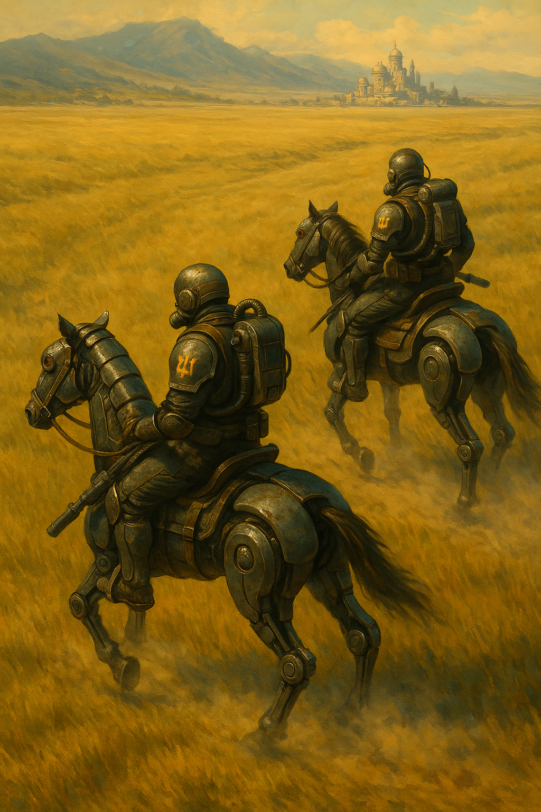
# Глава 3\. Після Штурму

*Внутрішні приміщення станції варп-зв’язку «Дике Поле 17».*

Гайдуки один за одним поверталися назад на станцію для ремонту силової броні, зброї та відпочинку. Замість них на чергування на поверхню вийшло третє відділення. Загону та розрахунку важкого кулемета під командуванням Цимбалюка пощастило менше. Танк першим пострілом влучив прямо у скоростріл та убив чотирьох гетів. Їхні скафандри були розгерметизовані, а тіла мали численні ураження — деякі з гетів були навіть без кінцівок. Данило разом із Семенком та Тавридом одразу після закінчення бою перенесли поранених та непритомних гайдуків до медичних ботів, які хутко на своїх чотирьох металевих лапах понесли козаків до шлюзу на станцію.  
Скоростріл «Вепр-3» був повністю розплавлений мельт-зарядом із танка; то тут, то там валялися набої з коробів, які встигли винести до шанця боти. Тіло й навіть силову броню Цимбалюка знайти не вдалося. Мельт-заряду, випущеного танком сонячників, вистачило для випаровування цілого важкого гайдука разом із скорострілом.  
Данило в голові прокручував момент пострілу танка прямо по його позиції. Якби його ракета не збила з курсу мельт-снаряд танка, він сам разом із Тавридом був би випаруваний так само, як і Цимбалюк.  
— Дякую тобі, Даниле, — Таврид тихо сказав у локальний вокс-канал, підбираючи понівечені самопали із загону Цимбалюка. — Якби не ти, збирали б наші самопали. Я, до речі, так і не знайшов свій, тому попрошу дозволу взяти один із цих.  
Данило кивнув Тавриду через свій візор із 270-градусним оглядом, який був спеціально створений для ведення ближнього бою і не затуляв огляд бійцям-термінаторам. Вони склали знайдену зброю, набої та повернулися разом зі своїм загоном до шлюзу.  
Адреналін від перемоги та першої справжньої великої битви затьмарив втрату цілого відділення скорострільників. Троє гайдуків ще були живі — вони мали лише зламані кінцівки й обмороження в результаті розгерметизації броні, але такі поранення не смертельні, якщо вчасно надати допомогу. Станція орбітального зв’язку була також невеличким форпостом, що міг приймати війська, розташовувати їх для подальшої відправки через варп або просто для відпочинку. Медичні боти-носії витягли поранених і тіла загиблих та через шлюз доставили на станцію, і вже через п’ятнадцять хвилин над ними поралися медики в герметичних боксах станційного госпіталю.  
Наступними за пораненими повернулися Данило з Тавридом. Шлюз із гуркотом опустився вниз, зверху їх закрив величезний люк, який рухався за допомогою колосальних гідравлічних штирів, кожен з яких був завтовшки як людина. Гідравліка працювала з такою легкістю, неначе її основною задачею було набивання масла чи розрізання морозива, хоч люк і важив під тонну.  
Двері шлюзу, після вирівнювання тиску, відкрилися, і Данило з товаришем побачили гайдуків, які вишикувалися в коридорі й почали радісно вітати їх із перемогою. Їхні візори були відкриті, деякі навіть зняли шоломи й тримали їх у руках. В кінці коридору стояв їхній отаман, Іван Січнік разом із Калиною.  
— Рад радий вітати з блискавичним ураженням Т-100\! — Січнік не міг стримати суміш емоцій — радість від розбиття десятків ворожих штурмовиків, танка та кількох броньовиків змішувалася із сумом за п’ятьма загиблими козаками. Його голос вирівнявся, і він продовжив: — Ви перші в історії гайдуки, які уразили цей новітній важкий танк Імперії Сонця. До цього ми мало знали про нього. За відзначену майстерність Данилі та Тавриду присвоюється значок\!  
Січнік дістав два магнітних значки та приладнав їх на плечі кожного з гайдуків.  
— Служу Січі-Матері та Лугу-Батьку\! — обидва гайдуки підняли праву руку й стиснули її в кулак.  
Гайдуки не могли бачити свої власні значки через громіздкість броні, зате кожен роздивлявся чужий значок, на якому було зображено силует танка, башту якого розривав снаряд.  
Січнік та Калина потисли руки гайдукам і вийшли до новоствореного штабу, де сидів старший по станції Мухнар і старшина загону.  
— Оце так на\! Перший бій — і одразу забили Т-100\! — інші гайдуки підбігли до них, щойно старші вийшли з коридору. — Трясця Алтаю, я теж хочу такий значок\!  
— Та тихше, а то ще відпаде й загубиться, і доведеться ще один танк збивати\! — гайдуки продовжували вітати одне одного й жартувати між собою.  
Біль від утрат товаришів поступово відходив на другий план. Усі розуміли, що це початок якоїсь великої війни, і вони — перші воїни Федерації Гетьманату, які як понесли втрати, так і розбили переважаючу силу ворога. Данило нарешті пробився крізь гурт гайдуків і попрямував до свого куреня. Треба було полагодити броню та й відпочити не завадило б. Скоріш за все, перший десант був розвідувальним, і рано чи пізно соняшники спустять із небес ще більшу ватагу. Гайдук зайшов у велику кімнату, де вздовж стіни стояло декілька костюмів із силовою бронею. Він підійшов до самого крайнього вільного слоту і натиснув кнопку виходу з силового скелету. Броня, слава Січі, не заклинила і змогла сама розкритися: кришка ззаду посунулась і піднялась угору. Данило вийняв одну руку за іншою, хотів схопитися за відкриту кришку як за турнік, але випав зі скафандру і боляче ударився дупою. Таврид із Михайлом, які щойно зайшли в курінь, гигикнули.  
— Ой, гляну, як ти зі свого випадеш зараз, — Данило весело пирснув у відповідь, а сам узявся знімати внутрішній скафандр, який треба було перевірити на розгерметизацію. Чухати забиту дупу через товстий захисний шар костюму не мало ніякого змісту.  
Таврид підійшов до щойно спорожненої силової броні Данила, став поруч, провів ту саму процедуру виходу із броні і… випав таким же чином із неї. А слідом за ним і Михайло.  
— Коли вони вже покращать цей вихід, у нас же один куприк. Трясця Алтаю, ще два таких виходи — і поїду в сузір’я Трахтамирів як інвалід та ветеран, який зламав собі куприка при виході зі скафандра, — Таврид із гіркотою в голосі почав розтирати через внутрішній скафандр свою дупу. Але це не полегшило біль.  
— Давай швидше скидаємо лати та понесемо на перевірку. Той танк усе-таки добре і по нас лупанув, — Данило вже вийшов із тонкого внутрішнього скафандра і вдягав на шию дихальну маску з під’єднаними балонами з киснем. За інструкцією під час бойових дій не можна було знаходитися на станції на безатмосферній планеті чи місяці без захисту, тому треба було або бігати у внутрішньому скафандрі, або в силовій броні, або ж із маскою.  
— Ну як там ваші дупи, уже відбили? — У кімнату зайшов механік Теодор Харченко. Його завданням було не воювати й не стріляти у ворогів, а займатися обладнанням та ремонтом силової броні. Він мав на собі легкий силовий привід-скелет, який допомагав тягати важкі речі або, як у цьому випадку, купу обладнання для дослідження і налагодження броні.  
— Колись не втримаємося і напишемо листа на Січ\! Нехай покарають цих інженерів, вони явно не продумали етап виходу з броні\! — відмахнувся від старого гайдука Данило. — Ми в гермодуш та до лікаря, у нас обох була розгерметизація по правому стегну та гомілці. Дай нам знати, який статус ремонту.  
— Звісно\! — усміхнувся Харченко. — До речі, вітаю з новими значками\! Я їх відполірую — і вони блищатимуть як Африка [[../../Всесвіт/Історія/Знищення Африки|після наших ударів]], — Харченко любив жартувати про пекельну зброю, яка давним-давно перетворила весь Африканський континент на шматок скла із шаленою радіоактивністю, через що навіть атмосферні літаки уникали польотів над ним.  
— Дякую тобі, ми скоро повернемося, — Данило почекав хвилинку на Таврида, і вони разом пішли до медкімнати.  
Дійти до медиків було не так уже й легко. Кожен гайдук хотів привітати товаришів із відзнакою знищення танка, адже до цього ще ніхто не брав участі в дуелях із важкою броньованою технікою. Гайдуки пробиралися коридором та приймали поздоровлення. Багато з новачків, які ще не були в боях, із захватом дивилися на двох героїв і кожен хотів потиснути руку Данилу з Тавридом.  
— Алтайські трясця[^27], ми колись дійдемо чи ні? — жартував Данило, коли до них підбігали чергові гайдуки привітати з перемогою в бою.  
Нарешті вони дійшли до медкімнати. Це було велике приміщення з каталками, розміщеними вздовж стін, на яких лежали поранені козаки. Данило впізнав декого з них — саме він відкопав їх та поклав на мед-бота під час пошуків на позиції Цимбалюка. Медики поралися навколо одного з них: його нога була вся синя, схоже, броня луснула і сталася розгерметизація. Через різкий перепад температури й тиску лопалися капіляри, і нога починала дуже швидко гнити, як тільки поверталася назад у природні умови. Тому слід було якомога швидше вирізати уражені судини і замінити їх на інші, які пересаджували з інших кінцівок.  
Таврид і Данило мали пройти поверхневий огляд та заміряти рівень радіації. Один із медгайдуків на цікаве ім’я Сергій Печиборщ помітив новоприбулих, кивнув їм і показав очима на інші двері. Гайдуки прослідували в іншу кімнату, де вже не лежали поранені. Зайшовши в кімнату, Данило роздягнувся догола, зняв із шиї респіратор та заліз у капсулу огляду. Роботизовані медичні процедури з підтримкою штучного інтелекту були звичним явищем для нього, адже кожен вихід у космос був небезпечним і ховав у собі багато ризиків. Одна з таких небезпек — це отримати ураження судин через розгерметизацію або нахапати радіації в легені чи шкіру.  
Коли Данило вже був у капсулі, в кімнату зайшов Печиборщ і одразу підійшов до панелі керування.  
— Вдихни і закрий очі, — медгайдук клацнув щось на клавіатурі, і капсула заграла діодами та зажужала.  
Данило виконав наказ. Медгайдук закрив кришку і запустив огляд. Через десять секунд кришка сама відкрилася.  
— Чудово. Радіації не більше, ніж в Африці. Будеш жити. Недовго, — за виразом обличчя медгайдука можна було зрозуміти, що він жартує, — мікропробої відсутні. Ти цілий, як дупа віслюка мюрида.  
— Трясця, ну в тебе і гумор, — Данило вдягав труси з відділом для причиндалів. Куприку не сподобався дотик трусів, і він знову занив болем. Тим часом Таврид, теж повністю роздягнений, залазив у капсулу. Його куприк прикрашав гарний свіженький синець. Скоріш за все, такий самий був і в Данила.  
— Як там гайдуки, яких ми повернули? — Данило звернувся до медика. — Я бачив, що деякі мають герметтравми[^28].  
— Одному, скоріш за все, вночі відріжуть ногу — ураження майже всіх вен. Якщо почне гнити — відрубаємо прямо тут. Ще один надихався вакууму — його легені прорвані, як штани на паркані. Їх треба в Цитадель. Там відхайлучать, — Печиборщ поклацав кнопки на панелі і завершив огляд Таврида.  
Кришка відкрилася, і Таврид виліз із капсули.  
— У порівнянні з іншими, ви наче і не були на поверхні. Все-таки ваша надважка броня і подвійний скафандр вирішують, — медик вимкнув капсулу та дістав з кишені дві пігулки. — На всякий хуторський випадок прийміть дерадифікатор. Ви могли хапанути всередину трошки пилу, тож попийте, щоб через тиждень не заблювали мені тут легенями і шлунком всі коридори.  
Гайдуки запили гидотні пігулки водою, вдягли респіратори на шию й вийшли в коридор. Там саме шикувалася зміна загону, що мала заступити на чергування на поверхні. Важкі гайдуки перевіряли власну зброю. Данило підійшов до термінатора-побратима — на його спині, на магнітних кріпленнях, висів спис, а під ним була приліплена мельт-граната. Цим списом можна було вести ближній бій: навершя, відковане найкращими ковалями з Канева[^29], блищало під лампами. Руків’я було вкрите прислів’ями, а на п’яті — тактична іконка підрозділу.  
— Удачі вам, товариші. Я впевнений, ви повернетесь із перемогою… а, може, й із парою язиків, — Данило хлопнув термінатора по плечу. Візор став прозорим, і він побачив обличчя козака.  
Це було молоде обличчя. Вуса сягали кількох сантиметрів і були рівно підрівняні. Чуб — скручений у спіраль — ховався під тканинним кепчиком. Точно такий самий, як у Данила.  
— Дякую тобі, — гайдук відповів через маленький говірник на шоломі. — Маю честь служити з тобою ще з часів походу на Мюридів. Іду по свій Т-100 вузькооких — не хочу відставати.  
Візор затемнився, і обличчя гайдука знову зникло. В кінці коридору Данило побачив свого рідного брата Михайла, окликнув його — і втрьох вони вирушили відпочивати до свого курінька. Через сорок хвилин усі вже спали козацьким сном.

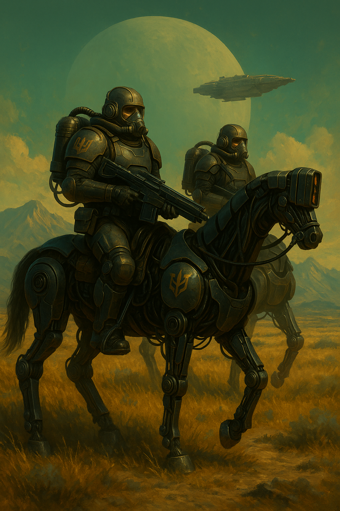
# Глава 4\. Передих та облога Цитаделі

*Новини з Цитаделі. Перші успіхи.*

Дванадцять гайдуків завершили приготування і вирушили до шлюзу для виходу на поверхню. Один за одним вони зникли за металевими дверима, які зачинилися з гуркотом. Кожна зміна мала чергувати цілу січну добу (1,2 земної доби) та відбивати можливий десант. Хоч і після першого погрому сонячники поки не наважувалися на нову висадку. На радарах Мухнара нових капсул десантування не фіксувалося, але  ворог посилив свою присутність на орбіті місяця. Особливо тривожив великий штабний корабель. Якщо імперці притягли польовий орбітальний штаб, то просто так вони вже не відступлять.  
Данило дізнався від інших гайдуків, що варп-вади, які ставили торпеди, більше не діяли. Замість них, за 600 кілометрів від місяця «Дике Поле 17», сонячники розмістили величезний крейсер. Судячи з усього, він блокував варп-зв’язок і водночас слугував базою для десантно-ударних військ, які найближчим часом мали атакувати місяць.  
Данило, Михайло та Таврид прокинулися через десять годин, поїли і пішли дізнатися новини. Лабораторія-колонія «Дике Поле 17» і гетська цитадель тримали оборону та знищували ворога. Імперія Сонця досі не могла встановити панування в атмосфері планети. Насичення ворожих військ, що розпочали облогу цитаделі-вулика, постійно зривалося завдяки рейдам штурмової авіації одного з полків гайдуків, які з самого початку служили тут. Під час одного з таких рейдів їм вдалося доставити припаси та зброю на станцію, зокрема додаткові ШІ-турелі та дрони. Назад літуни евакуювали поранених гайдуків із загону Цимбалюка.  
Ця зухвала вилазка з поверхні Дикого Поля на його місяць стала настільки несподіваною, що сонячники зреагували надто пізно. Вантажний літак «Лелека» увірвався у вокс-ефір станції варп-зв’язку несподівано навіть для самого Мухнара. Щоб уникнути виявлення на радарах, корабель вимкнув усі передавачі, залишивши тільки систему «свій-чужий», аби не потрапити під вогонь станційних ШІ-турелів. Сам літак мав кілька гармат для самозахисту, але був занадто повільним і громіздким для бою з орбітальними перехоплювачами.   
За ті десять хвилин, що пілоти провели на станції, чекаючи, поки медики перевезуть поранених гайдуків, вони розповіли оборонцям про облогу Цитаделі. Сонячники захопили кілька фортець навколо вулика-міста, бої вже точилися під його стінами. Ситуація залишалася стабільно важкою — ворог зазнавав вогневих ударів як на поверхні, так і в космосі. Під час однієї з ракетних атак, запущеної з планети, було завдано серйозних пошкоджень одному з флагманів сонячників — «太阳的力量», тобто «Сила Сонця». Гети випустили по флоту імперців близько 38 ракет. Запуски відбулися як з самої Цитаделі-вулика, так і з незаселеної частини єдиного континенту, майже з полюсу. Саме з останньої позиції 12 ракет і досягли цілі. Один із колосальних вантажних кораблів сонячників здетонував разом із варп-двигунами, миттєво перетворивши на пил тисячі імперських солдатів і, Січ-зна скільки, техніки.  
Ракети, які уразили ціль, мали складну конструкцію: при підльоті до цілі з носа випускалися мельт-заряди, завданням яких було проплавити обшивку корабля. Ці заряди "охоронялися" роєм безпілотних дронів, які перехоплювали протиракетні снаряди. Якщо мельти пробивали, а точніше сказати \- проїдали корпус, в отвір діаметром у кілька десятків метрів залітала основна бойова частина ракети. За таймером вона розкривалась на дві половини і вистрілювала плазмові стержні — як уперед, так і в боки. Таким чином ураження охоплювало велику площу. Одна трьохсотметрова ракета типу «Сагайдачний-3»[^30] могла рознести на шматки корабель завдовжки понад 20 кілометрів.  
Мухнар з Деметром записали атаку у файл і з захопленням транслювали її на всі монітори станції. Їх настільки вразило побачене, що вони ледь не проґавили прибуття власних транспортників — лише після запиту вокс-каналом і виклику вантажних джур-ботів зрозуміли, що треба відкривати шлюз.  
За двадцять хвилин карго-корабель був вивантажений, а на його борт підняли поранених гайдуків і два понівечених скоростріли «Вепр-3». Один залишився від загону Цимбалюка, іншим під час бою командував Михайло. Але від щільного лазерного вогню ворога станина та ствол розплавилися — навіть заміна ствола нічого не змінила б.  
На козацьке щастя, сонячники саме тоді розбиралися з наслідками ураження флагмана ракетою «Сагайдачний-3». Тож, коли транспортник «Лелека» з форсажем стартував з місяця, їм уже було не до якогось малого корабля — їхні літуни займалися відбиттям нових атак і виконували протиракетні маневри.  
Новина про знищення флагмана атакуючого флоту заполонила всі кімнати станції. Дехто рвався до Січніка, вимагаючи негайного старту до ворожих кораблів і абордажу. Інші просили висадити їх на поверхню, щоби вдарити по укріпленнях, де могли лишатися залишки першого десанту. Взаємне підбурювання та заохочення до активних дій набирало загрозливих обертів. Звісно, у гайдуків траплялися бунти проти старшини, але цей номер не проходив із Січніком.  
Дізнавшись, що перед його штабом зібрався натовп у кілька десятків козаків, який невпинно зростав, він разом із трьома зброєносцями вийшов у загальний коридор. Гайдуки, щойно побачили свого отамана, миттю стихли. У коридорі запанувала така тиша, що було чутно, як клацає реле ШІ-турелей і працює система охолодження станції.  
— Товариші, — Січнік підняв візор свого шолома (він, згідно з інструкцією, завжди носив герметичну броню на безатмосферних місяцях) і окинув присутніх поглядом. Його голос не був підсилений говірниками, але й без них звучав надзвичайно волево і впевнено. — Ми всі тут маємо чітко поставлену задачу — оборону станції варп-зв’язку. Наказ виданий наказним отаманом Чайковським мені, а значить — і кожному з вас.  
Отаман зробив паузу, дозволяючи обов’язковості перемогти в серцях козаків жагу до битви й абордажу зорельотів Імперії Сонця.  
— Не мені вам розповідати, яке стратегічне значення має ця станція. Без неї не буде зв’язку ані з Січчю, ані з паланкою. Битви вистачить на всіх. Сили ворога перевищують наші в сім разів: три корпуси гайдуків проти двадцяти корпусів саманаків, синіх кхмерів[^31] та, Січ зна, ще якої вузькоокої наволочі.  
Отаман взяв ще більшу паузу. М’язи на правій руці скрутило від напруги, але силова броня цього не видавала. Січнік був готовий розрядити свій важкий однозарядник із плазмою просто в обличчя будь-якому гайдуку, який наважився б і далі будоражити загін до самовбивчих дій.  
— Наказ один — захист станції. — Продовжив отаман, поклавши ліву руку на шаблю, що висіла на боці. — Будь-яка непокора чи підбурювання каратиметься негайною стратою. А ви знаєте, що в такому разі ваше ім’я буде викреслено з реєстрів козаків, родину розселять по сірим планетам, а ваші сини змиватимуть ваш сором, тягнучи лямку в штольнях шахтарських світів, охороняючи байдиків, пияків та рабів.  
У холі запанувала така тиша, що навіть реле ШІ-турелей перестали клацати. Данило, який прийшов просто на страшний гамір, стояв, як статуя Виговського в залі Січі, боячись ворухнутись. Під респіратором крапля поту неквапливо скочувалась по шиї, викликаючи невтримне бажання почухатися.  
Січнік стояв мовчки, дивлячись водночас кудись у вічність і на кожного з них. Гайдуки, які ще п’ять хвилин тому хотіли вибивати двері шлюзу й іти на абордаж зорельотів та фортець на поверхні, тепер стояли з опущеними головами, потираючи навершя своїх шабель.  
Конфлікт розрядив гучний «клац» реле ШІ-турелі. Всі здригнулись, крім Січніка, й підняли очі на свого отамана. Данило не витримав і вирішив якось розвеселити обстановку.  
— Якщо турель здатна виконувати наказ, то й найкращі захисники Січі — теж. — Погляд Данила зустрівся з Січніком. Холодний піт пробіг від забитого куприка аж до вух. Погляд отамана був настільки важким, ніби дві чорні діри засмоктували матерію до себе. Буквально секунду Січнік роздумував над подальшою долею свого термінатора.  
Січнік раптово посміхнувся, закинув голову назад, наскільки це дозволяла броня, і зареготав. Інші гайдуки теж вибухнули сміхом слідом за отаманом. Данило ж, приголомшений страхом за власне життя, продовжував стояти рівно, немов олівець, і зміг лише криво скривити губи у подобі посмішки.  
— Тоді готуємося сидіти тут до останнього гайдука або турелі\! — Січнік витягнув свою силову шаблю, яка заграла смертоносним, ледь помітним розрядом активної плазми вздовж ріжучої кромки, і підняв її над головою. — Всесвіт та Воля\! Один за всіх — і всі за Січ\!  
Гайдуки підняли правий кулак високо над головою і хором повторили девіз військ планетарної оборони:  
— Всесвіт та Воля\! Один за всіх — і всі за Січ\!  
Волюнтаристський інцидент було вичерпано. Уже ніхто не рвався до шлюзу, щоб запускати свій десантний корабель на штурм невідомо яких кораблів навколо.  
— Калина\! Твоя зміна на поверхню заступає за три години. — Іван Січнік продовжив, щойно голосні вигуки почали стихати. Як досвідчений отаман, він знав — зараз найкраща мить, щоб об’єднати всю сотню навколо єдиної задачі: відсічі десанту ворога та запуску сигналу «Січ-3». — Підготувати батареї та прошийте дрони під умови цього клятого місяця\! Ми втратили два скоростріли. Наступний штурм буде справжнє пекло — і для нас, і для них\! Хочу бачити замінованим усе довкола — входи до віддушин та саму станцію\!  
— Гайдуки розбрелись по своїх куренях. Хтось почав готуватись до заступу на зміну, хтось, навпаки, пішов відпочити. Данило з Тавридом повернулись до зброярника, який щойно завершив догляд за його важким термінаторським костюмом.  
— Ти ж знаєш, що він міг тебе просто на місці застрелити? — Таврида досі трусило від занепокоєння через зухвалий жарт Данила.  
— Ну, не застрелив же\! Зате всі посміялись. Хоча мені вже й не смішно. — Данило ще не відійшов від погляду Січніка і таращився просто перед собою. — Пішли краще до Теодора, дізнаємось, що з нашими костюмами. Він якраз за поворотом.  
— Що там за галас був? — спитав Теодор Харченко, який порався з бронею гайдуків і не міг приєднатись до загального божевілля «а давайте нападемо самі на них». У його руках був пульт, дроти з якого звисали вниз і були під’єднані до піхов силової броні. На екрані пульта всі показники блимали зеленим — знак того, що технічне обслуговування після бою завершено успішно.  
— Та гайдуки зраділи удару по флагману вузькооких, то й вирішили просити Січніка піти на абордаж уцілілих човнів, — відповів Данило. — Ще трохи, і хтось із наших міг би отримати сто грамів плазми за непокору.  
— Я манав потім відтирати шолом від такого лайна. Плазма випалює людську плоть просто в метал. Це треба драїти лазгеном, шліфувати... Ну і запах потім нікуди не дінеш. Запах горілої людської плоті... — На останніх словах плечі Теодора здригнулись і підтягнулись до шиї, як це буває, коли згадуєш щось дуже мерзотне. Або коли пісяєш на морозі.  
— Там внизу сонячники висадили корпус із п’яти десятків тисяч військ і навіть виставили пересувний космопорт для живлення осадних військ. А вони хочуть захоплювати кораблі на орбіті? — Теодор бурчав собі під ніс і тикав дротами в ніжки мікросхем, перевіряючи сигнал.  
— Пересувний космопорт?.. — Данило витріщив очі на Теодора. — Невже… все так погано?  
— А ти думав? У них, виявляється, є пересувний космопорт. Сьогодні він тут, завтра — в двадцяти кілометрах на північ. Постійно маневрує, щоб не потрапити під удар балістичних атмосферних ракет. Ти б бачив, яка це здорова махіна. Нашому Гетьманату такого не бачити ще років п’ятдесят, — Теодор від злості хотів жбурнути автовикрутку, але втримався.  
— Ці покидьки готувалися до війни заздалегідь. Інакше на чорта їм пересувний космопорт? — Михайло вклинився в розмову.  
— Вони можуть висаджувати по три полки за день\! Ви бачили ту махіну? Мухнар показував нам фотознімки з поверхні… Поки ви там їх зі скорострілу лупили, ці вузькоокі звели космопорт\! Хехе. Уявіть собі: платформа чотири на чотири кілометри, стабілізатори, антени, купа техніки для вирівнювання поверхні під ідеальний нуль-рівень. У них з десяток посадкових шахт, які можуть приймати вертикальні вантажні ракети, та ще три порти для звичайного орбітального транспорту. По суті — майже наш космопорт Цитаделі, тільки, трясця Венери, *змінює свою позицію*\! — На останніх словах Теодор перейшов на крик, явно вражений інженерними досягненнями сонячників.  
Теодор на кілька секунд завмер, прокручуючи в голові інженерні досягнення Імперії Сонця, які наразі залишалися недосяжними для науковців і інженерів Гетьманату. І потім продовжив:  
— Я не знаю, як можна витримати таку навалу. Нашим на поверхні зовсім несолодко — уся міць ворога обрушилася саме на них. На нас вислали десант, щоби відволікти або захопити зненацька. Та з цих капсул не скинеш двохсоттонний танк, який здатен випалити кілька кілометрів укріплень одним боєкомплектом. А от там, унизу… На них усе це звалилося. Розумієте?  
Гайдуки мовчки втупили погляд у підлогу. Кожен думав про своє — про товаришів, які саме зараз стримують першу навалу.  
— Є і гарні новини. Цю нитку сполучення з основною армадою противника наші винищувачі постійно атакували. Але з кожним днем сонячники розширювали зону польотів, і зрештою наша атмосферна авіація була змушена припинити рейди. Цитадель перейшла на глуху оборону, наразі вимотують вузькооких нальотами пластунів та засідками. Поки що кільце тримається, але ворог усе активніше задіює ресурси з орбіти…  
Розповідь Теодора урвала гучна сирена станції — Корпус Імперії Сонця розпочав другу спробу штурму варп-вузла.

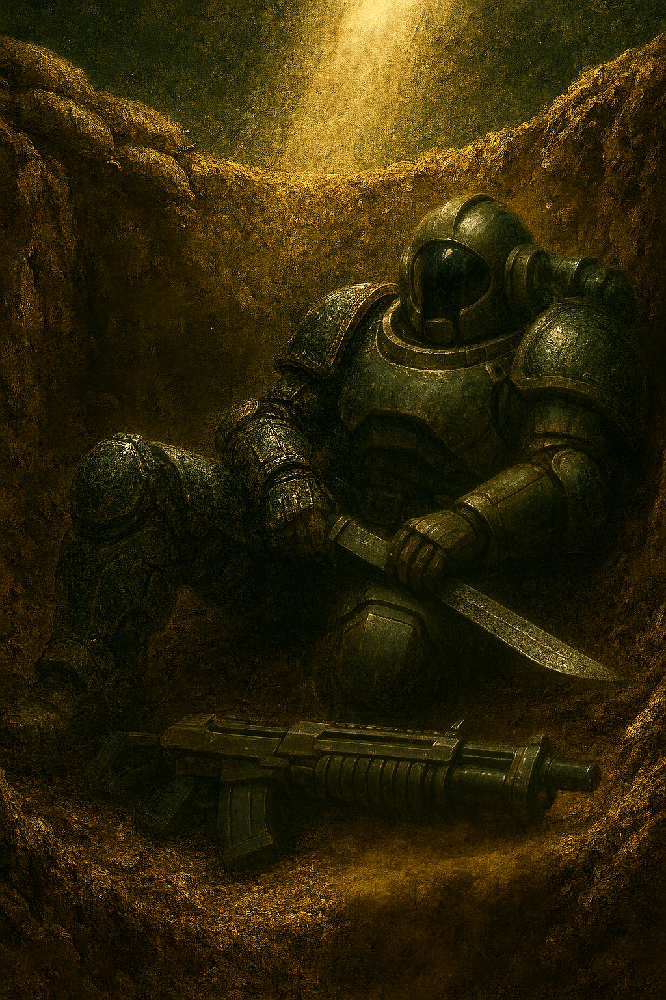
# Глава 5\. Бій за поверхню

*Другий штурм. Зміна тактики.*

Мухнар припав до показників радарів станції. Декілька десятків цяточок відокремилися від величезних крейсерів Імперії Сонця і направилися в сторону місяця. Згідно з показниками радарів, які ще досі працювали, він міг розпізнати десантні модулі та декілька винищувачів, що прикривали колони. Космічні човни часто відходили від основної групи кораблів, які згодом зависали на орбіті колонії «Дике Поле 17». Але зазвичай вони змінювали курс і йшли на посадку до планети або ж ставали на патрулювання космічного простору навколо. Гети досі наносили орбітальні удари і здійснювали рейди на окремі кораблі сонячників. Але цього разу цяточки відійшли на декілька сотень кілометрів від крейсера та стали чекати на цяточки меншого розміру, які наздоганяли основну колону.  
— Схоже, це друга штурмова група, — з тривогою сказав Деметр, його руки стукали по консолі, віддаючи команди турелям до активації.  
— Щось їх забагато, я сфокусував ближній радар на них, вони летять дивною формацією. Зараз покажу, — Мухнар закінчив введення команд у термінал та повернув голову на великий дисплей, що висів у центрі кімнати.  
— Зацініть, перед десантом летять маленькі кораблики, що це може бути? — Мухнар звернувся до Січніка, який щойно увійшов до кімнати керування. Як і всі інші, він був одягнений у бойову броню, навіть шолом виявився одягненим по-бойовому.  
— Схоже на якісь розміновувачі або тарани, — Січнік промовив через локальний вокс-канал. — Вони будуть відволікати турелі, і це дасть шанс основним човнам прилунитися. Я щойно змінив чергових на поверхні, видав їм ледь не все із запасів — на міни та дрони.  
— Ну що ж, будемо чекати на них. Всі турелі запущено, шлюз закрию, як тільки нова зміна вийде на поверхню. По твоїй команді я відкрию, якщо буде необхідність, — Мухнар підключив ще одне живлення до ШІ-турелей.  
Данило стояв на платформі шлюзу разом з іншими гайдуками. Платформа стояла нерухомо, аж поки люк на поверхню не почав відкриватися. Із шлюзу вийшли залишки повітря, і весь тунель залило яскраво-білим світлом із легким зеленим відтінком. Поруч із ним стояв Михайло. Його силова броня була очищена від піску та ґрунту після першого бою й могла б сяяти на сонці, але для камуфляжу зброярник сотні Теодор Харченко намащував броню гелем, який надавав усім металевим поверхням матового кольору, геть непримітного на сонці. На спині у Михайла висіли два блоки з дронами, під лівою лопаткою на магнітному замку був запасний зарядний блок для лазерного самопала, а з іншого боку — окислювачі для рекуператора дихання.  
Перед боєм кожен з гайдуків міг сам обрати собі набір гаджетів, що відповідав поставленому завданню. Сам же Данило взяв, як завжди, універсальні гайдуцькі списи. На додачу до них, під лівою лопаткою на броні висіли чотири невеликі мельт-заряди. Ці бомби кріпилися на навершя списа і дозволяли жбурнути його як звичайний «джавелін». На лівому боці спереду висіла особиста зброя — силова шабля з доволі широкою ялманню. Перед собою він тримав свій захисний важкий щит. На правому стегні висів короткий однозарядний мельт-самопал, постріл з якого міг навіть пропалити середню броню якогось сонячника.  
Далі за Данилом стояв медик Аполлон Калина та інженер Семенко. Останній був обвішаний дротами, капсулями підриву та мінами. Якби якийсь детонатор спрацював у шлюзі, то, скоріш за все, всі гайдуки перетворилися б на пару за секунду, а сам шлюз завалився б. Рідний брат Аполона — Іван Калина — уже піднявся на поверхню в першій черзі й розставляв своїх гайдуків на позиціях.  
За ті чотири дні, що імперці не атакували, інженери разом із ботами-копачами збудували фортифікацію у формі зорі. У центрі зорі був сам шлюз, а навколо нього — до п’яти метрів заглибки траншеї, декілька довготривалих точок оборони й навіть невеликий склад з озброєнням.  
Платформа підняла гайдуків на поверхню місяця. Бот-джури розбіглися до вказаних позицій, несучи на собі купу запасних акумуляторів для лазерних самопалів, мельт-заряди, окислювачі для ручних скорострілів та дрони. Біля виходу зі шлюзу вже стояв Іван Калина.  
— Термоси[^32], висуваєтесь на позицію «Лід». Звідти зможете прикривати найближчу позицію до їхнього поля смерті, — Калина мав на увазі місце першої висадки, де стояли розбиті два танки Імперії Сонця та під десяток броньованих машин, які вдалося знищити ще до їх підльоту до самої поверхні. Під «термосами» ж він, як і більшість, мав на увазі термінаторів-гайдуків, таких як Данило та Михайло. — Позицію знайдете в двохстах метрах звідси, праворуч. Всі інші — за мною.  
Вся новоприбувша група гайдуків підтвердила отримання наказу та розсіялась по шанцях. Данило разом із Михайлом рушили по траншеї до своєї позиції.  
— Схоже, що цей бій будемо проводити вже вдвох, — Данило звернувся до Михайла через локальний вокс. — Скорострілів уже немає…  
— Може, нарешті, помахаюсь шаблею, — відповів Михайло, несучи перед собою свій важкий щит. Над його спиною, як і в Данила, височіли запасні списи-рогачі. — Цікаво зустрітись із їхніми саманаками, кажуть, що це найкращі термінатори імперських військ.  
— Я бачив їх на висадці, слава Січі, їх порізали плазмою із скорострілу, — відповів Данило, розставляючи короби з батареями на позиції «Лід», куди вони щойно прибули. — Вони виглядали досить витонченими, я б навіть сказав — елегантно. Які вони в ближньому бою, думаю, взнаємо дуже скоро. Здалеку ж їх скосив наш скоростріл.  
— Ух ти, дивись, що нам підкинули гайдуки з Цитаделі, — Михайло взяв до рук великий плазмовий самопал «Щука», який стояв притулений до стінки шанцю. В останньому рейді гайдуки з полку «Таврос» привезли чимало нового озброєння.  
— Клас\! Це дуже потужна й точна зброя. Бери його собі, он там є потрійні заряди для плазми. А я займуся дронами, — Данило відчепив магнітний замок на ящику, який щойно притягли, і став виймати дрони з комірок.  
Позиція, де вони почали хазяйнувати, була найбільш висунута від шлюзу. Гайдуки, які були тут до них, вже облаштували її та нанесли вдосталь батарей для лазерних самопалів, зарядів плазми, а також блоків життєзабезпечення для безатмосферного бою — окислювачі-рекуператори, змінні контейнери для відходів і рідка їжа.  
Перед їхнім шанцем простягалося місячне поле, а за кілометр-два височіли невеликі скелі. Справа і трохи позаду лежали розбиті залишки першої хвилі десанту. Данило навіть зміг побачити той самий танк, який він поцілив і за який отримав відзнаку від сотника Івана Січніка. Оскільки атмосфера місяця не містила кисню, полум’я не виникало. Лише хімічне окислення після розплавлення плазмою генерувало дим, який стелився низьким шаром над поверхнею.  
— Увага. Десант на підході. Всім до бою, — різко крякнув вокс-канал Івана Калини. — Січ з нами.  
— Луг над нами, — тихо відповіли про себе Данило з Михайлом, мабуть так само, як і всі інші кілька десятків гайдуків, які обороняли шлюз.  
Тактика Імперії Сонця цього разу була іншою. Попередню атаку, по суті, розбили станційні турелі, що височіли в різних точках над поверхнею місяця. Вони знищили майже всі важкі човни, з яких мала зійти техніка та піхота. Зараз же ворог першими в колоні поставив свій новий винахід: мельтові парасольки. Це були невеликі бочки розміром з термінатора, всередині яких містився мельт-заряд і невеличкі двигуни для корекції траєкторії. Їхнє головне завдання — прийняти на себе перші черги гайдуків, а в разі ураження — детонувати і викинути мельт-речовину прямо вниз.  
Данило відчув дрижання землі і через декілька секунд пролунали перші ж черги з турелей. Трасери черг заполонили небо. Снарядам з ШІ-турелей знадобилося лише декілька попадань, щоб здетонувати перші мельт-парасольки. Захисні тарани випирснули кілька центнерів мельти, що подібно до краплі води, з величезною швидкістю опустилися точно на ціль — турелі. Вони продовжували стріляти по бочці, але нічого не могли вдіяти проти в’язкої мельт-плазми, яка з легкістю пропалювала залізну обшивку гармат. ШІ-турелі почали детонувати одна за одною.  
Підбити бочки все вибухали, а з них виривались мельт-краплі, які досягали своєї цілі. Перед очима гайдуків відкрилася жахливо красива картина — тисячі літрів мельти опускалися на землю, повністю випалюючи все металеве й органічне під собою. Дісталося навіть першій позиції гайдуків, де колись стояв скоростріл, з якого добили перший десант. Схоже, цього разу ворог добре підготувався — і вирішив заздалегідь приглушити оборону станції.  
— Думаю, сьогодні нам таки доведеться помахатися шаблею, — з гіркотою промовив Михайло. — Я вже нарахував дванадцять знищених турелей. Це майже всі...  
— Схоже на те. Тоді нам більше дістанеться, — відповів Данило. — Тільки б не було їхніх клятих Т-100. Минулого разу я в неї поцілив хіба що дивом.  
По вокс-зв’язку надходили підтвердження ураження турелей. Одна з мельт-бочок зачепила шанець, випаливши склад боєкомплекту. На щастя, обійшлося без детонації та жертв.  
— Ніхто не стріляє по човнах — це безглуздо. Наші пукалки не пропалять їхню броню, — голос Калини лунав чітко і спокійно. — Як тільки приземляться, запускаємо дрони й відстрілюємо піхоту, яка висиплеться з посадкових модулів.  
Данило з Михайлом почали відкривати ящик із дронами. У кожного в окопчику стояла стартова установка — схожа на тумбу з чотирма трубками. В них вставлявся дрон, і по натиску кнопки можна було одночасно запустити всі чотири. Скільки зарядив — стільки і злетить. Дрони поділялись на оборонні й наступальні. Оборонні зависали в повітрі над потрібною зоною і патрулювали простір, знищуючи ворожі цілі. Наступальні ж одразу летіли в задану точку й шукали ціль: плазмові та мельт-дрони — техніку та інженерне обладнання, фугасні — піхоту або озброєння.  
— Я запускаю чотири «Сича». На перший час вистачить, щоб прикрити нас зверху, — повідомив Данило Михайлу і закинув один за одним капсули з написом «Сич-40»[^33] у труби пускової установки. — Ти заряджай дві «Сокіл-Плазма» і дві «Сокіл-Фугас»[^34]. Якщо вилізе хтось важкий, чи, боронь Січ, танк — буде чим уразити.  
Поверхню почали струшувати надпотужні вибухи. Великий стовп попелу та пилу здійнявся над старою позицією гайдуків, де вони тримали оборону в перший день боїв. Штурмовики Імперії Сонця цього разу вирішили добре побомбити всі позиції перед висадкою свого десанту. Данило підняв голову вгору. Завдяки широкому візору, який не затуляв огляду, термінатори завжди могли бачити, що твориться позаду та по боках. На чорному тлі космосу він побачив світлі цяточки від двигунів десантних кораблів. Ворог наближався, і ніхто не міг його зупинити — станційні турелі мовчали, а більше і не було чим відбиватися від орбітальних візитів. Вибух за вибухом здіймався над поверхнею місяця. Залп ракет був синхронізований із прилуненням десанту. По воксу розійшлися повідомлення про перші втрати серед гайдуків.  
Данило взяв до рук важкий піхотний самопал «Щука» та направив його на найбільшу цяточку, яка навіть світилася іншим, синюватим кольором. Величезний візор-приціл самопалу мав доволі добру оптику, яку виробляли ще з часів Відходу[^35], а зараз — на системі Кудряхівка. Данило покрутив шестерні наближення і зафіксував десантний корабель у фокусі. Таких величезних десантних кораблів Данило ще не бачив. Двадцятикратне наближення показало вісім двигунів, які здалеку здавалися одним цілим. У сторони від корабля відходили якісь крила, схожі на металеві нарости. Корабель опускався все нижче — навіть довелося зменшити зум до восьми.  
— Трясця корпів, там така дуринда до нас летить, як чотири наших кораблі, — Данило сповістив Михайла по локальному воксу. — Ще хвилини дві — і буде тут.  
— Я тоді наступними запущу побільше плазмових «Соколів». Я так розумію, до нас їде важка броня, — Михайло розпакував ще один цинк з надписом «Сокіл-Плазма 40 мм». Всередині лежали жовтенькі капсулі з дронами. Сам апарат запуску дронів уже був забитий, його чотири лампочки під кожною трубою миготіли зеленим діодом, що означало з’єднання станції запуску із зарядженими дронами.  
У Данила засяло під шлунком в очікуванні битви. Величезний десантний корабель уже було видно й без прицілу.  
— Допоможи нам, Січ. Врятуй нас, Луже, — Іван Калина вирішив підбадьорити свій курінь перед навалою ворогів. — Пам’ятайте: кожна убита вузькоока наволоч тут не зможе ступити на наші планети й скривдити наших дітей. Вогонь — вільно, по можливості. Дронів — не більше десяти на позиції. У разі втрати позиції — відступ до шлюзу.  
Гайдуки, з дозволу курінного через загальний вокс-зв’язок, востаннє обмінялися вокс-привітаннями та побажали удачі в бою один одному.  
— Дупа огірка, коли ці кляті сонячники уже приземляться… — Михайло теребив свій лазерний самопал та вставляв туди-сюди батарею. — Я СТРІЛЯТЬ хочу.  
Данило та Михайло одночасно зареготали. Їх накрила тінь від човна імперців. Ще триста метрів — і буде контакт. Михайло запустив два дрони вгору, те саме зробив Данило. «Сичі» та «Соколи» запустили двигуни й почали кружляти над головами.  
Тінь від корабля відійшла далі, реактивні струмені з човна імперців розкидали пісок і пил з поверхні місяця. Через відсутність атмосфери все відбувалося абсолютно беззвучно. Лише легка вібрація та свербіння через стопи важкої броні вказували на титанічну енергію, яку вивергали двигуни десантного човна.  
Останній ракетний удар по старих позиціях гайдуків припинився. А це значило, що десант вийде з хвилини на хвилину.  
— Беру лівий люк на себе. Ти бери правий, — Данило поклав важкий самопал «Щука» на бруствер та через дальномір відбив дистанцію. — 430 метрів. Як тільки двері опускаються — б’ємо.  
Величезний човен з безшумним гуркотом опустився на місяць та вимкнув сопла двигунів. Данило припав до прицілу й почав розглядати корабель.  
Він був разів у чотири більший за сердюцький десантний човен «Байдак». Збоку виглядав як приплюснутий шестикутник, знизу якого трохи виступали сопла стопових двигунів. Абсолютно чорна поверхня поглинала світло від зорі, ледь було видно шви конструкції. На стиках граней було утовщення, яке виступало над дахом, неначе антени. Коли залишалося декілька десятків метрів, стоповий струмінь із двигуна став ще товстішим та згодом почав вибивати глибоку яму прямо під корпусом, і човен у неї занурився. Сопла працювали далі й вибивали ще більше ґрунту, засмоктуючи човен на декілька метрів під землю.  
— Що за чортівня? Вони що, самі сіли в свою яму? — Михайло здивовано розвів плечі, хоч цього й не було видно в його костюмі термінатора.  
— Це дуже дивно. У нас усі човни відключають двигуни за пару десятків метрів від поверхні, щоб не викопати самі собі яму й сісти на рівну платформу, — Данило розглядав у приціл чудернацький човен Імперії Сонця.  
Зі стиків човна відійшли стабілізатори, які розклалися й уперлися в поверхню місяця. З деяких маленьких лючків вийшла пара — схоже, що човен вирівнював тиск. Жодна зі стінок човна не мала великих люків чи дверей для висадки десанту. Принаймні, на тих стінках, які були фронтально до позицій гайдуків.  
— Може, це якась штука зі штучним інтелектом? Тут немає дверей\! — Данило продовжував вивчати елементи металевої конструкції. — Бачу лише якісь бійнички. Чортівня якась. У будь-якому разі, готуйся обстрілювати десант.  
Як тільки Данило договорив, невеликі бійнички на стінках човна відкрилися, і з них вилетіли коричневі циліндри розміром з гайдука в силовій броні. У польоті металевий шнур, прикріплений до кожної з бочок, розкручувався і поступово лягав на землю. Металеві бочечки вдарилися об поверхню за кілька сотень метрів від човна. Щойно весь трос, прив’язаний до бочок, випрямився й ліг на місяць, відбулася детонація заряду. Обоє гайдуків від струсу поверхні впали на дно шанцю, а на Данила зверху гепнувся важкий піхотний самопал «Щука», якого здуло вібрацією поверхні від титанічних вибухів. Із дна траншеї він побачив величезну хмару пилу, каміння та бруду, яку підняв вибух.  
— Всратися дупою, оце так приземлення, — Данило скидав із себе стартовий модуль для дронів і намагався піднятися так, щоб не пошкодити приціл на «Щуці». — Михайле, ти як?  
Михайлу пощастило більше: струс від колосального вибуху жбурнув його в одну стінку траншеї, а потім він, як м’ячик, відскочив у протилежну.  
— Я нормально, збережи нас Січ, — він рукавицею струшував пил із шолома і намацував коробку з дронами.  
На їхні голови продовжували падати каміння та пил. По вокс-каналу ватаги Іван Калина запустив перекличку.  
— Данило і Михайло. Тримаємо пост. Ураження відсутні, — Данило, як головний по позиції, відповів у вокс, щойно черга звітності дійшла до нього.  
— Трясця корпів, усіх наших дронів здуло уламками. Михайле, запускай чотири «Соколи», — Данило підняв із землі важкий самопал «Щука», поставив його на місце і припав до прицілу.  
Пил, який було піднято вибухом, уже осідав на місяць. В усі сторони від десантного човна розходилися невеличкі траншеї, утворені внаслідок детонації тросів і бочок із вибухівкою.  
Траншеї, на перший погляд, були по пояс Данилі, але в його приціл потрапив відблиск металу від чогось схожого на клинок лопати.  
— Бачу рух\! У траншеї ворог\! — Данило сповістив Івана Калину. — П’ятдесят метрів від човна, рух продовжується.  
Згодом схожі повідомлення надійшли й з інших постів.  
— Михайле, що по дронах? Нам найближче до їхньої траншеї.  
— Надав одному «Соколу» команду відпрацювати по першій цілі. Це бот-копач. Він заглиблює та розширює шанець, — із цими словами один із ботів, яких Михайло запустив після вибуху, злетів угору на декілька десятків метрів, потім склав свої крильця і прожогом полетів каменем униз.  
— Знищено\! — радісно закричав Михайло в локальний вокс. — Ще можу двох знищити.  
— Відпрацьовуй, — Данило продовжував дивитися в приціл «Щуки». Там, де він бачив відблиск металу, спалахнув вибух. Шматки бота-копача викинуло з траншеї, і вони, крутячись по спіралі, упали поруч із бруствером.  
— Ціль два готова. Шукаю третю, — Михайло закидав у стартовий модуль ще два дрони «Сокіл».  
Але там, де було знищено одного бота, знову здійнялася пилюка, і в приціл було видно, як працює новий бот-копач, що своїми клешнями-лопатами викидав ґрунт на бруствер, постійно розширюючи прохід у шанці. Коли ж бот дійшов до залишків свого товариша, то своїми загостреними лопатами-маніпуляторами просто перерубав його на шматки й викинув покручений метал, який ще був вкритий залишками плазми, зі шанця.  
— Мюридські копальні, ти це бачив? — Данило аж роззявив рота, побачивши, з якою легкістю бот-копач Імперії Сонця розрубав металевий корпус свого полеглого «побратима» та продовжив розрівнювати шанець.  
Михайло вперше чув таку лайку, яку Данило, скоріше за все, і сам придумав, згадуючи легендарний момент придушення повстання на планеті Мюридів, у якому брав участь їхній загін. Частина місцевої шляхти разом із військом повстанців після погрому в пустелі відступила до природних штолен, звідки добували руду для виготовлення термінаторських шабель, списів та лобових візорів орбітальних штурмовиків. При першому заході мюриди-повстанці знищили ватагу гайдуків, перебивши їх у рукопашному бою. Тому було прийнято рішення піти в обхід, прорубати нові входи до штолень і зайти в тил ворогу. Що й було виконано куренем Івана Калини — з прямою участю Данила та Михайла як перших термінаторів, які увірвалися до приміщення штольні та почали різати своїми шаблями, які, по іронії долі, були виковані з тієї ж мюридської руди, всіх без розбору на вік.  
— Калина, я бачу бота-копача. Він просувається мені за спину, хоче відрізати позицію від вас. Я висуваю Михайла на його знешкодження. — Данило звітував у вокс-канал ватаги.  
— Виконуй. — Калина завжди був короткий на відповідь. І це не дивно — з усіх боків до позицій гайдуків наближалися боти, які прорубували навіть кам’яну породу, наче це був якийсь пластилін. Часу на діалоги вже не залишалося.  
— Михайле, твоє завдання — зупинити копача. Бери зброю й відходь назад, десь сто метрів позаду нас він має пробити прохід. — Данило звернувся до Михайла по локальному воксу.  
— Докинь у повітря пару «Сичів» і прикріпи їх до мене. — відповів Михайло, підбираючи плазмовий щит, який валявся на землі після детонації бочок. На спину він закріпив два додаткових термінаторських списи та взяв мельт-заряди до них.  
У рукопашному бою він навряд чи б потягнув змагатися з копачем, який своїми ножами різав камінь, як хліб, тому вирішив підірвати його здалеку списом зі встановленим мельт-зарядом. Данило ж відклав «Щуку» на видовбану в місяці полицю, дістав контейнер із «Сичами» й запустив їх. «Сичі» злетіли вгору, зробили один оберт навколо станції запуску та попрямували назад — у точку ймовірного прориву шанця. Туди вже прямувала своєю важкою термінаторською ходою постать Михайла, несучи важкий щит перед собою і тримаючи короткий плазмовий самопал у правій руці.  
«Оцей ритуал обльоту станції запуску — дурна ідея», — подумав Данило, спостерігаючи за дронами, які, по суті, виявляли його позицію, і ворог міг зрозуміти, звідки йде бомбардування їхніх копачів.   
— «Сичі», які ми з тобою запустили, почали все частіше відпрацьовувати по об’єктах над нашими головами.  
— Мабуть, сонячники концентруються в шанці для прориву. Тому й почали теж закидати нас дронами. — Михайло від’єднав мельт-заряди з магнітних роз’ємів на своїй спині та почав розкладати їх на бруствері. — Я вже дійшов до заданої тобою точки. Буду чергувати тут. Бачу два наших дрони наді мною.  
Судячи з перемовин по вокс-каналу всієї ватаги, бій уже почався на західному напівколі позиції гайдуків. Данило іноді бачив залпи лазерних самопалів і вибухи гранат далеко ліворуч від себе. Взявши «Щуку», він під’єднав її через роз’єм на правому передпліччі до свого візора та став роздивлятися десантний корабель, який так і стояв непорушно з моменту висадки. Єдине — позаду нього здіймалася курява, і був відчутний рух. Бот-копач, який тягнув шанець до їхньої позиції, завмер з піднятою лопаттю після удару плазмового «Сокола». Більше копачів у цьому десанті або не було, або їх поки що не хотіли витрачати. Всього, за оцінкою Михайла, яку він сповістив по воксу, боту не вистачило якихось тридцяти метрів до з’єднання. Штурмова група, якщо вирішить іти на їхню позицію, буде змушена останні кілька десятків метрів перебігати по відкритій поверхні місяця.  
У приціл «Щуки» на своєму візорі Данило бачив, як чорні шоломи то з’являлися в складках шанців, то зникали. Іноді хтось бігав туди-сюди з антеною, яка стирчала на пів метра над поверхнею. Вистрілити і вцілити у ворога було дуже важко — жодна з цілей не висовувалась з окопу. Поступово курява від копачів навколо човна відступала все далі від центру ями, вибитої посадковими струменями.  
— Михайле, бачу рух позаду човна. Вони концентруються для заходу в шанець. Їхні копачі розширюють свій опорний пункт.  
— «Соколи» дістають туди?  
— Ні, я вже втратив дві штуки — вони просто падають вниз при підльоті. Схоже, що працює глушник, або їх просто збивають. Наразі я відкликав «Соколів» ближче до нашого шанця, для прикриття.  
— Я приготував дві мельт-міни для списа. Готовий до бою. — Михайло накрутив одну мельт-гранату, яку чомусь усі називали міною, до головки списа. Такий джавелін термінатор міг зажбурнути дуже далеко та одним махом знищити групу імперців у шанці.  
Продовжуючи роздивлятися через приціл «Щуки» щойно зведений просто у них під носом опорний пункт Імперії Сонця, Данило помітив відблиск дроту над шанцем — щось на зразок антени від передавача воксу. Антенка — вірніше, її власник — деякий час стояв на місці, а потім почав рух у кінець шанцю, де їхній бот-копач ледь не вирив прохід прямо до гайдуків.  
— Пішла атака\! — негайно сповістив Данило Михайла. — Бачу антену воксу в шанці, що рухається до тебе. Я їх битиму з «Щуки», чотири «Соколи» відправив ближче до тебе.  
Не встиг Данило договорити, як у десяти метрах над головою сталися два вибухи. «Пролунали» — це було гучно сказано. Через відсутність атмосфери весь бій проходив абсолютно беззвучно — лише вібрації поверхні від вибухів та спалахи свідчили про запеклий бій. Два «Сичі», які патрулювали над Данилом, перехопили ворожі дрони та знищили їх. Уламки та шматки розпеченої плазми попадали біля гайдука — ось так і можна було дізнатися, що навколо тебе триває бій.  
Данило прожогом розкрив ще один ящик із написом «Сич-40» та закинув капсули дронів у стартовий пристрій. Два «Сичі» відправив до Михайла, два залишив для себе.  
Тепер ворог знав, де знаходиться їхня позиція «Лід», і відкрив вогонь з лазерних рушниць по ній. Лазери били то тут, то там по брустверу й виплавляли шматки каміння у грудки, що нагадували соплі, вишкрябані з носа. Піхота Імперії Сонця висипалася в окопи з човна — біля двох десятків рушниць безупинно лупили по гайдуках. Вогонь був хаотичний, більше схожий на відволікаючий маневр.  
Данило перебіг на іншу одиночну позицію, вскинув «Щуку», яка все ще залишалася під’єднаною до його передпліччя, над насипом і почав вишукувати цілі. На наближенні з позначкою «три» він чітко бачив штурмовиків імперців. Повністю чорна, навіть матова, броня, на плечах — золотисті інкрустації з номером підрозділу та званням. Візор був затемнений і зливався з шоломом — здавалося, що на тебе дивиться просто якийсь робот із литою головою.  
Їхні лазерні рушниці виглядали витончено — разів у два тонші за гайдуцькі. Зверху виднівся приціл із двома лінзами. Імперці перезаряджали зброю незвичним способом. Гайдуки, наприклад, вставляли лазерні батареї знизу, як у класичних автоматах часів Об'єднання[^36]: щоб від’єднати батарею, треба було натиснути кнопку та з силою витягнути ріжок-батарею.  
Імперські ж заряди являли собою гнучку довгу паличку, яку вставляли вздовж зброї, починаючи від приклада і до середини рушниці. Витягували батарею аналогічним чином. Данило бачив, як один з імперців вів вогонь по його позиції, тримаючи в руці дві запасні палички-батареї. Коли заряд закінчувався, він відпрацьованим і чітким рухом перевертав рушницю на бік, вказівним та великим пальцем хапав за кінець вставленого заряду, витягував його й тією ж рукою швидко вставляв новий. Через те, що знизу рушниці не стирчала батарея, імперцям було значно зручніше вести вогонь лежачи або з окопу. Гайдукам же заважав магазин, що впирався в землю, і це ускладнювало прицільну стрільбу.  
— Починаю вогонь, Михайле. Скоріш за все, вони лише відволікають увагу від групи, що рухається до тебе. — Данило оцінив тактичні уловки імперців. — Відсилаю тобі своїх «Сичів». Якщо стане важко — клич, я прийду.  
— Все в нормі. «Сичі» прийняв. — Михайло викликав дрони до своєї позиції й наказав їм піднятися ще вище, щоб не так видавати себе ворогу.  
Данило зайшов в одиночний окопчик, де була амбразура, відлита з плекс-бетону для ведення стрілецького бою. «Щука», як стандартна зброя, ідеально підходила під розміри бійнички — навіть ріжок з лазерною батареєю мав спеціальний виріз у стінці. Ліворуч була поличка, куди гайдук міг складати обнулені або запасні батареї.  
Данило від’єднав «Щуку» від передпліччя, щоб вести вогонь безпосередньо через її рідний приціл. Як тільки міг у подвійному бойовому костюмі термінатора, він щільно притис приклад до плеча, підняв приціл до рівня очей та накрутив збільшення «3.5». Цяточка прицілу змінила колір на червоний, щойно він навів її на голову імперця, який стріляв боїзна-куди вгору — мабуть, хотів поцілити дрона. Лазерна рушниця не вимагає поправок на гравітацію чи відстань — промінь летить, як і має, строго по прямій. Невеличка світлова риска вилетіла з довгого ствола «Щуки» і вже за мить розтрощила голову імперському штурмовику. Зі шолома разом із парою вилетіли шматки мозку та плоті. Вогонь ворога на мить затих, а потім поновився з новою силою — тепер імперці почали стріляти хаотично, намагаючись знайти стрільця, тобто Данила. «Щука» вистрілювала білим лазерним променем, що робило її слабко помітною на тлі місячної поверхні, яка під світлом зорі «Дике Поле 17» й без того випромінювала до біса багато світла.  
Данило не був упевнений, чи мають візори імперців можливість накладати різні світлофільтри, щоб відокремлювати та підкреслювати типи лазерного вогню. Тому на всяк випадок перейшов на іншу позицію, ідентичну попередній. Припавши до прицілу, він просунув «Щуку» в бійничку й швидко знайшов наступну жертву. Це, найімовірніше, був офіцер чи комісар імперців — на плечі в нього сяяла велика золотиста зоря. Досить нерозумно для стрілецького бою — по таких нашивках було значно легше визначати важливість цілі.  
«Ще б на візорі написав "Я отаман”», — буркнув про себе Данило й натиснув на спуск. Лазерна риска ударила прямо в шию сонячника. Той похитнувся, ліва рука обвисла, з неї повільно потягнувся струмінь пари. Солдати, що були поруч, одразу підхопили його під руки й опустили на дно шанцю, тож Данило не встиг його добити.  
«Щука» була потужною стрілецькою лазерною зброєю, але її батареї вистачало лише на два постріли. Данило міг би закластися, що здійснив постріл приховано — білий лазерний промінь на тлі місячної поверхні був майже непомітний. Але цього разу по бійничці ворог відкрив шалений вогонь. У хід пішли навіть вибухові міні-гранати, які запускалися з ручних гранатометів.  
— Двох зняв. Схоже, їм це не подобається\! — Данило поділився враженнями з Михайлом. — Міняю позицію. Ти як?  
— Два дрони ще є. Вони посилають ботів уперед, схоже, скоро намагатимуться прорватися в шанець. — Михайло сидів у бліндажі на двох гайдуків і чекав на команду до рукопашного бою. Його короткий плазмовий самопал був напоготові — він тримав його в руці, націлений на вхід у кімнату.  
— Добре, я повертаюсь на «Лід», прикриватиму тебе. — Данило на ходу замінив батарею. Як тільки добіг до позиції, вставив використаний магазин у зарядник та взяв новий.  
Ставши до бійниці, що дивилась праворуч, він був повністю захищений від лазерного вогню групи підтримки. Якщо вони не викотять танк чи броню зі свого десантного корабля, шансів пережити цей штурм було більше. З бійниці він повністю контролював галявину перед шанцем, де перебував Михайло.  
По воксу Данило чув про спробу штурму західного шанцю, але гайдуки змогли його відбити — справа дійшла до рукопашного бою. Декілька гайдуків загинули від рук бот-копача, який прорвався в тил позицій та встиг перерубати двох козаків, аж поки один із термінаторів не перегородив шанець своїм щитом і не спалив бота з плазмового самопалу.  
— Данило, до вас прямують два гайдуки для підсилення, — голос Івана Калини у вокс-каналі був сконцентрованим і сухим. — Вистав їх на позиції. Я з дрона засік дві штурмові групи. Очікуйте штурм.  
— Прийняв, — Данило клацнув передавачем і перемкнув його на локальний канал. — Михайле, повернешся до мене, як тільки підійдуть два гайдуки. Залишиш їх у своєму шанці.  
— Буде важко?  
— Так. До нас прямують дві штурмові групи, йтимуть тими самими кишками, що до нас прокопали. У західних шанцях був заміс із копачами — декілька наших загинули. Тримай щит при собі. — Данило кинув оком на свій щит, що стояв притулений у проході. — Поки що тримаємось. А ось і наша підмога.  
На візорі, на панелі локального воксу, додались дві зелені цяточки — це означало приєднання ще двох передавачів.  
— Хлопці, вас виставить Мих…  
— **КОПАЧ\!** — викрик Михайла обірвав передачу у воксі.  
Данило кинувся до «Щуки» й приставив приклад до плеча. На позиції Михайла здіймалася курява: він бачив, як лопасті копача прорили прохід до шанцю гайдуків. Михайло миттєво зустрів ворога ударом щита по корпусу бота, намагаючись його опрокинути й не дати себе забити величезними руками-лезами. У правій руці він тримав зведений плазмовий короткостріл, але удари по щиту не дозволяли виставити самопал і вистрілити.  
— Михайле, він на прицілі\! Сядь на дупу\!  
Михайло, почувши команду, присів на коліно й підняв щит над собою. Від кожного удару лез із нього висікались шматки металу у вигляді рожевих іскор.  
Данило тільки-но почав натискати на спускову скобу, як у його бійницю влетів дрон і здетонував. Ударної хвилі не було, лише уламки врізались у термінатора. Один удар прийшовся в ліве плече — Данила розвернуло навколо осі й відкинуло трохи назад. У візорі миттєво заблимала червона лампа розгерметизації.  
Досі відходячи від удару, гайдук зняв з магніта на правому стегні балон із плекс-гелем і почав задувати ним бронеплиту на плечі. З ушкоджень і щілин вибивався пар — це свідчило про розгерметизацію силової броні. Плекс-гель миттєво залив отвори, а бортовий комп’ютер автоматично почав накачувати тиск, щоб уникнути ураження вен та м’язів термінатора.  
— Данило\! Врятуй\! Щит майже розбитий\! — Михайло у розпачі кричав у вокс.  
Данило намагався намацати «Щуку», але важкий піхотний самопал було геть розтрощено вибухом: приціл узагалі вилетів з окопу, а там, де мав бути лазерний заряд-батарея, зяяла діра розміром з кулак.  
— Я йду\! Тримайся\! — Данило побіг на поміч брату, дорогою схопив щит термінатора та прикріпив списи на магнітний замок на спину.  
Його візор, з’єднаний із дронами «Сичами», що досі кружляли над головою, сповістив про захоплення цілі й автоматичне перехоплення ворожих ударів. Десь у двадцяти метрах над головою пролунали два вибухи — дрони імперців було знищено. Але Данило вже не мав часу досилати нових «Соколів» у небо: бій за їхню позицію вступив у вирішальну фазу.

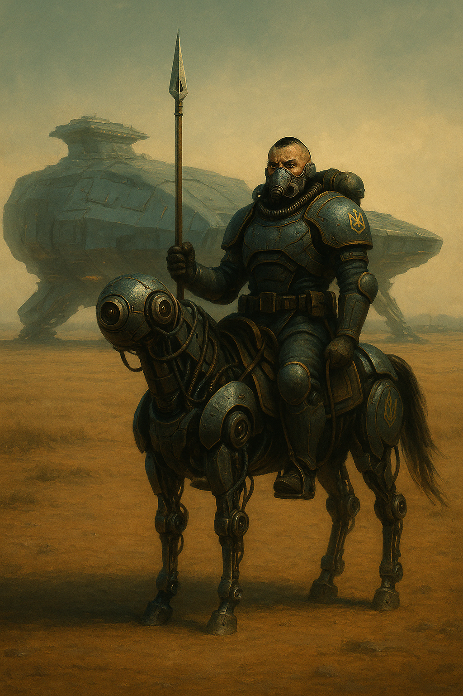
# Глава 6\. Втрата поверхні

*Бій за позицію «Лід». Трофеї та порятунок.*

Два гайдуки, яких вислав Калина на підсилення позиції «Лід», добігли до Михайла саме вчасно. Термінатор зміг здійснити постріл зі свого плазм-самопалу прямо в корпус бота, але це не знищило його. Якось в разкоряку, закриваючись від ударів, які після його пострілу в упор по тулубу стали набагато слабкіше, Михайло намагався прокрутити барабан на плазмовому самопалі. З-під щита він побачив броньові чоботи і спочатку подумав, що штурмова група уже зайшла в шанець і це його смерть, але потім помітив на броньованих кісточках ніг золотасті тризуби.  
«Свої» — радісно подумав Михайло одночасно із залпом лазерних самопалів по копачу. Копач заіскрив і упав на бока.  
— Харе, харе\! — деякі постріли припадали на щит Михайла, який був напівзруйнований і не виконував свої захисні функції.  
— Припинити вогонь\! — Гайдук відкинув ногою копача і допоміг встати Михайлу на ноги.  
— Ви саме вчасно. Дякую. — Михайло глянув на скалічений щит, той був геть посічений і в двох місцях мав уже дірки, потім перезарядив самопал. — Зараз піде піхота. До бою\!  
Гайдуки стали по сторонах від тільки-но прорізаного шанцю і заглянули всередину.  
— Імперці\! — закричав у вокс один із гайдуків. З цими словами виставив самопал в прохід і відкрив автоматичний вогонь на осліп. — Ідуть\! Ідуть\!  
— Я іду\! — Данило на максимумі швидкості, яку давав силовий костюм термінатора, мчав до своїх. — Тримати вхід\!  
— Я бачу двох термінаторів. Попереду іде щитовик. — Гайдук продовжував обстріл проходу в шанці, не даючи швидко пересуватися ворогу. — Дрони є?  
— Ні, всі уже відстріляли. Михайло, займай прохід, вистав щит, нехай гайдуки через тебе ведуть вогонь. — Данило намагався оцінити ступінь небезпеки, кожні декілька кроків він виглядав на поверхню, щоб не пропустити можливого прориву поверху.  
— Чорти там, щит розбив копач. — Михайло вів вогонь зі свого самопалу в перерві між перезарядкою одного з гайдуків. — До нас метрів сто, б’ємо на спалах.  
Як тільки Михайло завершив вокс-повідомлення, ворожий дрон пробив наскрізь гайдука, який стояв справа від проходу. Ліве плече відлетіло разом з броневим захистом, з величезної діри вискочила пара кисню разом з червоною хмарою крові і плоті. Бризки крові, в силу внутрішнього тиску людини, вилетіли на декілька метрів і під дією сонячних променів і високої температури — випарувалися. Убитий гайдук повільно сповз в шанець і своїм тілом загородив прохід.  
— Трясця, брате Брут, НІІІІІ\! — другий гайдук завопив у вокс. — Здохніть\!  
Гайдук відкрив вогонь і продовжував водити лазерним самопалом вліво-вправо навіть після того, як батарея була вся висаджена.  
— Спокій, гайдуче\! — Михайло ударив шматком свого щита по потилиці гайдука, щоб привести його до тями. Гайдук розвернувся до Михайла з наміром дати здачі, але суттєва різниця між звичайним космічним гайдуком та термінатором, охолола його наміри. — Веди вогонь по два постріли. Я готую джавелін.  
— Це був мій брат\! — Гайдук промовив це важким диханням майже переходяче в плач.  
— Помстимося\! Як тебе звати? — Михайло продовжував розмовляти з гайдуком, щоб повернути його до бою  
— Цесар.  
Дякуючи Січі, Михайло недоречно сприснув без включеного воксу. Батьки цих двох братів були ще ті жартівники.  
— Добре, прострілюй прохід, сам не висовуйся. — Михайло вирвав лазерну рушницю з рук упавшого гайдука і кинув її Цесару.  
— Хлопці, я уже тут. — Запиханий Данило нарешті добіг до своїх. Від вигляду розрубаного навпіл гайдука у Данила закіпіла кров. — Посуньтесь.  
Цесар достріляв батарею і притиснувся до стінки шанцю, даючи величезному термінатору просунутись в щілину. Михайло стріляв зі свого однозарядного короткого плазмового самопалу. Ворог, а саме щитовик, за яким йшла основна штурмова група все ближче підходила до їх позиції.  
Над головою гайдуків відбувся короткий бій дронів. Схоже, що Іван Калина вислав декілька сичів та соколів на допомогу. Падіння уламків та спалахи швидко зупинилися.  
— Михайло, ти зарядив джавелін? Вони на відстані кидку. — Данило ховався за своїм товстенним щитом і у віконце уже чітко бачив такого самого термінатора, який повільно, крок за кроком просував всю групу до них.  
З-під щита та з обох боків періодично висовувались тонкі стволи лазерних самопалів та стріляли по ним у відповідь.  
— Готовий\! — Михайло відклав свій самопал та став за спиною Данила. В правій руці він тримав джавелін, на вістрі якого була прикручена велика у формі дзиги мельт-міна. Миготіння червоної лампочки на пімпочке свідчило про те, що всі ланцюги працюють і міна готова до підриву.  
— За мною\! Цесар, Веди вогонь по їх ногах, щоб він не підняв щит. Михайло, вперед\!  
Обидва термінатора, як два древніх скіфські воїни, двинулись вперед вивіреним кроком. Тактичний прийом кидання спису з\-за щита свого товариша був чи не основним під час ведення лінійного бою. Колись цей прийом вони застосували для відбиття навали кавалерії мюрідів для збиття першої нищівної атаки елітних вершників на важких залізних бот-конях.  
Штурмовики імперців зупинились, збентежені, що на них почали рухатися. На фоні чорного неба Данило побачив підсвічений сонцем світлий об’єкт, який вилетів з\-за спини одного з сонячників.  
— Граната\! — Данило опустив щит на землю, а сам напівліг на землю і трохи нахилив термінаторський захист на себе.  
Граната упала в двох метрах від його ніг і вибухнула. Над поверхнею здійнялась велика хмара пилу та каміння і повністю затулила видимість в шанцях. Самі ж уламки від фугасної гранати шипіли на щиті, хоча це просто мозок Данила автоматично додавав звук шипіння. Жоден з уламків не зміг пробити товстий щит.  
Так як вибух гранати затулив огляд обом сторонам, то це був найкращий час, щоб без боязні отримати лазерний заряд в пахву під час розгону джавеліну.  
— Михайло, кидай\!  
— Пішов\! — Михайло різко видихнув і кинув спис.  
Спис перелетів через Данила і по дузі залетів прямо в середину скупчення імперців, які ховалися за щитом. Протипіхотна мельт-міна була розроблена таким чином, щоб завдяки своїй формі дзиґи при детонації розкидати мельти речовину на всі 360 градусів. Беззвучний вибух спопелив сонячників, куди безпосередньо упав спис із міною. Інших же вибух розрізав навпіл  і надав такого кінетичного прискорення , що шматки половин тіл із частинами силових костюмів викинуло на бруствер. Данило і Михайло спостерігали, як кров’яна застигла пара розлетілася в усі сторони і почала випаровуватися. Перші два термінатора-щитовика ще стояли, але схоже, що були уражені, бо їх щити почали хилитися до землі.  
— Вперед\! — Данило пристібнув свій самопал на магнітний замок на стегні, правою рукою зняв рогач зі спини, підняв його над головою і рушив вперед.   
За ним рухався Михайло, в лівій руці він тримав плазм-самопал, а в правій — новий джавелін. Навершя спису крутилося із шаленою швидкістю, готове проштрикнути ворога.  
Данило, підбігши до першого ворога, з усієї сили ударив його в щит і тут же уколов в щілину в строю імперців-термінаторів. Ворог, через куряву, яку підняла граната, не очікував, що на них буде контр атака і був атакований зненацька. Удар списа прийшовся у праве плече, рука імперця стискала щось схоже на чекан, але з дуже довгим залізним чубчиком. Від удару, його рука розстислась і випустила зброю на землю. Імперець розвернувся до Данила і почав захищатися щитом і в цей момент в його шию увійшов джавелін запущений Михайлом. Навершя списа, як тільки торкнулося чорної як космос броні імперця вмить активувалося і почало обертатися зі швидкістю тисячу обертів за хвилину. Як дриль джавелін вгвоздився в броню, іскри полетіли в усі сторони і за секунду броня тріснула. З дірки вздовж залізного древка списа вилетів стовп крові, який миттєво випарувався, навершя продовжувало обертатися і проштрикнуло броню та тіло вузькоокого наскрізь. Візор тріснув, звідти вилетіла червона пара крові і термінатор упав на спину, поверх шматків ніг та тіл того форшмаку, якого накоїла мельт-міна всього пару секунд назад. Навершя джавеліну ще деякий час продовжувало свердлити камінь, на який упав сонячник і за декілька секунд, як тільки закінчився заряд, застигло, навіки пригвоздивши нападника до місяця.  
Все це відбувалось не більше двох секунд, за які інший термінатор-сонячник зорієнтувався та встиг ударити своєю катаною по голові Данила. Відкований в кращих майстернях Великого Лугу, а саме в системі Канів (і по іронії долі із руди мюрідів), візор витримав удар, і хоча бортовий комп’ютер сповістив про мікророзгерметизацію, тут же погасив лампочку тривоги. Данило не став чекати на другий удар, поклав свій великий щит поверх ворога , таким чином заблокувавши йому огляд та можливість зробити ще один ріжучий удар, наступив на ногу чорного бронекостюма імперця і з усією сили відштовхнув тіло від себе. Той не очікував такого прийому і не стримавши рівноваги, почав падати назад. Упавши на місяць, він одразу ж отримав укол рогачем Данила в стегно та пах, і почав крутитися від болю як вуж. З отворів, які прогриз рогач, вилітала червона пара, яка миттю замерзала і випаровувалась. Данило ніяк не міг уразити груди чи голову ворога, той закривав себе щитом і все хотів повернутися на бока, щоб упертися рукою і встати. Данило ударив своїм броньованим чоботом по щиту знизу верх, як по футбольному м’ячу, той беззвучно відлетів вбік, повністю розкривши груди термінатора. Гайдук опустив рогач, підсилений навершям, що оберталося із величезною швидкістю, прямо в центр великої червоної зірки-гербу військ Імперії Сонця. Зброя пробила чорну силову броню імперця-термінатора, пластини тріснули і спис, як дріль, увійшов прямо в тіло бійця. Своєю вільною рукою вузькоок схопив за древко списа і намагався вистромити його зі своєї броні, але спис під шаленим тиском силових агрегатів та броні Данила все ж таки пробив весь захист і в ту ж секунду розвірвав сердце противника на шматки. Червона пара вискочила з розгерметизованого костюму і сонячник закляк у конвульсії. Данило, не висовуючи спис з тіла свиноокого, поводив списом вліво-вправо, щоб засвідчитись у смерті ворога. Михайло ж теж зняв запасний рогач з магнітних держаків на спині, не відставав і колов візори інших імперців, які могли бути ще живими. Всього за декілька десятків секунд вся штурмова група Імперії Сонця була винищена.

* Що у вас тут. — різко кинув у вокс Цесар, який тільки-но добіг до них.  
* Ти трошки запізнився, — відповів Данило, виймаючи свій спис з чергового добитого візора ворога. — Пройди далі вперед і займи прохід, не хочу, щоб нас зненацька застала ще одна група.

Гайдук із автоматичною лазерною рушницею переступив через трупи сонячників та спочатку просунув ствол та голову в поворот окопу, а потім зайшов весь сам.  
— Тут чисто. Метрів п’ятьдесят до загину шанців, нікого немає.  
— Чудово, прикрий нас, ми подивимося, що ми тут затрофеїли. — Данило відставив свій броньований щит, відклав спис і прийнявся розглядати убитих.  
— Дивись, цей походу був якимсь чемпіоном. У нього стільки іконок на шоломі. — Михайло навершям списа указав на шолом імперця. І дійсно, на його лівій скроні були відмічені декілька червоних іконок. Деякі з них мали намальований меч, інші – списи.   
— Відкрутити візор зможеш? Покажемо Січніку. — Данило спитав у Михайла, який уже сам прийнявся розглядати кріплення броні.  
— Так, шолом модульний, зараз відірву пластину. — останні слова прозвучали з потугою, термінатор схопив голову імперця, і як древній герой гетів Геракл у боротьбі з левом намагався розчепити скоби шолома, щоб розкрити його на дві половинки. Шолом довго не давався, але все ж таки під натиском силових агрегатів і біцепсів Михайла піддався.— Є\!  
Михайло примагнитив шмат шолому з іконками до себе на спину.  
— У них якась інша зовсім зброя. Наші батареї для лазерів не підходять, плазму ще не пробував. — Данило теж не втрачав час і розгрібав трофейну зброю. Деякі рушниці були так сильно затиснуті руками з силовою бронею імперців, що гайдук не міг їх вирвати з рук забитих. — Їх катани — лайно, навіть не пробили візор. Не бери їх.  
Данило роздивлявся катану-меч термінатора, з яким у них був двобій. Витончена, тонка, легка. Можливо, гарно працює проти звичайних скафандрів, але не проти мюридівських  пластин відбитих в кузнях канівських майстрів. Скільки часу займе Імперії Сонця покращити свою зброю, щоб пробивати їх броню? Рік? Два?  
Роздуми Данила перервав крик у вокс каналі.  
— Ідуть\! — Цесар, який прикривав дерибан трофеїв, накидував з автоматичного самопалу в прохід. — Ворог зайшов в шанець\!  
— Михайло\! Бери щити, відступаємо\! — Данило, будучи старшим в команді продовжував керувати боєм. Декілька гранат, розірвалися поміж широкої траншеї, лише трохи перелетівши Данила. Він, не звертаючи увагу на початок обстрілу, схопив спис, надягнув щит на рукавицю, перевірив свій плазмовий одностріл на стегні. — Гайдуче\! Добивай магазин і відходь\!  
Данило закинув спис на спину, а сам взяв великий револьверний гранатомет, який валявся під одним із забитих імперців. «Трясця, ну у них тут і зброї, нам ще повезло, що застали їх на контрударі», Данило досі відходив від факту, що три гайдуки змогли розібрати елітну штурмову групу імперців з дванадцяти бійців.  
— Михайло, прикрий гайдука щитом, вони накидують по нам гранати\! — Декілька уламків від вибуху влетіли прямо в око Данилі, але скло візора витримало і лише трохи защербилося.  
Михайло став позаду іншого гайдука, підняв щит над головою і як парасолькою став прикривати і себе і його.  
— Відходимо трохи назад\! Затримаємо їх на цьому повороті. — Данило все прораховував найкращий варіант розвитку бою для них. Підняв трофейний гранатомет, прицілився на дурня і пустив одну гранату. Граната полетіла чорт зна куди високо, навіть не думаючи падати по дузі вниз.  
На гранатометі було декілька перемикачів , але всі підписи були зроблені ієрогліфами. Данило перевів один важіль в інше положення, всередині зброї щось ляцнуло. Гайдук вскинув гранатомет ще раз, нажав на гачок. І…НІЧОГО.  
— ТА ПІШЛО ВОНО. — Сам того не очікуючи Данило пролаявся прямо у вокс.  
— Ти норм? Заділо? — Михайло і їх новий товариш одночасно повернули голови взнати, що сталося. Згідно кодексу гайдуків, під час бою були заборонені будь-які емоційні вокс-трансляції, навіть якщо очі виїдала гушитська[^37] кислота. Лише команди і звіти.  
— Кляті вузькоокі не можуть зброю нормальну зробити, спробую лазган їх.  
З лазганом було простіше. Данило підібрав один, підняв ствол вгору і вистрілив. Вгору здійнявся зелений короткий промінь.  
— Можу вести вогонь. — Данило, як і Михайло, були важкими термінаторами, заточеними під рукопашний або близький бій. Їх особиста зброя – щаблі та плазмові короткі самопали, годилися лише для бою на 5-10 метрів.  
Тут до Михайла в голову прийшла чудова ідея, яку він підгледів у мюридів, коли їх корпус гайдуків гасив повстання місцевих отаманів. Одну з механізованих кавалерійських бригад мюридів покрошили із скорострілів, вцілілі вершники почали використовувати залишки товаришів і коней як прикриття і навіть змогли звести невеличкий шанець прямо посеред степу. Їх хоч і всіх добили з дронів, але гайдуків мюриди так і не підпустили до себе.  
— Данило, тягни трупи в прохід, пам’ятаєш,  як мюриди з них зробили укриття.  
— Січ-Мати, оце ідея\! Прострілюйте прохід, я зведу тут стінку з цих трупаків.  
Силові механізми почали працювати над всю потужність, як тільки Данило підняв першого імперця, проніс його ближче до входу в їх розширений шанець і кинув в прохід. Вентилятори загули, намагаючись відвести тепло, яке виділяло тіло гайдука, і направити його на охолоджуючі батареї в скафандрі.  
Поки він тягав трупи і складав з них перешкоди, гайдук і Михайло по черзі обстрілювали то поле перед ними, то шанці. Інтенсивність обстрілів зі сторони імперців теж не вщухала, а згодом і збільшилась. Декілька дронів намагалися уразити гайдуків, але попадали прямо в щит Михайла, який постійно тримав його над головою.  
— Готово\! — Данило переніс і скинув останнього імперця поверх іншого, заблокувавши прохід. Візор був повністю розтрощений і гайдук побачив перекошене, біле як крейда обличчя. Ліве око було видавлене з черепа від удару списа і висіло на декількох ниточках-судин. Два дроти входили прямо в голову імперському штурмовику через вживлені під шкіру компьютерні порти. Від вигляду такої наруги над тілом Данила аж перетрусило.  
— У мене розгерметизація обох ніг. — Промовив гайдук, все ще стріляючи одиночними лазерними зарядами в пройму окопу.  
— Як тебе хоч звати? — Данило вирішив взнати ім’я гайдука, з яким уже більше пів години давали відсіч наступаючому ворогу.  
— Цесар, я з куреня Цимбалюка. — Трішки з сумом відповів гайдук, — Нас розтрощив танк при першому штурмі. Мені повезло, був лише шок розгерметизації, але бот-медики вчасно віднесли до шлюзу. Тому мене і розподілили до вас на допомогу.  
— Прикро, що так сталося… — Данило згадав як танк «Т-100» імперців влучив в позицію скоростріла Цимбалюка і як потім вони розбирали завали та рештки тіл.  
Тим не менше гайдук продовжував кидати лазерні промені в коридор окопу, не даючи висунутися вузькооким. Данило зняв з магнітних тримачів на спині Михайла банки з плекс-гелем і почав задувати бронепластини на стегнах Цесара.  
— Що каже борт [^38]?   
— Досі травить, — Цесар перевірив іконку в правому нижньому кутку його візору, яка досі блимала червоним. — Підміни мене, я перевзую сегменти.  
— Давай. — Данило взяв лазерний автоматичний самопал з рук Цесара, виставив перед собою свій щит термінатора і зайняв прохід.  
Поки Цесар лагодив свою силову броню, Данило встиг прослухати донесення інших груп гайдуків , які діяли на трьох флангах. Ситуація зі штурмом почала складатися не на користь Федерації Гетьманату. Лівий фланг був розірваний в двох місцях, гайдуки вели бої в шанцях і з ними зв’язок був втрачено. Правий фланг, вершину якого прикривав Данило з Михайлом, ще тримався і здійснював контрудари дронами та вилазками, які поки що не дали успіху. Кільце ворогів стискалося і все більше гайдуків відступали до центру оборони – входу в шлюз. Під вогнем противника вдалося відправити до госпіталя поранених і розгерметизованих козаків, а також поповнити запаси ренаменту і набоїв. Боти-копачі встигли нарити і звести ще більше оборонних точок, що сповільнило просування ворога.  
Данило кинув лазерний постріл в тінь, яка промайнула в пройомі окопу. Ворог не наважувався вийти з шанцю і піти по відкритій місцевості на штурм, а по окопу, хоч він і не був вузьким, а міг спокійно вмістити дві ширини термінаторів, іти в лоб було ще більшим самогубством.  
«Саме час звітувати до Калини» — подумав вголос гайдук, і тут же помітив, що вокс зв’язок з отаманом було перервано більше п’ятнадцяти хвилин тому. Або його особиста антена була розбита обстрілами, або ж вокс-передавач, які були розставлені по поверхні, перестали працювати.  
— Трясця, ми відрізані по воксу. — Данило почав кидати свої думки у вокс. — Наказ був тримати цей закріп, ми його виконуємо. Я бачив, що Цесар брав лахи з мед-бота, який приніс нам допомогу і набої. А це значить, що позаду ще немає ворога і Калина ще про нас пам’ятає. Обстріл трішки стих, сонячник накопичує ресурси або чекає на штурмових термінаторів, щоб нас проломити. Будемо відбиватися тут, якщо буде дуже кепсько — відходимо до шлюзу.  
І дійсно, кількість ворожих дронів та закидів гранат і лазерних пострілів упав. Але це не можна було сказати про лівий фланг, який був трошки вищим і гайдуки могли бачити надвисоку інтенсивність боїв. Різнокольорові лазери пронизували небо місяця, то тут то там здіймалася пилюка від вибухів, дим від хімічного горіння плазми і мельти застилав безатмосферний мертвий простір. Деякі групи імперців досі висаджувалися зі своїх ДЗОТ-човнів і приєднувалися до штурму шлюзу.  
— Оце так заруба там. — Цесар тихо сказав у вокс. На його ногах уже красувалися нові бронепластини, які він взяв з мед-бота, що приніс їх до них. Колір броні на ногах трохи відрізнявся від інших пластин, які були всі в подряпинах та затертостях.  
— Замінив лахи? Накинь і нам плекс-гель балонів. Мені ще треба фільтри для повітря.  
Цесар зняв останні короби з мед-бота і натиснув кнопку “назад”. Залізяка весело заскакала на своїх чотирьох залізних лапах геть від гайдуків. По черзі кожен оновив запас кисню, фільтри, воду та відведення калу з сечею. "Ще б можна було душ прийняти…”, подумав про себе Данило і з тугою згадав своє світле дитинство на системі Тавридія, де пройшли його часи разом з батьками, які служили Січі та були одними з перших колонізаторів тамошніх планет-хліборобів.  
Раптово в його вокс з сильними вадами увірвався новий вокс передавач.  
— Хлоп….де? Я гайдук-\*нерозбірливо\*-ид.  
Повідомлення постійно повторювалось. Данило стукнув по антені на правому плечі, щоб оклигати її.   
— До нас хтось іде, якийсь гайдук. — Данило підняв вгору трофейний лазган і тричі вистрілив вгору. Сенсу ховати позицію від імперців не було, вони і так чудово знали, де засіли козаки.  
— Ба-\*нерозбірливо\*-Бачу\!  
Через дві хвилини до них в шанець зайшов Таврид, який привів за собою чотири(\!) бот-коня.  
— Волові Трясця\! Що ти тут робиш? —Данило з радістю побачив свого близького побратима, який був геть весь у пилюці та із вм’ятинами і зазубринами на броні. Схоже, що він пройшов через все пекло.  
— Привів вам коней на водопій\!   
— Ти з глузду з’їхав? Навіщо вони нам тут? — Данило і інші гайдуки були геть ошарашені побачити тут бот-коней. Посеред окопних заруб вони були абсолютно не потрібні.  
— Якщо серйозно — шлюз скоріш за все уже упав. Ворог прорвав лівий фланг, увійшов в шанці. Там був бій за кожен поворот, але імперцям постійно надходить підмога, вони змогли спустити ще один танк і почали розвалювати всі наші опорники. Калина зробив рейд і зміг деблокувати з десяток наших і вивів їх до шлюзу. Потім отаман отримав наказ від Січніка спускатися на станцію. Я знав, що ви тут, і зв’язку з вами не було, тому визвався добровольцем пройти до вас і забрати. Калина виділив чотири бот-коні. Але назад до шлюзу дорога уже геть закрита. Слухайте його план…

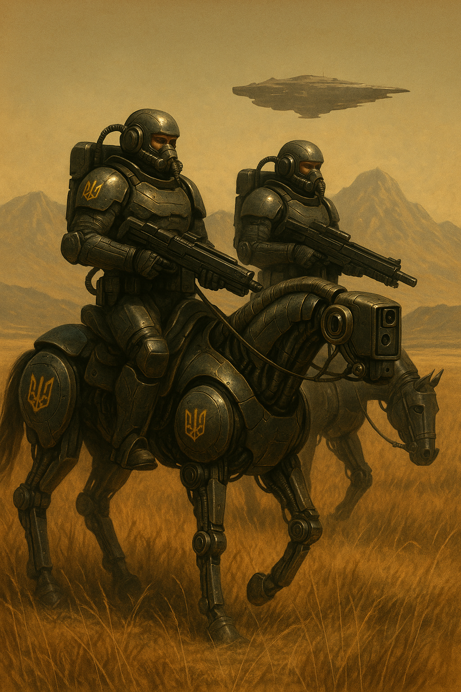
# Глава 7\. До своїх

*Зухвалий план. Несподівана зустріч на поверхні. Порятунок.*

План отамана був самогубством, але іншого шляху не було. В шлюз не могли загрузитися всі одночасно, то ж багато лахів та ботів просто кинули напризволяще. Саме тоді Тавриду прийшла ідея: він бере з собою бот-коней та пробивається до позиції Данила. Візуально гайдуки бачили, що іде бій, а значить, що термінатори були ще живі. Таврид попросив дозволу здійснити спробу провести коней до товаришів і разом, уже на них, спробувати вирватися з кільця облоги, яке все сильніше звужувалося навколо входу до станції. Отаман зв’язківців, Мухнар, ще коли гайдуки були на станції, показував план варп радіо-станції. В декількох кілометрів від шлюзу, прямо в скелях, які виходили з\-під грунту і височіли над плато станції, був запасний вихід, що часто використовувався для проведення регламентних робіт, на випадок, коли треба було виводити важку інженерну техніку на поверхню. Прохід майже ніколи не використовувався, але функціонував. Гайдуки його спеціально не чіпали, щоб ворог якомога довше не знав про нього. То ж план Січніка та Таврида полягав в тому, щоб на конях подолати ці декілька кілометрів та зайти на станцію. Гайдуки хоч і мали достатньо запасних балонів з охолоджувачами для скафандру, киснем та виведенням продуктів життєдіяльності людини, але в оточені вони навряд чи б протрималися більше кількох годин, ведучи нерівний бій з піхотою та танком Імперії Сонця. Тому тут або пан або пропав.  
Бот-коні, як озброєння гайдуків, було щось новим і з’явилися лише зовсім недавно, і то як допоміжні зайві боти для перенесення ренаменту, або виведення розгерметизованого гайдука із бою. Їх ефективність довели повстанці на планеті Мюридів, яке було примучене 1589-им корпусом «Списи» під отамануванням Всевіда Чайковського. В той час він керував лише одним корпусом, до складу якого входив полк, в якому служили Данило і інші гайдуки, а саме «Збаражські Списи», названі в честь системи, з якої набиралися рекрути. Данило з Михайлом з самого початку служили в 6-їй важкій роті гайдуків «Космічні Списи», головою яких був наш Іван Січнік. Таврид же приєднався до них уже після придушення повстання мюридів. Повстанці використовували ботів для швидкого переміщення по материку, і вони завдавали втрат гайдукам, які не були такі мобільні, і більше звикли до осад або штурмів. Але в пісках планети «Мюридів», порізаних рівчаками та скелями, де могли сховатися повстанці разом зі своїми бот-коням, старовина кіннотна тактика підходила дуже вдало. Після повернення «Мюридів» під контроль гетів, зброярники з «Січі» прийняли рішення додати бот-коней в якості експерименту до деяких полків.  
Данило з Тавридом прийнялись за розробку уже більш детального плану по відходу з оточення. Михайло ж з Цесарем інколи пострілювали по окопах навколо і чатували. Вогонь імперців інколи залітав в їх шанець, та і поки що піхотою ніхто не здійснював спроб пробити позиції термінаторів Але що було точно очевидним, так це те, що з хвилину на хвилину свиноок[^39] зайде або ззаду, або зробить штурм в лоб.  
— Дивись, он там подалі, видніється кряж. Нам треба зайти за нього, з іншого боку є вхід на станцію через генераторну. — Таврид висунувся з Данилом із окопчика і указав броньованою перчаткою на невеличкі скелі.  
Шлях до них був через геть пласке плато, а з рядком рівчаків та кратерів, серед яких можна було сховатися. Кожен бот-кінь був здатен нести термінатора-гайдука зі зброєю, але тоді швидкість помітно падала.  
— Нам треба буде рухатися душе швидко, щоб встигнути заскочити в перший ярок. — Данило пильно оглядав весь ландшафт навколо. Жаль, що дрони уже всі були відпрацьовані і не можна було облетіти їх маршрут. — Я буду рухатися на коні зліва від вас, у мене ще робочий щит, який здатен витримати з десяток лазганів свинооких.  
— Я можу стріляти з двох рук. — останні два слова Таврид вимовив трохи стисло, від прильоту гранати поруч підняло куряву і трохи посікло уламками його броню, але жоден з аварійних значків не заблимав тривогою в його візорі. — У Цесара броня геть порепана, мені здається плекс-гель там ледь тримає герметичність. Нехай буде іти за нами всіма.  
— Згоден. — Данило переключився на локальний вокс канал для всіх гайдуків, щоб Михайло та Цесар могли чути. — Ми прийняли рішення. На конях прориваємося он до тих скель. З собою беремо мінімум. Я іду зліва, прикриваю вас щитом. Далі — Таврид, буде вести вогонь по ворогу, якщо треба. Михайло і Цесар, ви ідете за нами, щоб між їхньою капсулою висадки і вами завжди були ми. Збираємось, через п’ять хвилин — прорив.  
Гайдуки по черзі прийнялися набирати ренамент та зброю. Данило взяв свій щит, спис та короткий однозарядний плазмовий самопал. Михайло, щит якого був роздерибанений ботом-копачем імперців, схопив свою магнітну сумку із гранатами, спис і автоматичний лазерний самопал. Цесару, який був просто гайдуком, а не термінатором, не було з чого вибирати, лише як свій власний самопал та додаткові магнітні короби із плекс-гелем, запасними бронепластинами і парою зарядок для самопалу. Таврид мав на правому плечі спис, щит він полишив ще біля шлюзу, на лівому ж плечі висів плазмовий самопал. В дві руки він взяв лазерні автомати імперії сонця, які валялися в окопі. До них зняв з убитих імперців ще декілька додаткових зарядок.   
Якщо подивитися з боку на всю цю компанію, то здалося б, що хтось випадковим чином розкидав по них зброю і ще й усадив на коней. Ніхто з них не мав повного рідного комплекту броні, то тут то там виднівся ремонтний комплект пластин, деякі з них були ще залиті поверх плекс-гелем.  
— Всі готові? — У Данило почало ссяти під шлунком, в очікуванні можливої битви.  
Як відповідь, всі три значки гайдуків у візорі Данила заблимали підтвердженням.  
— По конях\!  
Данило вставив свій броньований чобіт у величезне металеве стремено на бот-коні. Він міг побитися на свої дві пайки, що почув звук шкіряного сідла. Хоча весь бот-кінь був відкований і вилитий із металу, а під дупу просто підкладений ущільнювач. «Це прямо якийсь голос предків до мене постукав, я і живих коней не бачив уже років з десять», подумав про себе Данило.  Всі гайдуки усілися в сідла і рушили назад, в сторону шлюза. В результаті обстрілів і бійки із попередньою групою імперців, яких розмотало по поверхні мельт-міною зі списа Михайла, ґрунт осунувся і утворив гарне місце для виходу на поверхню в чисте поле. Вони кроком просувалися по окопу, ширини якого вистачало як раз для проходу в одного коня. Гайдуки ж повністю лягли на своїх ботів, щоб не демаскувати свій відхід — гайдук-термінатор, сидячи на коні був більше за три метри зростом.  
— Данило, ось тут це місце, де можна вискочити. — Таврид коротко кинув у вокс канал.  
— Добре.  
Данило повернув голову і глянув на свою міні-ватагу. Всі стояли колоною, у порядку, як і домовлялися.   
— Не знаю, чи ця оказія вийде вдалою. Але до шлюзу дороги немає. — Як доказ його слів, з тієї сторони піднявся величезний гриб від вибуху, чи то вороги скинули мельт-міну, чи здетонував якийсь танк, гайдуки не звертали уже уваги. —Прориваємося до рівчака, по ньому буде легше рухатися. Далі ідемо в напрямку скель і шукаємо ці кляті віддушини для генератора.  
— СІЧ З НАМИ\! — Голосно вигукнув Травид у вокс.  
— ІМПЕРІЯ ПІД НАМИ\!  
Чотири бот-коня, один за одним вискочили із окопа і прожогом кинулися через поле в сторону яру, поритого під час будування станції. Внутрішні двигуни коней, які працювали на капсулях з надважких металів – ейнштейнія і стронція, могли видавати по 120 кВт в одиницю часу. Цього було достатньо, щоб нести на собі термінатора в обладунку на швидкості 50 км/год. Данило подивився на дисплей коня, який показував миттєвий розхід, який збільшувався з 40 кВт до 93 кВт, як тільки кінь почав іти галопом по рівнині.  
— Летимо\! Всі ховайтеся за мною\! — Данило поставив щит на ліву ногу, намагаючись прикрити свою ватагу від вогню.  
— Ворога не бачу\! Вони досі луплять по точці, де ми були\! — Таврид вимовляв всі слова в ритм галопуючого коня.  
— Прорвемося\!  
Кожен з вершників дивився на свій сектор. Данило все ще очікував побачити лазерні розряди, які б летіли в їх сторону, але ворог досі не зметикував, що відбувається. Атмосфери на місяці не було, тому ніяких звуків і шуму коні при пересуванні не видавали. Лише гуркіт та вібрація через ґрунт могли викрити сміливий маневр гайдуків.  
— Пів дороги\! Ще трішки\! — Данило не встиг договорити, як з десантної капсулі, звідки і висипали всі штурмовики, по ним відкрили вогонь із скоростріла. Лазерні рисочки з неймовірною швидкістю подолали з кілометр до тікаючих гайдуків і ударили зовсім поруч з конем термінатора. — Вогонь\! Ведуть по нам\! Голову до коня\!  
Гайдуки, відтопиривши свої броньовані дупи назад, стоячи в стременах на ногах, продовжували розривати дистанцію.  
— 90 кВт\! Оце так пре\! — Михайло із захватом поділився своїми даними з ватагою.  
— Можемо оббігти тричі цей клятий шлюз ще і батареї залишиться\! Ці мюридські конячки – наш порятунок\! — Таврид уже звик до галопу і йому він не збивав дихання.  
Декілька розрядів лазерного скорострілу попали в щит Данила, одна риска пролетіла просто між передніми і задніми ногами його коня. Але обстріл почав спадати. З такої дистанції, навіть автоматизовані скоростріли мало чим могли зарадити, намагаючись попасти по рухомій цілі. Вектор відходу був вибраний Тавридом ідеально — вони рухалися одночасно подалі від ворога і вправо від нього, що змушувало скорострільника імперців постійно перераховувати приціл.  
— Так\! Дійшли\! — Данило з радістю заволав, коли побачив інший берег рівчака. —  Збавляємо швидкість, ми тут уб’ємося на конях…  
Данило збився з речення, яке так і не договорив. З самого краю рівчака він розгледів ворожий табір, а від кількості ворожої піхоти в самому рівчаку у нього стислися навіть мікропробоїни на броні. В яру сиділо до пів сотні бійців ЛІНІЙНОЇ ПІХОТИ Імперії Сонця\! Як вони опинилися, і що тут робили, Данило навіть не встиг навіть обдумати.  
— ВОРОГ\! — щосили проричав у вокс. — БИЙ\!  
Один за одним, всі чотири гайдуки на повній швидкості влетіли в рівчак. Імперці  схоже що взагалі не очікували побачити тут гетьманатів, а тим паче трьох термінаторів і гайдука на якихось бот-конях (яких у них, до речі не було взагалі). Деякі з них сиділи на землі і не мали при собі зброї. Вона була акуратно складена штик до штика в купки як палатки. Інші імперці розвантажували якесь інженерне обладнання з бот-носіїв. Посеред табору була встановлена шахта, звідки транспортер вигрібав ґрунт.   
— РІЖ\! — Михайло зметикував самим першим, і замість стрілянини із плазмового самопалу, вихопив свою термінаторську шаблю і одним махом зніс голову найближчому піхотинцю, коли той ще підводився з землі.  
— РУБАЙ\!  
— СУКАААА\!  
— НАААА\!  
Вокс канал міні ватаги заполонився нерозбірливими криками гайдуків, які прийнялися рубати і різати піхоту навколо. Прямо на краю рівчака сиділи п’ять імперців, вони підскочили і чимдуж побігли до своєї зброї, але чотири надважких вершники ударили по ним. Від першого удару гайдуків, кожен з яких важив майже півтори тони разом з бот-конем, у свинооких просто лопнули скафандри і відбулась миттєва розгерметизація. Данило встиг розрядити самопал в наступну групу, миттю кинув його на карабін і витяг шаблю. Таврид, ледь не звалився з коня при тарані, але якось втримався і почав вести з двох рук вогонь з імперських лазерних рушниць. Михайло махав шаблею на ліво і на право, клепаючи візори всім підряд. Цесар, який не був термінатором, під своєю вагою після тарану першої купки, збився з курсу і по інерції заскочив на протилежний схил рівчака, зупинився і прийнявся розстрілювати інші підрозділи піхоти, які були трохи подалі та уже добігли до арсеналів зі зброєю.  
— ЗА СІЧ\! … І ЛУГ\! — Данило в ритм ударів шаблею вигукував своє улюблене гасло. — За…СІЧ\! І….ЛУГ\!  
На «За» та «І» він вдихав всіма легенями, а на кожен «Січ» та «Луг» різко видихав і опускав шаблю. Кожен наголос на слові завершував блискавично швидкий удар вниз. Ще один скафандр пробитий. І ще. Тіла, які падали під бот-коня, добивались залізними ударами копит бота, у якого, як виявляється, була закладена бойова підпрограма. З усіх сторін випаровувалась кров, яка тут же одночасно і замерзала, і зникала на сонці. Через декілька десятків метрів швидкість бот-коней упала, але її вистачило щоб вклинитися в наступну групу із десятка імперців, які прожогом кинулися тікати хто куди, як риба, коли в басейн запустили щуку. Данило не переставав клепати потилиці на візорах. Огидний червоний герб імперців у вигляді червоної зорі то тут то там тріскався на двоє, з тріщини вискакували шматки мозку з кров’ю, і тут же починали випаровуватися і замерзати одночасно. Майже ніхто не чинив опору, паніка охопила імперців і вони кинулися рачки вилазити з рівчака. Їх було ще дуже багато, тому гайдуки не зупиняли атаку і продовжували розстрілювати з рушниць та рубати шаблями. Як тільки натиск спаде, імперці могли б зрозуміти, що їх клепає всього чотири гети і тоді результат бою буде зовсім не на користь гайдуків.  
— УБИТИ ЇХ ВСІХ\! — Данило викрикнув у вокс риторичну команду. Шаблі і списи уже з не такою інтенсивністю, але все ще продовжували знищувати нападників, розрізали їх тіла та броню та за собою залишали шматки м’яса, що билися в передсмертних конвульсіях розгерметизацій. Данило з Михайлом загнали трьох імперців на будівлю шахти, які ті, судячи з усього, тут і зводили.  
— Михайло\! Що це за будівля\! Вона явно не наша\!  
— Мабуть, це підкоп до станції, чи хочуть закласти тектонічну бомбу через неї. Її треба знищити\!  
— Давай знищимо. У тебе ж була ще одна міна?  
— Звісно, забирай її.  
Михайло став спиною до брата, і той не злазячи з бот-коня, відчепив чималий диск із мельт-міною, натиснув на кнопку таймера, прокрутив кільце взводу до позначки «10». Потім висмикнув роторне кільце і заховав в сумку бот-коня. Тепер міну ніяк не можна деактивувати.  
— Через десять хвилин вибухне\! Данило що сили жбурнув міну прямо в ствол шахти, з якого боти-копачі продовжували висипати ґрунт назовні через ленту-транспортер.  
— Отамане, у нас проблема… — Голос Таврида був трохи стурбований.  
— Трясця юпітерські, що там ще?  
Декілька десятків ворогів почали гуртуватися навколо офіцера, який підняв яскраво-червоний стяг із жовтою зіркою. Старший по званню відкрив вогонь зі свого короткого лазерного пістолету, але сили пострілу не вистачало, щоб пробити броню когось із гайдуків. Він це робив скоріш для того, щоб підбадьорити своїх підлеглих і указати їм ціль для стрільби з піхотних лазерних рушниць.   
— Заваліть той стяг\! — віддав наказ Данило. — Цесаре, Таврид, вогонь по групі вузькооких\! Не дайте їм згуртуватися. Чим більше зараз завалимо, тим легче буде потім\!  
Цесар перевів вогонь зі свого лазерного самопалу на купку в чорних обладунках. Не всі з них мали зброю, під час панічного відступу багато хто з піхоти просто кинувся тікати в усі сторони, не думаючи про захист. Але цей офіцер, який мав трохи іншу форму шолому і більш масивні нагрудні пластини, зметикував і підняв свій стяг, даючи можливість імперцям об’єднатися навколо нього.  
Два лазерні заряди ударили прямо всередину групи піхоти, двоє з імперців, що стояли поруч із офіцером, упали на землю і з них почав виходити пар і миттєво замерзати. Данило з Михайлом на конях ніяк не могли наблизитися до офіцера, щоб розрізати його своєю мюридською шаблею. Прості піхотинці озброїлись хто чим міг. Дехто навіть взяв шматок металевої пластини і закривався ним від ударів Данила і Михайла. Інші ж списами і лазерами відганяли гайдуків від стягу. Данило відскочив вбік, прикриваючись щитом перезарядив свій плазмостріл.  
— Треба добити цього офіцера. Михайло, відволічи їх, а я наближусь і уб’ю його з плазми.   
— Гаразд.  
Михайло вискочив з укриття і з піднятою шаблею почав накручувати круги навколо барикад та імперських піхотинців.  
Данило так само різко вискочив з укриття, направив коня прямо на стяг, який тримав офіцер, і з піднятим самопалом пустив бота в галоп. Як тільки до цілі залишалося метрів двадцять, що було убивчею відстанню для його короткого плазмострілу, Данило став стискати спусковий гачок, як раптом різка біль в правій гомілці обірвала його атаку. Від несподіванки він смикнув коня, той став завдибки і ледь не скинув гайдука під себе. Справа від гайдука стояв із великим списом в руках імперський піхотинець і замахувався для другого уколу в нього. Данило розвернув плече із самопалом і в упор всадив сімдесят грам плазми прямо в груди нападнику. За мить величезна діра засяяла прямо посеред бронекостюму імперця.  
«Розмергет. Розмергет. Розмергет.» — клята червона лампочка заблимала прямо під очима на візорі. Данило глянув на офіцера, навколо нього з кожною секундою все більше і більше збиралося піхотинців. Вони припинили панічний відступ і ставали в кругову оборону навколо стяга.  
— Ти живий? Що з конем? — Михайло стурбовано спитав у брата.  
Данило не звернув уваги на клопіт Михайла, прокрутив свого бот-коня на 360 градусів, щоб оцінити масштаб битви і чи варто її подовжувати. Загалом, на землі лежало декілька десятків забитих імперців, хтось упав в під ударом шаблі, когось пробив наскрізь лазерний заряд з гвинтівки Цесара. Вцілілі ж об’єднувались в купки і просувалися до стягу, ховалаючись за своїми щитами і пострілювалючи по гайдуках.  
Данило також бачив, що піхотинці по черзі вибігали із строю, щоб підняти зброю, спис чи ще один щит і прожогом ховалися назад за свій стрій. Офіцер імперців, уже не тримав стяг, а вів вогонь по Михайлу та постійно віддавав команди вцілілим солдатам іншою рукою. Цесару вдалося влучили в нього двічі, але важкі броньовані пластини витримали і не луснули. Інерція бою з такого неочікуваного наскоку повністю себе вичерпала, гайдуки уже на собі відчули підвищену щільність ворожого вогню. Якщо до них прийде підмога, або хтось почне працювати з більш важкого озброєння, то вважай що гети уже не живі.   
— Всі\! Уходимо\! У мене пробій, розгермет тридцять відсотків\! Міна уже в штольні, вони не дістануть\! Виходимо з рівчака\! Цесар, ти перший\! — Данило розвернув свого коня і став швидко підніматися вгору, але все ще прикриваючи себе і інших щитом. — Михайло, Тавриде, дострілюйте магазин і виходьте з бою.   
Гайдуки одним за одним почали підніматися вгору по рівчаку, прикриваючись валунами та складками місцевості. Схоже, що хтось з імперців нарешті розчохлив плазмомет, і почав накидувати снаряди в ті місця, де тільки декілька десятків секунд тому були гайдуки.   
— Я порожній. — важко дихаючи промовив Цесар у вокс. — є два розгермета[^40]. Пробую залитись.   
Михайло та Таврид дострілили останні набої та викинули самопали.   
— Скачемо до скель. Вони навряд чи за нами підуть. Сподіваюсь, на станції нас чекатимуть. — Данило і троє гайдуків чим дужче понеслися в сторону скель. Лампочка на візорі уже показувала «Розгермет. 45%»  
Позаду них ще упали дві плазм-міни, але попасти в кіннотників балістичною зброєю просто неможливо. Гайдуки через десять хвилин дійшли до самих скель, ніякої погоні імперці не змогли організувати за ними.   
— А ось і вхід\! — Данило першим побачив величезний прохід в скелі. Важкі, зроблені з металу для космічних кораблів ворота шлюзу були посипані піском. По слідах на ґрунті можна було зрозуміти, що тут колись їздила важка будівельна техніка.  
— Я радий, що ви вийшли. — голос Січніка пролунав у воксі неначе хтось з богів зі скіфського олімпу спустився до них. — Заходьте. Шлюз уже відкривається.  
Данило зайшов в шлюз останнім і упав з коня в темряву.

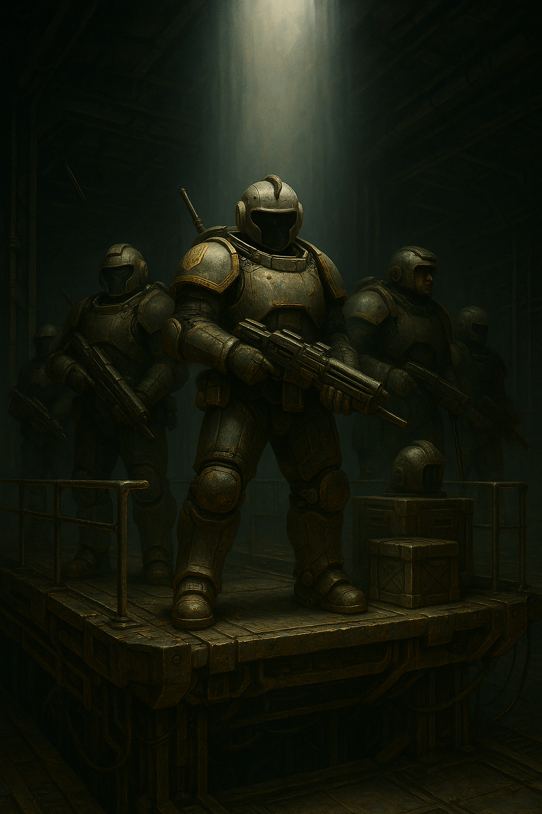
# Глава 8\. Зняття осади

*Гарні новини. Плани на наступ.*

Данило очухався в госпітальній кімнаті, його ноги були загорнуті в прозорі циліндри. Мережа з дротів і голок стирчали з гомілок та колін, по трубочках лилася якась брудна жижа, більш схожа на воду з калюжі. «Трясця розгермет, невже відріжуть» — промайнула перша думка у Данила в голові. За свою службу він надивився на наслідки розгерметизації скафандрів, коли вени і капіляри забивалися кров’ю і просто починали гнисти. «Де Таврид та Михайло, і той третій гайдук-римлянин, як його, Цесар?» — друга думка, яка промайнула в його голові. Він знайшов в собі сили піднятися на лівому лікті і окинути оком приміщення. Навколо нього лежало ще декілька гайдуків. Один з них на половину був засунутий в якийсь апарат, діафрагма всередині стискалась і розширювалась в такт дихання людини. «Цей, мабуть, напівтруп, або легені розірвало, або дуже довго лежав без кисню на поверхні».   
Данило різко здригнувся, коли почув звук відкривання дверей. За декілька діб на поверхні місяця його вуха відвикли від справжніх звуків. В їх кімнату зайшов медгайдук Печиборщ. Він був вдягнений в гнучкий скафандр та навіть мав на поясі довгий ніж і лазерний багатозарядний пістолет.  
— Зброя на медику? Все так погано? — Данилі доводилося дуже рідко бачити озброєних медгайдуків, тим паче в скафандрах на все тіло.  
— О, ти уже не спиш, я тобі стільки вгатив ібунола[^41], думав ти ще пару годин покайфуєш. Ну і навели ви шороху на поверхні… — гайдук підійшов до Данила і рукою показав йому лягти назад на спину. — Ще встанеш, ноги будуть ходити, не бійся.  
— Вони на станції? — Данило не звернув уваги на останнє речення, продовжував дивитися на зброю медика і поступово впадав у відчай. Якщо медик ходить зі зброєю, значить ворог на станції і халепа повна. Ось так, закінчити своє життя від удара імперського штика, лежачи на каталці і не бути в змозі себе захистити. — Вони наш штурманули?  
— Так, була спроба. — Медик підкритув щось в циліндрах на ногах Данила і гнила рідина заструмилась в якийсь фільтр, що стояв на підлозі. — Вони просверлились на саму станцію, спрацювала тривога розгерметизації, тому Січнік дав команду  не знімати бойові скафандри до розпорядження.  
— І як? Їх вибили?  
— Ооо, так. Туди одразу відправили групу гайдуків. Але головну відсіч дали на поверхні. — Медик прищурив очі і з посмішкою подивився на Данила.  
— Що ти так дивишся? — Данилі не сподобався цей підозрілий погляд і особливо посмішка.  
— А те що ти і інші троє твоїх друзів перебили майже всіх штурмовиків, які мали зайти в пробоїну. Вони уже були на станції, як ти зі своїми гайдуками налетів на них і дав змогу відбити тунель. А потім ще і підірвав штольню із обладнанням.  
— Так ось чому вони були так слабо захищені? Це була спеціальна штурмова група для станції? Їх лазери ледь пробивали броню.  
— Слабо?? В штурм пішли Саманаки. Це як термінатори-сердюки, тільки вузькоокі. Це, мабуть, на поверхні стояла якась легка лошня. Ми ж туди теж відправили важких термінаторів, в тунелі була просто різанина кістка в кістку. Але їх було дуже багато і врешті решт вони почали тіснити наших…аж поки ти не навалився на них як якийсь давносередньовічний козак із рогачем і конем. Потім стався вибух в штольні і задавив половину саманаків. Добре, що вони в той час уже відтіснили наших, так би і гайдуків зачепило. Без підтримки, саманаки протримались там добу, врешті-решт Січнік із термосами особисто зачистив станцію, а пробій уже залагодили, підходи замінували і виставили пару сейсмоодатчиків, щоб знати, якщо знову хтось підійде. Зараз той відсік заново заповнюють тиском і киснем.  
— А що з моїми? — Данила дуже непокоїла доля своїх гайдуків.  
— Михайло — десь чатує на станції. Таврида бачив в столовій, від’їдається після рідкої їжі з трубочок скафандру. Цесара трошки посікло, але з ним все добре, я навіть не став його класти до тебе.  
— А що з моїми ногами? — Данило припіднявся і ще раз оцінив ураження ніг.  
— Та все добре. Твою броню на ногах пробив спис і відбувся розгермет. Внутрішній скафандр порвався і трішки полопало вени на гомілках. Ти як тільки зайшов на станцію і зліз з коня — упав на землю. Таврид з Михайлом тягли  тебе до мене і горланили так у вокс про допомогу, що я думав уже брати пакет бо від тебе там залишилася лише грудина і голова. Дуже переживали.  
Медик підняв фільтр, який стояв на підлозі  куди стікала жижа з ніг Данила.  
— О, вуглекислого газу стало менше, значить прочистили твої вени. Навіть не прийшлося виривати їх і пришивати замість них щось з твоєї дупи. — Медгайдук продовжував сипати афоризмами в своєму стилі. Хоча дійсно, Данило мав перспективу пересадки судин з дупи на ноги.  
— Вітаю..\! — Данило ліг на ліжко і у нього потемніло в очах.  
— Спи, три доби на місяці в боях, цього забагато навіть для термінатора. — Печиборщ докрутив щось на крапельниці і Данило провалився у варп.  
Прокинувся він уже в приміщенні без медичних апаратів, світло було приглушене, по стінках і підлозі йшла якась вібрація і інколи лампочки в стелі втрачали яскравість майже до нуля. «Мабуть знов штурм», подумав Данило і різко піднявся на своєму ліжку. В голові засвистіло і чорні кола забігали в очах, але гайдук втримався і через пару секунд все пройшло.  
— Нарешті ти видрихся. — Поруч сидів Михайло в малому бойовому скафандрі з двома самопалами і шаблею. — На маску, вдягай. Медик дозволив тобі доспати без цього клятого респіратора. Як ти?  
— Та чорт його, а ти як? — Данило оглянув свої ноги. Вони були всі в чорних синцях, але він відчував їх як свої. Хіба що дірочки від уколів та дренажу на шкірі видавали недавню операцію по врятуванню ніг.  
— Та ми супер. Ось закінчив зміну і прийшов до тебе. Вузькоокі продовжують лізти на станцію, треба уже і твоя допомога.  
— Вони знову засверлились до нас? — Данило крутив стопами то по колу в одну сторону, то в іншу, щоб перевірити, чи він дійсно може ходити.  
— Вони захопили варп вежу та уже зробили два засверли на станцію. Виявляється, ота група лінійної піхоти в легкій броні — це було прикриття їхньої спецури, головною функцією якої є бій на космічних станціях. Легка зброя, броня — все для бою в приміщенням, коли поруч бігає пару надважких «ломів».  
— Дивно, так? У нас для бою на станціях користуються термінаторами і важкими обладунками. А у них ось такі хробаки, я їх шаблею половинив. — Данило не без приємних спогадів згадав, як тріскалися їх візори від його удару шаблею.  
— Хробаки не хробаки, але дуже маневрені та юркі. Плюс їх дуже багато. Навалюються одночасно і переходять на рукопашний бій. Один мені застрибнув навіть на шию, хотів засунути в щілину мельт-гранату, але я вирвав йому руку і нею ж забив до смерті.  
— Трясця Алтаю, мені теж заступати скоро? — Данило почав шукати свою зброю в кімнаті, але її ніде не було.  
— Тобі ще ні. Січнік особисто тобі видав два дні спокою. — Михайло взяв паузу і важко зітхнув. — Ти чув останні новини з Цитаделі?  
Данило дослухав новини від Михайла, допив очищену воду і сів обдумати всю ситуацію. На «Дике Поле 17» напали війська «Імперії Соцня». Виявляється, уже не секрет, що на планеті знайшли великі поклади нового елементу – «гладіум». З його допомогою розробили нові двигуни для варп-переходів і випробовування пройшли успішно. Тепер не треба трястися чорт зна де в просторі декілька днів, а то і тижнів, щоб попасти на іншу сторону системи чи галактики. Нові двигуни, розроблені на «Дике Поле 17» разом з «гладіумом» здатні переносити військові кораблі буквально за лічені години на відстані, які раніше не були можливі з уже застарілими двигунами, які діють на основі надважких металів «Лоренців» та «Нобелій». Сигнал, який мала передати ця станція, саме сповіщав про закінчення досліджень та вдалі випробовування тестових зразків. Але, так як група вчених була зібрана з усіх кутків космосу, хтось з них зливав всю інформацію «Імперії Сонця». Коли декілька місяців тому нарешті синтезували топливо для нових двигунів на основі металу «гладіуму», шпигун сповістив про це імперців. А може і корпоратів теж. Цих декількох місяців вистачило їм, щоб зібрати ударне угрупування та переслати його варпом до «Дике Поле 17». Чому «Європа Юпітерська» дозволила цей напад? Адже без відома Європи ніхто не може перекинути такі величезні кораблі у варпі ще і на такі відстані. Схоже, що дослідження і винахід нового двигуна для «Європи Юпітерської» зовсім не має зиску, адже це не їх технологія і Гетьманат може розірвати будь-які зв’язки та здихатися від впливу цього застарілого організму під назвою Старий Світ. І так, з десяток ударних корпусів «Імперії Сонця» при підтримці або мовчазній згоді «Європи Юпітерської» здійснили варп-перехід та напали на гетів на «Дике Поле 17». Вони одразу заглушили варп-передавач на місяці, щоб ми не змогли сповістити паланку про напад. Нам не вистачило всього декілька десятків хвилин для завершення передавання на «Зоряну Січ» новини про винайдення нового типу двигунів. Першим удар прийняли орбітальні патрулі. Ці зорельоти можуть переміщатися у відкритому космосі і вони гідно зустріли перші торпеди та бомбардувальники імперців. Це дало змогу змобілізувати всі три корпуси гайдуків на «Дике Поле 17»: 988-й корпус «Тавридський», його війська в основному займалися обороною «Цитаделі», 1223-й  корпус «Улани», та 1589 корпус «Списи», в полк «Збаражські Списи» і входив Данило разом із товаришами.  
Полк «Космічні Улани» прийняв перший удар, адже в його складі знаходяться чи не всі зорельоти та літаки орбітальної авіації сил гетів. «Імперія Сонця» кинула на перший удар сили, які в чотири рази переважали за кількістю сили оборонців. Деякі з бомбардувальників імперців змогли прорватися в атмосферу і скинути плазм-бомби на «Цитадель», але дуже швидко були перехоплені і знищені протиповітряною обороною самої «Цитаделі». «Космічні Улани» стримували винищувачі та бомбардувальники впродовж декількох днів, не даючи імперцям висадити десант на поверхню планети. Їм вдалося відтіснити наші винищувачі лише від місяця із варп-станцією. В останнє вікно можливостей і залетіла шоста сотня важких гайдуків «Космічні Списи» з полку «Збаражські Списи». З ними ще ішла третя сотня, але імперцям вдалося вцілити в неї торпедою і всі гайдуки загинули за одну мить, ще не встигнувши навіть підлетіти до шлюзу. Поки «Збаражські Списи» відбивали штурми десанту на місяці, гайдуки з полків «Стріла Тавриди» та «Космічні Улани» вели бій уже на поверхні планети. «Дике Поле 17» мала аж один континент, де і знаходиться «Цитадель» — колосальний вулик-місто-фортеця, оточена з північної сторони горами, де і добували «гладіум», а з півдня — степ, розрізаний балками, невеличкими скелястими старими горами та купою озер і рік. Саме на південний шмат континенту і висадилися сили ворогів. Вони змогли сформувати плацдарм і запустити свою космічну станцію на поверхні планети, щоб мати можливість перекидати колосальні вантажі знизу на гору і навпаки. Декілька куренів атмосферної авіації з «Космічних уланів» змогли здійснити вдалі рейди і завдати ударів по космопорту, що звузило його можливості по передачі вантажів для штурму уже самої «Цитаделі». «Імперія Сонця» розгорнула цілий корпус своїх наземних військ і стала поступово просуватися до стін міста-вулика. Роз’їзди кавалерії гайдуків постійно здійснювали москітні удари по ворогу, перехоплюючи вантажі, заблукавшу техніку чи невелику групу солдат вузькооких. За п’ятьдесять кілометрів від «Цитаделі» була зведена нова лінія оборони, яка і зупинила просування ворога. Ворог не наважувався залітати за цю зону, щоб не потрапити під вогонь цитадельних батарей. Саме залп з поверхні орбітальними ракетами зруйнував великий десантний корабель імперців, що бачив на власні очі Данило, та і всі гайдуки, що були на варп-станції. Цим, практично, вони і врятували скрутне становище оборонців, адже натиск на станцію дуже сильно спав. Що не можна було сказати про бої під стінами «Цитаделі». Врешті-решт через декілька днів боїв, заваливши гайдуків просто нескінченими атаками своїх лінійних піхотних полків, вони продерлися до стін «Цитаделі». Деякі регіменти гайдуків не встигли відійти до фортеці і опинилися в оточені, продовжуючи вести бої на всі сторони. Цей прорив був такою несподіванкою для гетів, що сонячники на спинах відступаючих гайдуків зайшли на територію самої «Цитаделі», на вулицях і підземеллях міста-вулика почалися вуличні бої. Уже не можна було зрозуміти хто контролює яку вулицю. Декілька тисяч гайдуків, які залишилися в оточені на лінії обороні, не давали сонячникам розгорнутися з усією силою і навалою зайти в місто. Це дало змогу стабілізувати ситуацію.  
Але саме цікаве сталося ще коли Данило разом з друзями вів бої на поверхні місяця. Наша варп-станція отримала сигнал про варп-перехід декількох сотен важких кораблів. Спочатку подумали, що це гети з центральної паланки нарешті прийшли згідно протоколу взнати, що відбувається, і чому зник сигнал з «Дике Поле 17». Але ж не сотні кораблів\! Космос навколо планети вибухнув пожежами на кораблях імперців, скрізь почався хаотичний бій, в який навіть змогли вступити орбітальні війська з «Космічних Уланів». Як виявилося, Корпоративна Республіка вирішила теж напасти на «Дике Поле 17», але запізнилася на декілька тижнів і таким чином врятувала безнадійне становище гетів, зіткнувшись з ордою імперців. Корпи прямо з виходу із варпу уперлися в тилові частини корпусів «Імперії Сонця», яких спочатку охопила паніка, але згодом, завдяки страті декількох кораблів, які намагалися утікти, змогли чинити опір, поступово відступаючи до поверхні планети. Що корпорати, що сонячники несли колосальні втрати. То декілька десятків винищувачів корпів залітали прямо під брюхо крейсеру вузькооких і відстрілювали всі свої плазмові торпеди в упор, повністю виводячи з ладу тридцяти кілометровий корабель. То черговий вантажний корабель корпів попадав на міно-плазмові космічні поля імперців і розпепеляв весь свій людьский вантаж на космічний пил. За всім цим дійством спостерігали з варп-станції та «Цитаделі». Імперці були змушені відкликати чималу кількість орбітальних та атмосферних літаків, і цим скористались гети — зібравши всю авіацію, яка ще залишилась, в ударний кулак і рішучим самовбивчим рейдом перервали пуповину, яка живила всі осадні війська на поверхні планети — розтрощили космопорт, зведений ворогом для проведення осадної операції. Без належної підтримки в боєприпасах і заміні людей, імперці не змогли стримати наземний контр удар гайдуків, які вибили противника з території цитаделі, розблокували залишки гайдуків на оборонному валу і повернулись назад, під захист стін вулика. Саме ж місто-фортеця перейшло в режим ядерної зими, піднявши величезні щити, обрубавши будь-які зв’язки із зовнішнім світом, і перевівши колонію в режим кокону, під належним захистом авіації і протиповітряної оборони зверху. Для штурму такої колонії треба не один місяць убивчих атак, а цього часу ні у імперців, ні у корпоратів уже не було.  
Але були і погані новини. Поки Данило лежав в госпіталі і медики прочищали його підгнивші від розгерметизації ноги, штурмовики імперії сонця змогли захопити вежу варп-передавача і відключили її від станції. Постановщики варп-вад уже не працювали, але і варп-вежа без живлення не могла відсилати ніякі дані. Ситуація на поверхні була патова — в результаті удару корпоратів імперцям уже було не до штурму шлюзу чи самої станції. Їх спроби проникнути на станцію через підкопи і засверління у відсіки припинилися. У гетів ж не було достатньо сил робити вилазки на поверхню, навіть не вистачало силової броні для термінаторів. Зв’язок з поверхнею був перерваний ще коли сонячники увірвались в саму цитадель. Гайдуки позмінно ставали на чати у відсіках, куди могли засверлюватися імперці. Почалась фаза нудної осади, хто кого пересидить.  
Цей потік ретроспективи в голові Данила перервав станційний сигнал тривоги. «Трясця, що там ще» — прошепотів про себе гайдук, вдягаючи респіратор на обличчя. Він мав заступити на чергування уже завтра, але під час тривоги, згідно протоколу ведення війни на станції, кожен гайдук має вдягти хоча б станційний скафандр і мати особисту малу зброю при собі.  
Раптово двері відчинились і в них влетів Михайло в повній силовій броні термінатора.  
— Вдягайся худкіше, там ще сто виходів із варпу. — Голос брата звучав через гучномовець сухо і стурбовано. — Калина дав наказ всім стати до зброї, можливо, це підмога або корпам, або імперцям.  
— А наші з паланки колись прийдуть? — спитав Данило відкриваючі свою велику шафу, де стояв малий станційний бойовий скафандр і прийнявся розстібати зіпери на спині. — Що там зв’язківці кажуть?  
— Згідно правил «Дикого Поля», кожна планета і колонія має відсилати сигнал в центральну паланку раз за січну добу. Якщо паланка не отримує сигнал від колонії, то відправляє пару кораблів пластунів і оголошує збір сердюків, для швидкої реакції на вторгнення. — Михайло ледь стримувався від реготу, бачачи, як Данило намагається влізти в скафандр без допомоги збройника. Сам він зі своєю силовою бронею міг хіба що переламати кістки Данилу, або вирвати з м’ясом той зіпер на спині. — Звідси до паланки летіти декілька днів, ще додай пару тижнів на збір сил…Тобто підмога нам має прийти з дня на день.   
— Тут тривога, вторгнення корпів, а тобі смішно, як я влажу в свій скафандр. — захеканий Данило розминав стопу, яку уже продів в черевики скафандру. Це було найскладніше, якщо вдягався сам. Фіксатори на ахілах клікнули і нарешті ці муки вдягання закінчилися. — Якщо хтось зробить скафандр, який можна вдягати без підвищення пульсу до ста п'ятдесяти, я не проти, щоб він став головним гетьманом Січі.  
— Я теж. — Михайло повисив голос, щоб перекричати через свої гучномовці сигнал тривоги. — Хапай лазган та малу шаблю. Пішли.  
Всі гайдуки, які не були на постах, зібралися в центральному залі станції. Там уже стояв Мухнар, начальник станції, та Іван Січнік, сотник.  
— Чудовий час на збори. У нас ще є дві хвилини, але я почну. — Промовив Січнік через свій гучномовець і паралельно транслюючи свій сигнал в локальний вокс. — Тільки-но ми отримали сигнал про вихід з варпу ще близько ста кораблів. Ми не знаємо чиї це. Я завжди сподіваюсь на найгірше. Якщо це корпи – вони доб’ють імперців, а потім приймуться і за нас. Якщо це підмога імперцям – то вони доб’ють корпів, і … теж приймуться за нас.  
Січнік повернув голову до Мухнара і кивком голови дав йому слово.  
— А ще існує третій варіант. Нарешті приходить підмога нам. Згідно правил «Дикого Поля», раз в добу ми маємо відсилати сигнал в центральну паланку. Ми мали це зробити ще декілька тижнів тому, але за декілька годин до віправки сигналу на нас напали імперці. Даємо декілька днів на очікування, ще пару тижнів на збори сил сердюків. І маємо надію, що це саме наші сили вийшли з варпу.   
Гайдуки підняли радісний шум, тому Мухнар взяв паузу, щоб гайдуки встигли переварити цю інформацію. Через декілька секунд Січнік підняв правицю і гайдуки замовкли.  
— Скажу відверто, майже весь радіозв’язок заблоковано. Варп-вежа, як ви знаєте, від’єднана від живлення. Сердюки, якщо це прилетіли вони, скоріш за все спершу полетять до колонії, щоб оцінити обстановку. Імперці і корпи  в такій же патовій ситуації, як і ми тут. Корпи своїм ударом по сонячникам знищили їх матеріальну-продуктову тилову базу. Але і самі отримали колосальні збитки. Практично, їх обидва флоти вторгнення паралізовані. Сто кораблів сердюків — це не сто кораблів гайдуків. Як ви знаєте, сердюки сформовані і укомплектовані набагато більш потужними силами і засобами для ведення наступальних дій. Я маю надію, що вони зможуть розблокувати Цитадель, а згодом і нас. — Мухнар раптово підняв руку до вуха, глянув на Січніка, різко розвернувся і майже побіг в кімнату зв’язку.  
— Щоб б там не було, — Січнік стурбовано зиркнув на начальника станції, а потім перехопив промову у Мухнара і продовжив, — нам ще треба пережити декілька битв. Я вважаю, що треба діяти більш активно на поверхні і спробувати розблокувати шлюз. Мені треба декілька добровольців, які готові здійснити рейд по тилах імперців над нами. Про свою готовність сповістіть вашого курінного до 20:00. На цьому все.  
Січнік відключив зв'язок і закрокував слідом за Мухнаром. Стискаючи зуби, щоб не перейти на біг, якомога спокійнишим кроком він пішов в кімнату зв’язку. У текстовому вокс-каналі для вищої старшини він уже побачив новину. Але не захотів її оголошувати гайдукам на зібрані, не обдумавши і не обговоривши це з Мухнаром і «Цитаделю».  
— То що, це наші прилетіли? — спитав Січнік, знімаючи герметичний шолом і залишаючи на обличчі лише дихальний респіратор.  
— Так, — Мухнар аж підскакував у кріслі, — прибула ударна група з дев’яносто двох кораблів сердюків. Це 317-й окремий полк. Вони уже вступили в бій. Наразі, через блокування зв’язку, ми можемо лише приймати від них повідомлення, але відповіді ще не проходять. Я виставив скрипт, який кожні п’ять секунд відсилає їм звістку про нас.  
— Чудово. А «Цитадель»? Щось відповідає нам?  
— З поверхні запустили дрон-болванку, який вийшов на другу космічну швидкість і підлетівши ближче до нас, передав нам новий наказ. Якщо сердюки зможуть зняти облогу, то всі сили направлять на розблокування нашої варп-станції. Прогнози у Чайковського дуже позитивні. Їм вдалося зробити ще одну вилазку атмосферною авіацією і знищити генератори, які живили космопорт сонячників.  
— То я, мабуть, притримаю своїх для вилазки. Коли почнуть гасити імперські кораблі, які нас штурмують, тоді і зробимо вилазку. Так буде менше жертв з нашої сторони.  
— Ну…якщо відбити варп-антену і перепід’єднати її до живлення від наших реакторів, то ми зможемо відправити те кляте повідомлення на Космічну Січ і до приходу сердюків. Може ризикнемо?  
— Якщо операція не вдасться, то ми отримаємо мінус двадцять гайдуків, які могли б обороняти саму станцію. Давай почекаємо пару днів. Я дам тобі знати. — Мухнар кивнув зв’язківцям, вдягнув шолом і вийшов.  
Як би секретно не доставлялися всі ці повідомлення, але через декілька днів чутки про те, що прибули сердюки, і що уже ідуть бої на поверхні планети, ширилися між вцілілими захисниками станції. Новини обговорювали позаочі отамана, то ж Данило, Таврид та Михайло з Цесарем зібралися в столовій, щоб з’їсти гарячого та обговорити ситуацію.  
— Як же без зв’язку, виявляється, погано. — Данило сьорбнув гарячого борщу із залізної тарілки. — Ніколи не думав, що ось ці гайдуки-зв’язківці можуть бути такими важливими. Я їх взагалі і за рівних не рахував до нас.   
— Відсутніть інформації гірше, ніж відстутність набоїв. — Михайло простягнув руку за хлібом, але ударив пальцем стіл і одразу ж засунув його в рота, щоб зупинити кров, яка бризнула з\-під нігтя. — От скотство, без нормальної їжі ці нігті геть розсипаються. Може я хапанув радіації і гнию?  
— Та чорти там собачі, ми ж ходимо до Печиборща як до себе додому після цих виходів на поверхню. Ми чисті, як селища німців в Старій Європі[^42], після Першого Походу[^43] козаків. — Данило оглянув свої нігті, які поки що не слоїлися, як у його брата.  
— У мене, до речі, якийсь із прадідів там і отримав стан козака. — Цесар розмовляв і жував одразу. — Пішов як забраний[^44], а повернувся десятником. Його історії мій дід записав, то кожен з чоловіків в роду тепер може перечитати. Що там правда, що ні – чорт його бери. Але сотника за три роки отримав не дарма.  
— А мого діда дядя…  
Данило, Михайло та Таврид пирснули борщем прямо на стіл.  
— Та правду кажу\! Як повернемося в курінь, я покажу вам записи та реєстр. От уже\! Не забувайте, ми з моїм загиблим братом, вас врятували. Вірніше Михайла. — Цесар хотів збити розмову трохи в тужливу течію.  
— Дуже прикро, що він тоді загинув. — Михайло витер рот хлібом. — Його тіло змогли повернути?  
— Ні. Він там досі лежить десь.  
— Ти ж знаєш, після зняття облоги, ми повернемо всіх і запишемо в реєстр героїв на Січі. — сумно промовив Данило.  
— Ти сам в це віриш? — Цесара почало розносити на емоціях. — Почалась велика війна. Ми навіть не знаємо, чи наші паланки цілі. Можливо, ця система під номером сімнадцять — не єдина точка вторгнення.  
Всі мовчки продовжили їсти борщ з хлібом, обдумуючи втрати в підрозділі та взагалі долю рідних, які залишилися на поверхні «Дике Поле 17».  
— Ну ми достатньо довго жили в напівзатиші. — Михайло вийняв свій розбитий палець з рота і навалився ложкою на борщ, якого ставало все менше. — Всі три імперії, ми, вузькоокі та корпи — нарощували флот, технології. Рано чи пізно, ми б зіштовхнулися. Паланки наші цілі, інакше б хто прислав сюди сердюків? Тим паче стільки\!  
— І то правда. — Данило облизав ложку і поклав її на стіл. — До речі, Цесаре, якого дідька у тебе і у твого загиблого брата такі імена? Ти не з перших гетів?  
— А це мій прапрадід, коли його забрали на війну в Перший Похід, назад повернувся не тількі десятником, а ще і з дружиною зі Старого Риму. З тих пір іноді в нашому роду проскакують давноримські імена.  
— Я тобі потім покажу наші із Михайлом сімейні скрижалі. — Данило краєм ока помітив, що в столову зайшов Калина. За правилами гайдуків, в столовій знаки шанування старших не розповсюджувалися і шикуватися не треба було, тому відкрито ніхто не звернув уваги на отамана. Але всі розмови трохи стихли та не були уже такими різкими.  
Калина вийшов до роздатчика їжі, взяв стілець, заліз на імпровізовану сцену та підняв руку. Всі поклали ложки і повернулися до нього.   
— Вибачте, їжа почекає. Я маю дуже гарні новини. Тільки-но отримав наказ від Січніка підготувати рейдову групу на поверхню. До нас летять…сердюки\! Осаду з Цитаделі практично знято\!  
— Волові трясця\! Оце так на\! — всі повскакували з місць і прийнялися радісно обнімати одне одного, вигукуючи поздоровлення та відчуваючи, що скоро все закінчиться.  
Куточок, де сиділа четвірка наших гайдуків теж підскочила, перекинувши залишки борщу із величезної миси на стіл та на штани скафандру Таврида, який весь цей час сидів мовчки і їв не стільки борщ, як сметану з хлібом. На їх везіння, штани повністю екранували температуру, тому він не обпікся.  
— Годі, годі\! Це ще не все\! — Калина голосом вмів заспокоїти навіть два десятки гайдуків. — Наш сотник, Січнік, провів нарешті перемовини з поверхнею та сердюками. Вони готують десант для звільнення станції\! Ми ударимо одночасно. Наша задача — пробитись через шлюз та будівельний вихід та навести шороху серед вузькооких висерків. Сердюки — упадуть зверху їм на голови і розчавлять своїми штурмовиками. Дамо їм просратися\!  
— Хто проти Січі, той проти Всесвіту\! —  всі разом вигукнули головне гасло гайдуків.  
— Чудово\! — У Калини у самого чесалися руки розгерметизувати пару сонячників і дивитися, як їх очі синіють від холоду космосу. Його погляд зустрівся з Данилиним. — Данило, Михайло, Таврид та Цесар. У вас спеціальне завдання від Січніка. Він чекає у відсіку зв’язківців. Всі інші — добиваєте обід і готуйтеся до виходу на поверхню. Просто так сонячники нам не віддадуть ту вежу.  
Трійка гайдуків витирала стіл за собою, поки Таврид в туалеті намагався змити залишки їжі зі штанів. Опісля разом поставили стільці на місце, вийшли в коридор та вдягнули респіратори та почимчикували до Січніка. Правило носіння респіраторів стало ще більше жорстким, після того, як сонячники забурились в один із відсіків станції і розгерметизували її. Два гайдуки, які носили респіратори просто на шиї, отримали розриви легенів, хоча і залишились живими завдяки лікарям сотні. Блукаючи коридорами, Данило і його команда бачила загальний шмон і приготування до бою. То тут, то там, хтось біг з бронепластиною, щоб причепити її на свій костюм, хтось перевіряв запрограмовані дрони. Скрізь кипів жвавий динамізм. Звістка про скорий прихід сердюків надзвичайно підняла бойовий дух сотні гайдуків.  
Перед кімнатою зв’язку стояло два помічника Січніка. Оглянувши четвірку, вони мовчки відкрили двері і кивнули головою, даючи знак, що можна заходити. Всі стіни в кімнаті були завішані дисплеями, де зображались різні сторони планети «Дике Поле 17», один з дисплеїв мав назву «Варп Зв’язок» і показував червоним текст «Відсутній».  
— Здоров’я бажаю. — привітався Січнік. На його правому плечі був приклеєний патч із зображенням трьох золотих списів, які пробивали череп. Схожі патчі мали і звичайні гайдуки, але золоту розшивку міг вдягати лише сотник. — Я бачу, ви в гарній формі, саме те, що треба для наступного завдання.  
— Готові до обговорення і виконання. — Данило відповів за всіх, досі стоячи струнко, як і його товариші.  
— Вільно, давайте без церемоній, тут війна. — Січнік сів за стіл і запросив до себе чотирьох друзів. — Завдання ваше — вилазка через будівельний шлюз, який уже закинутий давно, це той самий через який ви і попали назад на станцію. Вузькосракі так і не додумались його перевірити, мабуть, досі гадають, що ви десь бігаєте по цьому клятому місяцю. Ось план поверхні. На бот-конях ви робите петлю, — сотник почав малювати олівцем на столі, ведучи стрілку від шлюзу і до антени-варп зв’язку, — і приходите в цю точку. Наш дрон встиг відловити їх матеріальну базу. Оця цяточка, що тут роздрукована — це їх генератор, навігаційний радар та станція зв’язку одночасно.  
Січнік посунув великий лист із роздрукованою мапою місячної бази і позицій імперців ближче до гайдуків і продовжив.  
— Як ви бачите, їх основні сили знаходяться в наших же шанцях, як ми копали для оборони шлюзу. Із нього просто не реально вискочити…зараз. Але стане можливим, якщо навести шороху в їх тилу. Це і є вашою задачею.  
— Ми вчотирьох ударимо по їх базі забезпечення? Яка там охорона? — Данило посунув лист ближче до Цесара, щоб і той міг роздивитися.  
— Так, у нас є чотири бот-коня і…чотири костюма термінатора.  
— Ееее, — Цесар підняв очі і вирячив їх на Січніка.  
— Так, я знаю, що ти рядовий стрілок. Був ним. З цього дня ви вчотирьох — зведений загін термінаторів-штурмовиків в нашій сотні. — Цесар продовжив далі витріщатися на Січніка. — Я читав рапорт по вашому відходу. Чудова робота, голова у вас працює краще ніж шинок у жида. Якщо чесно, коли ми ретирувалися через шлюз, як у звіті поставив вам всім «мінус», як втрату. Але…ви переграли свою долю, ще і побили з десяток імперців, які уже залізли на станцію.  
— Це велика честь, я служу лише п’ять років, а уже термінатор. — Цесар хотів встати з\-за столу, але Січнік перебив його жест.  
— Давай без сю-сю, у мене тут через вісімнадцять годин буде наліт сердюків, встигнемо тобі видати регалії, як треба. — Січнік жестом відкритої долоні зверху вниз посадив Цесара назад. — І так. Берете побільше мельт-мін для пілумів, ще видам вам одну цар-міну[^45], щоб бабахнуть там все за один раз, якщо зможете. Із охорони, судячи з нашої розвідки, там стоять якісь теліпали. Не більше двадцяти персоналу в халатах-скафандрах. У них явна не хватка людей на основних редутах, а після знищення їхньої десантної-матки нашими торпедами із Цитаделі — підмоги більше не було. Там ще і корпи прилетіли. Коротше, в теорії, ви робите наліт, закидуєте мельт-мінами обладнання, вузькооких — ріжете. Якщо буде можливість – закладаєте цар-міну під мобільний посадковий модуль або під їх радіо вежу і тікаєте. Ми в цей же час, як ви почнете свою гру, починаємо штурм їх позицій біля шлюзу. Третій курінь полізе прямо зі шлюзу. Інші два — через секретні виходи, які ми уже прорізали. Якщо ж взагалі все буде атас, то тікаєте до шлюзу і вступаєте в бій.  
Данило і троє інших дивилися на Січніка з виряченими очима. Вчотирьох знищити базу ще і мобільний посадковий модуль, де явно охорони більше ніж три обшитованих[^46] вузькоока…Сотник явно не хотів виправляти «мінуси» навколо їх імен в своєму рапорті.  
— Та чого ви так вирячились? — Січнік почав реготати і ударив долонею по столу, але косий погляд Мухнара, який розмовляв із Цитаделю по планетарному зв’язку, обірвав його регіт. Технічно, Січнік ходив тут під начальником станції, то ж субординацію треба було дотримуватись. — А зверху на них падають…триста сердюків\! Вони уже летять до нас, просто що взяли довшу траекторію, щоб набрати швидкості і увірватися в цей простір зненацька. Весь північний полюс, екватор — уже під нашим контролем. Космопорт імперців розбитий. Корпи на півдні лише зберігають активність, але вони не втримались удару сердюків. Ох там була бійня…Колись ця оборона і наліт сердюків увійдуть в книжки Вищої Військової Академії на Січі…А наразі, які питання? — Січнік різко змінився в обличчі і холодним поглядом пройшовся по всім чотирьом гайдукам.  
— Можна взяти п’ятого бот-коня? Щоб тягнув ці міни? — Таврид вперше заговорив з часів, як гарячений борщ залив його штани.  
— Я не проти, якщо Харченко може вам збере ще одного. Наскільки я знаю, працюючих ботів залишилося лише чотири.   
— Як ми синхронізуємо удар сердюків, наш шорох в їх тилу і вашу атаку з\-за шлюзу? — Михайло вирішив теж встряти в розмову із сотником.  
— Ніяк. Сердюки нам дали точну інформацію про час їх удару. Космос любить плани до секунд. Спершу вони відбомбляться орбітальними винищувачами, потім скинуть капсули з сердюками. За півгодини-годину до цієї «історичної» події ви і маєте почати наводити шорох. Рух інших гайдуків я почну, як тільки побачу вас із дрону.  
— І яка це година? — Данило глянув на часи, які висіли над головою Мухнара.  
— 0800 стандартний час Січі. В 0600 ви уже маєте скакати на кониках до їх бази. — Січнік навіть не глянув на годинник, щоб відповісти.  
— Тобто, у нас є дванадцять годин.  
— І п’ятнадцять хвилин. — Січнік встав, даючи зрозуміти, що сюсюкі уже скінчилися. — Ааа\! І головне. Ледь не забув.  
Сотник прийнявся виймати щось зі своєї кишені. Це був термінаторський жетон і патч на плече.  
— Цесар Ґанджа. Ти переведений зі стрілків-гайдуків в гайдуки-термінатори шостої сотні «Космічних Списів», з полку «Збаражські Списи». Вітаю\!  
З цими словами, за звичаєм, Січнік з усієї сили ударив розкритою долонею по лівому плечу Цесара, прикріплюючи патч. Той не встиг навіть злякатися, але і несподіваний сильний ляпас від сотника не зсунув його з місця.  
— Ну ти скеля\! Вірю, що для вас це лише початок. — Січнік потис руки всім чотирьом. — В 0500 чекаю від вас особистий доклад про готовність до виконання завдання.  
Гайдуки вийшли один за одним. Як тільки закрились двері, Цесар зірвав  свій патч термінатора, почав його цілувати і стрибати від стінки до стінки.  
— Ось так\! Я термінатор\! — Цесар кинувся до Данила, показуючи йому свій новий патч.  
— Вітаю\! Ти тепер один з нас\! — Данило був неймовірно радий, що отримав такого бійця в термінатори.  
— Не дарма муштрувався шість місяців на різні спеціальності\! — Цесар розглядав свій патч, весь сяючи, а потім присобачив його на ліве плече.  
— Біжимо до Харченка, хай підганяє під тебе броню. Хто останній, той піндос[^47]\! — Всі вчотирьох побігли наввипередки до свого зброярника.  
Гайдуки знайшли Харченка в зброярні, з якої він не вилазив навіть на сходки із сотником. Якби не респіратор на обличчі Данила, він би точно закашлявся від кількості диму, який не встигали висмоктувати два величезних вентилятора в стелі кімнати. Харченко сидів в ремонтному екзоскелеті, розробленому спеціально для робіт на силовій броні. Скелет виглядав як величезний «фартух», з якого стирчали два маніпулятори, а сам він був зафіксований на упорах в підлозі. Його залізні маніпулятори мали купу насадок, з однієї з них світився лазер-плазма. В іншій руці маніпулятора була заготовка нагрудної пластини. Харченко тримав її лівою рукою, а правою водив туди-сюди по поверхні лазер-плазмою. Від повільного нагріву бронепластина поступово розмякшувалась і ставала більше піддатливою для обробки. Перед зброярем на столі лежав грудний сегмент від термінаторської броні. Прямо посеред пластини сяяла величезна, розміром з два кулаки, діра, края якої були явно опалені. Харченко почекав декілька секунд, водячи кругами лазер-плазмою по латці, потім поклав розм’якшену латку на силову броню, правий лазер-плазму виключив, винув уже свою справжню руку з неї, наосліп намацав кнопку автоматичної ковальні. Зверху, прямо на латку і броню, почав бити чималий ударний молот. Харченко, був настільки вправним, що ще встигав правою рукою почухати собі дупу, поки лівою через маніпулятор по-троху зсував грудний сегмент, щоб латочка лягла по всьому контуру.  
Від перезвону металу у Данила заклало вуха навіть через респіраторну маску.  
— Трясця, походу, Цесаре, ти будеш в дірявому бігати. — Михайло включив вокс канал і намагався перекричати удари молота.  
— Та хоч в якому, я згоден на все\! — Цесар досі стрибав від радощів і з відстані декілька метрів, стоячи за спиною Харченка, який досі не помітив гайдуків, поїдав очима свою броню.  
— Ходімо в наші відсік, тут можна і без слуху залишитися. — Данило кивнув головою в наступні двері, і почимчикував туди.  
Як тільки двері закрились за четвертим гайдуком, всі зняли маски і з полегшенням зітхнули. Переодягальня для термосов була герметична, тому навіть у випадку чергового проникнення сонячників на станцію, її б не розгерметизувало.  
— Щогли, всім відпочинок 8 годин. В 0300 збираємося і в 0500 докладаємо Січніку про готовність. Я б поспав на вашому місці. Хоча не впевнений, що Цесар засне.  
І дійсно, Цесар вештався по кімнаті, розглядаючи свою майбутню термінаторську зброю. Данило з Михайлом заснули на постілці на полу, а Таврид пішов в столовку доїдати недоїдки, його завжди пробивало на голод перед виходом. Згодом в кімнату зайшов Харченко і приніс обладунок для Цесара, той самий, який він тільки-но латав у себе.  
— Хлопці тебе навчать залазити в цю дупу, головне ноги не поламав в перший раз хаха. — З цією порадою він викотився на своєму екзоскелеті з кімнати, залишивши Цесара сам на сам.  
Згодом, Цесар ліг поруч з товаришами і заснув.  
— Цесаре, давай тобі проведемо майстер клас по твоїй нові справі. — Данило розбурхав заспаного Цесара, підійшов до величезного відкритого шкафа, де стояв його костюм термінатора. — Уже 3 ранку. Дивись, он твоя шафа №5, там всі твої лахи. Щоб почати вдягатися на вихід на поверхню, треба спочатку залізти у внутрішній скафандр.  
Цесар під керівництвом Данили вибрав собі внутрішній скафандр і заліз в нього, виконуючи всі інструкції Данила та Михайла, що щойно прокинувся і протирав очі.  
— Майже готово. Раджу вибирати менший візор, щоб було зручніше потім сидіти в броні і не стукатися об неї. — Данило підійшов до іншої стіни, де під лейблами з іменами термінаторів висіли їх особисті візори. — Твого візора ще немає, тому вибирай запасний.  
Залазання в термінаторський обладунок зайняв же більше часу ніж хотілося б. Цесар все ніяк не міг вигнути ноги так, щоб вони зайшли в свої пази в броні. Данило навіть покликав Михайла, щоб тримав Цесара за плечі, а сам пхав його ноги всередину костюму.  
— Волові трясця, от що значить, костюм не по розмірах. Ну нічого, навіть на поламаних ногах зможеш ходити, тут сервоприводи такі, що переженеш коня. — Михайло обома руками тримав тіло Цесара, який сопів через візор.  
— Як я ненавиджу залазити і вилазити. — пробурчав Данило через гучномовець зі скафандру. — А тут ще і іншого запхати треба. Ооооо пішло\!  
В скафандрі щось хруснуло, чи то коліна Цесара, чи просто почулося. Але вони нарешті запхали гайдука.  
— Нарешті, майже готово. — Данило з полегшенням промовив через внутрішній вокс. — Михайло, закривай йому кришку. Цесаре, перевір під’єднання комп’ютерів.  
— Сигнал є. Синхронізація відбулась. Дякую\!  
Михайло та Данило нарешті заскочили у свої обладунки. Таврид, спостерігаючи хвилин двадцять за потугами Цесара, був уже давно повністю готовий. У дальній частині роздягальні висіла їхня особиста термінаторська зброя. Звісно, вона була в півтора-два рази більшою і важчою за звичайну стрілецьку, тому гайдуки брали її до рук лише після вдягання повного обладунку. Оскільки термінатори мали знову мчати на своїх бот-конях у рейд по тилу противника, кожен із гайдуків прикріпив у слот на спині по одній мельт-міні, запас кисню та батарею для лазерних самопалів. На тримач на правій лопатці повісили кілька рогачів. Найважчим елементом екіпірування був термінаторський щит, але їх залишилося лише два. Тож Таврид і Цесар замість них взяли по одній цар-міні.  
— Ну що, до виступу готові. Ходімо до Січніка, нехай випускає нас. — Данило оглянув оком свій мізерний загін та відкрив двері в коридор.

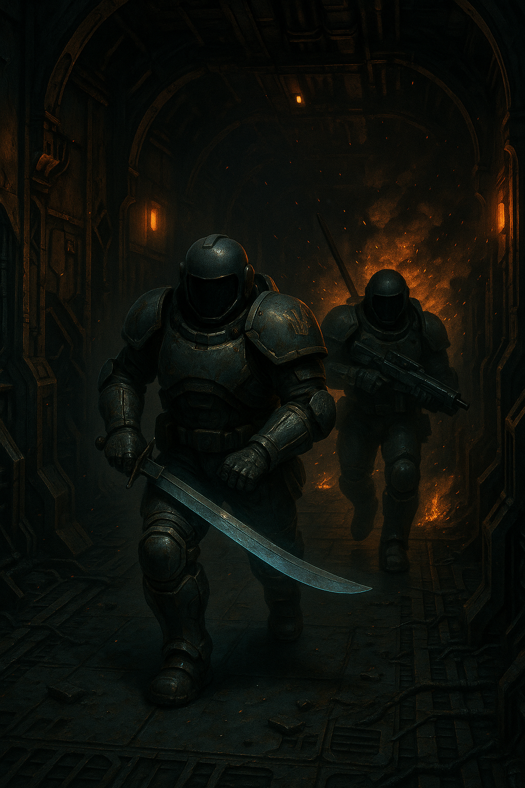
# Глава 9\. Наліт на штаб

Чотири термінатора-гайдука уже близько п’яти хвилин верхи на бот-конях прямували до невеличкого пагорба. Їм треба було обійти його з тіньової сторони, розвідати де точно стоїть центр сполучення з орбітою осадних військ імперців і зробити рейдовий наліт. До підльоту сердюків залишалося ще дві години, то ж часу було вдосталь. Гайдуки важкою ходою ботів ниточкою  то заходили в рівчаки та заглиблення на місяці, то виходили з них. Місцеве сонце світило своїм зеленувато-жовтим відтінком і освітлювало всю поверхню. За бортом термінаторського костюму температура коливалась від \-77 C, до \+99 С. Всі гайдуки зберігали вокс-мовчання, щоб засоби радіорозвідки не зафіксували їх заздалегідь. Данило ішов першим і час від часу озирався назад, щоб перевірити, чи інші не збилися з дороги. Зі сторони процесія із чотирьох важких термінаторів виглядала надзвичайно епічно — величні постаті броньованих силових костюмів верхи на таких же міцних роботизованих конях. На лівому боці двох термінаторів висіли щити. Вся броня, включаючи коней, була абсолютно матова і не відблискувала на сонці. У кожного з\-за спини виглядало декілька списів-рогачів, які можна було як жбурляти у ворога, так і використовувати як зброю ближнього бою. З-під щита на лівому стегні стирчали піхви від шаблі. Вона була спеціально викована на планеті Мюридів, де містилися великі поклади однойменної сталі. Саме на цій системі і отримав своє бойове хрещення їх полк «Збаражські Списи», де вони були змушені придушувати повстання місцевих арабських аборигенів. Звичайна піхотна або особиста шабля була замалою для обладунку термінатора, та і пробити могла лише звичайний станційній костюм, тому всі термінатори мали особливі важкі шаблі майже вдвічі більші за звичайні. У Цесара замість щита на боці висіла величезна, трохи з метр діаметром цар-міна. Така сама, тільки уже з правого боку, міна виднілась і у Таврида. Навколо сідла та позаду сідниць гайдуків знаходились додаткові батареї, кисень, балони з їжею та інший ренамент.  
Данило на бот-коні під’їхав до велетенського уламка — колись, найімовірніше, частини метеорита, що врізався в цей місяць. Гайдук пригальмував і почекав, поки Михайло, який слідував за ним на відстані з пів сотні метрів, побачить, куди він зверне. Данило підняв ліву руку, розкривши долоню — сигнал зупинки. Михайло відповів тим самим жестом, даючи зрозуміти, що готовий до подальших вказівок. Данило склав долоню в форму качиного дзьоба й вказав напрямок руху. Користування воксом до контакту з противником було заборонено, а відсутність атмосфери на місяці виключала будь-які інші способи комунікації — лише візуальні сигнали. Свій плазмовий короткостріл Данило тримав напоготові — хоч до ворожих позицій ще залишалося кілька кілометрів, обережність не завадить. Попереду лежав не надто високий хребет, що кільцем охоплював варп-станцію. Саме з його вершини гайдуки мали провести розвідку й остаточно скоригувати план нападу.  
Обійшовши уламок, який виявився на сотню метрів довшим, ніж спершу здавалося, перед очима Данила відкрилася рівна ділянка місячної поверхні та пологий підйом на хребет. Він зупинився в тіні каменя й зачекав товаришів. Ті не змусили себе довго чекати — вже за кілька хвилин четвірка термінаторів знову зібралася разом.  
— Перевірка, перевірка, — Данило нарешті зміг увімкнути вокс-передавач на мінімальній потужності, щоби його було чути лише в радіусі десятка метрів.  
— Чую, все добре, — відповів Михайло шепотом, хоч у вакуумі й не було сенсу понижувати голос. Він повернув візор у бік Таврида й Цесара та жестом дав команду активувати їхні вокси.  
— Я з Михайлом підіймуся на хребет і роздивлюсь їхню базу, — продовжив Данило, щойно побачив, як на його візорі загорілися ще дві точечки активних воксканалів. — Вона десь унизу. Думаю, ми вже майже на місці. Ви двоє залишайтесь біля бот-коней. Ворог може нишпорити поблизу — роз’їзди, сейсмодатчики, розтяжки... Тому відтепер — максимальна бойова готовність.  
Данило ліг на голову бот-коня — якщо той відросток із металу й датчиків узагалі можна було назвати головою — переніс вагу на праву ногу й одним рухом зіскочив. Поверхня навколо була кам’яниста, з поодинокими озерцями пилу, тож заховати міни чи датчики було непросто. Але гайдуки обережно ступали тільки по щільних кам’яних масивах.  
Підйом на хребет зайняв не більше хвилини. Данило чув, як вентилятори всередині костюма відреагували на його задишку: збільшили оберти, охолоджуючи тіло та виводячи піт із-під шолома. Силова броня підсилювала рухи, та початковий імпульс усе одно треба було задавати власними м’язами.  
Останні десять метрів гайдуки долали повзучи на животі, щоби не видати себе високими постатями ворожим сенсорам. Досягши вершини хребта, Данило відклав свою плазмову рушницю збоку, сперся на лікті й почав оглядати долину, що розкинулася внизу. Приблизно за кілометр виднівся невеликий мобільний космопорт — компактна платформа, розрахована на швидкий прийом вантажів, техніки та десанту. До шлюзу був пришвартований вантажний корабель. Судячи з усього, імперці вже завершували розвантаження: поруч стояв новенький, ще не подряпаний танк Т-100. Саме такий танк Данило з Тавридом знищили на початку війни. Біля нього поралися кілька фігур — чи то механіки, чи то боти. Космопорт був оточений шанцями квадратної форми та чотирма бліндажами по кутах. Біля кожного стояла станція протиповітряної оборони — хоч повітря на місяці й не було, зенітки все одно називали "протиповітряними". Декілька пускових установок були націлені вгору, а обертовий радар свідчив, що імперці сканують орбіту й готові до ударів. Поруч із платформою, де висипалися ренамент і жива сила, стояла металева споруда, що нагадувала вхід до підземного комплексу. Вочевидь, основні сили ховались під землею — у модульному таборі, який викопали для них боти.  
На даху будівлі височіла вежа з накритим важким плазмовим кулеметом або чимось подібним — Данило ніколи не бачив такої зброї. Декілька імперців розвантажували важкі ящики та підносили їх до вежі. Потім двоє з них підхопили один ящик за ручки й потягли його нагору — до самого кулемета.  
«Трясця Варпу та Свята Січ, вони тільки встановили цей кулемет і несуть йому набої» — Данило подумав про себе. «Якщо ударити прямо зараз, ми застанемо їх без штанів. Їх тут всього з пару десятків на поверхні». Данило повернув голову, не змінюючи положення скафандру, в сторону Михайла, який теж роздивлявся ворожу базу. Михайло не помітив, що він дивиться на нього, аж поки Данило не штовхнув його в плече. Данило уже склав план атаки на цю базу і хотів якомога скоріше його почати. Кивком голови назад він дав команду Михайлу спускатися з ним. Так само, на пузі, обидва гайдуки прослизнули декілька метрів вниз, потім встали і почимчикували до Таврида та Цесара. Підійшовши до побратимів, Данило жестом правої руки дав команду включити локальний вокс і стисло переказав те, що бачив.  
— І так, зараз найкращий шанс напасти на них. Вони на розслабоні шаряться по базі, тягають вантажі. Вся їх база під землею в бункері. Наша задача — миттю наскочити на них з однієї сторони, кулемет у них навіть не зібраний, знищити всю живу силу, закласти цар-міни на дах бункеру і дриманути звідти. Можемо ще додатково пошкодити ракетні установки, я нарахував чотири позиції по вісім ракет, тобто, кожному по одній. Якщо все пройде вдало, тоді сердюки зможуть з легкістю висадитись і врятувати нас.  
— Я бачив, що вся їх база засипана зверху шаром грунту і піску, — Михайло перехопив наступну фразу Данила, — це насправді все величезний бункер, зібраний з модулів. Я, здається, знаю, де сходяться всі коридори, то ж пропоную мені та Тавриду взяти цар-міни і закласти їх в тому місці. Щоб поховати їх всіх одночасно. Ми покладемо міни одна на одну, вибухом вниз. Тих, кого не спалить мельтою — розірве катастрофічний розгермет.  
— Приймаю. Виконуємо. Але пам’ятайте, вокс включаємо назад лише коли почнеться заміс. До цього моменту, нальот відбувається в повній тиші\! Ми з Цесарем забиваємо піхоту, ви вдвох якомога швидше ставите міни. Поїхали\! — Данило договорив і виключив передавач.  
Михайло з Тавридом перенесли цар-міну з коня Цесара, а взамін Михайло віддав йому свій щит. Всі ще раз перевірили заряди в лазерних самопалах, зняли запобіжники з усієї зброї, навіть запасної і один за одним заскочили на своїх ботів. Данило рушив перший, кін-бот з потугою стартанув вгору, неначе справжній кінь, якому треба було тягнути воза. Але згодом, набравши інерції, бот побіг веселіше і уже на самій вершині пагорба ледь не стрибав. Гайдуки вистроїлись в шерегу і на всій швидкості прожогом почали спускатися вниз. Треба було подолати останні десяток сотень метрів до бази по абсолютно пласкій поверхні. Якщо заговорить кулемет — вони всі трупи. Якщо поле засіяне мінами або іншими сюрпризами, то результат буде такий же — смерть. Данило тримав щит і у вільній лівій долоні стискав рогача, в правій же виставив перед собою свій короткий плазмовий самопал. За спиною на магнітних замках висіло ще два рогача. Гайдуки не чули нічого, крім свого дихання та роботи вентиляторів охолодження костюмів, з кожним поштовхом бот-коня вони наближалися до своєї цілі. Їх помітили лише на пів шляху. Ті двоє, що тягали ящики на гору до кулемета, різко кинулись до зброї і стали розчехляти кулемет. Вони указували руками на гайдуків, які на шаленій швидкості наближалися до них. З десантно-вантажного човна висипало ще з десяток вузькооких, дехто з них почав стріляти по гайдуках зі своєї лазерної зброї.  
— Вогонь у відповідь\! — Данило ввімкнув вокс. Ховатися вже не було сенсу — вся база Імперії Сонця була піднята по тривозі.  
Цесар, Таврид та Михайло відкрили вогонь зі своїх лазерних самопалів по групі піхотинців, які висипали з корабля. Один із лазерних променів уразив імперця просто в голову — з його шолома бризнула червоно-біла пара, яка миттєво перетворилася на замерзлу хмаринку. Ще двоє впали поруч, марно намагаючись щось зробити з розгерметизованими кінцівками.  
Зворотний вогонь імперців теж досягав цілі — кілька пострілів влучили в гайдуків, але важка термінаторська броня була на дві щогли міцніша за зброю, з якої її намагалися пробити. Один із плазмових зарядів потрапив у голову бот-коня Данила — вона на кілька секунд спалахнула хімічним полум’ям і тут же згасла. Половина сенсорів вийшла з ладу, і кінь різко заклав управо, але Данило зумів відновити контроль. Датчик заряду на щиті світився зеленим — це означало, що броня досі успішно відбиває лазерні удари. Троє гайдуків — окрім Данила, який не мав довгобійної зброї — перезарядили на скаку лазерні батареї й продовжили вести вогонь. Ще двоє імперців скорчилися в агонії. Першим до шанців, де окопалися двоє імперців і стріляли по них із лазганів, дістався Данило. Перестрибуючи траншею, він впритул розрядив свій короткий плазмач у ворога. Розпечений заряд уразив праву ключицю, відірвавши всю руку разом із плечем. Шматок кінцівки відлетів убік, а тіло гепнулося на дно ями. Рука, стискаючи лазган, досі залишалася в броні. Другого сонячника Цесар пробив своїм рогачем. Короткого удару зверху вниз вистачило — броня на голові тріснула, виштовхнула пару, яка тут же замерзла. Тіло вузькоокого від сили удару відлетіло, вдарилося об протилежний край траншеї і повільно сповзло вниз. На подив Данила, в першому шанці було лише двоє імперців — усі інші стрілецькі комірки виявились порожніми. Шлях до місця закладки цар-мін був відкритий, окрім невеликого осередку спротиву біля десантного корабля, де по них досі вели вогонь із легких лазганів.  
— Михайле, Цесаре, готуйтеся до закладки мін. Тавриде, за мною — до корабля, треба придушити їх\! — Данило одночасно віддав команди й лівою рукою вставляв новий заряд плазми у свій короткий самопал.  
Михайло з Цесарем поскакали на ботах позаду Данила, на ходу випустили останній заряд по імперцях, після чого зупинилися на центрі великого майданчика, що, вочевидь, слугував дахом бункера імперців, і взялися знімати з себе цар-міни.  
Данило з Тавридом стрімко подолали останні сто метрів до внутрішнього кільця оборони і зав’язали рукопашний бій з групою десантників, яким не пощастило розвантажувати свій хабар саме в момент нищівного рейду гайдуків. Перших двох піхотинців Данило проштрикнув списом, та останній удар вийшов настільки потужним, що наконечник пробив огидне жовтувате тіло разом із бронею, вийшовши з\-під правої лопатки. Навершя, яке оберталося зі шаленою швидкістю, наче свердло, застрягло в трупі, й Данило довго не міг вирвати спис. Два лазерні заряди вдарили просто в грудну пластину його силової броні, змусивши гайдука покинути цю справу і перейти до інших супротивників. Бій, як завжди, проходив у повній тиші — чути було лише серцебиття і власне дихання, перемішане зі звуками роботи вентиляторів у шоломі, які намагалися охолодити тіло.  
Краєм ока Данило помітив, як Таврид уже рубав шаблею піхотинців, що насіли на нього й намагалися стягнути з бот-коня. Один із сонячників упав прямісінько під сталеві копита бота, який почав топтати його, мов півень курку.  
З такої близької відстані Таврид уже не міг нормально розмахувати шаблею. Кінь спіткнувся об труп забитого сонячника й різко нахилився вперед. Таврид, із грацією 450-кілограмового велетня, перелетів через його голову, зробив сальто й приземлився на сталевий пірс десантного корабля, висікши з нього снопи іскор.  
— Я ПРИКРИЮ, ВСТАВАЙ\! — Данило закричав у вокс, розвернув коня і на всьому скаку врізався в групу з десяти імперців, яких, схоже, надихнула ця мікро«перемога» над грізним термінатором гетів.  
— Данило, ШЛЮЗ\! Вони відкривають шлюз до бункера\! — Михайло проревів у вокс.  
Він та Цесар встигли зняти чималі цар-міни з коней і тягли їх до місця закладки. Усі сонячники були повністю зайняті рукопашною з Тавридом і Данилом, тому по саперах вогонь ніхто не відкривав. Та Михайло відчув вібрацію по поверхні даху бункера й помітив, як два проблискові маячки над входом заблимали червоно-жовтим. Було очевидно: знизу висувається підмога зі штабу.  
— Я зайнятий\! Таврида збили\! — Данило щойно розвалив візор черговому вузькоокому й розвертав свого коня на ще одну атаку. Таврид усе ще лежав на землі, судомно смикаючи правою ногою. Два рогачі, що висіли на магнітних тримачах, відлетіли під час падіння й валялися поруч.  
— Таврид, трясця Січі\! ВСТАВАЙ\! — Данило волав у вокс і вже заходив на черговий кінний удар, коли отримав попередження про пробій правої гомілки. — Я розгерметизований\! Михайле, Цесаре — ставте міни й запускайте детонатор\! Треба їх знищити\!  
Відступати або заливати пробій плекс-гелем не було часу. Кілька імперців уже вели вогонь майже впритул, ховаючись за ящиками з набоями та запасними стволами до лазерних скорострілів. Підійти до них на коні було неможливо, тож Данило зіскочив з бота, з щитом і рогачем кинувся в атаку в напівприсяді, підстрибуючи на лівій нозі.  
Перший із ворогів саме перезаряджав свою тріскотню, і помітив термінатора тільки тоді, коли його гігантська постать затулила сонце. Останнє, що він побачив, — це обертове навершя рогача, яке мов дриль увійшло йому в шию, пробиваючи тонкий піхотний скафандр у найменш захищеній точці, й вилетіло з іншого боку, розкидаючи уламки хребців на всі боки.  
Данило впер щит у мертве тіло, що ще здригалося в конвульсіях, і вирвав рогач. Тільки-но він збирався рвонути до наступної цілі — ворожого стрільця з коротким лазганом, непридатним навіть для бою, — як потужний удар у праве плече сильно похитнув його. Данило ледь утримав рівновагу, стрибаючи на лівій нозі.  
— Волові трясця, це що ще таке? — у Данила широко розкрилися очі, коли він побачив причину удару. Це був мех-розвантажувач імперців. Майже вдвічі вищий за термінатора-гайдука, він мав броньований кокон для оператора всередині. Замість ніг у нього були два потужні двигуни, що крутили гусениці. Руки виглядали майже людськими, але замість долонь у меха стирчали гідравлічні тиски, призначені для підйому важких палет і вантажів.  
Один із тисків був подряпаний — сліди залишила броня Данила після першого удару. Гайдук обернувся, щоби добити двох піхотинців і зосередитися на новій загрозі, але ті вже лежали бездиханні. Вантажний мех на повній швидкості гусеницями підповз до нього й замахнувся знову.  
Швидкість удару перевершила очікування Данила — термінатор завжди вважав такі розвантажувачі повільними і незграбними. Він ледь устиг закрити голову щитом, коли масивна тискова клешня з усього розмаху вдарила по ньому. Удар відкинув його на кілька метрів убік. Щитом пройшли електричні розряди — це з короткого замикання розірваних кабелів, які транслювали енергію від лазерних чи плазмових попадань у батареї всередині щита.  
— Данило, ти де? Міни на місці, десять хвилин до детонації. Нам треба ушиватися, — Михайло явно ще не знав, що Таврид валяється чи то живий, чи з перебитими силовими агрегатами, а Данило вже отримав третій удар від меха-навантажувача. І в принципі, ще два\-три таких удари — і щит лусне остаточно.  
— Михайле, підбери Таврида, він забитий. А на мені сидить мех, — Данило чудом увернувся від розмашистого удару правою кінцівкою меха. На сталевій платформі, куди мех загнав гайдука, щось було розлите. Схоже, одна з бочок з креоном була пробита, і охолоджувальна речовина повільно розтікалася по підлозі. Гусениці меха буксонули, і коли його правий "хук" пройшов повз ціль, вся махіна прокрутилася на дев’яносто градусів і гепнулася на бік.  
— Шлюз відкривається\! Ми їх стримаємо\! — Михайло прокричав у вокс. Але він так і не почув відповіді Данила про те, що відбувається в якихось двадцяти метрах від нього.  
Данилові той шлюз поки що був як мертвому кисень. Мех уже віджимався від платформи і намагався встати на гусені, але креон ще не випарувався і продовжував прилипати до сталевих пластин, з яких була зібрана платформа. Імперец, який сидів в коконі механічного повантажувача, намагався звестися назад на гусені за допомогою висувних механізмів на правому маніпуляторі. Йому це майже вдалося, але права рука прослизнула по сталевій підлозі і він знову гепнувся на бока. Через напівпрозорий кокон меха Данило бачив обличчя сонячника, з його рота звисав згусток кривавих соплей та слини, а саме обличчя перекосила гримаса відчаю та паніки. Данило вирішив, що другого шансу на своє спасіння не буде, десятьма кроками швидко подолав дистанцію до меха, застрибнув йому на бока і витяг свою шаблю. Спочатку він хотів пробити кокон і виковиряти оператора, але лівим маніпулятором той міг схопити як і шаблю так і руку гайдука, то ж це було небезпечно. Тому термінатор гетів прийнявся розбивати дроти зв’язку та пневматики на кінцівках зі спини. Знадобилось три удари його особистої важкою термінаторської шаблі, звісно ж викованої на планеті Мюридів, щоб розрізати кожух, який прикривав вузол дротів над правою лопаткою. Четвертий удар розтяв одразу всі дроти в цьому модулі, і права рука меха заклякла напіврозігнута. Імперець хаотично смикав джойстиком, намагаючись відновити контроль над правою рукою, що йому звісно не вдалося, як пропав контроль і над лівим маніпулятором — гайдук розібрався з блоком керування ще швидше. Пересвідчившись, що мех не може керувати своїми руками, Данило зістрибнув на сталеву підлогу, обійшов меха з лицевої сторони і зазирнув в очі імперця, який склав руки біля грудей і благав про щось гайдука через кокон. Звісно ж, воплі і плач вузькоокого не було чути. Данило одним дуже сильним ударом шаблі пробив кокон, звідти пшикнуло повітря, яке миттєво замерзло. Оператор меха намагався руками затулити пробоїну, рятуючи дорогоцінний кисень та тиск, хоча і був вдягнений в особистий скафандр. Данило просунув вістря шаблі в пробоїну, трошки розширив її, ведучи шаблю вліво-вправо, неначе вскриваючи банку зі згущенкою, і коли щілина стала достатньо велика, з усією силою ліг грудьми і руками на шаблю, протикаючи імперця наскрізь. Ще одна хмаринка повітря із розгерметизованого скафандру шпикнула назовні, кров імперця від різниці тиску тіла та місяця бризнула фантанчиком, заляпуючи весь кокон. Через дві секунди оператор меха закляк назавжди.  
— Данило\! Допоможи встати\! — нарешті Таврид, який весь цей час валявся на підлозі, смикаючи кінцівками, дав про себе знати.   
— Трясця войду, ти живий? — Данило краєм візора побачив, лазерні промені, які улітали в небо. Скоріш за все Михайло та Цесар намагаються ліквідувати групу, яка хотіла вийти із бункера на допомогу своїм. — Біжу до тебе\! Треба ушиватися звідси\! Ти втратив керування над бронею?  
— Можу тільки згинати і розгинати ноги. Схоже, руки заклинило наглухо.  
Ситуація, в якій опинилися гайдуки вимагала миттєвого рішення. З однієї сторони Михайло з Цесарем уже зав’язали перестрілку з групою, яка вийшли зі шлюзу, але схоже, що вона була добре притиснута вогнем. З іншого боку – Таврид безпомічно валяється на вантажній платформі. З третього боку — детонація двох цар-мін залишить від них лише плями на піску.  
— Цесаре\! Наказую відступити від шлюзу і допомогти встати Тавриду. Садиш його на ботів і тікаєте. Ми з Михайлом затримаємо скільки зможемо імперських піхотинців. Двох коней нам залишаєте. До виконання\!  
Обговорювати таке дивне рішення ніхто не збирався, то ж на візорі Данила засвітилися три зелені точечки, які означали, що команду доведено і прийнято до виконання. Кмітливість мозку Данила оцінила, що найбільший шанс вижити вчотирьох  буде, якщо Цесара вивести з бою. Він був лише вчора посвячений в гайдуки-термінатори, а отже мало що міг показати у випадку рукопашного або просто ближнього бою. Михайло ж з Данилом були бувалі термінатори, тому зіткнення з переважаючою силою було для них не в новину. Тим паче, що Данило, збираючи свою зброю, яка злетіла з магнітних тримачів на спині, уже мав план, як обрізати вилазку ворога із бункера. На платформі лежали його два рогача і мельт-міна, яка накручувалась на навершя списа. Її можна було вкинути прямо в шлюз, з якого піхота намагалась вийти. Пам’ятаючи перший бій на цьому місяці і які ушкодження спис-джавелін із міною викликають у піхоти, Данило був впевнений, що вдасться і в цей раз.

— Данило, давай ріжче до мене\! Двоє уже вийшло зі шлюзу, хочуть зайти з флангу\! — Михайло звітував старшому і одночасно посилав заряди плазми зі свого самопалу по проходу, який вів у шлюз. На підлозі уже лежало троє понівечених штурмовика, які були вдягнені в зовсім інший обладунок, ніж він бачив до цього. Їх броня мала червонуватий відтінок, на стегні висіла катана, що не уступала в розмірах його власній шаблі. Шолом, де закінчувався візор, був окований золотою ниткою, а із-за спини стирчав якийсь прапорець із ієрогліфами. Це були уже не прості піхотинці, яких вони шинкували як свиней в забої, а щось посерьйозніше, можливо, особиста охорона командувача.

— Біжу\! Не дай їм вирватись\! Дай мені пару хвилин, я несу мельт-міни. — Данило похапцем підбирав свою розкидану зброю. Шабля уже лежала в піхвах на стегні, один з рогачів, які він щойно підібрав, гайдук закинув на спину. На інший же на ходу накручував мельт-міну. — Цесаре, худкіше до Таврида, він лежить за тим мехом.   
— Бачу\! — Цесар як раз вибіг на платформу, де Данило махався із мехом всього декілька хвилин тому. — Тавриде, готуй сраку\!  
Хвилина знадобилась Данилові, щоб дістатися до Михайла, який уже поступово відходив зі свого укриття, бо ті двоє, які встигли вибігти, почали класти лазери з лівого флангу, одна з броньових пластин на лівому плечі гайдука уже репнула від прямого влучання важкого лазера.  
— Це не те м’ясо, яке ми рубали до цього\! Їх бере лише наша плазма, і то треба пару попадань в одне місце\! — Михайло клацав голосом у вокс, щоб якось заповнити цю запаморочливу тишу бою в безатмосферному середовищі. Начебто, навколо стільки всього відбувається: то лазер прошмигне прямо перед візором, то прямий постріл з плазмового самопалу відірве кінцівку імперцю…і все це в абсолютній тиші. Лише тріск піску під ногами та вібрація від вибухів.  
— Готуйся\! Я підходжу і одразу жбурляю міну\! Краще заховайся\! — Данило в пристрибку наближався все ближче до точки, з якої уже міг докинути списа. — ЛЯГАЙ\!  
Як і скіфські воїни в легендарні часи Великої Скіфії, гайдуки вправно працювали зі списами. Біла палка, завдовжки з півтора метра з великою гулею на наверші, взлетіла високо в небо і переливаючись під променями місцевого сонця полетіла до входу. Всього через дві секунди спис вістрям вниз став опускатися вниз і зайшов прямо під дашок, який прикривав вхід до шлюзу бункеру. Зеленувато-жовтий спалах осяв обличчя Данила та Михайла, з проходу шлюзу вилетіли шматки броні та плоті. Через секунду відбулась ще одна детонація, яка протрясла навіть ящики, за якими ховалися гайдуки. Обидва від потужного вибуху не втримали рівновагу і попадали на поверхню.  
— Що вони там ховали? Треба тікати звідси\! — Данило одночасно з Михайлом різко підвівся на ноги, перевірив, чи шабля ще на поясі, взвів плазмовий самопал і піднявся на ноги.   
— Пропоную вшиватися звідси, навряд чи шлюз ще раз відкриється. — Михайло добив заряд лазерного самопалу в димлячий вхід до шлюзу.   
Обидва чимдуж побігли по широкій платформі в сторону великого десантного корабля. Їм в спину іноді долітали лазерні заряди від декількох імперців, які десь сховалися, але клопоту не завдавали. Під ногами лежали уламки розкиданих дверей шлюзу, деякі бочки з охолоджувачами, рідкою їжею, та навіть заряди до лазерних і плазмовий рушниць просто лежали під ногами, і випирськували іскри з\-під сталевих ніг гайдуків-термінаторів, коли ті на них наступали. Часу залишалося зовсім обмаль, тому Данило з Михайлом бігли подалі від бункеру опустивши зброю. Як раптом з\-за рогу складу з ящиками прямо під ноги Данилу вискочив імперський піхотинець. Від неочікуваної події той не знайшов нічого кращого, як з усієї сили вперіщити лівим чоботом прямо в пах піхотинцю, який теж не шукав зустрічі з двома  термінаторами одночасно. Від удару імперець зігнувся і схопився за місце удару обома руками. Данило навіть не збавив крок і побіг далі. Другий удар прямо в щелепу візора наніс уже Михайло. Удар, підсилений силовими агрегатами броні, був настільки сильний, що вибив оглядове захисне скло в скафандрі, від чого імперець миттєво отримав розгермет і впав на платформу з оскалом смерті на обличчі і почав роздирати собі очі.  
— Трясця Варпу, я такого ще не бачив. — уже запиханий Михайло промовив у воск. — Я йому начисто зніс візор, неначе відкрив пляшку вина.  
— І то добре, той сонячник міг і гранату кинути вслід нам. — Данило теж уже запихався від бігу. — Бачу платформу, сюди\!  
— Годі там теревенити\! Я не можу затягти Травида на коня\! — писк на останньому слові свідчив, що Цесар на межі паніки.  
— Ви ще тут? Я думав ти з Тавридом давно уже на станції.  
— Та де там, у нього геть заклинило силові агрегати, він як чотирьохсот кілограмовий залізний манекен, я ледь його притяг до бота. А до цього збирав бот-коней по майданчику. — Цесар розвернувся до Данила з Михайлом і помахав їм рукою.  
— Михайле, ти і я зайдемо з іншого боку коня, ти хапаєш ногу, я руку. А ти, Цесаре, підкинеш його нам трохи, щоб затягли на сідло. — Данило трохи збавив біг, коли майже наблизився до Таврида.  
Закинути Таврида вийшло з першого разу. Данило направив його руку до шиї бота-коня, де містився роз’єм синхронізації.   
— Є контакт\! — Нарешті хоч щось промивив Таврид у вокс. — Десь антену зажало, а тепер, походу, відпустило. Я вам кричу уже хвилин тридцять…

— Чорт з нею, всі на коней і драпаємо звідси. Через декілька хвилин буде великий бабах. — Михайло перервав передачу Таврида.

Гайдуки пересинхронізували коней, часу вибирати своїх попередніх уже не було часу. Бот-коні, не обтяжені мінами, щитами та додатковою зброєю, несли гайдуків все далі і далі від бункеру. Коли гайдуки були за два кілометри від нього, вся поверхня здригнулась, пісок та невелике каміння піднялося вгору і, здавалось, зависло на секунду, але так само різко упало. Гайдуки зупинились і озирнулись назад. Масштаб вибуху був найбільший, який вони коли не-будь бачили: зелено-жовтий стовп вибуху піднявся десь на сотню метрів, в усі сторони летіти величезні шматки арматури, плекс-бетону. Кисень, який вирвався з бункеру підсичував полум’я червонуватим кольором. Згодом стовп почав загортатися і утворювати мініатюрний ядерний гриб.  
— Ми справились. Не думаю, що…ракетні установки зверху вижили. — Данило відмітив в своєму бортовому комп’ютері час виконання завдання. Це було необхідно для аналізу подій на полі бою, навіть якщо він загине, то старшина зможе зчитати показники і скласти картину подій.  
— Шлях для сердюків відкритий. — Лаконічно підвів підсумок їх роботи Михайло.  
— І я вижив. Хоч і закляк. Кхе-кхе. — Таврид засміявся у вокс.  
— Легше було підірвати бункер, ніж твою дупу на коня запхати. — Цесар підтримав товариша і всі вчотирьох засміялися.  
Гайдуки продовжили стояти в декількох кілометрах від вибуху, як до них почали долітати уламки.  
— Що далі? — Цесар розвернувся до Данила і задав питання.

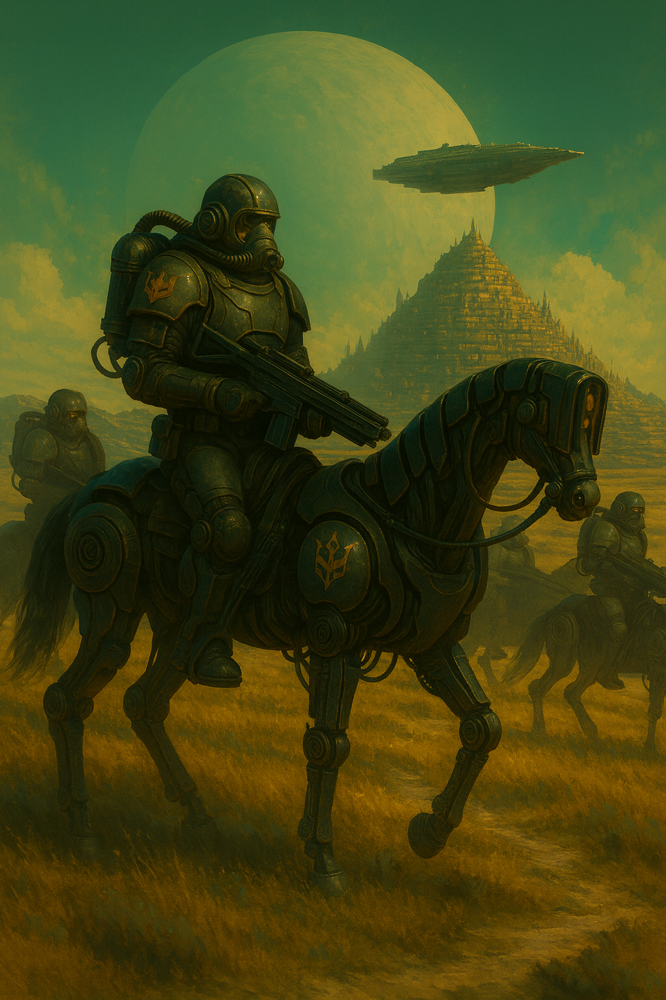
# Глава 10\. Зустріч із сердюками.

*Остання заруба. Кмітливість гайдуків.*

— Мабуть…навіть не знаю. Завдання було підірвати. Далі інструкцій не було. — Данилові, як і іншим, якось стало ніяково. Лише зараз до них дійшло, що завдання було суіцидальним. Вчотирьох напасти на центральний бункер осадних військ, ще і підірвати його…  
— Схоже, що ми план перевиконали. Котра година? Рівно 0800…— Михайло задер голову і почав вдивлятися у темний обрій космосу над головою. — Зараз має прилетіти важка кіннота.  
Інші гайдуки теж задрали голови і вишукували маленькі цяточки, які б рухались і залишали за собою слід від водневих двигунів.  
— Бачу крило\! Бачу\! Он вони\! — Цесар указав пальцем в космос і аж застрибав на стременах.  
Дійсно, в чорному космосі, поміж зорей, з’явилися сім цяточок, які рухалися в строю і ставали дедалі більш помітними. Раптом від них відділилися ще менші точечки і з шаленою швидкістю полетіли в сторону підірваного бункеру.   
— Хочуть добити когось там. Випустили керовані ракети по поверхні. — Данило проводив поглядом нові цяточки, як раптом ті змінили курс і почали прямувати до них.  
— Свята Січ\!\!\! ВОНИ Б’ЮТЬ ПО НАС\! — від переляку в його голосі спрацювала якась команда в бот-коні і той став на дибки. — РОЗСИПАЄМОСЯ\!  
Тікі-но гайдуки по звичці почали виконувати команду, як Цесарю прийшла краща ідея.  
— СТОЯТИ\! Ми не сховаємося тут від них\! Треба оголоти шаблі і підняти над головою. Ракети з віддаленим керуванням, пілоти-винищувачі побачать гетівське озброєння і відступлять\!  
Ідея була одночасно і слушна і дурна. На рівній поверхні, де лише є рівчаки та трохи пагорбів, сховатися від крил не було взагалі ніякої змоги. Якщо їх не розіб’ють ракетами, то замісять з гармат винищувачів. Біганина від них лише б відтермінувала їхню смерть. То ж Данило віддав наказ стояти, вийняв свою важку термінаторську шаблю і підняв її над головою, неначе захищаючи голову від удару зверху-вниз. Інші двоє гайдуків повторили його дію, а Таврид, так і продовжував заклякши сидіти на своєму бот-коні. Двадцять секунд, які знадобилося ракетам, щоб долетіти до гайдуків здавалися ніколи не пройдуть. Гайдуки уже бачили, як з сопел ракет виходить розпечена струя реактивного двигуна. Ще мить і їх просто рознесе на друзки.  
— СТОЇМО\! — навіть не сказав, а прогарчав Данило у вокс.  
Чотири ракети за декілька сот метрів до них різко вирівняли курс по горизонталі і пролетіли всього в п’ятдесяти метрах над головою.   
— Трясця Варпу і Свята Січ\! Колись знайду цих пілотів і відшмагаю шаблею. — з величезним полегшенням видав командир термінаторів і опустив шаблю вниз.  
Всі четверо повернули свої візори до головного шлюзу варп-станції «Дике Поле 17», куди і попрямували бомбардувальники. Вхід виднівся в декількох кілометрах від них. По відчуттях гайдуків, там уже з пів години ішов бій на поверхні, мабуть, Січнік, як і домовлялися, почав тиснути на імперців біля воріт шлюзу, намагаючись вийти з нього. Данило бачив, як в космос вилітали лазери, де\-не-де яскраві згустки плазми виривалися від поверхні і падали десь за горизонтом. Приліт же штурмової-бомбардувальної безатмосферної авіації гетьманатів поклав край будь-яким шансам імперців продовжувати осаду варп-станції. Ракети, які пілоти гетів випустили по четвірці термінаторів, були переспрямовані до скупчення бронетехніки навколо шлюзу. Один за одним крило бомбардувальних літунів заходило на удар і скидало величезні плазм-бомби вниз, на голови та броню сонячників. Заворушливе видовище сяяло різноманітними барвами веселки. Вибухи мельт-бомб мали зеленувато-жовтий відблиск, а от детонація боєкомплекту ворогів надавала уже чорно-жовтий колір. Неначе хтось змішав акварельні фарби в банці і пензликом почав возюкати по канві. Якщо ж керована ракета знаходила ціль, то невеличкий чорнуватий гриб-вибух здіймався вгору разом з випаруваними імперцями та їх озброєнням.  
— Не заздрю я товаришам, які там зараз б’ються біля шлюзу. Літунам до лампочки кого бомбити, головне скинути бабахі вниз і зарахувати собі черговий значок в журнал. — Михайло якось ніколи не любив літунів, тому і ставився до них прискіпливо.  
— Ну без них нам тут нічого не світило. Подивись, скільки натягли з орбіти. Ще б тиждень і зробили б тунель для техніки, яка б просто зайшла на станцію і покромсала нас. Імперці колись були вправними штурмовиками міст і вуликів. Але то було ще за часів Виговського, нехай сяє його розум в зірках Січі.  
— Нехай сяє. — Всі гуртом відповіли Данилові, як це було прийнято при згадці одного з батьків-засновників Федерації Гетьманату, першого гетьмана Івана Остаповича Виговського.  
— Давайте, почекаємо на результат бою тут, там іде такий заміс, що ми зі своїми шаблями і кониками будемо там зайві. — Данило перерахував заряди плазми до свого самопалу. — Та і маю лише три повних заряди до карамультука. А у вас що?  
— Я можу тільки крутити головою і смикати яєчками. — Таврид досі сидів в заклинившій силовій броні гайдуків і був більше схожий на вершника-манекена, якого прив’язали до коня.

— Ну якщо ними можеш смикати, то жити будеш. — Ляпнув у відповідь Таврид і всі засміялися у вокс.

Данило, Михайло, Таврид та Цесар стояли на вершині невеликого пагорбу, дивлячись за бійнею. Інколи детонації були настільки сильними, що пісок під ногами їх бот-коней починав дрижати і невеличкі камінчики зсипалися вниз по схилу. Подеколи на чорному тлі безмежного космосу спалахували бої між винищувачами гетів та Імперії Сонця, які намагалися хоч якось допомогти своїм вузькооким товаришам внизу на поверхні. Через пів години інтенсивність нальотів літунів гетів значно спала і Данило помітив в небі корабель, який безпомилково ідентифікував як Великий Десантний Корабель сердюків «Байдак». Кораблі такого класу та призначення могли вміщати в себе до тисячі сердюків чи гайдуків, з десяток одиниць бронетехніки та навіть бункер-штаб, на кшталт того, який вони підірвали всього годину тому. Ці кораблі використовували, щоб висадити ударний полк або декілька сотень на поверхню планети або місяця і взяти під контроль необхідні точки. Безпосередньо вниз сердюки і техніка доставлялися в капсулях, які вистрелювалися з брюха корабля і спускалися до поверхні. Під час підльоту до землі запускалися гальмівні реактивні двигуни і плавно вертикально саджали капсулі з піхотою. Один капсуль вміщав два курені, тобто п'ятнадцять-двадцять козаків, та обладнання, яке було необхідне для ведення бою і штурму. Данило спускався в такій капсулі лише один раз, під час придушення повстання в системі Мюридів. Але, наскільки він знав, капсульніі модулі, які мали сердюки, були більш просунуті. Деякі модифікації безпосередньо перед контактом із поверхнею розкидали навколо себе невеликі заряди-гранати, щоб знищили можливе мінування поверхні, були сотенні капсулі, в корпус яких мав вмуровані антени для підтримки сотенного і курінного зв’язку та навіть з виходом на спілкування з орбітою.   
Як підтвердження його слів і спогадів з навчання в Гайдуцькій Академії, на чорному брюсі десантного корабля спалахнули п’ять точок і попрямували прямо вниз.  
— Ви коли-небудь бачили висадку сердюків з цього бегемоту? — Данило заворушливо спостерігав за роботою товаришів з сердюцького корпусу.  
— Та я і гайдуцькі капсулі не бачив. — Цесар, здавалося, був заворожений найбільше серед усіх чотирьох. — Вони хоч нас не розвалять тут під шумок?  
— Ну це буде комедія: від імперців уйшли, бункер підірвали, від літунів ледь здихалися. А тепер нас причавить декілька сот тон відбірних сердюцьких дуп. — Михайлу так сподобався його власний жарт, що він приєднався до реготання своїх товаришів, як би це не звучало дивно по воксу.  
— Давайте краще зліземо з коней, бо сердюки це такі хлопці, що розвалять всіх, і саманаків[^48], і нас, і варп-станцію і місяць. Їм аби дати розвантажити свої плазмові гармати. Ще, якщо там будуть грифони[^49], то взагалі ховайся в жито.  
Цесар, Михайло та Данило зіскочили з коней і відвели трохи вниз по схилу, щоб не так було видно їх профілі на тлі безмежного чорного космосу.  
— Ей, хлопці. Я ж тікі яєчками можу совати, але це з коня мене не зніме. — Таврид помітно смикався в скафандрі, але той був геть заклинивший і не підсилював його рухи.  
— Да ти краще сиди на коні, керувати ж по інтерфейсу можеш. Ну його тебе знімати, потім ставити назад. А якщо треба буде терміново драпать? — Михайло зробив слушне зауваження.  
— Добре, хоч і дупа уже затерпла від сідла. — Таврид і сам не хотів ще раз зсідати з коня.  
— То почухай її яйцями. Га-га. — Цесар міг поклястися, що всі засміялися, просто не у вокс. Він все більше вливався у ватагу важких гайдуків-термінаторів і з кожним разом жартував все більш вдало.  
Гайдуки, хто міг, лягли на пісок і стали спостерігати за висадкою штурмових капсулів сердюків. Цяточки ставали дедалі більшими, по ним відкрили вогонь декілька турелей імперців, без видимого успіху. Стопові реактивні двигуни включились метрів за п’ятсот до поверхні, на наверші двох капсулів щось вибухнуло. Данило спочатку подумав, що імперцям все-таки вдалося пробити надзвичайно товсту броню штурмових капсулів, але насправді це спрацювали системи розмінування. В усі боки на триста шістдесят градусів розкидалися бомбочки. Частина з них були просто болванки, але з великою магнітною привабливістю для того, щоб знешкодити магнітні міни для техніки. Інші ж бомбочки здетонували як тільки торкнулися поверхні місяця. Місце висадки затягло пилом і піднятим піском. Реактивна струя зі стопового двигуна підняла ще більше пилу, і нарешті капсулі одна за одною торкнулися землі. Майже одразу після контакту відкрилися борти всіх капсулів і звідти почали висипати сердюки. На відміну від гайдуків, вони мали більш грізне обладнання, броню та зброю. Особливо першою відмінністю можна було помітити різницю у візорах. У сердюків це була напівсфера, яка кріпилася прямо на плечі та груди броні. Візор був повністю матовий, не відблискував та не відбивав ніяке світло. Броня, на вигляд, була рази в три товстішою та важчою за гайдуцьку. На лівому плечі майже у кожного сердюка стояла автоматична міні гарматка, яка захищала верхню півсферу простору від ударів дронів або інших гидот. Бойові рукавиці уже не були справжніми руками живої людини, а маніпуляторами. Ці штучні кисті могли крутитися в будь-яку сторону, і не були обмежені природніми властивостями людських долоней. Це давало можливість витворяти різноманітні прийоми шабельного та рукопашного бою, а також значно швидше змінювати приціл ручної зброї. На бронепластинах на плечах, як і у гайдуків, сердюки мали іконки підрозділів та спеціалізації. На потилиці, майже на холці, був викований золотий тризуб. Важкий термінатор з полку гайдуків за рівнем смертоносності був просто звичайним сердюком, який мав на озброєні такий же силовий костюм та озброєння, хоча і з візуальними відмінностями, наведеними вище. З капсулі першим вийшов загін шестиметрових механоїдів-термінаторів. В тулубі меха був кокон, чимось схожий на погрузчика імперців, якого розвалив Данило всього годину назад. В коконі сидів сердюк — оператор меха. Хоча його і не було видно за великими захисними пластинами зроблених із мюридської броні. На лівому плечі висів щит-екран, за ним ховався кокон та модуль камер керування мехом, який виглядав як залізний казан, але перевернутий вниз. В усі сторони з казана стирчали лінзи камер, від природнього, до інфрачервоного та вібраційного спектру. Такі надважкі мехи були на самому наверші будь-якої наступальної операції і використовувалися для очищення майданчику для висадки або прориву ліній ворога. На спину у меха висів здоровенний короб із мельт набоями для стрільби з надважкого мельтостріла «Коник». Мельтомет отримав цю назву за звук, який видавав під час пострілів, здалеку здавалося це стукіт копит коня, який несеться галопом. «Коник» міг нести лише механоїд, був приварений до лівої руки. Правою рукою і поворотом корпусу меха можна було скеровувати стрільбу в потрібну точку. Мехи з «кониками» крокували до входу в шлюз, і безперестанно стріляли в усі сторони. Ідея залишитися подалі від висадки сердюків була дуже слушна. Штурмовикам була поставлена задача якомога швидше погасити будь-який спротив імперців, і розбиратися хто стоїть перед ними, сонячник чи гайдук ніхто б не став. За дві хвилини вся штурмова ватага висипала з капсулів і за ними закрились борти. Капсулі залишилися на поверхні слугувати як центри зв’язку з батьківським кораблем, так і місцевого воксу і використовувалися для керування боєм. По одній з групі сердюків почав працювати танк імперців, який якимось дивом вижив під час бомбардування літунами. Один снаряд влучив в короб з мельт зарядами від «Коника» і запалив його. Безкисневий вогонь швидко заполонив весь відсік і той здетонував, але завдяки конструкції, енергія вибуху пішла вгору, врятувавши оператора меха, який, скоріш за все вижив у своєму коконі. Отруйно-блакитна струя плазми взлетіла вгору, як фонтан і упала вниз, поранивши декількох сердюків-гранатометників, які вели бій поруч зі своїм мехом.  
Через свою зум-лінзу Данило бачив, як декілька дронів, які були щойно запущені з десантних капсуль, різко опустилися вниз і уразили танк, що продовжував вести вогонь зі своєї гармати, зачепивши ще одного меха. Сердюк встиг підставити ліве плече із щитом-екраном. Від удару і вибуху мех не втримав рівновагу і завалився на правий бік. Навіть після шліфування бомбами і ракетами, сил у імперців вистачало, щоб вести опір і не дати просуватися сердюкам. Візуально Данило помітив сині скафандрів саманаків – елітних бійців Імперії Сонця. Ті вступили в рукопашний бій з сердюками і змусили тіснитися їх назад, до капсулів. З десятого ураження дроном танк нарешті замовк, але замість здвоєної гармати заговорив його кулемет на башті.   
— Пропоную встряти в бій. Імперці зайняті десантом із капсулів. Треба дати їм прочухана в спину. — Данило встав і пішов до коня. — У мене є ще три батареї для самопалу. Включаємо вокс і намагаємося дорватися до своїх.  
— Я за. — Михайло приладнав назад спис-рогач на спину і витяг шаблю.   
— Я теж з вами, ще маю трохи набоїв до самопалу. — Цесар вставив нову батарею взамін відстріляної.  
— У мене на спині є ще батареї, беріть. Я не зможу вести бій, броня вся заклякла. — Таврид розвернув свого бота, щоб гайдукам було зручніше його дерибанити. — Але я піду з вами, буду хоча б вогонь відволікати на себе.  
— Добре. — Відповідь Данила зівпала з величезним спалахом над полем бою жовто-зеленого кольору.  
Данило перечепив запасні заряди до свого плазмового самопалу на магніти на поясі і окинув оком свою невеличку ватагу. Михайло мав пробиту в двох місцях силову броню, десь нишком залиту плекс-гелем. Лівою рукою він притримував термінаторську шаблю, а в правій тримав підняту вгору трофейну лазерну гвинтівку, підібрану під бункером. Таврид стояв як вершник без голови, лише що голова була на місці. Двома руками тримався за поручень на коні. Візуально його броня була геть вся подерта ледь не до дірок, але прямих попадань плазми чи лазера не мав. І останній товариш, Цесар тримався на бот-коні уже більш впевнено, не смикався і не сповзав. За той тиждень, як вони познайомились під час бою в траншеях біля шлюзу, це був уже зовсім інший козак. Перед собою тримав лазерний самопал, збоку в магнітному слоту на поясі висіла плазмова граната. Данило, навіщось підняв коня на дибки, лівою рукою вихопив шаблю і підняв її вгору і викрикнув у вокс:  
— Один за всіх\! І всі за [[../../Всесвіт/Імперії/Федерація Гетьманату/Кіш|КІШ]][^50]\! — Останнє слово підсилилось одночасним криком всіх гайдуків.  
 Чотири бот-коні перейшли на галоп і все ближче приносили гайдуків до пекла, де мехи сердюків пропалювали залпами плазми ворожу техніку, сердюки-термінатори билися в строю в рукопашних сутичках із саманаками, які звідкись з’явилися, наче з\-під землі. Скоріш за все, готували генеральний штурм станції, але трішки не встигли. П’ятсот метрів коні промайнули дуже швидко і у вокс ефір Данилі пробився сотенний канал сердюків. Дві штурмові ватаги з правого флангу мали значний успіх, майже дійшли до старих шанців, які копав Калина в перші дні війни. Правий же фланг зустрівся з механізованим підрозділом Імперії Сонця і поніс значні втрати від вогню танків та важких скорострілів. Більш за все що саманаки саме готувалися до штурму станції, бо зустріли висадку сердюків в повній бойовій готовності. Важка ситуація була і на іншій стороні, де Іван Січнік особисто очолив прорив осадної лінії біля шлюзу. Спалахи залпів важкого озброєння майже не припинялися, сутички відбувалися навіть в небі, де дрони сердюків перехоплювали ворожих пташок і навпаки. Третя сотня, яка зав’язла в боях із саманаками, відчайдушно тримала завойовані в перші хвилини бою шанці та укріплення, але без підтримки інших сотень могла простояти ще не більше години. Під прикриттям двох скорострілів, які не давали висунутися сердюкам, та навіть змінити позиції, саманаки накатували на шанці гетів і згодом відступали. На третій накат вони змінили тактику — під час чергового накату ті притягли з собою важкі міни і закинули до гетів в шанець. Від вибуху укріплення розносило в друзки, а шанець перетворювався на велику вирву, де було важко сховатися від зарядів плазми, які по черзі клали два скоростріли.  
Ці всі повідомлення вихором проносилися у воксі та записувались в бортовий щоденник подій. Данило, проаналізувавши ситуацію, зрозумів, щоб дібратися до сердюків треба пройти через усю лінію шанців імперців, тобто вони зайшли зі сторони пустки — звідси ніхто не очікує ніякого нападу, і всі погляди зосереджені на ліквідації висадженого десанту. Коли до тилових укріплень залишалося зі ста метрів, Данило помітив, як у нього загорівся вокс-канал отамана сердюків. Дякуючи Січі, система розпізнала його як свого та надала доступ до керівного каналу.  
— Товариш отаман сердюків, говорить Данило, гайдук-термінатор 6-ої сотні важких гайдуків «Космічні Списи». Нас четверо термосів, ми готові атакувати саманаків біля третьої десантної капсулі. Чекаємо на ваші подальші команди.  
— Волові трясці і космічний пил\! Ви звідки тут взялися? — Навіть не представившись заволав у вокс отаман сердюків. — До дупи третю капсулу. Два скоростріли кладуть сердюків як мух, я не можу продавити їх правий фланг...  
Величезний вибух від детонації імперського танку  «Т-100» задавив вокс своїми вібраціями в радіоефірі.  
— …як чутно? Підтвердіть отримання команди, я не бачу значка. — Голос отамана повернувся у вокс.  
— Команду не отримав. Повторіть. — Данило загальмував своїх гайдуків і жестом шаблі наказав зупинитися.  
— Я бачу вас із дрона. Ваша задача обійти на північ їх шанці і ударити по двох скорострілах. Це триста метрів від вас. Вони у бункері, я не дістаю дронами. Скинув в журнал дві мітки. Очікую підтвердження отримання команди.  
— Команду отримано. Приступаємо до виконання. — Данило уже роздивлявся, в яку дупу їх хоче заслати сердюк-отаман.  
Судячи з мапи, він не збрехав їм, на хребті ворог звів укріплення, де під плекс-бетон заклав скоростріли, які мали прикривати базу зі сторони пустки, але якимось чином зміг розвернути скоростріли в іншу сторону і відкрив вогонь по сердюках, як тільки ті висадилися всередині бази імперців.  
— Товариші, зі мною зв’язався отаман сердюків, отримали наказ. Необхідно вивести з ладу два скоростріли, якими вони кладуть по нашим і не дають пересуватися. Прямуємо за мною, спішуємося, заходимо в шанці, створюємо возню. Головне завдання – вивести з ладу скоростріли. — Данило синхронізував наказ із своїми гайдуками і надав їм мітку скорострілів. — Щодо тебе, Тавриде, твоє завдання – гасати по шанцях зверху, відволікати вузькооких. Наразі ситуація патова для обох сторін, Калина і Січнік лізе зі шлюзу, третя і четверта капсуля застрягла в зоні висадки, успіх є лише у перших двох капсулів. Наш вклад в цей бій може бути вирішальним. До виконання\!  
Гайдуки, петляючи між камінням та валунами, щоб їх заздалегідь не помітили (хоча вони були і впевнені, що в сторону пустки ніхто не дивиться), дісталися кургану, де був один з пунктів оборони і бункер із скорострілом. Пагорб був доволі крутий, то ж троє з них спішилося, а Таврид поскакав далі по схилу, де він мав не такий крутий кут. Його помітили лише коли він заліз на шанці і почав скакати туди-сюди, намагаючись хоч якось привернути увагу до себе в цьому безатмосферному середовищі, де не було ніяких звуків. Лише коли по ньому почали працювати поодинокі лазерні рушниці, Данило, Цесар та Михайло заскочили в шанець, де нікого не було, і прийнялися шаритись по коридорах та проходах, намагаючи знайти вхід до бункеру. В одному з поворотів Данило вискочив на групу із п’ятьох імперців, що були вдягнені в броню із жовтими кантами на перчатках та горловині скафандру. Кожен з них в руці тримав чималий ящик із зарядами до скорострілу. Від несподіванки сонячники навіть не встигли схопитися за зброю, як два перших з них упали від удару «двійкою» шаблі Данила. Миттєвий розгермет випарував їх кисень і вніс корективи в діяльність мозку, вивернувши його всередину скафандру. Ще двоє схопились за зброю на поясі, за якісь короткі лазерні пістолети, як тут же отримали удари в груди рогачем Михайла, який відштовхнув Данила вбік і зробив два випади уперед. П’ятий сонячник хотів дати драла, але, як це не дивно, його наздогнав кинутий рогач. Той увійшов нижче лопатки, простромивши броню і, засверлившись в тіло вузькоока, продірявив тому легені. Данило помітив тактичні нашивки на плечах тільки-но забитих сволот – скорпіон із дуже довгим жалом, яке на кінці перетворюється на ствол скоростріла.   
— А ось і наші пацієнти. Це обслуга або стрільці скорострілу, ішли з плазмою. Значить нам на ліво. — Данило показав рукою перед собою на знак, який стирчав де шанець розходився на дві сторони. В ліво знак указував на такого ж скорпіона, а справа – на чашку з рисом, мабуть столова. — Я і Михайло заходимо, Цесаре, ти прикриваєш нас, щоб їм не прийшла підмога. Я не думаю, що там якісь саманаки. Це шанцева обслуга скорострілу, скоріш за все звичайне м’ясо.  
— Я їх тут роздраконив, за мною уже полюють. — Раптово увірвався у вокс Таврид. — Буду відтягувати їх на себе, вам удачі.  
Данило вислав контрольне підтвердження Тавриду.  
— Ходімо. Заткнемо пащеки цим скорострілам.  
Бій в шанцях був улюбленою справою термінаторів-гайдуків. Маючи поважну броню, підсилені рухи силової броні та шаблі з мюридської сталі, ніщо не могло зупинити термінаторів, крім саманаків. Данило з Михайлом швидкими кроками зайшли у довгий відкритий коридор без даху, стінки були не просто місячний грунт, а гарно зроблені панелі із символікою Імперії Сонця. Не знайшовши ворогів, вони просувалися далі.  
— До мене іде двоє, я їх підстережу. — промовив Цесар у вокс, сидячі в засідці за поворотом.  
— У нас поки чисто. Заходимо в бункер. — Данило з Михайлом саме дійшли до величезних дверей із зображенням вищезгаданого скорпіона.  
Данило був-но простягнув руку, щоб смикнути двері бункеру, як вони самі відкрилися, а в щілину хтось викинув відстріляні короби від скорострілу. Різким рухом правої ноги Данило поставив її в пройму дверей, щоб сонячник не зміг її закрити, а лівою рукою щосили смикнув її на себе. Разом із дверима на нього вивалився ще один «скорпіон» в легкому станційному костюмі і щосили ударився в нагрудну пластину броні. Від переляку очі вузькоока стали зовсім як нормальні, а рот відкрився заливаючи криком мікрофон. За секунду термінаторська рукавиця схопила його за горло і зламала шийні хребці. Відшвирнувши тіло імперця, Данило зайшов у бункер. Розрахунок скоростріла навіть не зрозумів, що відбулося. Перший, кого перестрів Данило всередину просторого бункеру отримав заряд плазми всередину грудей. Плазма наскрізь проїла і легкий скафандр і тіло, залишивши за собою дірку розміром з два людських кулаки. Тіло не ще встигло випарувати останню вологу і кисень, як Михайло, прикриваючись здоровеним тілом Данила, почав хаотично розстрілювати всю кімнату. В кінці приміщення стояв скоростріл, оператор якого саме заряджав новий короб. Лазерні промені відрізали йому обидві руки і він в агонії скотився на підлогу і щось волав в безатмосферне місячне середовище. Данило перервав його страждання ударом шаблі по переносиці. Більше в бункері ніхто не ворушився. Під десяток розстріляних тіл валялися на підлозі.  
— Цесарю, давай до нас. Будемо крошити всіх. З собою забери оті ящики, що несли «скорпіони».  
Данило був завеликий, щоб сісти в крісло оператора скорострілу, тому просто став поруч і дослав стрічку із плазмою в скоростріл. В амбразуру було видно все поле бою на декілька сотень метрів. Захисний вал, який сердюки із третьої капсулі встигли захопити, був як на долоні. В змійці шанців, укріплень та розбитої техніки, поміж вирв, лежали в очікування чергової атаки бійці в синіх силових скафандрах — саманакі, елітні бійці Імперії Сонця. По розмірах вони перевершували гайдуків-термінаторів, Данилові аж стало ніяково, якби хтось з цих бійців прикривав скоростріл, то розібрався б з ними голими руками.   
— Гей, отамане-сердюче\! Завдання виконане на половину\! Тепер лови подарунок від гайдуків\! — Данило навів скоростріл на групу в синіх скафандрах і натис гашетку.  
Скоростріл заговорив зовсім беззвучно, станкова система компенсувала будь-яку віддачу від запуску плазмових бомбочок. Першою чергою перерізало на дві половини кремезного бійця, що мав додатковий захист на плечах і в руках тримав двуручну катану. Його товариші, які сиділи в одному окопі, не зрозуміли, що відбулося, як плазмові кульки почали сікти їх броню, а згодом і тіла.   
— Працюй, гайдуче\! Це наш шанс\! — безіменний отаман сердюків від радощів аж вистрибував із вокс-каналу старшини.  
Данило чергою за чергою скошував саманаків, які як воші почали розбігатися в різні сторони, оголюючи свої бока, та лише думаючи, як вийти з\-під вогню свого власного скорострілу, що плювався плазмою. Михайло підійшов до Данила разом із ящиком додаткової плазми, яку приніс Цесар. Як тільки стрічка плазми відстрілилась від короба, Михайло ударом ноги відкинув її вбік, поставив новий заряд, витяг з невеличкого лючка ленту-заправник і з’єднав її із стрічкою від старого ящика. Михайло постукав по плечу брата і той продовжив посилати пекельні згустки плазми в чергового саманака. Мішеней ставало дедалі менше, після двадцятого знищеного імперця Данило перестав рахувати. Через габарити свого скафандру цілитися було доволі важко, все-таки цей плазмомет був розрахований на стаціонарні бункер-пости, де можна було керувати скорострілом без силової броні. Але чіткий трасер від польоту плазми добре указував, куди саме б’є зброя.   
У вокс знову увірвався голос безіменного отамана сердюків:  
— Гайдуче, перенеси вогонь на край нашого правого флангу, я об’єднав загони перших двох капсулів, будемо добивати їх.  
Замість відповіді у вокс Данило вислав команду підтвердження, а Михайло тим часом під’єднав до стрічки ще один ящик з плазмою.  
— Там ще два заряди і все. Цесар приніс все, що було.  
— Має вистачити. — Данило розвернув скоростріл вліво і прийнявся шукати синій броньовані костюми саманаків через свою зум-лінзу.  
— Данило\! Тут десяток імперців, вони здаються\! Підняли руки вгору і стоять в шанці. — Цесар, не маючи що більше тягати, вирішив прошерстити дальний бліндаж і наткнувся на сонячників. — Мені їх стратити?  
— Поки що ні. — Данило на секунду задумався із відповіддю. — Михайле, іди йому на поміч і пов’яжи їх.  
Новина про здачу в полон імперців вразила не тільки Данила, а і отамана сердюків. Сонячники не очікували таких втрат від несподіваного удару гайдуків з тилу. Після бомбардувань ворожими літаками їхній бойовий дух був суттєво підірваний. Уся оборона трималася на відчайдушному опорі саманаків, які навіть змогли відбити у сердюків кілька захоплених позицій. Однак на їхніх очах свій елітний підрозділ штурмовиків Імперії Сонця був майже повністю знищений скорострілом Данила, що довело звичайних піхотинців до повного відчаю. Остаточно зламати опір правого флангу вдалося завдяки скоординованій атаці трьох капсулів. Випускати мехів уже не було так ризиковано, адже до цього саманакі, будучи дуже проворними і сильними, просто схоплювалися одразу в рукопашний бій і неповороткий мех не міг нічого їм зробити.  Тепер же саманаки лежали мертвими, і мехи могли вийти із укритів і відкрити вогонь по другому скорострільному гнізду, знадобилося під сотню запальних-плазм снарядів, щоб підпалити той бункер. Чорно-жовтий дим від хімічного горіння став вириватися із бійниць, а згодом по поверхні розійшлась вібрацій від детонації плазм-коробів. Остання точка спротиву була загашена. То тут, то там над траншеями піднімались руки, здаючись на милість гетам. Жоден саманак не здався. Осада варп-станції «Дикого Поля 17» завершилась. Почалась Перша Велика Війна.

[^1]:  Варп — технологія здійснення міжзоряних переходів у викривленому просторі. Дозволяє переміщати зорельоти на тисячі світлових років за пару днів.

[^2]:  Гайдуки — військові Федерації Гетьманату головна задача яких, це підтримання порядку та захист територій своєї імперії. На відміну від сердюків ведуть лише обороні операції.

[^3]:  Гети — скорочена самоназва громадян імперії «Федерація Гетьманату»..

[^4]:  Пластуни — легкі розвідувальні загони гетів.

[^5]:  Космічна Січ — найвища законотворча та адміністративна одиниця в Федерації Гетьманату.

[^6]:  Зоряна Епоха — новий час відліку. Нульовий рік, це рік першого вдалого варп-переходу із людьми в іншу сонячну систему. По старому стилю – 2143 рік.

[^7]:  Курінь — військова одиниця. Складається із 10-15 козаків, які служать і живуть разом. Дуже часто, козаки з одного куреня мають родинні зв’язки.

[^8]:  Плекс-бетон — надзвичайно пластичний полімер-бетон, з якого будують буквально будь-яке місто в Федерації Гетьманату.

[^9]:  [[Нотатки/Віз-113|Віз-113]] — одна з моделей наземної середньоброньованої техніки. Призначена для перевезення гайдуків або сердюків та амуніції. 

[^10]:  ШІ турелі — турелі зі штучним інтелектом, здатні самостійно вести бій та знищувати всі об’єкти, які не можуть дешифрувати їх повідомлення.

[^11]:  Вокс-зв’язок — голосовий радіозв’язок, який здійснюється як між навколишніми приймачами, так і на дальні відстані.

[^12]:  Бот-джури, або просто джури — роботизовані помічники військових. Призначені тягати озброєння, воду, їжу та інші припаси. Можуть виносити поранених або розгерметизованих гайдуків з поля бою.

[^13]:  Свинокорпи — лайлива назва військових імперії «Корпоративна Республіка».

[^14]:  Свиноокі — лайлива назва військових імперії «Імперія Сонця».

[^15]:  Сонячники — неофіційна назва жителів «Імперії Сонця».

[^16]:  Танк «Булат» — основний бойовий танк імперії «Федерації Гетьманату».

[^17]:  Термінатор — піхотинець у важкому космічному бойовому скафандрі. Назва пішла з «Корпоративної Республіки» де вперше були розроблені важкі екзоскелети для ведення бойових дій.

[^18]:  Термос — скорочена неофіційна назва від [[../../Всесвіт/Імперії/Федерація Гетьманату/Військова Справа/Термінатор|Термінатора]]-піхотинця у важкому гайдуцькому обладунку.

[^19]:  Система «Мюрид» \- невелике сузір’я, де на заселених планетах добувають рідкісні метали, а також обробляють їх і створюють найкращі сплави для холодної зброї та для обшивки кораблів.

[^20]:  Бот-евак — автоматизований робот призначений для перевезення вантажів або для евакуації поранених козаків.

[^21]:  Мельт речовина — в’язка субстанція, якою можна стріляти. При контакті із металевими конструкціями вступає з ними в реакцію та пропалює і розчиняє. При контакті із біологічним матеріалом вчиняє так само.

[^22]:  Вантажні собаки – невеличкі роботизовані боти, які схожі на собак. Можуть швидко пересуватися і переносити невеликий вантаж.

[^23]:  [[Нотатки/MM-65|MM-65]] – мельт міна з вагою 65 кілограм. При детонації розкидає мельт речовину стовпом вгору. Призначена для знищення важкої техніки. 

[^24]:  Танк Т-88 – стандартний десантний легкий танк «Імперії Сонця». Використовується для висадки на планети та місяці.

[^25]:  Танк Т-100 – важкий основний бойовий танк «Імперії Сонця». Використовується для ведення лінійного бою на поверхнях планет.

[^26]:  Шайтанка – неофіційна назва важкого протитанкового гранатомету «Джміль».

[^27]:  Алтайські трясця – серія жартів про Алтай, регіон на Старій Землі, де зупинили навалу «Імперії Сонця» в дозоряну епоху.

[^28]:  Герметтравми – різновид бойових травм, отриманих внаслідок розгерметизації космічних костюмів. Якщо не надати вчасно допомогу, зазвичай спричиняють втрату кінцівок.

[^29]:  Канів, та інші географічні назви. За звичаєм, Федерація Гетьманату називали нові космічні заселені планети або сузір’я в честь своїх старих поселень на Старій Землі.

[^30]:  Ракета «Сагайдачний-3» названа в честь одного з перших засновників Старої Січі дозоряної епохи – Петра Конашевича Сагайдачного.

[^31]:  Саманаки та Сині Кхмери – найелітніші штурмові загони Імперії Сонця. Під час підготовки гине до 80% рекрутів через неперенесення генетичних змін в організмі.

[^32]:  Термоси — неофіційна назва гайдуків в термінаторській броні.

[^33]:    Дрон «Сич-40» — оборонний дрон, основне призначення \- це збивати інші дрони.

[^34]:    Дрони «Сокіл-Плазма» та «Сокіл-Фугас» — наступальні дрони 40мм калібру, призначаються для ураження техніки та живої сили.

[^35]:  Відхід — вихід всіх сил Федерації Гетьманату із Сонячної Системи в 91 році з.е. (2234 рік старої ери).

[^36]:  Часи Об’єднання – серія війн в Європі до зоряної епохи, під час якої гети захопили повний контроль над всім материком.

[^37]:  Гушиться кислота — хімічна сполука, розроблена науковцями Федерації Гетьманату. Використовувалась у війнах до появи мельт-речовини. Деякі види озброєння досі використовують цю кислоту.

[^38]:  Борт — бортовий комп’ютер, скорочена назва.

[^39]:  Свиноок — лайлива назва підданих Імперії Сонця

[^40]:  Розгермет — порушення цілісності скафандру, що дає ризик втрати тиску і обморожень.

[^41]:  Ібунол — медицинський препарат для введення людини в контрольовану кому.

[^42]:  Мається на увазі очищення земель Східної Європи на Старій Землі після перемоги в Першому Поході.

[^43]:  Перший Похід — великий похід військ Гетьманату на захід Європи, в результаті якого було знищено німецьку та французьку імперію. Землі центральної та східної Європи були очищені від населення і перезаселені гетами.

[^44]:  Забрані — завойоване населення інших народностей окрім козаків в Старій Європі, яких примусом включили у наступальні війська Імперії Гетьманату.

[^45]:  Цар-міна — неофіційна історично складена назва надважкої мельт-міни. Містить 200 кг мельт речовини.

[^46]:  Обшитовані — окрема каста всередині Імперії Гетьманату. Включає в себе важко поранених, старих або кволих колишніх сердюків та гайдуків.

[^47]:  Піндос — лайлива назва жителів Корпоративної Республіки. В перекладі з центрально-європейської мови означає пінгвін. 

[^48]:  Саманаки — елітні штурмові підрозділи «Імперії Сонця». 

[^49]:  Грифони — особиста охорона Зоряної Січі та найвищої старшини. Найелітніший підрозділ Федерації Гетьманату, який тільки можна уявити.

[^50]:  [[../../Всесвіт/Імперії/Федерація Гетьманату/Кіш|Кіш]] — бойове-командне утворення, яке формується під час небезпеки або ведення великих війн. Існує Центральний Зоряний Кіш — все військове керівництво Федерації Гетьманату. Саморозпускається після закічнення ведення бойових дій.