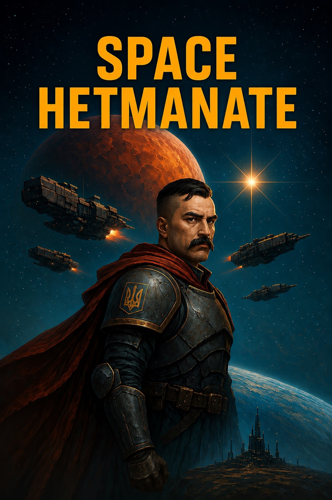

# Chapter 0. Introduction to the "Loca Deserta Sci-Fi" Universe.

Hey there, friend! Glad you decided to visit the fantastic universe of **"Loca Deserta Sci-Fi"**! This is the first book in the history of Ukrainian military space sci-fi. In this chapter, you will learn about the main historical events of our universe.  
To help you get oriented, imagine that before Hetman Ivan Ostapovych Vyhovsky came to power in 1657, the history in our world and in "Loca Deserta Sci-Fi" was absolutely identical. But he not only preserved the Hetmanate — he expanded its influence and territories. Later, other hetmans conquered all of Eastern Europe and the Balkans.  
In the 19th century, three empires formed and seized almost the entire Earth. The first — **the Sun Empire**. It controlled the entire Asian continent and the Pacific Ocean (with the exception of Australia). The second — **the Corporate Republic**. Its power covered both Americas, and Australia was its vassal. And finally, our own native empire — [[../../Всесвіт/Імперії/Федерація Гетьманату/Федерація Гетьманату|the Hetmanate Federation]]. It held under control all of Europe, North Africa, the Middle East, and Asia Minor. Around the 20th century, the empires began a war for control over Africa. This led to mutual nuclear strikes on troop formations on the continent, which ultimately completely destroyed it and rendered it uninhabitable. In order to salvage the situation and de-escalate the conflict, the empires signed the **Peaceful Nuclear Treaty**, which made the use of nuclear weapons on Earth impossible. By the end of the 20th century, all three empires had reached space and begun colonizing nearby planets and moons.

In the year 2143, or the zero year of [[../../Всесвіт/Історія/Зоряна Ера|Zorian Era|Zorian Era (ZE)]], the warp drive was invented, which made it possible to travel across the Solar System in a matter of hours, rather than years or decades. The superheavy metal Nobelium, also known as Lawrencium, became essential for executing warp jumps. To make wars in space impossible, all three empires divided the universe — both the explored and the unexplored (black space) — into three sectors. Each empire received its own sector in perpetual possession by drawing lots. More on that later.  
The warp drive was jointly invented on Jupiter's moon — Europa. [[../../Всесвіт/Європа Юпітерна/Європа Юпітерна|Europa Jupiteriana]] is a research station where scientists from different empires and planets worked together to create the warp drive. A jump required a large body with gravity (Jupiter) capable of accelerating a reactor containing Lawrencium or Nobelium and crumpling space, forming a corridor to another point in space.  
The first three interstellar travelers were the heads of the warp-drive development departments — representatives of each of the three terrestrial pre-stellar empires. Before launching humans, about forty successful launches of animals, plants, and simply objects took place. The journey was programmed so that after two days on the other side of the warp, the ship would initiate a warp transition back to Jupiter's Void. Having gathered enough evidence of the safety of warp travel and that time remained synchronized (the animals returned neither younger nor older), the decision was made to send the first interstellar cosmonauts.  
The transition was programmed for a three-day stay near Alpha Centauri with the ship's automatic return. But in the event of a successful warp with humans, they were to return in two Earth days.  
The moment of the ship's launch was broadcast to all four inhabited bodies of the Solar System: Earth, Mars, Europa, and the first artificial satellite of Earth. Around 20 billion people from all empires witnessed how the ship departed from Europa Jupiteriana and headed toward Jupiter's Void for the warp jump. In the Void itself, the cosmonauts sent their last signal — "Haida!" — and vanished from the Solar System's radars. The gravitational wave of the transition rippled through the planets, though it was only registered by instruments.

Two Earth days later, another gravitational wave struck the sensors arrayed around the Void. And in just a few hours, Europa Jupiteriana received a video signal with the cosmonauts. The astronomical time of return from the warp became the starting point of the new Zorian Era, or ZE. Humanity gained access to any star.

## [[../../Всесвіт/Історія/Марсіанський Поділ Світу|The Martian Division of the Universe and the Teegarden Incident]]

Every member of the Europa (Jupiter) International Research Station (EJRS) received access to all the developments of that laboratory. In the twenty-third year of the Zorian Era, each empire had already established one colony in the nearest solar system — Alpha Centauri. The search for subsequent systems capable of hosting humans showed that there were rather few of them, and systems with mineral resources — even fewer. Moreover, warp jumps were quite expensive, as Lawrencium and Nobelium are unstable and must be kept only under micronuclear explosions in a state of rest. Discussions began among the empires over who had the right to develop asteroids, comets, and planets and to establish colonies there.  
In Year 31 of the Zorian Era, the first armed clash occurred during the exploration of the Teegarden's Star system — specifically on the planets suitable for human habitation: Teegarden B and C. According to the rules, whoever landed on a planet first received it as their property. The Chinese of the "Sun Empire" captured Teegarden B, where they discovered large deposits of heavy metals and a planet more or less suitable for life. The Americans of the "Corporate Republic" landed on Teegarden C, which turned out to be an absolutely unsuitable piece of rock one and a half times the size of Earth. So, under cover of chaos, the Corporats seized the defenseless colonists on Teegarden B, killing them all. Afterward, they informed Europa Jupiteriana that they had occupied the planet Teegarden B. At the same time, the Sun Empire, for its part, reported to Europa that the Corporats had attacked their ships in that system and captured the warp control point, effectively expelling the Solarians.  
This incident entered stellar history under the name "the Teegarden Incident." It provoked unrest in the Solar System — all three empires entered a state of undeclared war. The troops of the Hetmanate, the Corporats, and the Sun Empire headed toward Europa Jupiteriana to seize control of warp-transition development and operations. Entering Europa's gravity zone would have meant the start of the first Solar World War, for the Europa Jupiteriana zone was demilitarized.  
The heads of warp-transition development from Europa Jupiteriana — namely Mykhailo Sahaidak, Jack Mo (马云), and Richard Stallman — issued a statement that any further movement by any of the empires aimed at seizing the warp laboratory would cause the collapse of civilizations. The research station workers threatened to activate the warp drive directly on Europa Jupiteriana, which would cause a gravitational rupture and destroy the moon along with the station.  
Three strike corps of the empires halted at the border of Europa Jupiteriana, hesitating to continue their advance. To begin negotiations, it was decided to hold a conference on Mars — to finally settle the question of the division of the universe and agree on the terms for obtaining warp drives.  
On July 24, Year 33 of the Zorian Era, the [[../../Всесвіт/Історія/Марсіанський Поділ Світу|Martian Division of the Universe]] took place.  
The entire universe was divided into three sectors — each constituting one third of an imaginary sphere that symbolized the spatial division. The distribution was carried out by drawing lots: each emperor drew a ticket with the name of a sector. As soon as someone drew the third ticket of a given sector, that sector was automatically assigned to their empire in perpetual use.  
The first to draw three tickets was Nick Rios, Emperor of the Corporate Republic. They received the upper-right sector. Between the Solarians and the Hetmanaters a fierce struggle erupted — each strove to obtain the "left" sector, for the "lower" one contained the gigantic void of Canis Major, almost entirely devoid of resources. Emperor-Koshovyi Taras Velychko and the Solarians' Emperor Wang Mang (王莽) simply could not draw the third ticket with the "left" sector — five times in a row each drew tickets with already-claimed space. At last, Wang Mang drew the "left" sector, thereby granting his empire the right to rule there, while the Hetmanaters automatically received the "lower" sector. Although the Hets were in despair, a deal was a deal.

## Results of the Martian Division of the Universe, Year 33

The main provisions of the treaty on the division of the universe.  
— The respective sector was granted to each empire in perpetual possession.  
— The Solar System was to become demilitarized, with no troops of any empire present by Year 100 ZE.  
— Each empire was obliged to pay a science tax to Europa Jupiteriana for the continuation of research.  
— The empires were to relocate from the Solar System to their own sectors.  
— The empires were forbidden from developing their own warp drives.  
— All warp technology belonged to Europa Jupiteriana.  
— The Solar System became demilitarized, with a population of about 5–8 billion.  
— Order was maintained by the Peacekeeping Forces, which were subordinate only to the three heads of the laboratory on Europa Jupiteriana.  
— Each empire had a group of representatives on Europa Jupiteriana.  
— The laws of the empires did not apply in the Solar System.  
— Europa Jupiteriana was forbidden from conducting research or development of any military technologies.  
— Europa Jupiteriana was forbidden from showing preference to any of the empires.  
Thus began two hundred years of continuous expansion of warp stations and the conquest of space by the three empires. Humanity conquered the universe!  
The Hetmanate finally relocated in Year 91 ZE. The Zorian Sich was founded in the Virgo Supercluster. The Corporats left the Solar System in Year 96 ZE — "Zorian Washington" was founded in the Centaurus Supercluster. The Sun Empire departed in Year 87 ZE, founding "Zorian Shanghai" in the Pisces-Cetus Supercluster.  
The Hetmanate embarked on numerous expeditions to various star systems and galaxies in search of rare elements and to research the possibility of synthesizing them. In Year 281 of the Zorian Era (2424 of the Old Era), the colony "Loca Deserta 17" was founded — in one of the most remote systems of the galaxy, which bore the same name. The sector received it due to the nearly complete absence of stars, planets, or other bodies — probes recorded nothing but utter darkness. On maps, this region looked like a black spot in infinite space. The number "17" was sequential — the Hetmanate so stubbornly sought to find something in this void that it founded seventeen colonies in an extraordinarily short time.  
Research on "Loca Deserta 17" was classified, and the colony was permanently guarded by three regiments of Space Haiduks.

 In Year 323 of the Zorian Era, communication with the colony was lost.

# Chapter 1. The Signal

*Sending a message. Unwanted guests from warp.*

Mukhnar, the duty signalman, half-lying in his chair, monitored the warp-radar and the gravitational detector. He was dressed in a light-gray station suit with a silver trident emblem on both shoulders. In his right hand, he twirled a radio headset, spinning it forward and back. The red light on the right earpiece indicated that the headset needed recharging. Usually, shifts on remote planets passed without any incidents whatsoever. The only entertainment was chatting with your partner, whom you see every shift, occasional trips to the canteen, or communicating with starships heading toward the planet's surface. Once a week, if you were lucky, a request might come in for a warp[^1] jump of ships carrying new settlers, or the dispatch of heavy cargo starships of the "Chumak" class to another system. The moon on which the warp-communication post was located orbited the planet "Wild Field 17," where there was only a single hive-city, and all the rest of the continent's territory was occupied either by mountains or endless steppe. The colony itself was a mining one — in the planet's depths, almost the entire periodic table had been found, so there was work for the Hetmanate's miners for the rest of their lives.  
The only thing Mukhnar couldn't understand was why the colony "Wild Field 17" was guarded by as many as three regiments of space haiduks[^2]. The number "17" was purely sequential, and the prefix "Wild Field" came from the name of a dark patch in space, where only quite recently ships of the Het' people[^3] had started appearing. Long-range reconnaissance probes reported complete emptiness. Warp-scanning results showed neither planets nor stars. There weren't even black holes. But everything changed about a hundred years ago, when the first plastuns[^4] of the Het' began returning from forays into this void and reported a completely different picture. Instead of a cosmic desert, there was an extraordinary abundance of star clusters, from old stars about to collapse to newly formed, young ones. When the fifth expedition returned, confirming the data of all the previous ones, the decision of the Cosmic Sich[^5] was made to begin colonizing the "Wild Field." The name itself was given from the name of the lands where the history of the Hetmanate Federation began in distant times (in the sixth century of the pre-stellar era[^6]), when the Het' still lived on Earth and occupied only a small patch of the steppes.  
It was precisely this sector to which the regiment "Zbarazh Lances" of the 1589th Corps of Haiduks was assigned. Three years of service passed without any incidents whatsoever. Quite quickly, the plastun engineers brought the atmosphere and plant life of the planet to a state where one could walk and run on the surface without spacesuits. And very soon the colony reached a 60% rate of self-sufficiency in food and water. Ice haulers of colossal size, some of which reached up to 10 kilometers in length, traveled along the far orbit of the planet and collected ice left behind by some comet that had passed here merely a few million years ago. It was one such ice hauler that Mukhnar lowered to a lower orbit this morning, where smaller ships could then transfer tens of thousands of tons of ice down to the colony.  
Right opposite Mukhnar's workstation hung monitors showing the flight traffic of both the far orbit and the lower one. About a dozen ice haulers, like boats on a river, darted back and forth from the surface to the colossal ship "Mriya," unloading its frozen contents. Today's requests were very monotonous — transmitting warp-messages between palankas and permits for launching and docking ice haulers at the colony "Wild Field 17." There were still two days left until the end of the shift, and then their kurin[^7] could finally get to the surface and rest. Living on a moon in the middle of a white desert was not exactly a pleasure. Resting on the colony's surface, however, was a different matter — you could spend nearly a whole week on your own business, and the newly built recreation complex on the ocean shore was just about to open for everyone.  
Nearly dozing off, Mukhnar returned to thoughts about the colony. Enormous radio-communication spires, dozens of kilometers of docking and landing modules — it could receive super-heavy cosmic cargo ships of the "Star Chumak" class. What exactly the colony produced, Mukhnar never figured out, but the number of mining artels and convoys was above usual. Next to the hive-fortress was a gigantic quarry where mechanized automated robots worked, capable of functioning under any conditions — the main thing was to supply them with energy. All the ore or rock they extracted from the planet's depths was transported by conveyor to the colony itself, and Sich-knows what they did with it there.  
As for energy, the colony had four underground atomic reactors. They were protected by huge cocoons of plex-concrete[^8] several dozen meters thick. Even an orbital strike with nuclear torpedoes or the dropping of planetary plasma bombs could not breach this cocoon. The planet would sooner split apart than a strike would reach the atomic stations.  
Every shift, Mukhnar would return to the surface of Wild Field to his kurin. The Great Otaman of the Cosmic Haiduks, Vsevid Chaikovsky, who governed the entire colony and the three regiments, liked to play at being Cossacks and constantly drilled the personnel. In truth, Mukhnar liked the drill. Landing operations from the "Viz-113"[^9] to clear the quarry, jumps from aircraft on gliders over the towering wall of the hive-colony together with jetpacks... The kurin was a signals unit, but general training applied to everyone. The empire didn't wage large wars, except for clashes in adjacent sectors, battles with corsairs, or the suppression of uprisings. And even in those conflicts, only a limited number of Cossacks took part. You could serve your whole life and never see a hot zone. Well, and in addition, wars with native animals — after all, planets sometimes threw up interesting evolutionary variants that had to be rooted out with plasma...  
The dream of rest on the surface with friends was interrupted by a sharp sound signal from the control panel. The gravitational detector flashed an alarming red light and displayed a message: "Attention! Warp-space exit registered. Shock wave — cruiser level." Mukhnar straightened up sharply and put on the orbital communication headset. The headset beeped three short times, reminding him of the need to charge the battery. Still somewhat in a half-asleep state, with dreams of the sea, Mukhnar tried to remember what he was supposed to do at this moment and whether he had missed anything. But there had been no requests for a warp jump — or at least, he didn't yet know of any.  
— "Surface-17," this is the orbital station duty officer, code "Station 02." Shock from a warp-wave received. Wave level — "cruiser."  
— "Station 02," we had no requests for a warp jump, await an incoming signal from the ship.  
— "Surface 17," grant permission to move interceptors to far orbit.  
— "Station 02," denied. Monitor the initiation signal. Most likely, plastuns have returned from a warp jump — they don't always give advance notice.  
— "Surface 17," acknowledged. Awaiting the initiation signal, — Mukhnar placed the communication headset on the terminal.  
The signal on the gravitational detector continued to flash, but no longer in red, and after three minutes it stopped showing any signs of life altogether.  
Suddenly, a radio operator from the colony's surface burst straight into Mukhnar's headset.  
— "Station 02," "Station 02." Order to open a warp-channel to the Sich. Report immediately upon opening. Encoding level "Sich-3." — the command came from the planetary communication node without any preliminary conversation or establishing a connection.  
Mukhnar's palms simultaneously went cold and sweaty. With sticky fingers, he adjusted the headset, which once again reminded him of its low battery charge.  
— "Otaman 01," proceeding. — Mukhnar began quickly typing commands on the terminal, loading the message transmission program. He knew that only the personal signalman of the Commanding Otaman Vsevid Chaikovsky had the right to burst into his headset like that, without warning.  
"Sich-3"? His entire signals kurin had never in their lives opened channels with a higher code than "Palanka." He exchanged glances with Demetr — his colleague, who until then had been dozing on a bench in the corner and was already taking up his combat post. Demetr opened a case with ampoules containing holographic codes and handed one of them to Mukhnar. On the ampoule's label glowed the inscription: "Access code for 'Sich-3' level." The "Palanka" code was used for negotiations between solar systems. Category "Sich" codes, however... had a direct connection with the Cosmic Sich-Mother. On the third try, Mukhnar broke off the capsule's cap and extracted a small display with the access code. He connected the code-key to the senior station officer's terminal and entered his personal set of digits for decryption.  
— "Otaman 01," ENTER ACCESS KEY FOR "SICH" ENCODING. My key "Station 02" is ready for synchronization with you, — Mukhnar adjusted the communication headset and reported to the otaman. To avoid erroneous data transmission, category "Sich" messages always required unlocking at the level of the main warp-tower and directly by the signalman of the commanding otaman.  
— "Station 02," keys synchronized. Begin sending the message, — on the warp-antenna control screen, a signal flashed indicating that another key was awaited, and the status bar blinked green, indicating sufficient energy to open the warp-channel.  
 Mukhnar entered the 32-byte sequence of the synchronized key, double-checked it together with Demetr, and together they pressed the pedal to begin the transaction. Suddenly, over 40 signals from shock after warp exit lit up on his warp-radar.  
— 40 simultaneous warp exits? Has the Hetman himself come to visit us? — Mukhnar had previously escorted the transfer of haiduks between palankas, but for forty warp-exit points to appear on the radar like that, without warning — it was completely unexpected. — "Surface 17," how many plastuns were supposed to return? I just received 40 signals of warp transition.  
— "Station 02," check the signal. Perform a radar restart, — the planetary signalman replied curtly.  
— "Surface 17," impossible, the radar is busy transmitting the message, — Mukhnar felt an alarming sensation, as if something had gone wrong.  
— "Station 02," restart the radar after transmission...  
Mukhnar couldn't finish hearing the sentence, due to the sudden screech of the alarm signal that flew into their room like a warp jump. Four red lamps attached to the ceiling began flashing their diodes and emitting an even more disgusting screech. The short-range radar detected over 200 warp-jam deployment torpedoes, which automatically triggered the alarm. The torpedoes moved in a crescent formation, surrounding the planet "Wild Field 17" from all sectors of space.  
— We must immediately notify the senior officer — we're under attack! — Mukhnar threw out, and together with Demetr began feverishly typing commands on the keyboards, sending warnings to the duty orbital interceptors and planetary defense systems. According to calculations, the Het' interceptors still had several dozen minutes to manage to get out beyond the orbit and meet the torpedoes — and with them, the likely landing capsules of the assault force.  
— "Otaman 01." The warp-communication station has just received a signal of mass warp exit and the approach of a large number of warp-jam deployment torpedoes. Space threat: approximately forty ships and several hundred torpedoes. Orbital fighters have been alerted, — Mukhnar reported, continuing to enter commands for raising the alarm for all starships and orbital defense nodes.  
— "Station 02." We are launching code "Citadel" until it is determined what kind of ships are heading toward us. Three regiments of haiduks have been raised on alert. Continue transmitting the "Sich-3" message. — Mukhnar and Demetr could hear the commotion that reigned at the central communication node on the planet.  
— What could this be? — Demetr asked rhetorically, addressing his senior in rank, Mukhnar.  
— I don't know, this is the first time I've seen something like this. Maybe some training prank from the plastuns? Decided to test us? — Mukhnar shrugged his shoulders and continued dispatching commands to the orbital interceptors.  
Dozens of thoughts whirled in his head — what else could this be? A cosmic attack by unknown hulls? An alien invasion? Maybe one of the palankas had rebelled and decided to seize their colony? About wars waged by entire corps with warp-transitions, the Cossacks knew only from their grandfathers' tales or from history lessons of the Sich in the era before the Departure.  
— Communication via warp is impossible. The enemy has deployed jammers. Transmission of the "Sich-3" message is nearly halted, — Demetr informed Mukhnar, the station chief.  
Mukhnar picked up the headset for communication with the surface on the colony.  
— "Otaman 01," warp-message transmission is not possible, the enemy is blocking 90% of the radar's throughput capacity — nobody can overcome that many torpedoes with jammers.  
— "Station 02" — what other warp-torpedoes... Devil... "Station 02"...  
The connection was not cut, and Mukhnar heard someone tear the headset away from the signalman on the colony surface.  
— "Station 02," this is the Great Otaman of the Cosmic Haiduks, Vsevid Chaikovsky. I order your kurin to transmit AT ANY COST, — the otaman emphasized the last words and pronounced them almost letter by letter, — the warp message "Sich-3." Torpedoes cannot hang in space forever. Hold the radar and control over it until the signal is sent.  
Out of the corner of his eye, Mukhnar saw the communication bus and how messages flew across it for the colony to close down and transition to "Citadel" mode. The code meant that a space attack was underway against the colony and it was switching to survival mode. Tens of thousands of workers, residents, and military personnel of the colony were being recalled to the hive-citadel.  
— Comrade Chaikovsky. The order will be carried out. There are three of us signalmen and three haiduks. In the event of a landing on our warp-station, we won't hold out for even an hour. I request that you send us reinforcements.  
— "Station 02," two ships of haiduks are heading to you. That's all that's on duty in orbit. After they land, close the station and hold the siege until the signal is sent. Torpedoes cannot deploy jammers forever. I repeat. The signal transmission must be completed at any cost. In the event of a landing and capture of the warp-tower, the station must be destroyed. May the Sich-Mother protect you, may Luh-Father give you strength. — Vsevid Chaikovsky broke the connection.  
— Did you hear Chaikovsky's voice? It doesn't sound like a prank by the plastuns or that we're being tested somehow. — Mukhnar turned to Demetr, who had a noticeable slight tremor in his hands as he placed them on the keyboard.  
— Demetr, I order you to activate the backup power line from the generators and bring the AI turrets[^10] to combat readiness. Also, find the others on the station and alert them, — Mukhnar said to the haiduk-signalman, while he himself continued sending alerts of the attack to the small fort-farmsteads remote from the main hive.  
Demetr dashed out of the room and ran through the corridors to search for the haiduk-guards, who were always wandering about somewhere, and he also needed to find Ostap, their fellow-kurin member. His shift was due to begin in a few hours, so he was most likely sleeping somewhere. Moving through the corridors, Demetr stopped at the consoles responsible for the AI turrets.  
At Mukhnar's station, the indicator of docking requests with the airlock beeped with two signals.  
— "Station 02," haiduk senior of boat 1808X ready for docking, open the airlock.  
— "Station 02," haiduk senior of boat 1202P, we will be at your moon in 5 minutes....  
Suddenly the moon shook. Mukhnar saw on the radar hundreds of small dots — interceptors of the haiduks and unknown ships that had just entered combat in orbit. Several dozen rockets had already reached their targets and struck the communication towers on the moon. Above the surface stood some auxiliary orbital communication towers, but all valuable equipment was hidden deep under the moon's surface, where a torpedo was unlikely to reach. The dot with the number 1202P, which was approaching the station, suddenly vanished from the radar. Only the landing ship 1808X remained near the airlock.  
— 1202P, come in. — Mukhnar still hoped for some answer from the ship.  
— "Station 02," this is 1808X, a torpedo struck their engine. They are cosmic dust now — may Luh preserve their souls. We are already in the airlock, immediately close it and activate the turrets in autonomous AI mode. — The otaman of the haiduk landing ship, which was just docking to the station, dispelled Mukhnar's last hopes. Before his eyes, nearly a hundred of the finest sons of the Sich were scattered into trillions of atoms together with their ship. At least the death was instant.  
— "Otaman 01," this is "Station 02." Your boat 1808X has joined us. We are taking up defense and carrying out the order — at any cost. Ship 1202P is lost, — the signalman reported briefly to the surface, not waiting for a reply.  
Mukhnar rolled his chair over to the terminal controlling the station's defensive AI turrets and began activating them one by one. As soon as Demetr switched on power to an AI turret, the corresponding circle appeared on Mukhnar's screen as well. With a single poke of a finger, Mukhnar updated the turrets' certificate data and loaded current cryptographic keys into them. It would take the enemy several minutes to decrypt the challenge, during which the AI turret would have already destroyed them.  
Mukhnar activated the signal booster; the terminal showed 69%... and didn't move further. The warp-jam torpedoes had deployed a dense shield that even their orbital radar couldn't pierce. The torpedoes bypassed the colony from all sides and constantly emitted garbage-signal into the ether. Whoever was attacking had colossal capabilities, if they could launch several hundred warp-jam torpedoes.  
On the orbital radar, the signalmen of "Wild Field 17" observed the heroic duels of the haiduk interceptors and the attackers. Hundreds of dots — some disappeared, some stopped flying along their trajectory and gradually descended into the atmosphere and eventually burned up... Mukhnar recalled the cosmic gymnasium, how the small interceptors formed crescent, triangle, and saber-shaped formations. Each of these tactical maneuvers served different purposes, such as intercepting torpedoes, or luring and encircling landing modules. But back then it was a combat simulation, and now — their fellow flyers were dying.  
Ostap entered the room. All this time he had been sleeping in the rest room, and only the "Citadel" signal had woken him.  
— Ostap, launch the signal interceptor and try to decode the enemy's communications. Take four more power lines with you and activate the auxiliary AI. We're under attack!  
Ostap stopped rubbing his swollen right eye and opened his mouth, at first thinking it was someone's prank. But dozens, even hundreds of dots on the radar, forming various tactical formations, were beginning to disappear here and there. Alarm signals sounded from all directions — and the picture emerging was not at all cheerful.  
Mukhnar opened the Warp-Transmitter station control terminal, entered the weapons section, and activated the arsenal. In the adjacent room something stirred — the heavy doors of the weapons safe could be heard opening with a rumble. Mukhnar looked around in surprise, realizing that Ostap had ignored his order. He was still standing in the middle of the room, devouring the orbital communication monitors with his eyes. Behind him suddenly appeared Demetr, who had already managed to run through the station's left sector.  
— Demetr and Ostap, order: find the other haiduks and retrieve your weapons from the safe. Everyone put on combat station spacesuits — in case of station depressurization. Along the way through the corridors, activate the AI turrets. We rendezvous in the central hall — we'll wait there for the haiduk otaman. Execute — now!  
Demetr shoved Ostap in the shoulder to snap him out of his stupor, and together with him ran to the rest room to search for the haiduks who were still roaming about. On the way, right in front of their communication room, the doors to the weapons storage were already open.  
— Are you still asleep? Hurry up, get dressed and grab your weapon. — Demetr hastily put on his spacesuit and scolded Ostap, who couldn't get his protective suit off the hanger. Demetr himself had managed to activate almost all the AI turrets, but the backup channel with the generator still needed to be connected so that the station would be ready to repel orbital strikes.  
— Is... is this really war? — Ostap finally managed to squeeze something out of himself.  
— There are close to two hundred warp-torpedoes deploying jammers on us. I think this isn't just a war, but some damned, huge-as-an-ox's-tremor enormous war. And we are the first who have to hit them hard. — Mukhnar took a short laser pistol and checked the charge.  
Ostap fastened the protective sphere-helmet, checked the oxygen supply and local vox[^11]-communication. His comrade grabbed two oxygen kits and laser charge packs and attached them to the magnetic strip on the back of his spacesuit. Emerging from the weapons room, both of them rushed to find the haiduks — and immediately ran into them around the nearest corner. The signalmen's combat guards were already dressed in full combat station suits, and behind each back hung an automatic laser pistol.  
— We have received orders to keep the radar on at any cost — until the message is sent. And any cost means the cost of our signals kurin and a few dozen haiduks who are already emerging from the airlock. I order you to take up defensive positions. Prepare and charge the plasma cannons in case of a landing. AI turrets are activated, — came Mukhnar's voice through the station vox-communication.  
— What kind of signal is this anyway? We can still jump to the surface..., — one of the haiduks said uncertainly.  
— No "we can." My House Is on the Edge...  
— I AM THE FIRST TO MEET THE ENEMY!  
All, as one, replied his comrades and the newly arrived haiduks who had just entered the station's central section. Their heavy steps in armored suits coincided in rhythm with the saying. Mukhnar rushed out to meet them.  
— Mukhnar, I am Ivan Sichnik. Commander of a space haiduk detachment. I have orders to reinforce the warp-radio communications post. Command passes to you, in accordance with the order of the Commanding Otaman.  
The surface of the Moon shook — dust fell from the ceiling. The AI turrets opened fire on torpedoes or rockets attempting to breach the airlock and the protective shield. Dozens of tons of debris and explosives began hammering straight against the station's hull. Mukhnar carefully examined the armor of the reinforcements who had just arrived for the station's defense. They were their comrades from the "Zbarazh Lances" regiment. Two of them, who had just entered the central room, wore heavy haiduk armor — designed for combat in atmosphere-less conditions, such as the surface of the Moon. On the left side of each hung a heavy infantry saber. The faint blinking of a small lamp in the middle of the guard indicated the presence of plasma inlays in the blade — such additions allowed one to cut through metal and flesh with a single motion of the hand. The statures of the heavy haiduks were two to three heads taller than human ones, and the massive armored plates on their shoulders and chests made them look like battle giants. The suit itself was reinforced with hydraulic modules that allowed moving the protected joints with muscular effort. Each haiduk's helmet lay on their shoulders — the front and upper hemispheres were transparent, but could darken depending on conditions. At the back of the head, several optical eyepieces and auxiliary sensors were visible.  
The examination of the giants was interrupted by another salvo from the AI turrets, after which the station was again well shaken. The moon's surface shuddered, dust fell from the ceiling. The turrets opened fire on torpedoes and rockets trying to breach the airlock and the fortification's armor. Tons of debris and explosives thudded dully against the station's outer hull.  
Ivan Sichnik began studying the dust that was falling from the ceiling, as if doubting whether the station would withstand the next strike from orbit.  
— This is plex-concrete, the best grade. It can withstand up to a nuclear strike... so we should only fear a landing force with their plasma cannons. We take up a circular defense. Food for... two weeks. Unlikely we'll live that long... ammunition... scarce, — Mukhnar finally answered Sichnik, gripping his shortened laser pistol.  
— Mukhnar, our landing ship has enough ammunition and batteries for plasma and lasers. We also have three sets of bot-djuras[^12]. We'll break through. — Ivan Sichnik smiled doubtfully at the signalman. — Besides, we're not some scouts. We're a rapid-response warband — I have three squads of heavy haiduks under my command who can give the enemy a serious repulse.  
— How many of you exactly? To transmit the signal, we need to keep the generator, the communication spire, and the central control room under control. The station itself is large, but if some sections are captured, nothing will happen. — Mukhnar and Demetr cheered up significantly when they heard how powerful a detachment had arrived.  
— With me are sixty haiduks, there are three sections with super-heavy infantry equipment and armament. Also, there are five entrenching djuras. I propose we deploy the super-heavy units onto the moon's surface — they'll be more useful there. The other haiduks are already bringing the kit to you, — Ivan Sichnik announced over the internal communication.  
— Excellent, bring the equipment to the central room — there's a hospital section there, we've never used it, but all the equipment has been inspected. — Mukhnar grew even more cheerful from this news. Together with the AI turrets and the heavy infantrymen, they were capable of withstanding a siege of the station and even preventing a potential landing force from touching down.  
Sichnik silently nodded to his haiduks, and they instantly vanished behind his back. A few minutes later, they returned with standard ammunition crates: from combat drones to melt-mines, and they also brought in three heavy machine guns "[[../../Всесвіт/Імперії/Федерація Гетьманату/Озброєння/Вепр-3|Vepr-3]]."  
— Now that's some devilry! — Ostap exclaimed in surprise. — In training, I only fired the "Vepr-1"!  
— "Vepr-1" is a powerful combi-rapid-fire gun, but "[[../../Всесвіт/Імперії/Федерація Гетьманату/Озброєння/Вепр-3|Vepr-3]]" — now that's a real song! — proudly responded one of the haiduks who had brought the weapons. — By the way, my name is Myron Mnohohrishny.  
The Cossacks shook each other's hands, as much as was possible in the bulky suit of a haiduk-machine-gunner and Ostap's light station overalls. Myron noticed that Ostap was literally devouring the brand-new rapid-fire gun with his eyes.  
— "Vepr-3" has a number of improvements, — Myron continued. — First, a built-in gravitometer: you don't need to calculate gravity yourself. The machine gun automatically adjusts the trajectory for each bullet. Second, you can attach two boxes at once: one with needle-like explosive ammunition — against infantry or a crowd of savages, and the second with plasma for penetrating armor. Ammunition can be alternated in turn, for greater effect. Third, the machine gun can be controlled remotely via an AI channel, sitting in safety while it makes mincemeat out of corporates or narrow-eyes — depending on who exactly is attacking us. By the way, what's known about the enemy? Is it the swine-corps[^13], or the swine-eyes[^14]?  
— The devil knows. So far, only torpedoes have been flying at us, and it's not written on them whose they are, — replied Ostap, still admiring the "Vepr-3" with enthusiasm.  
The station was shaken again by the explosions of the AI turret salvos and the debris falling on the hull.  
— It seems it's the sunners[^15]. They have smaller torpedoes — they barely show up on radar, but they hit with meter precision. The corporates, on the other hand, have somewhat cruder rockets and torpedoes: hefty great blanks, but if they do reach you, they'll blast everything around, — Mukhnar announced over the station communication. Only he and Ostap had access to record, but everyone could hear the message.  
— Sichnik, I'm not a combat haiduk like you, — Mukhnar continued. — I won't be able to command your lads, and I doubt they'd listen to me anyway. To carry out the order of the Commanding Otaman of the Cosmic Haiduks of "Wild Field 17," I need two things: the warp-communication antenna and the generator, which is located a kilometer away from it. All communications are laid beneath the surface, they're practically impossible to bomb out. But if the enemy lands an assault force directly on the station, the antenna, or the generator... we'll have serious problems, and we won't be able to transmit the signal to completion.  
Mukhnar's speech was interrupted by a series of powerful jolts — several torpedoes struck directly into the surface above the generator. Through the surveillance monitors, the haiduks saw enormous columns of dust, rock, and white smoke rising after the oxygen-less explosion. The lights flickered for a moment.  
— Don't piss yourselves! — Ostap giggled merrily. — There's still several dozen meters down to the generators. They hit the ventilation shafts, but those shafts are scattered across the entire surface. A couple of those exits are way out on the far slopes.  
As if confirming his words, the lighting stopped flickering and again shone steadily. The haiduks returned to their work, continuing to bring ammunition into the station. Everyone busied themselves with their own task. Mukhnar, Sichnik, and several of his assistants headed to the communication control room.  
— Ostap, put the station schematic on the ceiling display. Thanks, — said Mukhnar.  
The largest monitor under the ceiling, which until then had been broadcasting the space battle that was gradually dying down and shifting closer to the planet's surface, switched to the schematic of the warp-station.  
— So, we need to hold the antenna and the generators. The generators can be reached through the central hall or through the ventilation shafts. To the antenna, there's only one way — the underground tunnel, which also starts from the central hall. In principle, if we hold this hall, we'll control the entire station. It's from here, like the rays of a star, that all communications branch out.  
— And what about ventilation? Where do the shafts emerge on the surface? Where can the adversary bore through with plasma? — Sichnik clarified, carefully studying the schematic and jotting down the necessary information with finger movements into the holographic notepad on his helmet's visor. According to the "Citadel" protocol, every haiduk or Cossack was to remain in a spacesuit and have at least two additional oxygen kits with them.  
— Through the ventilation shafts, a whole "Bulat" tank[^16] could pass through — it'd fit without even noticing the walls. But all exits are carefully camouflaged under the surface. There are three such large vents in total. Perhaps they should be mined? In the worst case, the generator can operate without external cooling, relying on its own cold chambers for up to fourteen days... — Ostap was just bringing photographs of the vents onto the screen. They truly were enormous, about three to four haiduk heights across. The most vulnerable spot of the station — the airlock. And there's also the possibility that the enemy will try to bore down from the surface straight into one of the corridors, though that's already considerably more difficult.  
— I order two squads of heavies to go out onto the surface and immediately set up entrenchments, — Sichnik's right hand moved its fingers rapidly, transmitting commands to his subordinate haiduks. — They'll deploy two rapid-fire guns there and cover the airlock from an assault landing. We'll mine the approaches to the generator ventilation shafts. The third heavy squad will defend the generator from inside the station. Execute!  
The haiduks instantly dispersed throughout the station, carrying out the otaman's orders. Mukhnar, together with Ostap and Demetr, set off to check the status of the AI turrets. For now, the turrets were effectively holding back the strikes.

# Chapter 2. The First Assault

*Rest. Preparation for new assaults.*

Ivan Kalyna, a heavy haiduk-infantryman — or more simply put, a "heavy", — was hauling crates of provisions and batteries from his landing airlock straight to the central hall station, passing them to the djuras. His dual-layered suit with external armor plates lent his figure an exceptionally massive and fearsome appearance. Signalmen, unaccustomed to the presence of such giants nearby, instinctively parted ways in the corridor, even though the passages were designed so that two or even three heavies could pass through simultaneously.
Kalyna, in anticipation of battle, immersed himself in memories of past fights and continued hauling ammunition to the station. He and his squad used the "Vepr-3" rapid-firer, which had distinguished itself with exceptional effectiveness during the suppression of the Myurid uprising in the Azov system. The entire company consisted of three squads of heavies, engineers, scouts, several snipers, and dozens of djura-bots.
Helping him was Danylo — one of the terminators[^17]. On the station, the enormous armor of a "termos"[^18] was not very convenient, so Danylo simply walked around in a standard infantry armored suit. For him, carrying the "Vepr" and its kits was routine work. During this pre-battle bustle, Danylo recalled a familiar scene from the planet "Baghdad-14" in that same Azov system. Back then, otaman Ivan Sichnik, as the crew chief, had taken up an advantageous position on the sandy surface, camouflaging the machine gun among the rocks. The mechanized cavalry of the Myurids planned to flank the haiduks from the rear and cut down their company with power sabers. But the very first burst from the "Vepr-3" thwarted that audacious maneuver. The needle-explosive rounds of the "Vepr" detonated several meters before the target, scattering hundreds of striking elements. Plasma charges sliced through the armor of horses and riders, while titanium needles tore flesh and shattered bones. Within half an hour of battle, the entire Myurid cavalry was destroyed. Even bot-horses could not save the situation: the tiny needles penetrated artificial joints, disabled hydraulics, and severed control wires.
For that victory, their regiment received a yellow banner bearing a bot-horse with a diving falcon piercing its belly. Almost everyone who now set foot on the surface of the warp station wore these new insignia on their armor. Having carried three more crates of plasma charges, Danylo went to the armory to don his armor for exiting onto the surface.
— Kalyna, — rasped Sichnik's voice in the earpiece, — orders: go out onto the surface and set up the "Vepr" to defend the airlock against a landing force. Gather your whole squad and start digging trenches. The sunners are likely already on approach.
— Received. We're proceeding, — Ivan replied. Sichnik had great combat experience and unquestionable authority, so Kalyna did not even think of delaying the execution of the order.
Handing a crate of canned goods to the first djura-bot, he immediately sent a message to his squad: assemble by the landing ship. Exiting onto the surface was done through the airlock — first, the platform had to be loaded with everything necessary: ammunition for plasma and laser weapons, crates of drones, spare armor plates, oxygen containers.
Entering the arsenal room, Kalyna found his haiduk-terminators in the process of donning their power armor. It was a complex task that demanded experience and endurance. One of them — the young haiduk Danylo — had just finished carrying ammunition and was already starting to put on his terminator suit. At not quite twenty-one, he already bore combat distinctions for suppressing the uprising on the planet of the Myurids[^19]. Nearby, other haiduks were unpacking equipment boxes.
Danylo took the standard suit off the hook, slightly reinforced at the knees and elbows. He unzipped the back seal, sat on the bench, slid his legs into the trousers. The magnetic locks in the soles connected with a characteristic click. After that, he stood up, pulled on both sleeves, grabbed the long zipper tab behind his back, raised his arm upward, and hermetically sealed the suit.
— Almost ready. I recommend the smaller vizor — it's more comfortable to sit inside the armor without banging against it, — Danylo advised, approaching a large crate where, under labels with the terminators' names, their personal vizors lay.
Nearby fumbled Mykhailo — his own brother, two years younger. He was searching for his vizor among the crates arranged in the corners. Each of them looked like a transparent sphere, and on the back side there was a small box with all the processors and programs a terminator needed, from which wires protruded. The lower part of the vizor was cut off and framed with a metal collar that fit any suit.
Danylo found his vizor, took it off the shelf, placed it on his head, twisted it slightly to the left. After a characteristic click inside — he let go.
— There, I'm fully in the suit. Now I can climb into the armored suit.
The process of entering the terminator suit was, of course, considerably more complex. The armor consisted of massive segments for the arms, legs, and torso, connected to one another by a super-strong membrane. The rear part opened at the level of the tailbone and lifted upward — parallel to the floor — via an axis under the neck. That was where the haiduk had to climb in.
The suit stood vertically on the floor, the armored arms spread out to the sides at a ninety-degree angle. The armor was held stable by two cables, passed through fastenings on the shoulders and welded to the ceiling of the changing room.
Danylo approached it from behind, tugged a small handle on the belt — the armor clicked. Pneumatic actuators helped raise the heavy rear lid and locked it in the upper position. The haiduk placed a footstep, stopped on it, raised his left leg and carefully slid it inside the armor, then did the same with the right — barely holding on with his hands to the raised armored lid.
— How I hate this climbing in and climbing out... — Danylo grumbled through his suit's loudspeaker.
This problem was known to all haiduk-terminators: getting into and out of the armor was uncomfortable, painful, yet for some reason the suit had never been modernized. Every experienced "termos" had a tailbone that was literally black — from constant impacts against the floor when climbing out of the armor.
— Maybe I can support you? — Mykhailo had already stepped toward his brother so the latter could lean his back against him.
— No, — interrupted Tavryd, — every terminator must climb in and out on his own, unless wounded.
Both of Danylo's legs were already in the armor. The hardest part remained — simultaneously squeezing the body and arms into the armor segments. He held onto the raised lid as if it were a pull-up bar and slowly lowered himself down, waiting for his feet to finally touch the inner platform. Feeling support beneath him, he arched his back and began sinking his torso deeper. As soon as his buttocks were almost in, he abruptly pushed off the lid and quickly thrust his arms into the sleeves.
The torso went in easily, but the arms had to be forced through literally — as if pulling on a tight sweater. Danylo rocked to the right to free his left shoulder and managed to push both arms through to the end. At that moment, the onboard computer activated, recognized the haiduk by his personal key, and engaged the pneumatic support system.
His whole body seemed to grow lighter — the exoskeleton came to life. On the vizor appeared a control panel. Focusing his gaze on the "Hatch Close" icon, Danylo twitched his fingers in the glove — the system read the command, and the rear lid began descending almost silently. As soon as it seated into the groove, the sealing and pressure equalization system activated automatically.
— Finally. Almost ready, — Danylo said into the internal vox with relief.
He looked around, moved toward the weapons crates, began retrieving weapons, batteries, gear, and placing everything on the platform that was to go out with him onto the surface.
Mykhailo had already donned the inner suit when Apollon Kalyna entered the room — Ivan Kalyna's own brother. He was a combat medic and was the first to load his gear onto the platform: a bot-evac, additional oxygen canisters, oxidizers, a heap of spare protective plates — everything necessary to aid the wounded on the moon's surface.
Battle in an atmosphere-less environment was considerably more dangerous than under normal conditions, yet over the last fifty years, science and technology had advanced so much that the chances of survival had increased from five to sixty percent. The key was to seal the breach with plex-gel in time, inject medication through a special port on the suit, and hand the wounded over to a bot-evac[^20]. The bot would deliver the kozak to the airlock or into a sealed medical tent.
In ten minutes, the entire squad of terminators was ready to exit, and all the gear already lay on the self-propelled bot platform.
— We move to the airlock, — Kalyna commanded curtly and motioned the haiduks toward the exit.
Danylo and Mykhailo were wheeling the "Vepr-3." The rapid-firer was extraordinarily heavy — over three hundred kilograms — and could only be transported in power armor, and only by two men. Two crates of plasma rounds were already secured.
— Damn it, why did they even invent such a monster... — Mykhailo grumbled into the vox channel.
Kalyna walked ahead. On his right thigh already hung a heavy infantry power saber — the kurin commander was left-handed. On the weapon's guard two deep notches could be seen — a reminder of Baghdad. Back then, two Myurids had broken through the barrage of fire from the "Vepr" and made it to hand-to-hand combat.
— Get ready. I'm sending a request to exit onto the surface, — said Ivan, casting his eye over his squad of eight haiduks. Heavy armor, several carrier-bots, crates of drones, melt-bombs[^21] — the detachment looked resolute.
According to the doctrine of the military forces of the Sich, even medics and engineers were required to wear heavy armor — not always full terminator-grade, but fairly close. Of the whole company, the most imposing was Danylo. As a terminator, he did not carry a heavy firearms arsenal — only a short plasma handgun. Instead, on his left shoulder, under the armpit, hung a saber with active plasma coating, and each fist of his power armor was armed with enormous adamantite spikes. On his back — a combat shield and a heavy horned spear. All elements of his armor were more massive than those of any of his comrades.
The primary task of a terminator was to prevent the enemy from breaking into close combat with the squad — a kind of living bastion, personal bodyguard to the kurin. Danylo's helmet differed radically from the helmets of the other heavies: a hemispherical construction covered with sensors for 360-degree panoramic vision. More simply, they called it the "octopus" — due to the resemblance of the sensor "buds" to eyes on the tentacles of that very creature.
— We exit the airlock. Semenko, take two diggers and erect a trench on the hill a hundred meters from here. Danylo and Mykhailo, you drag the rapid-firer only after Semenko's signal, — Kalyna gave the order.
Semenko flashed his vizor in response, and Ivan understood that everything was received. Semenko was a seasoned engineer, a graduate of the Academy of Military Engineering on Kodak, with a golden trident at that. On the chest of his armor hung a badge with a falcon piercing the belly of a bot-horse — a symbol for participating in the battle on "Baghdad-14." It was Semenko who had then helped Sichnik choose the position for the rapid-firer and camouflage it so well that it destroyed half the enemy cavalry even before their first shot.
The readiness report was interrupted by the loud hum of the airlock mechanism. Air was being pumped out, equalizing pressure between the airlock and the surface. The lunar wasteland outside was entirely devoid of atmosphere and any signs of life: only a white sun with a greenish tint, light-brown soil, and chaotically scattered rocks — of various shapes and sizes. In a few seconds, the airlock doors opened, and the platform began ascending to the surface. Bright, greenish-white light flooded the chamber. The absence of deep shadows had long ceased to surprise the haiduks — in training they had often moved across similar atmosphere-less asteroids and moons, where there was nothing but stone and dust.
Semenko ran out first — to build the nest for the "Vepr-3." Behind him moved the digger bots and several cargo dogs[^22]. The servo drives of the power armor automatically adjusted effort according to the local gravity, so the haiduks' gait looked almost natural — as if on metric Earth. The diggers quickly deployed to work, and within ten minutes, between two lines of trenches rose a fortified nest for the rapid-firer. The other haiduks remained near the airlock, patrolling and mining potential landing zones of the enemy force. Although a Sun Empire landing force could theoretically land directly on the airlock, its hull was so thick that even a ramming by a spaceship would not cause significant damage. But a landing somewhere nearby — on the plateau — followed by cutting through the hull with melt-charges or plasma generators seemed far more realistic.
— Nest is ready. Bring the rapid-firer, — Semenko reported over the local voice channel.
— Danylo, Mykhailo, move it, — Ivan Kalyna commanded curtly. — Apollon, circle the plateau and clean the local comms antennas of dust.
These small metal rods protruded above the moon's surface. They were connected to the central node of the station and served as radio signal repeaters. Sometimes the antennas got covered with sand and dust — especially after the landing of heavy ships.
The digger bots had excavated two more side "whiskers" branching off from the nest, where the haiduks were already setting up the "[[../../Всесвіт/Імперії/Федерація Гетьманату/Озброєння/Вепр-3|Vepr-3]]" to the engineering level. Djura-bots tirelessly carried crates of charges, while Semenko finished installing the camouflage canvas over the position. This special canvas concealed the nest from optical and infrared enemy reconnaissance. From above, the position, resembling an octopus with sprawling trench lines, was completely invisible.
— So, is it really the sunners? Or corps? What did they forget here? The invasion is serious... I wonder how our other palankas are doing? — Danylo asked, simultaneously setting up an "MM-65" melt-mine[^23] in the middle of the large plateau stretching below their position.
— Yes, it's the sunners. Mukhnar confirmed. The corps have a different ship design; we would have recognized them, — answered Kalyna, sitting on crates of plasma rounds and sorting through replaceable armor plates for his power armor.
— We haven't fought them yet, but intelligence reported about their assault detachments. I think a very hard fight awaits us. The analysts from the Sich especially noted the combat capability of the samanaks — their fanatical shock troopers.
He set aside two spare plates and again pressed his eye to the rangefinder, transmitting the gathered data into his AI computer.
The samanaks, or assault troopers of the Sun Empire, were genetically enhanced warriors — veterans who had survived an extraordinarily difficult procedure of bodily modifications. The warriors of the Hetmanate Empire, by contrast, remained natural humans without any genetic alterations — their genes carried pure blood without defilement. The samanaks made up only a small percentage of the Sun Empire's forces; the main burden of battle was borne by ordinary infantry — just as with the hets.
Meanwhile, Apollon had just finished cleaning yet another local vox transmitter when his brother Ivan received an urgent message from Mukhnar: the landing ships were already on approach.
— Haiduks, faster! There's almost no time, the landing force is already on its way! — Ivan thundered into the vox channel of his squad. Then, with altered gravitational support in his power armor, he landed in five leaps near the "Vepr-3" rapid-firer. — Danylo, take the trench behind us, you cover the rear against possible tunneling. Semenko, set out two sets of falcon-drones near the "Vepr" and activate them!
Danylo decided not to turn off the gravity autocorrector in his armor — and simply ran, as if on earth, back to his trench. He jumped into the long "whisker" trench, where his gear already lay, and began preparing for battle. Since he was designated for close combat, his weapon kit consisted of a spear, a shield, and a short plasma handgun. Into the slots on his back near the shoulder blades, Danylo inserted two falcon-drones. Their main task was to intercept enemy attack drones or combat drops. They operated by radio guidance and independently made decisions about attacking an enemy target above their master's head.
The terminator shield, with a heavy click, locked into the grooves on his left arm. On the upper right corner of the shield a charge-level display lit up. This shield was capable of withstanding direct fire from plasma and lasers — thanks to built-in batteries and the special material from which it was forged on the planet Kaniv. Such protection could only be worn by kozaks in super-heavy armor. The personal weapon — a heavy saber — hung tightly on the left thigh. It did not interfere with the right hand's control of the spear and did not snag on the shield on the left.
— Mukhnar reports the approach of ten landing boats. Most likely, all of them will try to land on this plateau — right in front of us, to seize the airlock, — Kalyna again addressed his haiduks via vox communication. — Mykhailo, you work the "Vepr" together with Mnohohrishny. Everyone else — cover the trenches. I've synchronized the coordinates — the rapid-firer operates in a unified network with my laser.
The plateau where the airlock was situated covered about twenty square kilometers. It had formed billions of years ago as a result of a small meteorite impact. Over time, the crater's edges had crumbled under the influence of the local sun and minor cosmic strikes, creating a landscape resembling a shallow bowl. Dozens of gullies, fissures, and depressions dissected the otherwise nearly flat floor. In some of these hollows, an entire squad of haiduks could easily hide. The airlock itself had been erected by engineers from the palanka twenty years ago, right in the center of the crater. It was built of plex-concrete — a super-strong composite delivered here in liquid form aboard gigantic ten-kilometer orbital barges. The station was entirely underground, with the exception of the communication antenna, the airlock, and a few service structures. Two wide landing strips allowed receiving ships up to two hundred meters in length — they could easily land, unload, and launch back. These pads were considered nearly the sturdiest objects in the entire sector — the depth of the plex-concrete pour reached five, and in places eight, meters.
The airlock structure itself rose at the edge of the landing strip. From the outside it resembled an earthworm that had peeked out of the soil to breathe. All the surrounding terrain, not occupied by concrete strips, was ordinary lunar surface — it could easily be dug, shaped, transformed into fortified positions thanks to the digger bots.
Danylo's musings about the plateau were interrupted by a low hum and a light tremor that rolled across the surface. All the haiduks rose from their trenches and peered out — above the plateau thundered the first volleys of the AI turrets, which had already begun working on the enemy landing ships.
About ten heavy cannons hammered at the black abyss of space, firing burst after burst of their enormous slugs. The landing ships themselves were not yet visible — until they engaged their braking engines, reducing speed before landing. Then bright, white-light specks appeared in the field of view. Danylo counted ten. It was toward them that the turrets' tracers were heading.
The cannon pairs worked in coordination: two installations would simultaneously target one object, showering it with a rain of penetrating slugs interspersed with plasma charges. The plasma was meant to melt the armor of the hull, and the shells — to pierce it through. Danylo knew well: if there were an atmosphere on the moon, his ears would have burst long ago from these volleys. But in vacuum, sound does not travel — only vibration transmitted through the soil. And this vibration was felt everywhere. It itched in the soles, ran through the armor, ached in the bones. If you laid your hand on the ground, you could catch a fine trembling — the rhythmic pulse of the defense.
The tracer lines from the turrets converged at a single point — exactly where, a minute ago, there had been empty space. The first three landing boats exploded almost simultaneously. Danylo's brain instinctively filled in the sound — the loud tearing of the hull, the shock waves, the clang of debris raining down onto the plateau. But in reality, everything happened in dead silence. Only the micro-vibrations rolling across the moon's surface made it clear: several hundred tons of burning enemy scrap had slammed down from above.
After the first three flashes, two more followed immediately. The turrets defending the warp station were set to instantly destroy unknown objects: if within a few hundred milliseconds they did not decode a "friendly" signal, the AI system deemed them enemies. And the first two available installations opened fire — without warning. From the sky, debris of the shattered landing force continued to rain down. Danylo even thought he saw a fiery combat vehicle that had torn loose from a wrecked ship — blazing with blue-yellow flame, it flew, spinning, straight onto the plateau. However, five more enemy ships were not destroyed. They were still slowing their descent, preparing to land.
Danylo gripped his spear tightly. He checked the shield — the indicator showed full discharge, as it should be: an empty battery could receive the energy of a laser strike, store it, and thus reduce the penetrating effect of the shot.
— To battle! — roared Kalyna into the local vox. — Semenko, two killer-falcons into the sky — at the right landing! Mnohohrishny and Mykhailo — the rapid-firer to the left! Fire in bursts: three plasma rounds, three with needles, then simultaneous feed from both crates! As soon as the gates open — fire! Everyone else — take positions, fire only on command!
Confirmations from all the haiduks rang over the vox.
Danylo sat in the trench behind and did not see the full picture of the preparation. Nearby, the djura-bots that had been bringing up ammunition from the airlock simultaneously powered down and settled onto the ground, like dogs lying down in the shade of a booth. They had only legs — with joints bent backward, like ostriches. Instead of a head — two cameras and a block with a neural circuit. Where an animal would have a tail, a large transmission antenna protruded.
Suddenly, a powerful jolt rolled across the ground; the sand on the surface stirred and rose in fine clouds. Danylo raised his head over the edge of the trench — and immediately saw a gigantic pillar of fire shooting up into the sky for dozens of meters. Even those haiduks who were only supposed to wait for the order peered out of their shelters to watch the spectacular event.
One of the sunners' landing ships had set down right on a double melt-mine that Danylo and Mykhailo had laid the day before on the plateau. That mine contained nearly a hundred kilograms of pure melt-substance — enough to breach even a star cruiser. The ship hovered above the surface for an instant — and then the magnetic detonator triggered. A jet of superheated melt-plasma tore upward, piercing the bottom of the landing ship through and through. Enormous fragments thundered apart in all directions — one, the size of a terminator itself, hurtled just a few meters from the trench where Danylo was sheltering. The stricken ship slowly tilted to one side and soundlessly crashed into the moon's surface. A moment later, thick black smoke, shot through with greenish veins, began rising from its hull. Something blazed within, barely discernible through the red-hot hole in the bottom.
Another ship, even before fully landing, opened its frontal gates and was already nearly touching the surface. As soon as the gates lowered, a burst from the "Vepr-3" rapid-firer struck into them. Plasma rounds are clearly visible — especially on such a high-contrast surface as the illuminated moon.
In the front ranks of the Sun Empire's assault troopers walked terminators, the size of Danylo himself. But they looked... sleeker. Not so massive, not crude like the haiduk ones, but rather resembling ancient ninja-warriors who had been issued power armor and shoved out into space. Each one held a shield in their hands, but unlike the haiduks, they carried them with both hands. A burst from the "Vepr-3" precisely covered the front rows emerging from the boat. The plasma charges stuck to the shields and seemed to cause no harm. Presumably, their shields worked on the same principle as Danylo's — they stored the energy of the shot. But the sunners' designers, it seemed, had not accounted for the effect of a combined strike: when needle rounds flew into an area of already-burning plasma, they damaged the absorbing coating, destroying the bonds in the material. This substantially reduced the ability to absorb subsequent strikes. The squad of sunners managed to take a few steps down the lowered gates before the first terminator dropped to one knee, then collapsed to the side and slammed his helmet into the lunar soil. A hole the size of a foot gaped in his shield — evidently, the needle rounds had clogged all the energy channels, and the next plasma was already working on it as if it were ordinary metal. That is — cutting through it like butter.
Everything that followed resembled the slaughter on "Baghdad-14" — the fire from the "Vepr-3" rapid-firer alternately drew rounds from the plasma and needle crates. This hellish mixture tore apart the second terminator: he did not fall sideways like his comrade, but first staggered, then — standing straight, like a soldier on the parade ground, simply collapsed headfirst. His power armor shuddered with several convulsions — and froze.
Everyone who walked behind him began scattering chaotically in different directions. But the plasma and needles from the haiduks' rapid-firer mercilessly caught up with everyone who tried to break out of the boat.
The "Vepr" of Ivan Kalyna was joined by another rapid-firer — from Tsymbalyuk's squad. The second subunit of heavy haiduks had at last emerged through the airlock and managed to deploy their position right in the midst of battle. Though belatedly, they made it just in time for the climax — the rout of the first wave of the landing force.
Two ribbons of plasma tracers sliced the light-yellow surface of the moon, burning through the power armor of yet another Sun Empire assault trooper. One of the "falcon" attack drones flew up to the enemy boat, where dozens of mangled sunners already lay, and detonated directly above them — finishing off the survivors or the wounded. The festivities of annihilating the first wave were interrupted by a new challenge: the other landing ships had already touched down — and had begun unloading infantry and equipment.
— Looks like some of the sunners from the shot-down landers survived after all, — Kalyna remarked over the squad vox channel. — Prepare for an assault on our positions.
Indeed, where the wreckage of the shot-down landers had fallen, figures of soldiers could be seen. They moved like ghosts between the enormous metal fragments. The two rapid-firers could not cover all the landing points, so unnoticed came the landing of the largest capsule among those Danylo had spotted in the sky.
Amid the chaos — explosions, volleys of laser handguns, and drone strikes — the gates of that capsule lowered. But instead of infantry, a heavy armored vehicle rolled out from within. The sunners' plan was classically simple: the infantry would tie up the haiduks in combat, and under cover of the noise, they would land the main forces — the heavy equipment.
The tank's first shot, even before it had fully exited the boat, came as a complete surprise to the haiduks. From behind the black smoke a shell suddenly flew out. It crossed the plateau and in mere seconds exploded right on the parapet of Kalyna's trench.
— Moon's damnation, it's an Imperial light tank! "T-88"[^24]! — Kalyna and his brother quickly wiped their vizors, clogged with dust and dirt from the blast.
As if to confirm Kalyna's words, the Imperial tank took another shot — this time at Tsymbalyuk's other squad. The shell was clearly visible against the backdrop of black space. It crossed the distance to the haiduks' trenches in an instant and exploded right in the middle of the position with the "Vepr-3." Black smoke from chemical combustion and a green blast wave from the detonation of plasma charges rose upward.
Kalyna asked for the comrade's status via the surface vox channel, but unfortunately, the connection either no longer worked at that distance, or the transmitters had been damaged by the explosion. There was no longer time to clarify the details.
The tank, meanwhile, had already driven out from behind the armored gates, which had fallen to the moon and stuck at a ninety-degree angle, forming a sort of artificial barrier. Now it could take cover behind it and continue shelling the haiduks' trenches.
Danylo was at last able to get a good look at it — and realized: this was no light "T-88." Before him stood a massive, state-of-the-art "T-100"[^25] — the main assault tank of the Sun Empire. It had a twin barrel, a cupola with a machine gun, and a multitude of sensors that thickly covered the armor — like the eyes of a spider. On the tank's rear was a large engine compartment operating on a special oxidizer adapted for atmosphere-less conditions. The haiduks did not know that the Imperials had already modernized their tanks for moon landings. The height of the monster reached two human heights of the hets. Its tracks could grind up their entire position in a matter of minutes. And on the sides of the flattened turret, two red stars were visible — the crest of the Sun Empire.
— Holy Sich! It'll slaughter us like swine, — in Kalyna's voice there flickered alarm, not fear. — Semenko, two plasma-falcons on the third landing, where the tank is! We need to knock out its sensors — our rapid-firers won't reach! Everyone else — disperse along the trenches!
"Vshhh, vshhh" — through the vibration of the soil, Danylo understood that two heavy falcon-drones had left their launch tubes and were gaining altitude. The built-in artificial intelligence of the drones searched for armored targets by template and attacked them. Each carried a melt-charge weighing ten kilograms — enough to disable virtually any Sun Empire tank.
As if sensing the hunt, the tank's artificial intelligence, or its crew, released a cloud of aluminum confetti into the air. It rose and spread in an even dome over the armored vehicle. Through such an obstacle, neither the drones' artificial intelligence nor the radio and magnetic guidance systems could work properly.
— Mykhailo, finish off the infantry from the landing and switch to the tank's sensors! Fire plasma! — Kalyna continued issuing orders. — This isn't cutting Myurids on bot-horses.
During battle, it was forbidden to clog the squad's vox channel — only the otaman could issue orders. Confirmations of their execution came in the form of green dots on the vizor. As soon as Kalyna saw three green dots, he immediately switched to the sotnik's channel for a report.
Ivan was troubled by Tsymbalyuk's position. Their rapid-firer had fallen silent, and black smoke still rose over the position. This could indicate either chemical combustion of plasma, or... the remains of power armor after penetration. The tank had to be broken at any cost, or their position would turn into the same column of smoke, which would hang over the dead moon until the particles settled on its surface under weak gravity.
The drones launched by Semenko reached the patrol zone and began circling, searching for a target. The tank itself aimed the muzzles of its twin barrel at the haiduks' positions... and did not fire. Imperial soldiers began running around it, trying to pull some metal pipe out from under the "T-100's" turret. It seemed a fragment had fallen onto the tank and damaged either the autoloader or the turret itself.
One of the drones sharply climbed upward, folded its wings, and arrowed down. From the side it looked like a trident, like the attack of a falcon — the symbol of the Hetmanate Federation. Following it, the second bot-falcon flung itself into a lethal attack as well.
— Damn the Warp and Holy Sich, HOW MANY OF THEM ARE THERE? — shouted Semenko. — Otaman, two falcons have detected two armored targets and attacked them! I cannot report the results; the curtain of blasted confetti is still blocking the signal.
But even without a report it was clear: five milliseconds before the bots disappeared — and the world saw the result. The blast wave had shoved aside the black smoke and dust, and in the corridor thus formed, the haiduks saw: two burning transporters, with a strange rapid-firer mounted on the turret, were falling apart into pieces. Yet another of the shot-down landing ships had nonetheless reached the surface and disgorged a tank assault group onto the moon.
The "Vepr-3" rapid-firer under Mykhailo's control quickly switched to finishing off silhouettes that occasionally flickered in the gaps of the black smoke. The haiduk delivered short bursts, not letting the "Vepr" overheat and jam. The scope jumped in short jerks from one silhouette to another. One by one the sunners fell — someone's head was torn off, someone lost an arm. The needle canister spared no one.
When another charge pierced an assault trooper's armor, a bloody mist burst from the crack, instantly froze, and dissipated. Through the scope, it looked as if someone were spraying red gas from a canister. "Pshhh-pshhh" — and another sunner fell under the pressure of fire.
— Haiduks, fire from laser muskets on the tank! Don't let them unjam the turret! — Kalyna rose to his full height and began pouring fire from his single-shot laser musket at the tank. — Mykhailo, finish with the infantry, hit the armor!
— For the Sich and Freedom! — his squad roared in response, opening a barrage of fire.
The heroic posture of Kalyna, as if from the European wars of pre-stellar expansion, was quickly cut short by a storm of fire from the Sun Empire's assault troopers. A dozen laser rifles spat their green-yellow beams in response. One of the lasers struck Kalyna on the shin, broke the armor plate, which cracked and flew off to the side. From the crack burst a small cloud of frozen gas — a sign of depressurization of the leg segment.
Ivan, with a quick tumble, flopped back into the trench, nearly crushing Apollon, his brother, who was already reaching for his belt to pull him back and get him out of the line of fire.
— Danylo and Tavryd, take the shaitanka[^26] and try to distract the tank! Move across to the left trench! Semenko, send more bot-falcons against the tank! — Kalyna feverishly gave orders, trying to forget his audacious act that had nearly cost him his life.
Through his vizor he saw his brother's face. Apollon had already taken out the plex-gel and begun spraying it onto the breached armor plate of the shin. Judging by his facial expression and the movement of his lips, the younger brother was not restraining himself in his choice of words about Kalyna's stunt, but not a single word came through the vox. Ivan looked down and saw: the plate on his shin was completely gone, and the inner suit was slightly venting air to the outside.
Under the action of the plex-gel, the cracks were gradually sealing, and the power armor was eventually supposed to restore pressure in the shin. The main thing was to seal the breach, to avoid tissue necrosis and the blood turning into gas due to the catastrophic pressure drop. Over the heads of the haiduks, plasma and laser charges of the Imperials still flew.
— Otaman, the shaitanka is ready! — sounded over the vox channel. Danylo, with the tube on his shoulder, held an enormous rocket with a blunt warhead. It was capped by a transparent sphere, inside which a guidance head rotated on three channels simultaneously: radio, magnetic, and optical.
Beside him, Tavryd was unpacking a fresh charge for the "Dzhiml" — the rocket launch system for atmosphere-less environments, "SZRBAS." Pronouncing this abbreviation in battle was nearly impossible, so the hets simply called the launcher "Dzhiml" or "Shaitanka."
— Burn the vermin! — the otaman answered curtly and clearly.
The barrage of fire from the Imperials was concentrated on the rapid-firer and the right trench, and they never expected that from the other end of the trench a terminator could emerge waist-high with an enormous launch tube on his shoulder and, from the knee, begin aiming at the tank.
The triple lock in the guidance head left the tank no chance of survival or of fooling this rocket in any way. It had no acceleration mechanism that first spat the charge out of the tube and only then had the engines accelerate the rocket toward the target. The "Dzhiml," a new development of the scientists and engineers of the Hetmanate, was the most successful infantry rocket system. It was, by the way, mounted on transporters, tanks, and light armored vehicles of the hets.
The main difference of battle on the moon from an ordinary planet was the absence of sound. Only vibrations, the patter of dust and stones on the suit's armor, and the work of one's own heart — that was all the haiduks felt. Danylo almost wanted to shout the command "Shot!" over the vox, like some rookie, but remembered that no one gets concussions on the moon. He raised the safety above the red button, pressed it with his thumb, and placed his index finger on the trigger guard. As soon as the scope blinked green, Danylo squeezed the guard with his finger and felt a light "click."
As always in atmosphere-less combat, everything happened soundlessly. Only the crackle of sand and the vibration from the "SZRBAS" launch module, that is, the "Dzhiml," informed Danylo of the rocket's departure. It, like a long pencil, exited the module and, with a furious acceleration under the reactive engine's thrust, headed straight for the tank.
The rocket covered those seven hundred to eight hundred meters in two seconds and, still a few dozen meters short of the tank, suddenly exploded. A flash of plasma, shrapnel, and fuel residue instantly vaporized the Imperials surrounding the tank and laying down covering fire. Two engineers who had been trying with cutters to saw off a part of the landing module stuck under the tank's turret and preventing it from firing were shredded into rags and tossed into the air. Through the "Dzhiml's" scope, Danylo saw clouds of vapor erupt from the punctured suits, as if someone had opened a freezer on a hot summer day. The tank itself, however, remained in place.
— No damage! Preparing a second! — the haiduk reported into the squad vox channel. — Tavryd, shove it in!
Danylo's voice nearly edged into panic: for the first time in his life, he saw the "Dzhiml" fail to destroy a target that stood crippled in the middle of the moon like that, instead disintegrating into pieces while still on approach.
— Prepping! — Tavryd sat at the bottom of the trench with a rocket ready for loading. He covered the distance to Danylo in two leaps, positioned himself behind, opened the loading hatch, and shoved in the rocket, long as a poplar. As soon as the rocket seated into the groove, the transparent sphere with the target-acquisition lenses on its nose came to life.
— Ready, target! — Tavryd nudged Danylo on the right shoulder, where the shaitanka lay, and rolled away, plunging — if one could call it that, the fall of a haiduk in heavy power armor — to the bottom of the trench.
Danylo no longer fired from the knee, for the laser fire had shifted to his position, and two armor plates had already been disabled by Imperial hits.
He pressed his eye to the large display-scope and zoomed it directly under the tank's turret. A second before launch, the haiduk saw the tank's power drive come alive: it seemed to lift on its tracks, and the turret suddenly became lighter. The tank gunner dialed a few more degrees and took the shot simultaneously with the terminator-haiduk.
From one of the tank's muzzles, a shell emerged and flew straight into the haiduk's scope. He was still looking at the launcher's monitor and saw how the two projectiles passed by one another, missing each other by mere centimeters. The traverse trail spewed by the het rocket's oxidizer engine struck the slug of the Imperial shell and slightly deflected its trajectory. The rocket itself, thanks to the absence of atmosphere, did not even notice the seventy-kilogram enemy counter-shell.
To the right of Danylo and Tavryd, a flash occurred; they were showered with chunks of soil and rock. The heavy terminator suit beeped right in the haiduk's ear, warning of depressurization and penetration. Danylo and Tavryd tumbled to the very bottom of the trench; debris from the explosion continued to bury them.
— Got it! — Danylo heard Kalyna's joyful shout in the vox. And he himself extracted plex-gel from the right sleeve of the suit and doused his whole leg with it. There was no time to figure out where exactly the penetration was, so a full two canisters were needed.
— Tavryd, how are you? — he asked over the local vox.
— Breaches in the armor, already sealed. Also, my handgun flew off somewhere, — Tavryd replied, fiddling with his own leg and dousing it with sealing gel.
There were no open holes — it seemed that both had suffered dozens of micro-penetrations from the rock and fragments of the Imperial high-explosive shell.
— Did you hit?
Danylo rose and peered over the parapet of the trench. At the spot where the sunners' tank had stood, a column of greenish-colored fire was rising. That is how plasma usually burns. The tank had been completely destroyed, as had everything alive within twenty meters around. The sunners' tank ammunition had detonated and splashed chunks of plasma, melt, and God knows what else around itself.
— Yes, target destroyed, — it was Danylo's first tank to his credit. Before this, he had carried out rocket launches only on simulators.
The first assault of the Sun Empire had been repelled.

# Chapter 3. After the Assault

*Interior of the warp-communications station "Wild Field 17."*

Haiduks, one by one, returned to the station to repair their power armor, weapons, and to rest. In their place, the third squad took up sentry duty on the surface. The heavy-machine-gun team and crew under Tsymbalyuk's command had less luck. The tank's first shot struck the rapid-firer directly and killed four het's. Their suits were depressurized, and their bodies bore numerous wounds — some of the het's were even missing limbs. Right after the battle ended, Danylo, together with Semenko and Tavryd, carried the wounded and unconscious haiduks to the medical bots, which swiftly, on their four metal legs, bore the cossacks to the airlock and into the station.  
The "Vepr-3" rapid-firer had been completely melted by a melt-charge from the tank; here and there lay scattered cartridges from the ammo boxes that the bots had managed to carry out to the trench. Tsymbalyuk's body — and even his power armor — could not be found. The melt-charge fired by the solarists' tank had been enough to vaporize an entire heavy haiduk, together with his rapid-firer.  
In his head, Danylo replayed the moment the tank fired directly at his position. Had his rocket not knocked the tank's melt-shell off course, he, together with Tavryd, would have been vaporized just like Tsymbalyuk.  
"Thank you, Danylo," Tavryd said quietly over the local vox-channel, picking up the mangled self-palm guns from Tsymbalyuk's squad. "If not for you, they'd be gathering our self-palm guns. By the way, I never found mine, so I'll ask permission to take one of these."  
Danylo nodded to Tavryd through his visor with its 270-degree field of view — specially designed for close-quarters combat that didn't obstruct the sight of terminator fighters. They gathered up the found weapons and cartridges and returned together with their squad to the airlock.  
The adrenaline of victory and of the first real, major battle overshadowed the loss of an entire rapid-firer team. Three haiduks were still alive — they had only broken limbs and frostbite from the depressurization of their armor, but such injuries are not fatal if help is rendered in time. The orbital communications station was also a small outpost capable of receiving troops, quartering them for further dispatch through the warp, or simply for rest. The medical carrier bots pulled out the wounded and the bodies of the fallen and delivered them through the airlock onto the station, and within fifteen minutes medics were bustling over them in the sealed boxes of the station's hospital.  
Next after the wounded, Danylo and Tavryd returned. The airlock descended with a rumble; from above, a massive hatch closed over them, moved by colossal hydraulic rods, each as thick as a man. The hydraulics worked with such ease, as if their main task was churning butter or slicing ice cream — even though the hatch weighed nearly a ton.  
After pressure equalization, the airlock doors opened, and Danylo and his comrade saw haiduks lined up in the corridor, who began joyfully congratulating them on the victory. Their visors were open; some had even removed their helmets and held them in their hands. At the end of the corridor stood their otaman, Ivan Sichnyk, together with Kalyna.  
"Glad, glad to greet you on the lightning destruction of the T-100!" Sichnyk could not contain the mix of emotions — joy at smashing dozens of enemy stormtroopers, a tank, and several armored vehicles mingled with sorrow for the five fallen cossacks. His voice steadied, and he continued: "You are the first haiduks in history to destroy this cutting-edge heavy tank of the Solar Empire. Until now, we knew little of it. For distinguished skill, Danylo and Tavryd are awarded the badge!"  
Sichnyk produced two magnetic badges and affixed them to the shoulder of each haiduk.  
"I serve the Sich-Mother and the Luh-Father!" Both haiduks raised their right hands and clenched them into fists.  
The haiduks could not see their own badges owing to the bulk of the armor, but each studied the other's badge, which depicted the silhouette of a tank whose turret was being torn apart by a shell.  
Sichnyk and Kalyna shook the haiduks' hands and departed for the newly established headquarters, where the station senior Mukhnar and the squad sergeant-major sat.  
"Well, how about that! First battle — and they immediately bagged a T-100!" The other haiduks rushed up to them as soon as the seniors exited the corridor. "Altai's shaking, I want a badge like that too!"  
"Quiet, or it might fall off and get lost, and then you'll have to take down another tank!" The haiduks continued congratulating one another and joking among themselves.  
The pain of losing comrades gradually receded into the background. Everyone understood that this was the beginning of some great war, and they were the first warriors of the Hetmanate Federation who had both suffered losses and crushed a superior enemy force. Danylo finally broke through the crowd of haiduks and headed to his kurin. He needed to repair his armor, and some rest wouldn't hurt either. Most likely, the first landing had been a reconnaissance force, and sooner or later the solarists would drop an even greater horde from the skies. The haiduk entered a large room where several powered-armor suits stood along the wall. He walked up to the furthest empty slot and pressed the exit button of the power skeleton. The armor — glory to the Sich — did not jam and managed to open by itself: the back cover slid aside and lifted upward. Danylo extracted one arm after another, wanted to grab the open cover like a pull-up bar, but tumbled out of the suit and landed painfully on his arse. Tavryd and Mykhailo, who had just entered the kurin, sniggered.  
"Oh, let's see how you fall out of yours right now," Danylo snorted cheerfully in return, and set about removing the inner suit, which had to be checked for depressurization. Scratching a bruised arse through the thick protective layer of the suit made no sense whatsoever.  
Tavryd walked up to Danylo's just-emptied power armor, stood beside it, performed the same exit procedure, and… tumbled out of it in the very same fashion. And Mykhailo after him.  
"When will they ever improve this exit — we only have one tailbone. Altai's shaking, two more exits like that and I'll be off to the Trakhtemyriv constellation as a disabled veteran who broke his tailbone getting out of his suit," said Tavryd bitterly, trying to rub his arse through his inner suit. But that did not ease the pain.  
"Let's shed the plates quicker and take them in for inspection. That tank did give us a good wallop after all," said Danylo, who had already stepped out of his thin inner suit and was putting a breathing mask with attached oxygen canisters around his neck. According to regulations, during combat operations one could not remain on a station on an atmosphere-less planet or moon without protection, so you had to either run about in an inner suit, or in power armor, or with a mask.  
"So, how are your arses — beaten back yet?" The mechanic Teodor Kharchenko entered the room. His job was not to fight and shoot at enemies, but to handle the equipment and repair the power armor. He wore a light power-drive skeleton that helped him haul heavy things or, as in this case, a heap of equipment for examining and tuning the armor.  
"One of these days we won't be able to hold back and we'll write a letter to the Sich! Let them punish these engineers — they clearly didn't think through the armor-exit stage!" Danylo waved the old haiduk off. "We're off to the herm-shower and then the doctor; both of us had depressurization on the right thigh and shin. Let us know the repair status."  
"Of course!" Kharchenko smiled. "By the way, congratulations on the new badges! I'll polish them up and they'll shine like Africa [[../../Universe/History/Destruction of Africa|after our strikes]]," — Kharchenko loved to joke about the hellish weapons that long, long ago had turned the entire African continent into a chunk of glass with insane radioactivity, so that even atmospheric aircraft avoided flying over it.  
"Thank you, we'll be back soon," — Danylo waited a minute for Tavryd, and together they went to the med-room.  
Getting to the medics was not so easy. Every haiduk wanted to congratulate the comrades on the distinction of destroying a tank — for until now, no one had taken part in duels with heavy armored vehicles. The haiduks made their way down the corridor and accepted congratulations. Many of the newcomers who had not yet seen battle gazed with admiration at the two heroes, and each wanted to shake Danylo's and Tavryd's hands.  
"Altai's shaking[^27], are we ever going to get there or not?" joked Danylo, as yet more haiduks ran up to congratulate them on the victory in battle.  
At last they reached the med-room. It was a large space with gurneys arranged along the walls, upon which lay wounded cossacks. Danylo recognized some of them — he himself had dug them out and placed them on a med-bot during the search at Tsymbalyuk's position. Medics bustled around one of them: his leg was entirely blue; it seemed the armor had cracked and depressurization had occurred. Due to the sharp drop in temperature and pressure, capillaries burst and the leg would begin to rot very rapidly as soon as it was returned to natural conditions. Therefore, it was necessary to cut out the affected vessels as quickly as possible and replace them with others transplanted from other limbs.  
Tavryd and Danylo had to undergo a surface examination and have their radiation levels measured. One of the med-haiduks, by the interesting name of Serhiy Pechyborshch, noticed the new arrivals, nodded to them, and pointed with his eyes to another door. The haiduks proceeded into another room, where no wounded lay. Entering the room, Danylo stripped completely naked, removed the respirator from his neck, and climbed into the examination capsule. Robotized medical procedures supported by artificial intelligence were routine for him, for every venture into space was dangerous and harbored many risks. One such danger was sustaining vascular damage from depressurization or catching radiation in the lungs or skin.  
When Danylo was already in the capsule, Pechyborshch entered the room and went straight to the control panel.  
"Inhale and close your eyes," — the med-haiduk clicked something on the keyboard, and the capsule lit up with diodes and began to hum.  
Danylo followed the order. The med-haiduk closed the lid and launched the scan. Ten seconds later the lid opened by itself.  
"Excellent. No more radiation than in Africa. You'll live. Not for long," — from the med-haiduk's expression one could tell he was joking — "no micro-punctures. You're whole, like the arse of a murid's donkey."  
"Shaking, what humor you have," — Danylo was putting on underpants with a compartment for his tackle. The tailbone did not appreciate the touch of the underpants and began to ache again. Meanwhile, Tavryd, also fully undressed, was climbing into the capsule. His tailbone was adorned with a lovely fresh bruise. Most likely, Danylo had the very same.  
"How are the haiduks we brought back?" Danylo addressed the medic. "I saw that some have herm-traumas[^28]."  
"One of them, most likely, will have his leg cut off tonight — damage to nearly all the veins. If it starts to rot — we'll chop it off right here. Another one inhaled vacuum — his lungs are torn like trousers on a fence. They need to go to the Citadel. They'll get haylo'd there," — Pechyborshch clicked the buttons on the panel and completed Tavryd's scan.  
The lid opened and Tavryd climbed out of the capsule.  
"Compared to the others, you two might as well have never been on the surface. Your super-heavy armor and double suit really do make the difference," — the medic switched off the capsule and pulled two pills from his pocket. "For any khutor-style case that may arise, take a deradificator. You might have swallowed a bit of dust inside, so drink it down, so that in a week you don't vomit your lungs and stomach all over my corridors."  
The haiduks washed down the vile pills with water, put their respirators back around their necks, and went out into the corridor. There, the shift squad that was to take up sentry duty on the surface was just forming up. Heavy haiduks were checking their own weapons. Danylo walked up to a terminator-brother — on his back, on magnetic mounts, hung a spear, and under it a melt-grenade was affixed. With this spear one could wage close combat: the spearhead, forged by the finest smiths of Kaniv[^29], gleamed under the lamps. The shaft was covered with proverbs, and on the butt — the tactical icon of the unit.  
"Good luck to you, comrades. I am certain you'll return with victory… and maybe even with a pair of tongues," — Danylo clapped the terminator on the shoulder. The visor became transparent, and he saw the cossack's face.  
It was a young face. The mustache reached a few centimeters and was neatly trimmed. The forelock — twisted into a spiral — was tucked under a cloth cap. Exactly the same kind as Danylo's.  
"Thank you," — the haiduk answered through the small speaker on his helmet. "I've had the honor of serving with you since the campaign against the Murids. Off to bag my own T-100 from the slit-eyed ones — don't want to fall behind."  
The visor darkened, and the haiduk's face vanished again. At the end of the corridor, Danylo spotted his own brother Mykhailo, hailed him — and the three of them set off to rest in their little kurin. Forty minutes later, everyone was already sleeping the cossack's sleep.

# Chapter 4. Respite and the Siege of the Citadel

*News from the Citadel. First successes.*

Twelve haiduks finished their preparations and headed to the airlock for exiting onto the surface. One by one they vanished behind the metal doors, which closed with a rumble. Each shift was to stand guard for an entire Sich day (1.2 Earth days) and repel a possible landing force. Though after the first rout, the sunners had not yet dared a new landing. On Mukhnar's radars, no new landing capsules were registered, but the enemy had strengthened its presence in the moon's orbit. Particularly alarming was a large staff ship. If the Imperials had hauled in a field orbital headquarters, they were not going to simply back off now.

Danylo learned from other haiduks that the warp-jammers deployed by the torpedoes were no longer active. In their place, 600 kilometers from the moon "Wild Field 17," the sunners had positioned an enormous cruiser. Judging by everything, it was blocking warp-communication and simultaneously serving as a base for the landing-assault troops that were to attack the moon in the near future.

Danylo, Mykhailo, and Tavryd woke up ten hours later, ate, and went to learn the news. The laboratory-colony "Wild Field 17" and the Gethian citadel were holding the defense and destroying the enemy. The Sun Empire still could not establish dominance in the planet's atmosphere. The saturation of enemy forces that had begun the siege of the hive-citadel was constantly being disrupted thanks to the raids of the assault aviation of one of the haiduk regiments that had been serving here from the very beginning. During one such raid, they managed to deliver supplies and weapons to the station, including additional AI turrets and drones. On the return trip, the flyers evacuated wounded haiduks from Tsymbalyuk's detachment.

This audacious sortie from the surface of Wild Field to its moon proved so unexpected that the sunners reacted far too late. The cargo aircraft "Leleka" burst into the vox-ether of the warp-communication station unexpectedly even for Mukhnar himself. To avoid detection on radar, the ship had shut down all transmitters, leaving only the "friend-or-foe" system, so as not to come under fire from the station's AI turrets. The aircraft itself had several cannons for self-defense but was too slow and cumbersome for combat with orbital interceptors.

In the ten minutes the pilots spent on the station, waiting while the medics transferred the wounded haiduks, they told the defenders about the siege of the Citadel. The sunners had captured several fortresses around the hive-city; fighting was already underway beneath its walls. The situation remained stably difficult — the enemy was sustaining fire strikes both on the surface and in space. During one of the rocket attacks launched from the planet, serious damage was inflicted on one of the sunners' flagships — "太阳的力量," meaning "Power of the Sun." The Gethians had fired about 38 rockets at the Imperial fleet. The launches took place both from the Citadel-hive itself and from the uninhabited part of the sole continent, nearly from the pole. It was from the latter position that 12 rockets reached their target. One of the colossal cargo ships of the sunners detonated along with its warp engines, instantly turning thousands of Imperial soldiers and, Sich-knows-how-much, equipment into dust.

The rockets that struck their target had a complex design: upon approaching the target, melt-charges were released from the nose, their task being to burn through the ship's hull. These charges were "guarded" by a swarm of unmanned drones that intercepted anti-missile projectiles. If the melts breached — or more precisely, ate through — the hull, through the opening several dozen meters in diameter flew the main warhead of the rocket. On a timer, it would split into two halves and fire plasma rods — both forward and to the sides. In this way, the damage covered a large area. A single three-hundred-meter rocket of the "Sahaidachny-3"[^30] type could tear apart a ship over 20 kilometers long.

Mukhnar and Demetr recorded the attack to a file and enthusiastically broadcast it on all the station's monitors. They were so struck by what they saw that they nearly missed the arrival of their own transports — only after a vox-channel inquiry and a call from the cargo djura-bots did they realize it was time to open the airlock.

In twenty minutes, the cargo ship was unloaded, and aboard it were lifted the wounded haiduks and two battered "Vepr-3" rapid-firers. One remained from Tsymbalyuk's detachment; the other had been commanded in battle by Mykhailo. But the dense laser fire of the enemy had melted the mount and the barrel — even replacing the barrel would have changed nothing.

By Cossack luck, the sunners were just then dealing with the aftermath of the flagship being struck by the "Sahaidachny-3" rocket. So when the transport "Leleka" launched from the moon on afterburner, they had no time for some small ship — their flyers were busy repelling new attacks and performing anti-missile maneuvers.

The news of the destruction of the attacking fleet's flagship flooded all the rooms of the station. Some were bursting to see Sichnik, demanding an immediate launch toward the enemy ships and boarding. Others begged to be landed on the surface to strike at the fortifications where remnants of the first landing might remain. Mutual incitement and encouragement toward active measures were gaining dangerous momentum. Of course, haiduks had seen mutinies against the starshyna before, but that trick did not work with Sichnik.

Having learned that a crowd of several dozen Cossacks had gathered in front of his headquarters — and was steadily growing — he, together with three weapon-bearers, stepped out into the common corridor. The haiduks, as soon as they saw their otaman, instantly fell silent. Such silence reigned in the corridor that one could hear the clicking of the AI turrets' relays and the hum of the station's cooling system.

"Comrades," — Sichnik raised the vizor of his helmet (per regulation, he always wore sealed armor on atmosphere-less moons) and swept his gaze over those present. His voice was not amplified by loudspeakers, yet even without them it sounded extraordinarily strong-willed and confident. "We all here have a clearly assigned task — the defense of the warp-communication station. The order was issued by the Commanding Otaman Chaikovsky to me, and thus — to each of you."

The otaman paused, allowing duty to triumph in the hearts of the Cossacks over the thirst for battle and boarding the starships of the Sun Empire.

"It is not for me to tell you what strategic significance this station holds. Without it, there will be no communication with either the Sich or the palanka. There will be enough battle for everyone. The enemy's forces exceed ours sevenfold: three corps of haiduks against twenty corps of samanaks, blue Khmers[^31], and, Sich-knows, what other narrow-eyed scum."

The otaman took an even longer pause. The muscles in his right arm cramped from tension, but the power armor betrayed nothing. Sichnik was ready to discharge his heavy single-shot plasma gun straight into the face of any haiduk who dared to continue rousing the detachment toward suicidal actions.

"The order is one — defense of the station." — The otaman continued, placing his left hand on the saber hanging at his side. "Any disobedience or incitement shall be punished by immediate execution. And you know that in such a case, your name shall be struck from the Cossack registers, your family resettled across the gray planets, and your sons shall wash away your shame, pulling the strap in the drifts of mining worlds, guarding idlers, drunkards, and slaves."

Such silence fell in the hall that even the AI turrets' relays stopped clicking. Danylo, who had come merely because of the terrible din, stood like the statue of Vyhovsky in the Hall of the Sich, afraid to move. Beneath his respirator, a drop of sweat unhurriedly rolled down his neck, provoking an irresistible urge to scratch.

Sichnik stood silently, gazing simultaneously somewhere into eternity and at each one of them. The haiduks, who just five minutes earlier had wanted to break down the airlock doors and go board the starships and fortresses on the surface, now stood with lowered heads, rubbing the pommels of their sabers.

The conflict was defused by a loud "click" of an AI turret's relay. Everyone flinched, except Sichnik, and raised their eyes to their otaman. Danylo could not bear it and decided to somehow lighten the mood.

"If a turret is capable of following an order, then so are the finest defenders of the Sich." — Danylo's gaze met Sichnik's. A cold sweat ran from his bruised tailbone all the way to his ears. The otaman's gaze was so heavy, as if two black holes were sucking matter into themselves. For literally a second, Sichnik pondered the further fate of his terminator.

Sichnik suddenly smiled, threw his head back as far as the armor would allow, and burst into laughter. The other haiduks also exploded with laughter after their otaman. Danylo, however, stunned by fear for his own life, continued standing straight as a pencil and could only crookedly twist his lips into the semblance of a grin.

"Then we prepare to sit here until the last haiduk or the last turret!" — Sichnik drew his power saber, which played with a deadly, barely perceptible discharge of active plasma along its cutting edge, and raised it above his head. "Universe and Freedom! One for all — and all for the Sich!"

The haiduks raised their right fists high above their heads and in unison repeated the motto of the planetary defense forces:

"Universe and Freedom! One for all — and all for the Sich!"

The voluntarist incident was exhausted. No one now was bursting toward the airlock to launch their landing ship for an assault on who-knows-which ships around.

"Kalyna! Your shift onto the surface takes over in three hours." — Ivan Sichnik continued, as soon as the loud shouts began to subside. As an experienced otaman, he knew — now was the best moment to unite the entire sotnia around a single task: repulsing the enemy landing force and sending the "Sich-3" signal. "Prepare the batteries and reprogram the drones for the conditions of this blasted moon! We lost two rapid-firers. The next assault will be true hell — both for us and for them! I want to see everything around mined — the entrances to the ventilation shafts and the station itself!"

The haiduks dispersed to their kurins. Some began preparing for the shift change, others, on the contrary, went to rest. Danylo and Tavryd returned to the armorer, who had just finished servicing his heavy terminator suit.

"You do realize he could have shot you on the spot?" — Tavryd was still trembling from anxiety over Danylo's audacious joke.

"Well, he didn't shoot me! At least everyone had a laugh. Though I'm not laughing anymore." — Danylo had not yet recovered from Sichnik's gaze and was staring straight ahead. "Let's go to Teodor instead, find out what's going on with our suits. He's just around the corner."

"What was all that racket about?" — asked Teodor Kharchenko, who was busy with the haiduks' armor and could not join the general madness of "hey, let's attack them ourselves." In his hands was a control panel, wires dangling down from it and connected to the sheaths of the power armor. On the panel's screen, all indicators blinked green — a sign that post-battle technical maintenance had been successfully completed.

"Well, the haiduks got excited about the strike on the narrow-eyes' flagship, so they decided to ask Sichnik to go board the surviving boats," — Danylo replied. "A little more, and one of ours might have gotten a hundred grams of plasma for insubordination."

"I'd be damned if I had to scrub that crap off a helmet afterward. Plasma burns human flesh right into the metal. You have to scour it with a las-gun, polish it... And the smell afterward — you can't get rid of it. The smell of burnt human flesh..." — At these last words, Teodor's shoulders shuddered and drew up toward his neck, the way it happens when you recall something truly foul. Or when you're pissing in the cold.

"Down there, the sunners have landed a corps of fifty thousand troops and even set up a mobile spaceport to supply the siege forces. And they want to capture ships in orbit?" — Teodor grumbled under his breath, poking wires into the legs of microchips, checking the signal.

"A mobile spaceport?.." — Danylo stared wide-eyed at Teodor. "Surely... it's not that bad?"

"And what did you think? They have, it turns out, a mobile spaceport. Today it's here, tomorrow — twenty kilometers to the north. Constantly maneuvering so it doesn't come under a strike from ballistic atmospheric rockets. You should see what a huge monster it is. Our Hetmanate won't see anything like it for another fifty years," — Teodor, out of anger, wanted to hurl his auto-screwdriver but restrained himself.

"These bastards prepared for war in advance. Otherwise, what the hell would they need a mobile spaceport for?" — Mykhailo cut into the conversation.

"They can land three regiments a day! Have you seen that monster? Mukhnar showed us photo footage from the surface... While you were out there hammering them with the rapid-firer, these narrow-eyes set up a spaceport! Heh-heh. Imagine: a platform four by four kilometers, stabilizers, antennas, a heap of equipment for leveling the surface to an ideal zero-level. They have about a dozen landing shafts capable of receiving vertical cargo rockets, plus three ports for standard orbital transport. Essentially — almost our Citadel spaceport, only, Venus-damn-it, *it changes its position*!" — At these last words, Teodor switched to a shout, clearly impressed by the engineering achievements of the sunners.

Teodor froze for a few seconds, replaying in his head the engineering achievements of the Sun Empire, which currently remained beyond the reach of the Hetmanate's scientists and engineers. And then he continued:

"I don't know how one can withstand such an onslaught. Our people on the surface are having a really hard time — the full might of the enemy has come down precisely on them. They sent a landing force against us to distract or to catch us by surprise. But you can't drop a two-hundred-ton tank from those capsules — one capable of burning through several kilometers of fortifications with a single ammunition load. But there, below... All of that has come crashing down on them. Do you understand?"

The haiduks silently fixed their gaze on the floor. Each was thinking his own thoughts — about comrades who, right at that moment, were holding back the first onslaught.

"There is good news too. Our fighters constantly attacked that line of communication with the enemy's main armada. But with each passing day, the sunners expanded their flight zone, and eventually our atmospheric aviation was forced to cease its raids. The Citadel has shifted to a full defensive stance; for now, they're wearing down the narrow-eyes with plastun raids and ambushes. For the moment, the ring holds, but the enemy is ever more actively employing resources from orbit..."

Teodor's account was cut short by the station's loud siren — the Corps of the Sun Empire had begun its second attempt to storm the warp-node.

# Chapter 5. Battle for the Surface

*Second assault. A change of tactics.*

Mukhnar pressed close to the station's radar indicators. Several dozen dots separated from the enormous cruisers of the Sun Empire and headed toward the moon. According to the radar readings, which were still operational, he could make out landing modules and several fighters covering the columns. Space boats often departed from the main group of ships, which would later hang in orbit around the colony "Wild Field 17." But usually they changed course and landed on the planet or went on patrol in the surrounding space. The Geth were still delivering orbital strikes and conducting raids on individual sunner ships. But this time the dots moved a few hundred kilometers away from the cruiser and began waiting for smaller dots that were catching up with the main column.  
"It looks like a second assault group," Demetr said anxiously, his hands tapping on the console, issuing commands for the turrets to activate.  
"There's too many of them — I focused the close-range radar on them, they're flying in a strange formation. I'll show you now," Mukhnar finished entering commands into the terminal and turned his head toward the large display hanging in the center of the room.  
"Check this out — in front of the landing craft there are little ships flying. What could that be?" Mukhnar addressed Sichnik, who had just entered the control room. Like everyone else, he was dressed in combat armor, even his helmet was worn in battle mode.  
"Looks like some kind of minesweepers or rams," Sichnik said over the local vox channel. "They'll distract the turrets, giving the main boats a chance to land. I just rotated the sentries on the surface, issued them nearly everything from the reserves — mines and drones."  
"Well then, we'll wait for them. All turrets are online, I'll close the airlock as soon as the new shift gets out onto the surface. On your command I'll open it, if necessary," Mukhnar connected another power feed to the AI turrets.  

Danylo stood on the airlock platform together with other haiduks. The platform stood motionless until the surface hatch began to open. Remnants of air escaped from the airlock, and the entire tunnel was flooded with bright white light tinged with a faint green hue. Beside him stood Mykhailo. His power armor had been cleaned of sand and soil after the first battle and could have gleamed in the sunlight, but for camouflage the company armorer Teodor Kharchenko had smeared the armor with a gel that gave all metal surfaces a matte finish, utterly inconspicuous under the sun. On Mykhailo's back hung two blocks of drones; under his left shoulder blade, on a magnetic lock, was a spare charge pack for the laser musket; on the other side — oxidizers for the breathing recuperator.  

Before battle, each haiduk could choose his own set of gadgets suited to the assigned task. Danylo himself took, as always, the universal haiduk spears. In addition to them, under his left shoulder blade on the armor hung four small melt-charges. These bombs attached to the spearhead and allowed it to be hurled like an ordinary "javelin." On his left side, in front, hung his personal weapon — a power saber with a rather broad yelman. In front of him he carried his heavy defensive shield. On his right thigh hung a short single-shot melt-musket, a shot from which could even burn through the medium armor of some sunner.  

Further behind Danylo stood the medic Apollon Kalyna and the engineer Semenko. The latter was draped in wires, detonation capsules, and mines. Had any detonator gone off in the airlock, most likely all the haiduks would have turned to vapor in a second, and the airlock itself would have collapsed. Apollon's own brother — Ivan Kalyna — had already risen to the surface in the first wave and was positioning his haiduks at their posts.  

During the four days that the Imperials had not attacked, the engineers together with digger-bots had built a fortification in the shape of a star. At the center of the star was the airlock itself, and around it — trenches up to five meters deep, several long-term defensive points, and even a small weapons depot.  

The platform lifted the haiduks to the moon's surface. Djura-bots scattered to their designated positions, carrying heaps of spare accumulators for laser muskets, melt-charges, oxidizers for handheld rapid-firers, and drones. Near the airlock exit Ivan Kalyna was already standing.  
"Termies[^32], move out to position 'Ice.' From there you'll be able to cover the nearest position to their killing field," Kalyna meant the site of the first landing, where two destroyed Sun Empire tanks lay and nearly ten armored vehicles that had been taken out before they even reached the surface. By "termies" he, like most, meant terminator-haiduks such as Danylo and Mykhailo. "You'll find the position two hundred meters from here, to the right. Everyone else — follow me."  

The entire newly arrived group of haiduks confirmed receipt of the order and dispersed through the trenches. Danylo together with Mykhailo moved along the trench toward their position.  
"It looks like we'll be fighting this battle as a duo," Danylo addressed Mykhailo over the local vox. "The rapid-firers are already gone…"  
"Maybe, at last, I'll get to swing my saber," Mykhailo replied, carrying his heavy shield before him. Over his back, like Danylo's, towered spare horned-spears. "Interesting to meet their samanaks — they say those are the best terminators of the Imperial forces."  
"I saw them at the landing — praise the Sich, they were sliced up by plasma from the rapid-firer," Danylo answered, setting out crates of batteries at position "Ice," where they had just arrived. "They looked rather refined, I'd even say — elegant. What they're like in close combat, I think we'll find out very soon. From a distance, our rapid-firer mowed them down just fine."  
"Whoa, look what the haiduks from the Citadel tossed our way," Mykhailo picked up a large plasma musket "Pike" that stood leaning against the wall of the trench. In the last raid, haiduks from the "Tavros" regiment had brought plenty of new weaponry.  
"Nice! That's a very powerful and accurate weapon. Take it for yourself — over there are triple charges for the plasma. And I'll busy myself with the drones," Danylo released the magnetic lock on a crate that had just been hauled over and began pulling drones from their cells.  

The position where they had started settling in was the most forward one from the airlock. The haiduks who had been here before them had already equipped it and brought in plenty of batteries for laser muskets, plasma charges, as well as life-support blocks for atmosphere-less combat — oxidizer-recuperators, exchangeable waste containers, and liquid rations.  

Before their trench stretched the lunar field, and a kilometer or two away rose small cliffs. To the right and slightly behind lay the shattered remains of the first wave of landers. Danylo could even make out the very tank he had hit and for which he had received a commendation from company commander Ivan Sichnik. Since the moon's atmosphere contained no oxygen, no flames arose. Only chemical oxidation after plasma melting generated smoke that spread in a low layer over the surface.  

"Attention. Landers on approach. Everyone to battle," Ivan Kalyna's voice croaked sharply over the vox channel. "The Sich is with us."  
"The Meadow above us," Danylo and Mykhailo quietly answered to themselves — probably just the same as all the other several dozen haiduks defending the airlock.  

The Sun Empire's tactics this time were different. The previous attack had essentially been shattered by the station turrets that towered at various points above the moon's surface. They had destroyed nearly all the heavy boats from which vehicles and infantry were supposed to disembark. Now, the enemy had placed their new invention at the front of the column: melt-umbrellas. These were small barrels the size of a terminator, containing a melt-charge inside and small engines for trajectory correction. Their main task — to absorb the first bursts from the haiduks, and in the event of a hit — to detonate and spew the melt-substance straight downward.  

Danylo felt the ground tremble, and after a few seconds the first bursts from the turrets rang out. Tracers from the bursts flooded the sky. The AI-turret rounds needed only a few hits to detonate the first melt-umbrellas. The defensive rams sprayed out several centners of melt, which, like droplets of water, descended at enormous speed precisely onto the target — the turrets. They continued firing at the barrel, but could do nothing against the viscous melt-plasma that easily burned through the iron casing of the cannons. The AI turrets began detonating one after another.  

The struck barrels kept exploding, and from them burst forth melt-droplets that reached their target. Before the haiduks' eyes opened a terrifyingly beautiful picture — thousands of liters of melt descended to the ground, completely burning out everything metallic and organic beneath them. Even the first haiduk position, where the rapid-firer that had finished off the first landing once stood, took a hit. It seemed the enemy had prepared well this time — and had decided to silence the station's defenses in advance.  
"I think today we really will get to swing our sabers," Mykhailo said bitterly. "I've already counted twelve destroyed turrets. That's nearly all of them…"  
"Looks that way. Then more will fall to us," Danylo replied. "Just let there be none of their cursed T-100s. Last time I hit one only by some miracle."  

Over vox communication, confirmations of turret hits kept coming in. One of the melt-barrels grazed a trench, burning out an ammunition depot. Fortunately, there was no detonation and no casualties.  
"No one is firing at the landing boat," Danylo noted, observing the Imperial landing craft that sat motionless. "Hold your fire, Mykhailo. Let's see what they come up with."  

Danylo and Mykhailo began opening the crate of drones. Each had a launch platform in their foxhole — resembling a pedestal with four tubes. A drone was inserted into them, and at the press of a button all four could be launched simultaneously. However many you loaded — that many would take off. Drones were divided into defensive and offensive. Defensive ones hovered in the air over the required zone and patrolled the space, destroying enemy targets. Offensive ones flew straight to a given point and sought a target: plasma and melt-drones — for vehicles and engineering equipment; high-explosive — for infantry or weaponry.  
"I'm launching four 'Owls.' That'll be enough for now to cover us from above," Danylo informed Mykhailo and tossed one by one capsules labeled "Owl-40"[^33] into the tubes of the launch platform. "You load two 'Falcon-Plasma' and two 'Falcon-High-Explosive'[^34]. If something heavy shows up, or — the Sich forbid — a tank, we'll have something to hit it with."  

The surface began to shake from super-powerful explosions. A great pillar of ash and dust rose over the old haiduk position where they had held the line on the first day of fighting. The Sun Empire stormtroopers had decided this time to bomb all positions thoroughly before landing their troops. Danylo raised his head upward. Thanks to the wide visor that did not obstruct the view, terminators could always see what was happening behind and to the sides. Against the black backdrop of space he saw the bright dots of landing craft engines. The enemy was approaching, and no one could stop them — the station turrets were silent, and there was nothing else to fend off orbital visitors. Explosion after explosion rose over the moon's surface. The rocket salvo was synchronized with the landing of the troops. Over the vox spread reports of the first casualties among the haiduks.  

Danylo took the heavy infantry musket "Pike" in his hands and aimed it at the largest dot, which even glowed with a different, bluish hue. The enormous visor-scope of the musket had quite good optics, manufactured since the times of the Departure[^35], and now — in the Kudriakhivka system. Danylo turned the magnification gears and locked the landing craft in focus. Such enormous landing craft Danylo had never seen before. Twentyfold magnification revealed eight engines that from a distance seemed like a single whole. Extending from the ship's sides were some kind of wings, resembling metallic growths. The ship was descending lower and lower — he even had to reduce the zoom to eight.  
"Corp-dammit, there's such a hulk flying at us, like four of our ships," Danylo reported to Mykhailo over the local vox. "Another two minutes — and it'll be here."  
"Then I'll launch more plasma 'Falcons' next. I take it heavy armor is paying us a visit," Mykhailo unpacked another zinc case labeled "Falcon-Plasma 40mm." Inside lay yellow little capsules with drones. The drone launch apparatus itself was already loaded; its four lights under each tube blinked green, indicating the launch station was linked with the loaded drones.  

Danylo's stomach lit up in anticipation of battle. The enormous landing craft was already visible without the scope.  
"Help us, Sich. Save us, Meadow," Ivan Kalyna decided to hearten his company before the onslaught of enemies. "Remember: every slant-eyed scum killed here won't be able to step on our planets and harm our children. Fire — at will, as possible. Drones — no more than ten per position. In case of loss of position — retreat to the airlock."  

The haiduks, with the company commander's permission over the general vox channel, exchanged their last vox-greetings and wished each other luck in battle.  
"Cucumber's ass, when will these damned sunners finally land…" Mykhailo fidgeted with his laser musket and kept inserting and removing the battery. "I WANT to SHOOT."  

Danylo and Mykhailo burst out laughing in unison. The shadow of the Imperial boat covered them. Another three hundred meters — and there would be contact. Mykhailo launched two drones upward; Danylo did the same. The "Owls" and "Falcons" fired up their engines and began circling overhead.  

The shadow of the ship moved on; the jet streams from the Imperial boat scattered sand and dust from the moon's surface. Due to the absence of atmosphere, everything happened absolutely soundlessly. Only a light vibration and tingling through the soles of the heavy armor indicated the titanic energy that the landing boat's engines were spewing out.  

The last rocket strike on the old haiduk positions ceased. And that meant the landers would emerge any minute.  
"I'll take the left hatch. You take the right," Danylo laid the heavy musket "Pike" on the breastwork and ranged the distance through the rangefinder. "430 meters. The moment the doors drop — we hit."  

The enormous boat, with a silent roar, settled onto the moon and cut its engine nozzles. Danylo pressed close to the scope and began studying the ship.  

It was about four times larger than the Serdiuk landing boat "Baidak." From the side it looked like a flattened hexagon, from beneath which the stop-engine nozzles slightly protruded. The completely black surface absorbed the light from the star; the seams of the construction were barely visible. At the joints of the facets there was a thickening that protruded above the roof, like antennas. When a few dozen meters remained, the stop-jet from the engine grew even thicker and soon began gouging a deep pit right under the hull, into which the boat sank. The nozzles kept working, digging out even more soil, sucking the boat several meters underground.  
"What the hell? Did they just land themselves in their own pit?" Mykhailo shrugged his shoulders in surprise, though it wasn't visible in his terminator suit.  
"This is very strange. All our boats cut their engines a couple dozen meters from the surface so as not to dig themselves a pit and land on a level platform," Danylo studied the bizarre Sun Empire boat through the scope.  

From the boat's joints, stabilizers extended, unfolding and bracing against the moon's surface. From some small hatches, vapor escaped — it looked like the boat was equalizing pressure. None of the boat's walls had large hatches or doors for disembarking troops. At least, not on the walls that faced the haiduk positions.  
"Maybe it's some kind of AI thing? There are no doors here!" Danylo continued studying the elements of the metallic construction. "I only see some kind of firing slits. What the hell. In any case, prepare to fire on the landers."  

As soon as Danylo finished speaking, the small firing slits on the boat's walls opened, and from them flew brown cylinders the size of a haiduk in power armor. In flight, a metallic cord attached to each of the barrels unwound and gradually lay down on the ground. The metal barrels struck the surface several hundred meters from the boat. As soon as the entire cable tied to the barrels straightened and lay across the moon, a charge detonated. Both haiduks fell to the bottom of the trench from the surface shock, and the heavy infantry musket "Pike," blown by the vibration of the surface from the titanic explosions, thumped down on top of Danylo. From the bottom of the trench he saw an enormous cloud of dust, stones, and dirt thrown up by the blast.  
"Shit-my-pants, now that's a landing," Danylo shoved the drone launch module off himself and tried to get up without damaging the scope on the "Pike." "Mykhailo, you okay?"  

Mykhailo was luckier: the shock from the colossal explosion hurled him into one wall of the trench, and then he bounced like a ball into the opposite one.  
"I'm fine, may the Sich preserve us," he shook the dust off his helmet with his gauntlet and groped for the drone crate.  

Rocks and dust continued raining down on their heads. Over the company's vox channel, Ivan Kalyna initiated a roll call.  
"Danylo and Mykhailo. Holding the post. No damage," Danylo, as the senior on the position, answered over the vox as soon as the reporting order reached him.  
"Corp-dammit, all our drones were blown away by the debris. Mykhailo, launch four 'Falcons,'" Danylo picked up the heavy musket "Pike" from the ground, set it in place, and pressed close to the scope.  

The dust raised by the blast was already settling onto the moon. In all directions from the landing boat, small trenches spread out, formed by the detonation of the cables and barrels of explosives.  

The trenches, at first glance, were waist-deep for Danylo, but his scope caught the glint of metal from something resembling a shovel blade.  
"I see movement! Enemy in the trench!" Danylo reported to Ivan Kalyna. "Fifty meters from the boat, movement continues."  

Soon similar reports came in from other posts.  
"Mykhailo, what's with the drones? We're closest to their trench."  
"I tasked one 'Falcon' to work on the first target. It's a digger-bot. It's deepening and widening the trench," with these words, one of the bots that Mykhailo had launched after the blast soared several dozen meters up, then folded its little wings and plummeted like a stone.  
"Destroyed!" Mykhailo shouted joyfully into the local vox. "I can take out two more."  
"Get to work," Danylo kept watching through the "Pike's" scope. Where he had seen the glint of metal, an explosion flared. Chunks of the digger-bot were hurled out of the trench and, spinning in a spiral, fell beside the breastwork.  
"Target two complete. Seeking third," Mykhailo loaded two more "Falcon" drones into the launch module.  

But where one bot had been destroyed, dust rose again, and through the scope one could see a new digger-bot working, its claw-shovels throwing soil out of the trench as if nothing had happened. It bent both its cutting blades, placed them in front of itself, and released a high-power laser beam that crushed the lunar rock — and then the claw-shovels would scoop and hurl the debris away.  
"Murid mines, are you seeing this?" Danylo's mouth gaped at the sight of how easily the Sun Empire digger-bot sliced through the metal hull of its fallen "brother" and continued leveling the trench.  

Mykhailo was hearing for the first time such a curse, which Danylo had most likely invented himself, recalling the legendary moment of suppressing the uprising on the planet of the Murids, in which their unit had taken part. Part of the local nobility, together with the rebel army, after the rout in the desert, retreated to natural adits from which ore was mined for forging terminator sabers, spears, and the frontal visors of orbital fighters. On the first approach, the Murid rebels wiped out a company of haiduks, slaughtering them in hand-to-hand combat. So the decision was made to go around, cut new entrances to the adits, and come at the enemy from the rear. Which was carried out by Ivan Kalyna's company — with the direct participation of Danylo and Mykhailo as the first terminators to break into the adit chambers and begin cutting with their sabers, which, by an irony of fate, were forged from that same Murid ore, everyone indiscriminately regardless of age.  
"Kalyna, I see a digger-bot. It's advancing behind me, wants to cut the position off from you. I'm sending Mykhailo to neutralize it." Danylo reported over the company vox channel.  
"Execute." Kalyna was always short in reply. And no wonder — from all sides, bots were approaching the haiduk positions, cutting through even stone as if it were some kind of plasticine. No time for dialogue remained.  
"Mykhailo, your task is to stop the digger. Take your weapon and fall back — about a hundred meters behind us it should break through a passage." Danylo addressed Mykhailo over the local vox.  
"Send a couple of 'Owls' into the air and attach them to me," Mykhailo replied, picking up a plasma shield that had been lying on the ground after the barrel detonations. On his back he secured two additional terminator spears and took melt-charges for them.  

In hand-to-hand combat he would hardly have managed to contend with a digger that sliced stone with its knives like bread, so he decided to blow it up from a distance with a spear fitted with a melt-charge. Danylo set the "Pike" aside on a shelf carved into the moon, pulled out a container of "Owls," and launched them. The "Owls" soared up, made one orbit around the launch station, and headed back — toward the point of the trench's likely breach. Already moving there with his heavy terminator gait was the figure of Mykhailo, carrying his heavy shield before him and holding a short plasma musket in his right hand.  
*"That ritual of orbiting the launch station — a dumb idea,"* Danylo thought as he watched the drones that essentially revealed his position, letting the enemy figure out where the bombardment of their diggers was coming from.  
"The 'Owls' we launched have started intercepting objects above our heads more and more frequently."  
"Probably the sunners are concentrating in the trench for a breakthrough. That's why they've started throwing drones at us too." Mykhailo detached the melt-charges from the magnetic connectors on his back and began laying them out on the breastwork. "I've reached the point you assigned. I'll stand watch here. I see our two drones above me."  

Judging by the chatter over the whole company's vox channel, battle had already begun on the western semicircle of the haiduk position. Danylo occasionally saw bursts of laser musket fire and grenade explosions far to his left. Taking the "Pike," he connected it via the port on his right forearm to his visor and began examining the landing boat, which had stood motionless since the moment of disembarkation. The only thing — behind it dust was rising and movement was perceptible. The digger-bot that had been pulling a trench toward their position froze with its shovel raised after a strike from a plasma "Falcon." There were either no more diggers in this landing party, or they didn't want to spend them yet. In total, by Mykhailo's estimate, which he reported over the vox, the bot had fallen short by some thirty meters to the connection point. The assault group, if it decided to move on their position, would be forced to dash the last few dozen meters across the open surface of the moon.  

Through the "Pike's" scope on his visor, Danylo could see black helmets appearing and disappearing in the folds of the trenches. Occasionally someone ran back and forth with an antenna sticking half a meter above the surface. To fire and hit an enemy was very difficult — no target poked out of the trench. Gradually the dust from the diggers around the boat receded farther and farther from the center of the pit gouged out by the landing jets.  
"Mykhailo, I see movement behind the boat. They are concentrating to enter the trench. Their diggers are expanding their strongpoint."  
"Can the 'Falcons' reach there?"  
"No, I've already lost two units — they just fall down on approach. Looks like a jammer is working, or they're just being shot down. For now I've recalled the 'Falcons' closer to our trench, for cover."  
"I've prepared two melt-mines for the spear. Ready for battle." Mykhailo screwed one melt-grenade, which everyone for some reason called a mine, onto the head of a spear. Such a javelin a terminator could hurl very far and destroy a group of Imperials in the trench in one go.  

Continuing to study through the "Pike's" scope the recently erected Sun Empire strongpoint right under their noses, Danylo noticed the glint of a wire above the trench — something like an antenna from a vox transmitter. The little antenna — or rather, its owner — stood motionless for some time, then began moving toward the end of the trench where their digger-bot had almost dug a passage straight to the haiduks.  
"The attack has begun!" Danylo immediately alerted Mykhailo. "I see a vox antenna in the trench moving toward you. I'll hit them with the 'Pike'; I've sent four 'Falcons' closer to you."  

No sooner had Danylo finished speaking than two explosions occurred ten meters overhead. "Rang out" — that would be putting it loudly. Due to the absence of atmosphere, the entire battle unfolded absolutely soundlessly — only surface vibrations from explosions and flashes testified to the fierce fight. Two "Owls" patrolling above Danylo had intercepted enemy drones and destroyed them. Shrapnel and chunks of molten plasma fell around the haiduk — that was how you could tell that battle was raging around you.  

Danylo tore open another crate labeled "Owl-40" and tossed the drone capsules into the launch device. Two "Owls" he sent to Mykhailo, two he kept for himself.  

Now the enemy knew where their position "Ice" was located and opened fire on it with laser rifles. Lasers struck here and there on the breastwork, melting chunks of stone into lumps resembling snot scraped from a nose. The Sun Empire infantry spilled into the trenches from the boat — around two dozen rifles hammered the haiduks without pause. The fire was chaotic, more like a diversionary maneuver.  

Danylo dashed to another individual position, hefted the "Pike," still connected to his forearm, above the embankment, and began searching for targets. At magnification marked "three" he clearly saw the Imperial stormtroopers. Completely black, even matte, armor; on the shoulders — golden inlays with the unit number and rank. The visor was darkened and blended with the helmet — it seemed as if some kind of robot with a cast head was staring at you.  

Their laser rifles looked refined — about twice as slender as the haiduk ones. On top, a scope with two lenses was visible. The Imperials reloaded their weapons in an unusual way. The haiduks, for instance, inserted laser batteries from below, as in the classic rifles from the Union era[^36]: to detach the battery, you had to press a button and forcefully pull out the magazine-battery.  

The Imperial charges, however, consisted of a flexible long stick that was inserted along the length of the weapon, starting from the buttstock to the middle of the rifle. The battery was removed in a similar fashion. Danylo watched as one of the Imperials fired on his position while holding two spare stick-batteries in his hand. When the charge ran out, with a practiced and sharp motion he flipped the rifle to the side, grabbed the end of the inserted charge with his index finger and thumb, pulled it out, and with the same hand quickly inserted a new one. Because no battery stuck out from the bottom of the rifle, it was significantly easier for the Imperials to fire while prone or from a trench. The haiduks, on the other hand, were hindered by the magazine that dug into the ground, and this complicated aimed shooting.  
"I'm opening fire, Mykhailo. Most likely they're only diverting attention from the group moving toward you." Danylo assessed the Imperials' tactical ploys. "I'm sending you my 'Owls.' If things get tough — call, I'll come."  
"All good. 'Owls' received." Mykhailo summoned the drones to his position and ordered them to rise even higher so as not to give themselves away to the enemy.  

Danylo entered a solo foxhole where there was an embrasure cast from plex-concrete for conducting small-arms combat. The "Pike," as a standard weapon, fit the firing slit perfectly — even the magazine with the laser battery had a special cutout in the wall. To the left was a little shelf where a haiduk could stack spent or spare batteries.  

Danylo detached the "Pike" from his forearm in order to fire directly through its native scope. As well as he could in the double combat terminator suit, he pressed the buttstock tightly to his shoulder, raised the scope to eye level, and dialed the magnification to "3.5." The reticle dot changed color to red as soon as he aimed it at the head of an Imperial who was firing who-knows-where upward — probably trying to hit a drone. A laser rifle requires no corrections for gravity or distance — the beam flies, as it should, strictly in a straight line. A small streak of light shot out from the long barrel of the "Pike" and in an instant shattered the head of the Imperial stormtrooper. From the helmet, together with vapor, flew chunks of brain and flesh. The enemy's fire ceased for a moment and then resumed with new force — now the Imperials began firing chaotically, trying to locate the shooter, namely Danylo. The "Pike" fired a white laser beam, which made it faintly noticeable against the backdrop of the lunar surface, which under the light of the star "Wild Field 17" already radiated a hell of a lot of light.  

Danylo was not sure whether the Imperials' visors had the ability to overlay various light filters to isolate and highlight types of laser fire. So, just in case, he moved to another position, identical to the previous one. Pressing close to the scope, he thrust the "Pike" into the firing slit and quickly found his next victim. This was most likely an Imperial officer or commissar — on his shoulder gleamed a large golden star. Quite foolish for small-arms combat — such insignia made it far easier to determine the importance of a target.  
*"Might as well write 'I'm an otaman' on your visor,"* Danylo muttered to himself and squeezed the trigger. The laser streak hit the sunner right in the neck. He staggered, his left arm went limp, and a thin stream of vapor slowly trailed from it. The soldiers beside him immediately caught him under the arms and lowered him to the trench floor, so Danylo didn't manage to finish him off.  

The "Pike" was a powerful small-arms laser weapon, but its battery lasted only for two shots. Danylo could have sworn he had fired covertly — the white laser beam against the lunar surface was nearly invisible. But this time the enemy opened frantic fire on the embrasure. Even explosive mini-grenades launched from handheld grenade launchers came into play.  
"Took down two. They don't seem to like it!" Danylo shared impressions with Mykhailo. "Changing position. How are you?"  
"Two drones left. They're sending bots forward — looks like they'll try to break into the trench soon." Mykhailo sat in a dugout made for two haiduks and waited for the command to engage in hand-to-hand. His short plasma musket was at the ready — he held it in his hand, aimed at the room's entrance.  
"Alright, I'm returning to 'Ice,' I'll cover you." Danylo replaced the battery on the move. As soon as he reached the position, he inserted the used magazine into the charger and took a fresh one.  

Taking position at the embrasure that faced right, he was fully protected from the laser fire of the support group. If they didn't roll out a tank or armor from their landing ship, the chances of surviving this assault were higher. From the embrasure he completely controlled the clearing in front of the trench where Mykhailo was.  

Over the vox Danylo heard of an attempted assault on the western trench, but the haiduks had managed to repel it — it came down to hand-to-hand combat. Several haiduks perished at the hands of a digger-bot that had broken through to the rear of the positions and managed to cut down two kozaks before one of the terminators barred the trench with his shield and burned the bot with a plasma musket.  
"Danylo, two haiduks are heading to you for reinforcement," Ivan Kalyna's voice in the vox channel was concentrated and dry. "Position them on the line. I've detected two assault groups from a drone. Expect an assault."  
"Received," Danylo clicked the transmitter and switched to the local channel. "Mykhailo, you'll return to me as soon as the two haiduks arrive. Leave them in your trench."  
"Is it going to be tough?"  
"Yes. Two assault groups are heading our way — they'll come through the same guts that were dug toward us. In the western trenches there was a mess with diggers — several of ours died. Keep your shield with you." Danylo glanced at his shield standing propped in the passage. "So far we're holding. And here comes our backup."  

On the visor, on the local vox panel, two green dots appeared — meaning two more transmitters had joined.  
"Guys, Mykha… will position you…"  
**"DIGGER!"** — Mykhailo's shout cut off the vox transmission.  

Danylo lunged for the "Pike" and pressed the stock to his shoulder. At Mykhailo's position there was a cloud of dust: he could see the digger's blades had bored a passage to the haiduk trench. Mykhailo instantly met the enemy with a shield strike to the bot's body, trying to topple it and not let himself be killed by the enormous blade-arms. In his right hand he held a cocked plasma short-firer, but the blows on the shield prevented him from leveling the musket and firing.  
"Mykhailo, I've got him in my sights! Get your ass down!"  

Mykhailo, hearing the command, dropped to one knee and raised the shield above himself. From each blade strike, chunks of metal were carved from it in the form of pink sparks.  

Danylo had just begun squeezing the trigger guard when a drone flew into his embrasure and detonated. There was no shockwave — only shrapnel slammed into the terminator. One blow struck his left shoulder — Danylo was spun around his axis and thrown slightly back. In the visor, a red depressurization lamp instantly began flashing.  

Still recovering from the impact, the haiduk took a canister of plex-gel from the magnet on his right thigh and began spraying it over the armor plate on his shoulder. Vapor was seeping from the damage and cracks — this indicated depressurization of the power armor. The plex-gel instantly sealed the holes, and the onboard computer automatically began pumping pressure to avoid injury to the terminator's veins and muscles.  
"Danylo! Help! The shield is nearly broken!" Mykhailo cried in despair over the vox.  

Danylo tried to grope for the "Pike," but the heavy infantry musket had been utterly wrecked by the blast: the scope had flown completely out of the trench, and where the laser charge-battery was supposed to be gaped a hole the size of a fist.  
"I'm coming! Hold on!" Danylo ran to his brother's aid, on the way grabbing his terminator shield and attaching the spears to the magnetic lock on his back.  

His visor, linked with the "Owls" that still circled overhead, alerted him to target acquisition and automatic interception of enemy attacks. Somewhere twenty meters above his head, two explosions rang out — the Imperial drones had been destroyed. But Danylo no longer had time to send new "Falcons" into the sky: the battle for their position had entered its decisive phase.

# Chapter 6. Loss of the Surface

*Battle for position "Ice." Trophies and rescue.*

The two haiduks sent by Kalyna to reinforce the "Ice" position reached Mykhailo just in time. The terminator managed to fire his plasma samopal directly into the bot's hull, but it did not destroy it. Somehow sprawled awkwardly, shielding himself from blows that, after his point-blank shot to the torso, became much weaker, Mykhailo tried to rotate the cylinder on his plasma samopal. From beneath his shield he saw armored boots and at first thought the assault group had already entered the trench and that it was his death, but then he noticed the golden tridents on the armored ankles.
"Friendlies," Mykhailo thought joyfully, simultaneously with the volley of laser samopals at the digger. The digger sparked and fell onto its side.
"Enough, enough!" — some shots landed on Mykhailo's shield, which was half-destroyed and no longer performing its protective functions.
"Cease fire!" — The haiduk kicked the digger aside and helped Mykhailo to his feet.
"You're just in time. Thank you." — Mykhailo glanced at his mangled shield, which was completely slashed and already had holes in two places, then reloaded his samopal. "Infantry will be coming now. To battle!"
The haiduks took positions on either side of the freshly carved trench and peered inside.
"Imperials!" — one of the haiduks shouted into the vox. With those words, he thrust his samopal into the passage and opened automatic fire blindly. "They're coming! They're coming!"
"I'm coming!" — Danylo, at maximum speed allowed by his terminator powered suit, raced toward his comrades. "Hold the entrance!"
"I see two terminators. A shield-bearer is leading." — The haiduk continued firing into the trench passage, denying the enemy swift movement. "Any drones?"
"No, all already expended. Mykhailo, take the passage, set up your shield, let the haiduks fire through you." — Danylo tried to assess the level of danger; every few steps he glanced up at the surface so as not to miss a possible breakthrough from above.
"To hell with that, the digger smashed my shield." — Mykhailo was firing his samopal in the interval between reloads of one of the haiduks. "A hundred meters to us, we fire at the flash."

As soon as Mykhailo finished his vox message, an enemy drone pierced straight through the haiduk standing to the right of the passage. The left shoulder flew off together with its armor plating; from the enormous hole burst a puff of oxygen along with a red cloud of blood and flesh. Sprays of blood, propelled by the internal pressure of the human body, shot out several meters and, under the effect of the sun's rays and high temperature, evaporated. The slain haiduk slowly slid down into the trench and blocked the passage with his body.
"Damn it, brother Brutus, NOOOOO!" — the second haiduk howled into the vox. "Die!"
The haiduk opened fire and kept sweeping his laser samopal left and right even after the battery was fully drained.
"Easy, haiduk!" — Mykhailo struck the haiduk on the back of the head with a piece of his shield to bring him to his senses. The haiduk spun toward Mykhailo, intending to strike back, but the substantial difference between an ordinary space haiduk and a terminator cooled his intentions. "Fire in two-shot bursts. I'm prepping the javelin."
"That was my brother!" — The haiduk spoke this with heavy breathing, almost breaking into tears.
"We'll avenge him! What's your name?" — Mykhailo kept talking to the haiduk to bring him back into the fight.
"Tsesar."
Thanks to the Sich, Mykhailo inappropriately snorted with his vox switched off. The parents of these two brothers were real jokers.
"Alright, shoot through the passage, don't lean out yourself." — Mykhailo tore the laser rifle from the hands of the fallen haiduk and tossed it to Tsesar.
"Guys, I'm here." — A winded Danylo finally reached his comrades. At the sight of the haiduk split in half, Danylo's blood boiled. "Make way."

Tsesar finished draining his battery and pressed himself against the trench wall, allowing the enormous terminator to squeeze through the gap. Mykhailo was firing his single-shot short plasma samopal. The enemy, specifically the shield-bearer behind whom the main assault group advanced, was getting ever closer to their position.
Above the haiduks' heads, a brief drone battle took place. It seemed that Ivan Kalyna had sent a few owls and falcons to assist. The falling debris and flashes quickly ceased.
"Mykhailo, have you loaded the javelin? They're at throwing range." — Danylo hid behind his thick shield, and through the viewing port already clearly saw the same kind of terminator, who was slowly, step by step, advancing the entire group toward them.
From beneath the shield and from both sides, thin barrels of laser samopals periodically poked out and fired back in reply.
"Ready!" — Mykhailo set aside his samopal and took position behind Danylo's back. In his right hand he held the javelin, at whose tip was fastened a large top-shaped melt-mine. The blinking of the red light on the nub indicated that all circuits were working and the mine was ready to detonate.
"On me! Tsesar, fire at their legs so he can't raise his shield. Mykhailo, forward!"

Both terminators, like two ancient Scythian warriors, moved forward with measured steps. The tactical maneuver of throwing a spear from behind a comrade's shield was nearly a staple of linear combat. Once they had used this very maneuver to repel a myurid cavalry charge, breaking the first devastating attack of elite riders on heavy iron bot-horses.
The Imperial assault troopers halted, disconcerted that someone was advancing on them. Against the black sky, Danylo saw a sunlit bright object that had flown out from behind one of the sun-worshippers.
"Grenade!" — Danylo lowered his shield to the ground, half-lay upon the ground himself, and tilted the terminator armor slightly over himself.
The grenade landed two meters from his feet and exploded. A great cloud of dust and stone rose above the surface and completely obscured visibility in the trenches. The shrapnel from the high-explosive grenade hissed on the shield, though that was simply Danylo's brain automatically adding the sound of hissing. Not a single fragment managed to penetrate the thick shield.

Since the grenade explosion had blinded both sides, this was the perfect moment to throw the javelin without fear of catching a laser charge in the armpit during the wind-up.
"Mykhailo, throw!"
"It's away!" — Mykhailo exhaled sharply and hurled the spear.
The spear flew over Danylo and, in an arc, landed right in the middle of the cluster of Imperials sheltering behind their shield. The anti-personnel melt-mine was designed such that, thanks to its top-like shape, upon detonation it scattered molten matter in all 360 degrees. The soundless explosion incinerated the sun-worshippers where the spear with the mine had directly landed. The others were sliced in half by the explosion and given such kinetic acceleration that the chunks of half-bodies with pieces of powered suits were thrown onto the parapet. Danylo and Mykhailo watched as the frozen bloody vapor scattered in all directions and began to evaporate. The first two terminator shield-bearers were still standing, but it seemed they were wounded, for their shields began tilting toward the ground.
"Forward!" — Danylo locked his samopal to the magnetic clamp on his thigh, removed the rohach from his back with his right hand, raised it above his head, and moved forward.
Behind him moved Mykhailo; in his left hand he held a plasma samopal, and in his right — a new javelin. The spearhead spun at insane speed, ready to pierce the enemy.

Danylo, reaching the first enemy, struck his shield with all his might and immediately stabbed into the gap in the Imperial terminator formation. The enemy, because of the dust kicked up by the grenade, had not expected a counterattack and was caught off guard. The spear blow landed on the right shoulder; the Imperial's hand was gripping something resembling a chekan war hammer, but with a very long iron top-spike. From the blow, his hand unclenched and dropped the weapon to the ground. The Imperial turned toward Danylo and began defending with his shield, and at that moment the javelin launched by Mykhailo entered his neck. The spearhead, as soon as it touched the black-as-space armor of the Imperial, instantly activated and began spinning at a thousand revolutions per minute. Like a drill, the javelin bored into the armor; sparks flew in all directions, and in a second the armor cracked. From the hole along the iron shaft of the spear burst a column of blood that instantly evaporated; the spearhead kept spinning and pierced through the armor and the body of the narrow-eyed one clean through. The visor cracked, red vapor of blood burst out, and the terminator fell onto his back, atop the chunks of legs and bodies of that mincemeat wrought by the melt-mine just a couple of seconds earlier. The javelin's spearhead continued drilling into the stone upon which the sun-worshipper had fallen for some time, and after a few seconds, once the charge expired, it froze, forever pinning the attacker to the moon.

All of this took no more than two seconds, during which the other terminator sun-worshipper oriented himself and managed to strike Danylo's head with his katana. Forged in the finest workshops of the Great Meadow, specifically in the Kaniv system (and by irony of fate, from myurid ore), the visor withstood the blow, and although the onboard computer reported a micro-depressurization, it immediately extinguished the alarm light. Danylo did not wait for a second blow; he laid his great shield atop the enemy, thus blocking his view and the ability to deliver another slashing strike, stepped on the leg of the black armored suit of the Imperial, and with all his strength shoved the body away from himself. The enemy did not expect such a maneuver, and failing to keep his balance, began falling backward. Having fallen onto the moon, he immediately received a stab from Danylo's rohach in the thigh and groin, and began writhing in pain like a snake. From the holes gnawed by the rohach, red vapor flew out, instantly freezing and evaporating. Danylo could not manage to strike the enemy's chest or head; the foe covered himself with his shield and kept trying to roll onto his side to brace his arm and stand up. Danylo kicked with his armored boot at the shield from below upward, as if striking a soccer ball; it flew aside soundlessly, completely exposing the terminator's chest. The haiduk drove the rohach, augmented by the spearhead spinning at enormous speed, straight into the center of the large red star — the coat of arms of the Empire of the Sun's forces. The weapon pierced the black powered armor of the Imperial terminator; the plates cracked, and the spear, like a drill, went straight into the fighter's body. With his free hand, the narrow-eyed one grabbed the spear shaft and tried to pull it out of his armor, but the spear, under the insane pressure of the powered servos and Danylo's armor, still broke through all the protection and in that same second tore the enemy's heart to pieces. Red vapor burst from the depressurized suit and the sun-worshipper stiffened in convulsion. Danylo, without withdrawing the spear from the body of the swine-eyed, wiggled the spear left and right to confirm the enemy's death. Mykhailo, too, had removed his spare rohach from the magnetic mounts on his back, kept pace, and stabbed at the visors of other Imperials who might still be alive. In just a few dozen seconds, the entire assault group of the Empire of the Sun was annihilated.

* "What's going on here?" — Tsesar abruptly threw into the vox, having just reached them.
* "You're a little late," — replied Danylo, pulling his spear out of yet another finished enemy visor. "Move ahead and take the passage; I don't want another group catching us off guard."

The haiduk with the automatic laser rifle stepped over the corpses of the sun-worshippers, first pushing the barrel and his head into the trench bend, then entering fully himself.
"Clear here. About fifty meters to the bend of the trenches; nobody's there."
"Excellent, cover us; we'll see what we've trophy'd here." — Danylo set aside his armored shield, laid down his spear, and set about examining the slain.
"Look, this one seems to have been some kind of champion. So many icons on his helmet." — Mykhailo pointed with the spearhead at the Imperial's helmet. And indeed, on its left temple several red icons were marked. Some had a drawn sword, others — spears.
"Can you unscrew the visor? We'll show it to the Sichnyk." — Danylo asked Mykhailo, who was already examining the armor fastenings himself.
"Yeah, the helmet is modular; I'll tear off the plate right now." — the last words came with strain; the terminator grabbed the Imperial's head, and like the ancient hero of the Getae, Heracles, wrestling a lion, tried to pry open the helmet's clamps to split it into two halves. The helmet resisted for a long time but finally, under the pressure of the powered servos and Mykhailo's biceps, yielded. "Got it!"
Mykhailo magnet-locked the piece of helmet with the icons to his back.
"Their weaponry is completely different. Our batteries don't fit their lasers; haven't tried the plasma yet." — Danylo, too, wasted no time and rummaged through the trophy weaponry. Some rifles were so tightly gripped by the powered armor hands of the Imperials that the haiduk could not pry them from the dead. "Their katanas — crap; they didn't even crack the visor. Don't take them."

Danylo examined the katana-sword of the terminator he had dueled with. Refined, thin, light. Perhaps it worked well against ordinary spacesuits, but not against myurid plates forged in the smithies of Kanivan masters. How long would it take the Empire of the Sun to improve their weaponry to penetrate their armor? A year? Two?
Danylo's thoughts were interrupted by a shout on the vox channel.
"They're coming!" — Tsesar, who was covering the trophy-stripping, poured automatic samopal fire into the passage. "The enemy has entered the trench!"
"Mykhailo! Grab the shields, we're falling back!" — Danylo, being the senior in the squad, continued directing the battle. Several grenades detonated in the wide communication trench, just barely overshooting Danylo. Ignoring the onset of shelling, he grabbed his spear, mounted the shield onto his gauntlet, and checked his single-shot plasma pistol on his thigh. "Haiduk! Finish your magazine and fall back!"

Danylo stowed the spear on his back and himself picked up a large revolving grenade launcher that lay beneath one of the slain Imperials. "Damn, they've got so much weaponry here; we were lucky to catch them mid-counterstrike," Danylo was still recovering from the fact that three haiduks had managed to dismantle an elite assault group of twelve Imperial fighters.
"Mykhailo, cover the haiduk with the shield; they're lobbing grenades at us!" — Several fragments from the explosion flew straight into Danylo's eye, but the visor glass held and only got slightly chipped.
Mykhailo took position behind the other haiduk, raised his shield overhead, and, like an umbrella, began covering both himself and the haiduk.
"Fall back a little! We'll hold them at this turn." — Danylo kept calculating the best battle development for them. He lifted the trophy grenade launcher, aimed it roughly, and let off one grenade. The grenade flew who-knows-where high up, not even thinking of falling in an arc downward.

The grenade launcher had several switches, but all labels were written in hieroglyphs. Danylo flipped one lever to a different position; something clicked inside the weapon. The haiduk shouldered the grenade launcher again and pressed the trigger. And... NOTHING.
"TO HELL WITH IT." — Without meaning to, Danylo cursed directly into the vox.
"You okay? Got hit?" — Mykhailo and their new comrade simultaneously turned their heads to find out what happened. According to the haiduk codex, any emotional vox transmissions during combat were forbidden, even if one's eyes were being eaten out by Hussite[^37] acid. Only commands and reports.
"Damn narrow-eyed can't make a decent weapon; I'll try their lasgun."
The lasgun was simpler. Danylo picked one up, raised the barrel upward, and fired. A short green beam shot upward.
"I can provide fire." — Danylo, like Mykhailo, was a heavy terminator built for hand-to-hand or close combat. Their personal weapons — sabers and short plasma samopals — were only good for combat at 5-10 meters.

Then a wonderful idea came to Mykhailo's head, one he had glimpsed among the myurids when their haiduk corps was putting down a rebellion of local otamans. One of the mechanized cavalry brigades of the myurids was shredded with rapid-firing guns; the surviving riders began using the remains of their comrades and horses as cover, and even managed to erect a small breastwork right in the middle of the steppe. Though they were all finished off by drones, the myurids never let the haiduks get close to them.
"Danylo, drag the corpses into the passage; remember how the myurids made cover out of them."
"Mother Sich, what an idea! Lay down covering fire; I'll build a wall out of these stiffs here."

The powered mechanisms began working at full capacity as soon as Danylo lifted the first Imperial, carried him closer to the entrance of their widened trench, and threw him into the passage. The fans whirred, trying to vent the heat that the haiduk's body was generating and direct it toward the cooling batteries in the suit.
While he hauled corpses and stacked them into barricades, the haiduk and Mykhailo took turns firing at the field before them and at the trenches. The intensity of shelling from the Imperial side also did not abate, and eventually even increased. Several drones tried to strike the haiduks but hit Mykhailo's shield directly, which he constantly held overhead.
"Done!" — Danylo carried and dumped the last Imperial on top of the others, blocking the passage. The visor was completely shattered, and the haiduk saw a contorted, chalk-white face. The left eye had been forced out of the skull by the spear blow and dangled on a few threadlike vessels. Two wires entered directly into the Imperial assault trooper's head via computer ports implanted beneath the skin. The sight of such desecration of the body made Danylo shudder.
"I've got decompression on both legs," — said the haiduk, still firing single laser charges into the trench opening.
"What's your name, at least?" — Danylo decided to learn the name of the haiduk with whom they had been repelling the advancing enemy for over half an hour.
"Tsesar; I'm from Tsymbalyuk's kurin," — the haiduk replied with a hint of sadness. "We were crushed by a tank in the first assault. I got lucky — only decompression shock, but the med-bots got me to the airlock in time. That's why I was assigned to you as reinforcement."
"It's a shame it happened that way…" — Danylo recalled how the Imperial "T-100" tank had struck Tsymbalyuk's rapid-firing gun position, and how afterward they had cleared through the rubble and the remains of bodies.

Nevertheless, the haiduk kept hurling laser beams into the trench corridor, denying the narrow-eyed a chance to lean out. Danylo removed the cans of plex-gel from the magnetic holders on Mykhailo's back and began spraying the armor plates on Tsesar's thighs.
"What does the onboard[^38] say?"
"Still leaking," — Tsesar checked the icon in the lower-right corner of his visor, which was still blinking red. "Relieve me; I'll rewrap the segments."
"Go ahead." — Danylo took the automatic laser samopal from Tsesar's hands, placed his terminator shield before himself, and took the passage.

While Tsesar was repairing his powered armor, Danylo managed to listen to the reports of the other haiduk groups operating on the three flanks. The assault situation was beginning to tip not in favor of the Hetmanate Federation. The left flank had been torn in two places; the haiduks were fighting in the trenches, and contact with them had been lost. The right flank, the tip of which Danylo and Mykhailo were covering, was still holding and carrying out counterstrikes with drones and sallies that had so far yielded no success. The enemy ring was tightening, and more and more haiduks were falling back toward the center of the defense — the airlock entrance. Under enemy fire, they had managed to send the wounded and decompressed Cossacks to the hospital, and also to replenish stocks of replacement armor plates and ammunition. The digger-bots had managed to excavate and erect even more defensive points, which slowed the enemy's advance.

Danylo fired a laser shot at a shadow that flickered through the trench opening. The enemy did not dare emerge from the trench and advance to assault over open terrain, and moving down the trench — although it was not narrow and could easily accommodate two terminators abreast — head-on was even greater suicide.
"Right about time to report to Kalyna," the haiduk thought out loud, and immediately noticed that vox communication with the otaman had been cut off more than fifteen minutes ago. Either his personal antenna had been knocked out by shelling, or the vox relay stations placed across the surface had ceased working.
"Damn it, we're cut off on vox." — Danylo began throwing his thoughts into the vox. "The order was to hold this strongpoint; we're carrying it out. I saw that Tsesar was taking gear from the med-bot that brought us help and ammunition. Which means there's still no enemy behind us, and Kalyna still remembers us. The shelling has quieted a little; the sun-worshippers are gathering resources or waiting for assault terminators to break us. We'll hold here; if it gets really bad — we fall back to the airlock."

And indeed, the number of enemy drones, grenade tosses, and laser shots had dropped. But the same could not be said of the left flank, which was slightly higher and from where the haiduks could see the ultra-high intensity of the fighting. Multicolored lasers pierced the moon's sky; here and there dust rose from explosions; the smoke of chemical burning of plasma and melt shrouded the airless dead void. Some groups of Imperials were still disembarking from their DZOT boats and joining the assault on the airlock.
"That's some hell of a fight over there." — Tsesar quietly said into the vox. New armor plates already adorned his legs, which he had taken from the med-bot that had delivered to them. The color of the armor on his legs differed slightly from the other plates, which were all covered in scratches and scuffs.
"Replaced your gear? Toss us some plex-gel canisters too. I also need air filters."

Tsesar removed the last containers from the med-bot and pressed the "back" button. The tin can cheerfully scampered away from the haiduks on its four iron legs. Each in turn replenished their oxygen supply, filters, water, and waste drainage. "If only we could take a shower…," Danylo thought to himself, and with longing remembered his bright childhood on the Tavrydia system, where he had spent his years together with his parents, who served the Sich and were among the first colonizers of those farming planets.

Suddenly, a new vox transmitter burst into his vox with heavy interference.
"Gu…where? I'm haiduk-*unintelligible*-yd."
The message kept repeating. Danylo struck the antenna on his right shoulder to revive it.
"Someone's coming toward us, some haiduk." — Danylo raised the trophy lasgun upward and fired three times into the air. There was no point in hiding the position from the Imperials; they already knew perfectly well where the Cossacks were dug in.
"I-*unintelligible*-see!"
Two minutes later, Tavryd entered their trench, leading four(!) bot-horses behind him.
"Holy Ox! What are you doing here?" — Danylo was overjoyed to see his close brother-in-arms, who was covered entirely in dust and with dents and gouges on his armor. It seemed he had been through all of hell.
"I've brought you horses for the watering hole!"
"Have you lost your mind? What do we need them for here?" — Danylo and the other haiduks were utterly stunned to see bot-horses here. In the midst of trench slaughter, they were absolutely useless.
"Seriously, though — the airlock has most likely already fallen. The enemy broke through the left flank and entered the trenches. There was fighting for every turn, but the Imperials keep receiving reinforcements; they managed to bring down another tank and began tearing apart all our strongpoints. Kalyna conducted a raid, managed to relieve about ten of our men, and led them to the airlock. Then the otaman received the order from the Sichnyk to descend to the station. I knew you were here, and there was no contact with you, so I volunteered to come get you. Kalyna allocated four bot-horses. But the road back to the airlock is already completely shut. Listen to his plan…

# Chapter 7. To Their Own

*A bold plan. An unexpected encounter on the surface. Rescue.*

The otaman's plan was suicide, but there was no other way. Not everyone could load into the airlock at once, so many lackeys and bots were simply abandoned to their fate. That was when Tavrid got the idea: he would take the bot-horses and break through to Danylo's position. Visually, the haiduks could see that a fight was going on, which meant the terminators were still alive. Tavrid asked permission to attempt to bring the horses to his comrades, and then together, mounted on them, try to break out of the siege ring that was tightening ever more around the station entrance. The signals otaman, Mukhnar, back when the haiduks were still on the station, had shown them the plan of the warp radio station. A few kilometers from the airlock, right in the rocks that jutted out from the ground and towered above the station plateau, there was a backup exit often used for maintenance work, for when heavy engineering equipment needed to be brought to the surface. The passage was almost never used, but it functioned. The haiduks had deliberately left it alone so the enemy would not find out about it for as long as possible. So the plan of Sichnik and Tavrid was to cover those few kilometers on horseback and enter the station. Although the haiduks had enough spare canisters with coolant for their spacesuits, oxygen, and human waste disposal, encircled they would hardly hold out more than a few hours, fighting an uneven battle against the infantry and the tank of the Sun Empire. So it was all or nothing.

Bot-horses, as weaponry of the haiduks, were something new and had appeared only quite recently, and even then as auxiliary spare bots for carrying renament or evacuating a depressurized haiduk from combat. Their effectiveness had been proven by the rebels on the planet of the Murids, which was tormented by the 1589th Corps "Spears" under the otamanship of Vsevid Chaikovsky. At that time he commanded only one corps, which included the regiment in which Danylo and the other haiduks served — namely the "Zbarazh Spears," named after the system from which recruits were drawn. Danylo and Mykhailo had served from the very beginning in the 6th Heavy Company of Haiduks, the "Space Spears," headed by our Ivan Sichnik. Tavrid, on the other hand, joined them only after the suppression of the Murid rebellion. The rebels used bots for rapid movement across the continent, and they inflicted losses on the haiduks, who were not so mobile and were more accustomed to sieges or assaults. But in the sands of the planet "Murids," cut by gullies and rocks where rebels could hide together with their bot-horses, the ancient cavalry tactics worked very well. After the "Murids" were brought back under the control of the Gets, the armorers from "Sich" decided to add bot-horses as an experiment to some regiments.

Danylo and Tavrid set about working out a more detailed plan for withdrawing from the encirclement. Mykhailo and Caesar, meanwhile, occasionally took shots at the trenches around them and kept watch. Imperial fire sometimes flew into their trench, but so far no infantry had attempted to break the terminators' positions. What was absolutely obvious, however, was that at any minute the pig-eyed[^39] would either come in from behind or launch a frontal assault.

"Look, over there in the distance, you can see a ridge. We need to get behind it; on the other side there's an entrance to the station through the generator room." Tavrid leaned out of the foxhole with Danylo and pointed his armored gauntlet at the small rocks.

The path to them ran across an entirely flat plateau, but with a row of gullies and craters among which one could hide. Each bot-horse was capable of carrying a terminator-haiduk with his weapons, but then the speed dropped noticeably.

"We'll need to move very fast, to make it into the first gully in time." Danylo carefully surveyed the entire landscape around them. A pity the drones were all already expended and they couldn't fly their route beforehand. "I'll ride on the left flank of you all; my shield still works and can withstand a dozen lasguns from the pig-eyed."

"I can shoot with both hands." Tavrid spoke the last two words somewhat tersely — a grenade landed nearby, raising dust and slightly nicking his armor with shrapnel, but not a single emergency icon flashed with alarm in his visor. "Caesar's armor is all cracked; I think the plex-gel there is barely holding the seal. Let him ride behind all of us."

"Agreed." Danylo switched to the local vox channel for all the haiduks so Mykhailo and Caesar could hear. "We've made our decision. We break through on the horses toward those rocks. We take the minimum with us. I go on the left, covering you with my shield. Then Tavrid — he'll lay down fire on the enemy if needed. Mykhailo and Caesar, you ride behind us, so that we are always between their landing capsule and you. Mount up — in five minutes, we break out."

The haiduks one by one began gathering renament and weapons. Danylo took his shield, spear, and short single-shot plasma samopal. Mykhailo, whose shield had been wrecked by an Imperial digger-bot, grabbed his magnetic bag of grenades, his spear, and his automatic laser samopal. Caesar, who was just a haiduk, not a terminator, had nothing to choose from — only his own samopal and additional magnetic crates with plex-gel, spare armor plates, and a couple of charges for the samopal. Tavrid had a spear on his right shoulder — he had abandoned his shield back by the airlock — and on his left shoulder hung his plasma samopal. In both hands he took the Sun Empire's laser rifles that lay scattered in the trench. He also stripped a few extra charges from the dead Imperials.

If one looked from the side at this whole company, it would seem that someone had randomly scattered weapons across them and then dumped them onto horses. Not one of them had a complete native armor set — here and there a repair kit of plates was visible, some still covered over with plex-gel.

"Everyone ready?" Danylo felt a sinking in his stomach in anticipation of a possible battle.

In answer, all three haiduk icons in Danylo's visor blinked confirmation.

"To horse!"

Danylo placed his armored boot into the enormous metal stirrup on the bot-horse. He could have wagered his two rations that he heard the sound of a leather saddle. Though the entire bot-horse was forged and cast from metal, with just a sealant pad under the rear. "It's as if the voice of my ancestors knocked on my door — I haven't even seen a living horse in about ten years," Danylo thought to himself. All the haiduks settled into their saddles and moved back, toward the airlock. As a result of the shelling and the skirmish with the previous group of Imperials, who had been scattered across the surface by a melt-mine from Mykhailo's spear, the ground had subsided and formed a good spot for emerging onto the open field. They advanced at a walk along the trench, whose width was just enough for a single horse to pass. The haiduks lay fully flat on their bots so as not to unmask their withdrawal — a haiduk-terminator sitting on a horse stood more than three meters tall.

"Danylo, this is the spot where we can jump out," Tavrid threw briefly into the vox channel.

"Good."

Danylo turned his head and glanced at his mini-battlegroup. Everyone stood in a column, in the order they had agreed upon.

"I don't know if this venture will turn out well. But there's no road back to the airlock." As proof of his words, a huge mushroom cloud rose from that direction from an explosion — whether the enemy had dropped a melt-mine or some tank had detonated, the haiduks no longer paid attention. "We break through to the gully; it'll be easier to move along it. Then we head toward the rocks and look for those damned generator vents."

"SICH IS WITH US!" Tavrid shouted loudly into the vox.

"THE EMPIRE BENEATH US!"

Four bot-horses, one after another, leaped out of the trench and dashed headlong across the field toward the gully, gouged out during the construction of the station. The internal engines of the horses, which ran on capsules of superheavy metals — einsteinium and strontium — could output 120 kW per unit of time. That was enough to carry a terminator in armor at a speed of 50 km/h. Danylo glanced at the horse's display, which showed the instantaneous consumption, rising from 40 kW to 93 kW as soon as the horse began galloping across the plain.

"We're flying! Everyone hide behind me!" Danylo set the shield against his left leg, trying to cover his battlegroup from fire.

"I don't see the enemy! They're still pounding the spot where we were!" Tavrid spoke every word in rhythm with the galloping horse.

"We'll break through!"

Each of the riders watched his own sector. Danylo still expected to see laser discharges flying in their direction, but the enemy still hadn't figured out what was happening. There was no atmosphere on the moon, so the horses made no sound or noise while moving. Only the rumble and vibration through the ground could betray the haiduks' daring maneuver.

"Halfway! Just a little more!" Danylo hadn't finished speaking when, from the landing capsule from which all the assault troops had spilled, they opened fire on them with an autocannon. Laser streaks crossed the kilometer to the fleeing haiduks with incredible speed and struck right next to the terminator's horse. "Fire! They're firing at us! Head down to the horse!"

The haiduks, sticking their armored rears back, standing in the stirrups on their feet, continued to open the distance.

"90 kW! Now that's something!" Mykhailo shared his data with the battlegroup in excitement.

"We could outrun this damned airlock three times and still have battery left! These Murid horses are our salvation!" Tavrid had already gotten used to the gallop and it no longer broke his breathing.

Several discharges from the laser autocannon hit Danylo's shield; one streak flew right between the front and hind legs of his horse. But the shelling began to subside. From such a distance, even automated autocannons could do little to help, trying to hit a moving target. The withdrawal vector had been chosen by Tavrid perfectly — they moved simultaneously away from the enemy and to the right of him, forcing the Imperial gunner to constantly recalculate his aim.

"Right! We're here!" Danylo shouted with joy when he saw the other bank of the gully. "Slowing down — we'll kill ourselves on these horses here..."

Danylo broke off the sentence he never finished. Right at the edge of the gully he made out an enemy camp, and from the number of enemy infantry in the gully itself, even the micro-breaches in his armor tightened up. In the gully sat up to half a hundred fighters of the LINE INFANTRY of the Sun Empire! How they had gotten there and what they were doing — Danylo didn't even have time to think about it.

"ENEMY!" he roared into the vox with all his might. "STRIKE!"

One after another, all four haiduks flew into the gully at full speed. The Imperials clearly had not expected to see Hetmanate soldiers here at all, let alone three terminators and a haiduk on some kind of bot-horses (which, by the way, they did not have at all). Some of them were sitting on the ground without weapons on them. The weapons were neatly stacked bayonet to bayonet in piles like tents. Other Imperials were unloading some kind of engineering equipment from bot-carriers. In the middle of the camp stood a mineshaft, from which a conveyor was scooping out soil.

"CUT!" Mykhailo was the first to figure it out, and instead of shooting from his plasma samopal, he drew his terminator saber and in one swing took off the head of the nearest infantryman as he was still rising from the ground.

"HACK!"

"YOUUUU!"

"KILLLLL!"

The vox channel of the mini-battlegroup filled with the incoherent shouts of haiduks as they set about hacking and slashing the infantry around them. Right at the edge of the gully sat five Imperials; they leaped up and ran as fast as they could to their weapons, but four superheavy riders struck them. From the first blow of the haiduks, each of whom weighed almost one and a half tons together with their bot-horse, the pig-eyed ones' spacesuits simply burst and instant depressurization occurred. Danylo managed to discharge his samopal into the next group, instantly threw it onto the carbine clip, and drew his saber. Tavrid nearly fell off his horse from the ramming but somehow held on and began firing with both hands from the Imperial laser rifles. Mykhailo swung his saber left and right, smashing visors on everyone in a row. Caesar, who was not a terminator, under his own weight after ramming the first cluster veered off course and by inertia jumped onto the opposite slope of the gully, stopped, and began shooting at other infantry subunits who were a little farther away and had already reached the weapon arsenals.

"FOR THE SICH! ... AND THE MEADOW!" Danylo, in the rhythm of his saber strikes, shouted his favorite slogan. "For... the SICH! And... the MEADOW!"

On "For" and "And" he breathed in with all his lungs, and on each "Sich" and "Meadow" he sharply exhaled and brought the saber down. Each stressed syllable ended with a lightning-fast downward strike. Another spacesuit pierced. And another. Bodies that fell under the bot-horse were finished off by the iron blows of the bot's hooves, which, as it turned out, had a combat subroutine loaded into it. From all sides, blood evaporated, which instantly both froze and vanished in the sunlight. After a few dozen meters, the speed of the bot-horses dropped, but it was enough to wedge into the next group of a dozen Imperials, who dashed off fleeing in all directions like fish when a pike is released into a pool. Danylo did not stop hammering the backs of heads on visors. The hideous red emblem of the Imperials in the shape of a red star cracked in two here and there; from the crack burst chunks of brain with blood, which immediately began to evaporate and freeze at the same time. Almost no one offered resistance; panic gripped the Imperials and they scrambled on all fours to climb out of the gully. There were still very many of them, so the haiduks did not stop the attack and continued shooting from rifles and hacking with sabers. As soon as the pressure eased, the Imperials could realize that only four Gets were hammering them, and then the outcome of the battle would be entirely not in the haiduks' favor.

"KILL THEM ALL!" Danylo shouted a rhetorical command into the vox. Sabers and spears, with less intensity now but still continuing to destroy the assailants, cut their bodies and armor and left behind chunks of flesh that twitched in the death convulsions of depressurizations. Danylo and Mykhailo drove three Imperials onto the mineshaft structure, which, judging by everything, they had been building here.

"Mykhailo! What is this structure! It's clearly not ours!"

"Probably a tunnel to the station, or they want to plant a tectonic bomb through it. It must be destroyed!"

"Let's destroy it. You still have one more mine, right?"

"Of course, take it."

Mykhailo turned his back to his brother, and Danylo, without dismounting from the bot-horse, detached the sizable disc with the melt-mine, pressed the timer button, twisted the arming ring to the "10" mark. Then he pulled out the rotor ring and hid it in the bot-horse's bag. Now the mine could no longer be deactivated.

"In ten minutes it'll blow!" Danylo hurled the mine with all his strength straight into the mouth of the shaft, from which the digger-bots continued to pour soil out via the conveyor belt.

"Otaman, we have a problem..." Tavrid's voice was a little worried.

"Jupiter's damnation, what now?"

Several dozen enemies began to rally around an officer who had raised a bright-red banner with a yellow star. The senior officer opened fire from his short laser pistol, but the shot was not powerful enough to penetrate any of the haiduks' armor. He did it more to encourage his subordinates and point them to a target for shooting from their infantry laser rifles.

"Take down that banner!" Danylo gave the order. "Caesar, Tavrid, fire on the group of narrow-eyes! Don't let them rally. The more we take down now, the easier it'll be later!"

Caesar shifted fire from his laser samopal onto the cluster in black armor. Not all of them had weapons; during the panicked retreat, many of the infantry had simply fled in all directions without thinking of defense. But this officer, who had a slightly different helmet shape and more massive chest plates, had figured it out and raised his banner, giving the Imperials a chance to rally around him.

Two laser charges struck directly into the center of the infantry group; two of the Imperials standing next to the officer fell to the ground and steam began to pour out of them, instantly freezing. Danylo and Mykhailo on their horses could not get close to the officer to cut him down with their Murid saber. The simple infantrymen armed themselves with whatever they could. Some even grabbed a piece of metal plate and shielded themselves from the blows of Danylo and Mykhailo. Others with spears and lasers drove the haiduks away from the banner. Danylo jumped aside, reloaded his plasma gun while covering himself with his shield.

"We need to finish off that officer. Mykhailo, distract them, and I'll get close and kill him with the plasma."

"Alright."

Mykhailo burst out of cover and, with his saber raised, began circling around the barricades and Imperial infantrymen.

Danylo just as sharply burst out of cover, aimed his horse straight at the banner held by the officer, and with his samopal raised, sent his bot into a gallop. As soon as about twenty meters remained to the target — killing range for his short plasma gun — Danylo began to squeeze the trigger, when suddenly a sharp pain in his right shin cut his attack short. From the surprise, he yanked the horse; it reared up and nearly threw the haiduk under itself. To the haiduk's right stood an Imperial infantryman with a large spear in his hands, winding up for a second thrust at him. Danylo turned his shoulder with the samopal and point-blank planted seventy grams of plasma straight into the attacker's chest. In an instant, an enormous hole shone right in the middle of the Imperial's armored suit.

"Decompress. Decompress. Decompress." — the damned red light blinked right beneath his eyes on the visor. Danylo glanced at the officer; around him, with each second, more and more infantrymen were gathering. They had stopped their panicked retreat and were forming a circular defense around the banner.

"Are you alive? What's with your horse?" Mykhailo asked his brother with concern.

Danylo paid no attention to Mykhailo's worry, spun his bot-horse 360 degrees to assess the scale of the battle and whether it was worth continuing. By and large, a few dozen dead Imperials lay on the ground — some had fallen under a saber blow, some had been pierced through by a laser charge from Caesar's rifle. The survivors, meanwhile, were grouping into clusters and advancing toward the banner, hiding behind their shields and taking potshots at the haiduks.

Danylo also saw that infantrymen were taking turns running out of formation to pick up a weapon, a spear, or another shield, and dashing back behind their line. The Imperial officer was no longer holding the banner but was firing at Mykhailo and constantly issuing commands to the surviving soldiers with his other hand. Caesar managed to hit him twice, but the heavy armor plates held and did not crack. The momentum of the battle from such an unexpected charge had completely exhausted itself; the haiduks were already feeling the increased density of enemy fire on themselves. If reinforcements arrived or someone started working with heavier weaponry, the Gets could consider themselves already dead.

"Everyone! We're pulling out! I've got a breach, decompression at thirty percent! The mine is already in the adit — they won't get it out! We're exiting the gully! Caesar, you're first!" Danylo turned his horse and began quickly climbing upward, yet still covering himself and the others with his shield. "Mykhailo, Tavrid, finish your magazines and disengage."

The haiduks one by one began climbing up the gully, covering themselves with boulders and folds in the terrain. It seemed that someone among the Imperials had finally uncased a plasma gun and began lobbing shells into the spots where the haiduks had been only a few dozen seconds before.

"I'm empty," Caesar said through the vox, breathing heavily. "Got two decompressions[^40]. Trying to seal them."

Mykhailo and Tavrid fired off their last rounds and tossed away their samopals.

"We gallop to the rocks. They're unlikely to follow us. I hope they'll be waiting for us at the station." Danylo and the three haiduks raced as fast as they could toward the rocks. The light on his visor was already showing "Decompress. 45%."

Behind them, two more plasma mines fell, but hitting cavalrymen with ballistic weaponry is simply impossible. The haiduks reached the rocks themselves in ten minutes; the Imperials could not organize any pursuit after them.

"And here's the entrance!" Danylo was the first to spot the enormous passage in the rock. The heavy airlock gates, made of the metal used for spaceships, were dusted with sand. From the tracks on the ground, one could tell that heavy construction machinery had once driven here.

"I'm glad you made it out." Sichnik's voice sounded in the vox as if one of the gods from the Scythian Olympus had descended to them. "Come in. The airlock is already opening."

Danylo entered the airlock last and fell off his horse into the darkness.

# Chapter 8. Lifting the Siege

*Good news. Plans for what's next.*

Danylo came to in a hospital room, his legs wrapped in transparent cylinders. A web of wires and needles protruded from his shins and knees, and some murky sludge — more like puddle water — flowed through the little tubes. "Blasted decompression, are they going to cut them off?" — that was the first thought racing through Danylo's head. Over his service he'd seen enough of the consequences of suit decompression, when veins and capillaries clogged with blood and simply began to rot. "Where are Tavryd and Mykhailo, and that third haiduk-Roman, what's his name, Cesar?" — the second thought that flashed through his mind. He found the strength to rise onto his left elbow and scan the room. Around him lay several more haiduks. One of them was half-inserted into some kind of apparatus; a diaphragm inside contracted and expanded in rhythm with the man's breathing. "That one's probably a half-corpse — either his lungs ruptured, or he lay too long without oxygen on the surface."

Danylo flinched sharply when he heard the sound of a door opening. After several days on the moon's surface, his ears had grown unaccustomed to real sounds. Into their room walked med-haiduk Pechyborshch. He was dressed in a flexible pressure suit and even had a long knife and a multi-charge laser pistol on his belt.

"Weapons on a medic? Is it that bad?" Danylo had very rarely seen armed med-haiduks, let alone in full-body pressure suits.

"Oh, you're awake already — I pumped so much ibunol[^41] into you, I thought you'd be riding the high for another couple of hours. Well, you sure stirred up a racket on the surface…" The haiduk approached Danylo and gestured with his hand for him to lie back down. "You'll get up yet, your legs will walk, don't worry."

"Are they on the station?" Danylo ignored the last sentence and kept staring at the medic's weapon, gradually sinking into despair. If the medic is walking around armed, it means the enemy is on the station and it's a full-blown mess. So this is how it ends — dying from an Imperial bayonet thrust while lying on a gurney, unable to defend yourself. "Did they storm us?"

"Yes, there was an attempt." The medic adjusted something in the cylinders on Danylo's legs, and the foul fluid streamed into some filter standing on the floor. "They drilled right into the station itself. The decompression alarm went off, so Sichnik gave the order not to remove battle pressure suits until further notice."

"And? Did we beat them back?"

"Ohhh, yes. They immediately sent a group of haiduks there. But the main repulse happened on the surface." The medic narrowed his eyes and looked at Danylo with a grin.

"Why are you looking at me like that?" Danylo didn't like that suspicious gaze, and especially not the grin.

"Because you and the other three friends of yours slaughtered nearly all the stormtroopers who were supposed to enter through the breach. They were already inside the station when you and your haiduks fell upon them and made it possible to retake the tunnel. And then you went and blew up the adit with the equipment."

"So that's why they were so poorly defended? It was a special assault group meant for the station? Their lasers barely pierced armor."

"Poorly?? Samanaks went into that assault. They're like terminator-serdyuks, only narrow-eyed. What you faced on the surface was probably some light rabble. We sent heavy terminators into the tunnels too — it was a straight-up bone-to-bone slaughter in there. But there were too many of them, and eventually they started pushing our guys back… until you came crashing down on them like some ancient-medieval Cossack with a polearm and a horse. Then the explosion happened in the adit and crushed half the Samanaks. Good thing they'd already pushed our guys back by then, or the haiduks would've been caught too. Without support, the Samanaks held out there for a day. In the end, Sichnik and the termies personally cleared the station, and the breach has already been patched — the approaches have been mined, and they've set up a couple of seismic sensors to know if anyone approaches again. Right now they're refilling that section with pressure and oxygen."

"What about my people?" Danylo was very worried about the fate of his haiduks.

"Mykhailo — somewhere on watch on the station. I saw Tavryd in the mess hall, stuffing himself after a diet of liquid food from suit tubes. Cesar got a bit sliced up, but he's fine — I didn't even bother putting him in here with you."

"And what about my legs?" Danylo raised himself up and assessed the damage to his legs once more.

"It's all fine. Your leg armor was pierced by a spear — decompression happened. The inner suit tore and some veins in your shins burst a little. As soon as you came into the station and got off your horse, you collapsed. Tavryd and Mykhailo dragged you to me and were hollering over the vox for help so loud that I was already reaching for the body bag, thinking all that was left of you was a sternum and a head. They were very worried."

The medic lifted the filter standing on the floor, into which the fluid from Danylo's legs had been draining.

"Oh, the carbon dioxide level has dropped — that means your veins have been cleared. Didn't even have to rip them out and sew in something from your ass instead." The med-haiduk kept throwing out aphorisms in his signature style. Though indeed, Danylo had faced the prospect of having vessels transplanted from his ass to his legs.

"Congrats…!" Danylo lay down on the bed, and his vision went dark.

"Sleep. Three days on the moon in combat — that's too much even for a terminator." Pechyborshch twisted something on the IV drip, and Danylo plunged into the warp.

He awoke already in a room without medical apparatus. The light was dimmed; some vibration ran through the walls and floor, and occasionally the ceiling lamps lost brightness almost to zero. "Probably another assault," thought Danylo, and he abruptly sat up in his bed. A whistle filled his head and black circles danced before his eyes, but the haiduk held on, and after a couple of seconds everything passed.

"Finally, you've slept it off." Sitting nearby was Mykhailo, in a light combat pressure suit with two handguns and a saber. "Here, put on the mask. The medic let you sleep out the rest without this damn respirator. How are you?"

"To hell with me — how are you?" Danylo examined his legs. They were covered in black bruises, but he felt them as his own. Only the little holes from injections and drainage on his skin betrayed the recent operation to save his legs.

"We're super. Just finished my shift and came to see you. The narrow-eyes keep trying to crawl onto the station — your help's going to be needed soon."

"They've drilled into us again?" Danylo rotated his feet in circles, one way then the other, checking whether he could actually walk.

"They captured the warp tower and have already made two drill-ins on the station. Turns out, that group of line infantry in light armor was just cover for their special forces, whose main function is combat on space stations. Light weapons, light armor — everything for indoor fighting, with a couple of super-heavy 'crowbars' running around nearby."

"Strange, isn't it? For station fighting, we use terminators and heavy armor. And they've got these worms — I was halving them with my saber." Not without pleasant recollection, Danylo recalled how their visors cracked under his saber strikes.

"Worms or not, they're very maneuverable and slippery. Plus there are a lot of them. They rush you all at once and go for hand-to-hand. One of them even jumped onto my neck, tried to shove a melt-grenade into the gap, but I tore his arm off and beat him to death with it."

"Altai's curse — am I supposed to take up post soon too?" Danylo started looking for his weapon in the room, but it was nowhere to be found.

"Not yet. Sichnik personally granted you two days of rest." Mykhailo paused and sighed heavily. "Have you heard the latest news from the Citadel?"

Danylo listened to the news from Mykhailo, finished his purified water, and sat down to think over the whole situation. "Wild Field 17" had been attacked by the forces of the "Empire of the Sun." It turns out it's no longer a secret that large deposits of a new element — "gladium" — had been found on the planet. With its help, new engines for warp jumps had been developed, and the tests had concluded successfully. Now you didn't have to rattle around gods-know-where in space for several days, or even weeks, to get to the other side of a system or galaxy. The new engines, developed on "Wild Field 17" together with "gladium," are capable of transporting military ships literally in a matter of hours across distances that were previously impossible with the already outdated engines operating on the super-heavy metals "Lorentzium" and "Nobelium." The signal this station was supposed to transmit was precisely the announcement of the completion of research and successful tests of the experimental prototypes. But since the group of scientists had been gathered from all corners of space, someone among them had been leaking all the information to the "Empire of the Sun." When, a few months ago, they finally synthesized fuel for the new engines based on the metal "gladium," the spy informed the Imperials. And maybe the Corporates too. Those few months were enough for them to assemble a strike group and send it via warp to "Wild Field 17." Why did "Jupiterian Europa" allow this attack? After all, without Europa's knowledge, no one can move such enormous ships through warp, let alone over such distances. It seems the research and invention of a new engine holds no benefit for "Jupiterian Europa" — after all, it's not their technology, and the Hetmanate could sever all ties and shake off the influence of that decrepit organism called the Old World. And so, a dozen strike corps of the "Empire of the Sun," with the support or silent consent of "Jupiterian Europa," executed a warp jump and attacked the gets on "Wild Field 17." They immediately jammed the warp transmitter on the moon so that we couldn't alert the palanka about the attack. We missed completing the transmission to "Zorianna Sich" of the news about the invention of the new type of engine by just a few dozen minutes. The first blow was taken by the orbital p…

The regiment "Space Uhlans" took the first strike, since its ranks contain nearly all the starships and aircraft of the gets' orbital aviation. The "Empire of the Sun" threw forces at the first strike that outnumbered the defenders four to one. Some of the Imperial bombers managed to break through into the atmosphere and drop plasma bombs on the "Citadel," but were very quickly intercepted and destroyed by the Citadel's own anti-air defenses. The "Space Uhlans" held off the fighters and bombers for several days, preventing the Imperials from landing troops on the planet's surface. They only managed to push our fighters back from the moon with the warp station. It was in that last window of opportunity that the sixth hundred of heavy haiduks, the "Space Spears" from the regiment "Zbarazh Spears," flew in. The third hundred was also with them, but the Imperials managed to hit it with a torpedo, and all the haiduks perished in a single instant, before they'd even had time to approach the airlock. While the "Zbarazh Spears" were repelling landing assaults on the moon, haiduks from the regiments "Arrow of Tavryda" and "Space Uhlans" were already fighting on the planet's surface. "Wild Field 17" had but a single continent, where the "Citadel" stands — a colossal hive-city-fortress, surrounded on the northern side by mountains where "gladium" was mined, and on the south — a steppe, cut by ravines, small rocky old mountains, and a multitude of lakes and rivers. It was onto the southern chunk of the continent that the enemy forces landed. They managed to form a beachhead and launch their own space station on the planet's surface, so as to be able to transfer colossal cargoes from below to above and vice versa. Several kurins of atmospheric aviation from the "Space Uhlans" managed to carry out successful raids and strike the spaceport, narrowing its capacity to transfer cargo for the assault on the "Citadel" itself. The "Empire of the Sun" deployed an entire corps of its ground troops and began gradually advancing toward the walls of the hive-city. Cavalry patrols of haiduks constantly carried out mosquito strikes against the enemy, intercepting cargo, stray vehicles, or small groups of narrow-eyed soldiers. Fifty kilometers from the "Citadel," a new defensive line was erected, which halted the enemy's advance. The enemy did not dare fly beyond this zone, lest they come under fire from the citadel's batteries. It was precisely a salvo of orbital rockets from the surface that destroyed the large landing ship of the Imperials — the one Danylo saw with his own eyes, as did all the haiduks who were on the warp station. With that, they practically saved the defenders' dire situation, since the pressure on the station dropped sharply. The same could not be said for the battles beneath the walls of the "Citadel." In the end, after several days of fighting, having buried the haiduks under simply endless attacks by their line infantry regiments, they clawed their way to the walls of the "Citadel." Some regiments of haiduks didn't manage to withdraw into the fortress and found themselves surrounded, continuing to fight on all fronts. This breakthrough was such a surprise for the gets that the sun-worshippers, on the backs of the retreating haiduks, entered the territory of the "Citadel" itself — street fighting began in the streets and underground of the hive-city. You could no longer tell who controlled which street. Several thousand haiduks who remained encircled on the defensive line prevented the sun-worshippers from deploying with full force and swarming into the city. This made it possible to stabilize the situation.

But the most interesting thing happened while Danylo and his friends were still fighting on the moon's surface. Our warp station received a signal about the warp transition of several hundred heavy ships. At first it was thought that the gets from the central palanka had finally arrived, following protocol, to find out what was happening and why the signal from "Wild Field 17" had vanished. But not hundreds of ships! The space around the planet erupted with fires on Imperial ships — chaotic battle broke out everywhere, into which even the orbital forces of the "Space Uhlans" managed to join. As it turned out, the Corporate Republic had also decided to attack "Wild Field 17," but arrived several weeks late, and thus saved the gets' hopeless situation by colliding with the Imperial horde. Right out of warp, the Corps smashed into the rear echelons of the "Empire of the Sun" corps. Panic gripped them at first, but later, thanks to the execution of several ships that tried to flee, they managed to put up resistance, gradually retreating toward the planet's surface. Both the Corporates and the sun-worshippers suffered colossal losses. At times, several dozen Corp fighters would fly right under the belly of a narrow-eyes' cruiser and fire off all their plasma torpedoes point-blank, completely disabling a thirty-kilometer ship. At other times, yet another Corp troop transport would hit the plasma-mine spacefields of the Imperials and reduce its entire human cargo to cosmic dust. All this spectacle was watched from the warp station and the "Citadel." The Imperials were forced to recall a considerable number of orbital and atmospheric aircraft, and the gets seized the opportunity — gathering all the remaining aviation into a strike fist and, in a decisive suicidal raid, severed the umbilical cord feeding all the siege troops on the planet's surface: they smashed the spaceport erected by the enemy for conducting the siege operation. Without proper support in ammunition and replacement of personnel, the Imperials could not withstand the ground counterattack of the haiduks, who knocked the enemy out of the citadel's territory, unblocked the remnants of the haiduks on the defensive rampart, and returned under the protection of the hive's walls. The fortress-city itself switched to nuclear winter mode, raising enormous shields, cutting off all ties with the outside world, and putting the colony into cocoon mode, under the proper protection of aviation and anti-air defenses from above. Storming such a colony would require not just one month of murderous attacks, and neither the Imperials nor the Corporates had that kind of time anymore.

But there was bad news too. While Danylo lay in the hospital and the medics were cleaning out his legs, festering from decompression, the Empire of the Sun's stormtroopers had managed to capture the warp-transmitter tower and disconnected it from the station. The warp-jammer generators no longer worked, but the warp tower, without power, could not send any data either. The situation on the surface was a stalemate — as a result of the Corporates' strike, the Imperials had no more stomach for storming the airlock or the station itself. Their attempts to penetrate the station through tunnels and drill-ins into compartments had ceased. The gets, for their part, didn't have enough strength to make sorties onto the surface — they didn't even have enough power armor for the terminators. Communication with the surface had been severed back when the sun-worshippers broke into the citadel itself. The haiduks took rotating watches in the compartments where the Imperials might drill in. The phase of tedious siege began — who would out-sit whom.

This stream of retrospection in Danylo's head was broken by the station's alarm signal. "Damn, what now," whispered the haiduk to himself, putting the respirator over his face. He was supposed to take up his watch tomorrow, but during an alarm, according to the station warfare protocol, every haiduk must don at least a station pressure suit and have a personal sidearm on him.

Suddenly the doors opened and Mykhailo flew in, in full terminator power armor.

"Suit up faster — there's another hundred exits out of warp." His brother's voice through the loudspeaker was dry and worried. "Kalyna gave the order for everyone to take up arms — it might be reinforcements, either for the Corps or for the Imperials."

"Will our guys from the palanka ever come?" asked Danylo, opening his large locker where the light station combat pressure suit stood, and he began unfastening the zippers on the back. "What are the signallers saying?"

"According to the rules of 'Wild Field,' every planet and colony must send a signal to the central palanka once per Sich day. If the palanka doesn't receive a signal from the colony, it dispatches a couple of scout ships and announces a muster of serdyuks for rapid reaction to an invasion." Mykhailo could barely contain his laughter, watching Danylo trying to climb into the pressure suit without an armorer's help. With his power armor, he himself could do little more than break Danylo's bones or tear that back zipper out with flesh attached. "It takes several days to fly from here to the palanka, add another couple of weeks for mustering forces… So reinforcements should arrive any day now."

"There's an alarm, a Corp invasion, and you find it funny watching me squeeze into my suit." A panting Danylo was stretching his foot, which he'd already threaded into the suit's boots. That was the hardest part when dressing alone. The locks on his Achilles clicked, and at last those dressing torments were over. "If someone makes a pressure suit you can put on without raising your pulse to one-fifty, I wouldn't mind him becoming the chief hetman of the Sich."

"Me neither." Mykhailo raised his voice to drown out the alarm signal through his loudspeakers. "Grab your lasgun and short saber. Let's go."

All haiduks not at their posts gathered in the station's central hall. Already there stood Mukhnar, the station chief, and Ivan Sichnik, the sotnyk.

"An excellent time for a gathering. We have two minutes left, but I'll begin," said Sichnik through his loudspeaker, simultaneously transmitting his signal into the local vox. "We have just received a signal about the exit from warp of around one hundred more ships. We don't know whose they are. I always hope for the worst. If it's the Corps — they'll finish off the Imperials, and then they'll get to us. If it's reinforcements for the Imperials — they'll finish off the Corps, and… also get to us."

Sichnik turned his head toward Mukhnar and with a nod gave him the floor.

"And there's a third option. Reinforcements have finally arrived for us. According to the rules of 'Wild Field,' once a day we must send a signal to the central palanka. We were supposed to do that several weeks ago, but a few hours before the signal's dispatch, the Imperials attacked us. We allow a few days for waiting, another couple of weeks for the serdyuk forces to muster. And we hope that it is precisely our forces that have exited warp."

The haiduks raised a joyful din, so Mukhnar took a pause to let them digest this information. A few seconds later, Sichnik raised his right hand and the haiduks fell silent.

"I'll be frank — almost all radio communication is jammed. The warp tower, as you know, is disconnected from power. The serdyuks, if it is they who have arrived, will most likely first fly to the colony to assess the situation. The Imperials and the Corps are in the same stalemate as we are here. The Corps, with their strike on the sun-worshippers, destroyed their material and supply rear base. But they themselves suffered colossal losses as well. Practically, both invasion fleets are paralyzed. One hundred serdyuk ships are not one hundred haiduk ships. As you know, the serdyuks are formed and equipped with far more powerful forces and means for conducting offensive actions. I hope they will be able to relieve the Citadel, and later us as well." Mukhnar suddenly raised his hand to his ear, glanced at Sichnik, turned sharply, and almost ran into the communications room.

"Whatever happens," Sichnik glanced worriedly at the station chief and then picked up the address from Mukhnar and continued, "we still have to survive a few more battles. I believe we need to act more actively on the surface and try to unblock the airlock. I need several volunteers ready to carry out a raid in the Imperials' rear above us. Report your readiness to your kurinnyi by 20:00. That's all."

Sichnik cut the connection and strode after Mukhnar. Clenching his teeth so as not to break into a run, he walked as calmly as possible to the communications room. On the text vox channel for the senior command, he had already seen the news. But he didn't want to announce it to the haiduks at the gathering without having thought it through and discussed it with Mukhnar and the "Citadel."

"So, is it ours who've arrived?" asked Sichnik, removing his sealed helmet and leaving only the breathing respirator on his face.

"Yes," Mukhnar was literally bouncing in his chair, "an assault group of ninety-two serdyuk ships has arrived. It's the 317th Independent Regiment. They've already engaged in battle. For now, due to the communications blackout, we can only receive messages from them, but our replies aren't getting through yet. I've set up a script that sends them a message about us every five seconds."

"Excellent. And the 'Citadel'? Are they responding to us?"

"They launched a drone-courier from the surface that reached escape velocity and, flying closer to us, transmitted a new order. If the serdyuks can lift the siege, all forces will be directed to relieving our warp station. Chaikovsky's forecasts are very positive. They managed to make another sortie with atmospheric aviation and destroy the generators powering the sun-worshippers' spaceport."

"Then I'll probably hold my people back from the sortie. When they start taking out the Imperial ships that are assaulting us, that's when we'll make our sortie. That way there'll be fewer casualties on our side."

"Well… if we recapture the warp antenna and reconnect it to power from our reactors, we could send that damned message to the Space Sich even before the serdyuks arrive. Maybe we should risk it?"

"If the operation fails, we'll be down twenty haiduks who could have defended the station itself. Let's wait a couple of days. I'll let you know." Mukhnar nodded to the signallers, donned his helmet, and walked out.

However secretly all these messages were delivered, within a few days rumors that the serdyuks had arrived and that battles were already raging on the planet's surface spread among the surviving defenders of the station. The news was discussed behind the otaman's back, and so Danylo, Tavryd, Mykhailo, and Cesar gathered in the mess hall to eat something hot and talk over the situation.

"How bad it is without communications, it turns out," Danylo slurped hot borscht from an iron bowl. "I never thought those haiduk-signallers could be this important. I didn't even consider them our equals before."

"The absence of information is worse than the absence of ammo." Mykhailo reached for bread but struck his finger on the table and immediately shoved it into his mouth to stop the blood that spurted from under the nail. "What crap — without proper food these nails are falling apart completely. Maybe I caught radiation and I'm rotting?"

"Devil's dogshit — we go to Pechyborshch like it's our own home after these surface outings. We're as clean as the German settlements in Old Europe[^42] after the First Campaign[^43] of the Cossacks." Danylo examined his own nails, which weren't peeling yet like his brother's.

"I, by the way, had some great-grandfather who earned Cossack status back then." Cesar talked and chewed at the same time. "Went as a conscript[^44] and came back a desiatnyk. My grandfather wrote down his stories, so every man in the family can read them now. What's true, what's not — to hell with it. But he didn't earn sotnyk in three years for nothing."

"And my grandpa's uncle…"

Danylo, Mykhailo, and Tavryd snorted borscht right onto the table.

"I'm telling the truth! When we get back to the kurin, I'll show you the records and the register. So there! Don't forget, me and my fallen brother saved you. Or rather, Mykhailo." Cesar wanted to steer the conversation a bit into a somber current.

"It's deeply sorrowful that he died back then." Mykhailo wiped his mouth with bread. "Were they able to recover his body?"

"No. He still lies out there somewhere."

"You know, after the siege is lifted, we'll recover everyone and record them in the register of heroes on the Sich," said Danylo sadly.

"Do you believe that yourself?" Cesar began to get carried away by emotion. "A great war has begun. We don't even know if our palankas are intact. Maybe this system, number seventeen, isn't the only point of invasion."

Everyone silently continued eating borscht with bread, pondering the losses in the unit and, more broadly, the fate of their loved ones who remained on the surface of "Wild Field 17."

"Well, we've lived in semi-comfort long enough." Mykhailo pulled his bruised finger out of his mouth and fell upon the ever-dwindling borscht with his spoon. "All three empires — us, the narrow-eyes, and the Corps — have been building up fleets and technology. Sooner or later, we were bound to clash. Our palankas are intact — otherwise, who would have sent serdyuks here? Let alone so many!"

"That's true." Danylo licked his spoon and laid it on the table. "By the way, Cesar, why the devil do you and your fallen brother have such names? Are you not from the first gets?"

"Well, my great-great-grandfather, when he was taken to war in the First Campaign, came back not only a desiatnyk but also with a wife from Old Rome. Ever since, ancient Roman names sometimes pop up in our lineage."

"I'll show you our family tablets with Mykhailo later." Out of the corner of his eye, Danylo noticed that Kalyna had entered the mess hall. By haiduk rules, signs of deference to seniors didn't apply in the mess hall and you didn't have to form up — so no one openly paid attention to the otaman. But all conversations quieted a little and were no longer as sharp.

Kalyna walked to the food dispenser, took a chair, climbed onto the improvised stage, and raised his hand. Everyone put down their spoons and turned to him.

"Forgive me, the food can wait. I have very good news. I've just received an order from Sichnik to prepare a raiding group for the surface. The serdyuks… are flying to us! The siege of the Citadel has practically been lifted!"

"Ox-damn! That's something!" Everyone leaped from their seats and started joyfully embracing one another, shouting congratulations and feeling that soon everything would be over.

The corner where our four haiduks sat jumped up too, knocking over the remains of the borscht from the enormous bowl onto the table and onto the pants of Tavryd's pressure suit — he'd been sitting silently the whole time, eating not so much borscht as sour cream with bread. Luckily for him, the pants fully shielded the temperature, so he didn't get burned.

"Enough, enough! That's not all!" Kalyna's voice could calm even two dozen haiduks. "Our sotnyk, Sichnik, has finally held talks with the surface and the serdyuks. They're preparing a landing to liberate the station! We'll strike simultaneously. Our task is to break through the airlock and the construction exit and stir up a racket among the narrow-eyed shitlings. The serdyuks — will drop from above onto their heads and crush them with their stormtroopers. We'll make them shit themselves!"

"Whoever stands against the Sich stands against the Universe!" everyone shouted together, the chief motto of the haiduks.

"Excellent!" Kalyna's own hands itched to decompress a couple of sun-worshippers and watch their eyes turn blue from the cold of space. His gaze met Danylo's. "Danylo, Mykhailo, Tavryd, and Cesar. You have a special assignment from Sichnik. He's waiting in the signallers' compartment. Everyone else — finish your meal and prepare to go out onto the surface. The sun-worshippers won't just hand that tower over to us."

The three haiduks wiped down the table while Tavryd, in the restroom, tried to wash the remains of food from his pants. Afterward, together they put the chairs back, went out into the corridor, put on respirators, and headed to Sichnik. The rule of wearing respirators had become even stricter after the sun-worshippers had burrowed into one of the station's compartments and depressurized it. Two haiduks who wore their respirators just around their necks suffered lung ruptures, though they survived thanks to the hundred's medics. Wandering the corridors, Danylo and his team saw the general bustle and preparations for battle. Here and there, someone was running with an armor plate to attach to their suit; someone was checking pre-programmed drones. Lively dynamism boiled everywhere. The news of the serdyuks' imminent arrival had extraordinarily lifted the fighting spirit of the hundred of haiduks.

Before the communications room stood two of Sichnik's aides. Inspecting the quartet, they silently opened the door and nodded, signaling that they could enter. All the walls in the room were hung with displays showing various aspects of the planet "Wild Field 17"; one of the displays was labeled "Warp Link" and showed, in red text, "Absent."

"Good health to you," greeted Sichnik. On his right shoulder was affixed a patch depicting three golden spears piercing a skull. Ordinary haiduks had similar patches, but only a sotnyk could wear the gold embroidery. "I see you're in fine shape — just what's needed for the next task."

"Ready for discussion and execution." Danylo answered for all of them, still standing at attention, as were his comrades.

"At ease — let's skip the ceremony, there's a war on." Sichnik sat at the table and invited the four friends to join him. "Your task is a sortie through the construction airlock, the one that's long been abandoned — the very one through which you got back onto the station. The narrow-asses still haven't thought to check it; they probably figure you're still running around somewhere on this blasted moon. Here's the surface plan. On bot-horses you make a loop," — the sotnyk began drawing with a pencil on the table, tracing an arrow from the airlock to the warp-comm antenna — "and you arrive at this point. Our drone managed to catch their material base. This little dot printed here — that's their generator, navigational radar, and comms station all in one."

Sichnik slid a large sheet with a printed map of the lunar base and the Imperial positions closer to the haiduks and continued.

"As you can see, their main forces are located in our own trenches, the ones we dug to defend the airlock. It's simply impossible to jump out of it… right now. But it will become possible if a racket is stirred up in their rear. That's your task."

"The four of us are to strike their supply base? What's the guard there?" Danylo slid the sheet closer to Cesar so he could take a look too.

"Yes, we have four bot-horses and… four terminator suits."

"Uhhh," Cesar raised his eyes and bulged them at Sichnik.

"Yes, I know you're a rank-and-file rifleman. You were. From this day forward, the four of you are a combined squad of terminator-stormtroopers in our hundred." Cesar continued gawking at Sichnik. "I read the report on your withdrawal. Excellent work — your heads work better than a Jew's tavern. Honestly, when we retreated through the airlock, I marked you all as 'minus' in the report, as losses. But… you outplayed your fate, and on top of that, killed a dozen Imperials who'd already gotten onto the station."

"It's a great honor — I've only served five years, and already a terminator." Cesar wanted to rise from the table, but Sichnik cut off his gesture.

"Let's skip the mush — I've got a serdyuk raid happening in eighteen hours; we'll have time to issue you the regalia properly." Sichnik, with an open-palm downward gesture, sat Cesar back down. "So. Take plenty of melt-mines for the pilums — I'll also issue you one tsar-mine[^45] to boom everything there in one go, if you can. As for the guard, judging from our recon, there are some wobbly types there. No more than twenty personnel in robe-pressure suits. They clearly have a manpower shortage on the main redoubts, and after their landing-carrier was destroyed by our torpedoes from the Citadel — there've been no more reinforcements. And then the Corps showed up on top of it. In short, in theory, you carry out the raid, pelt the equipment with melt-mines, and slice up the narrow-eyes. If the opportunity arises, plant the tsar-mine under the mobile landing module or under their radio tower and get out. At the same time, as soon as you start your game, we begin the assault on their positions near the airlock. The third kurin will climb straight out of the airlock. The other two — through secret exits that we've already cut. If things go completely to shit, you flee to the airlock and join the fight."

Danylo and the other three stared at Sichnik with bulging eyes. Four of them to destroy a base and a mobile landing module, where there were clearly more guards than three patched-up[^46] narrow-eyes… Clearly the sotnyk was not keen on correcting the "minuses" around their names in his report.

"Why are you gawking like that?" Sichnik burst out laughing and slammed his palm on the table, but a sidelong glance from Mukhnar, who was speaking to the Citadel over planetary comms, cut off his laughter. Technically, Sichnik answered to the station chief here, so subordination had to be observed. "Because falling on them from above are… three hundred serdyuks! They're already flying toward us — they just took a longer trajectory to build up speed and burst into this space by surprise. The entire north pole, the equator — already under our control. The Imperials' spaceport is smashed. The Corps in the south are just preserving activity, but they couldn't withstand the serdyuk strike. Oh, there was a slaughter there… Someday this defense and the serdyuk raid will make it into the textbooks of the Higher Military Academy on the Sich… And now, any questions?" Sichnik abruptly changed his expression and swept a cold gaze over all four haiduks.

"Can we take a fifth bot-horse? To haul these mines?" Tavryd spoke for the first time since the hot borscht had doused his pants.

"I'm not against it, if Kharchenko can assemble one more for you. As far as I know, there are only four working bots left."

"How do we synchronize the serdyuk strike, our racket in their rear, and your attack from the airlock?" Mykhailo decided to also join the conversation with the sotnyk.

"We don't. The serdyuks gave us precise information about the time of their strike. Space loves plans down to the second. First, they'll bomb with orbital fighters, then they'll drop the capsules with serdyuks. Half an hour to an hour before this 'historic' event, you are to start stirring the racket. I'll begin the movement of the other haiduks as soon as I see you from the drone."

"And what hour is that?" Danylo glanced at the clock hanging over Mukhnar's head.

"0800, standard Sich time. At 0600 you should already be galloping on your ponies toward their base." Sichnik hadn't even glanced at the clock to answer.

"So we've got twelve hours."

"And fifteen minutes." Sichnik stood, signaling that the coddling was over. "Ahhh! And most importantly. I almost forgot."

The sotnyk began digging something out of his pocket. It was a terminator's dog tag and a shoulder patch.

"Cesar Gandzha. You are transferred from rifleman-haiduk to haiduk-terminator of the sixth hundred 'Space Spears,' of the regiment 'Zbarazh Spears.' Congratulations!"

With these words, as custom dictated, Sichnik struck Cesar's left shoulder with all his might with an open palm, affixing the patch. The man didn't even manage to get scared, but neither did the unexpected heavy slap from the sotnyk budge him from his spot.

"Well, you're a rock! I believe this is only the beginning for you." Sichnik shook hands with all four. "At 0500 I expect a personal report from you on readiness for the mission."

The haiduks filed out one by one. As soon as the doors closed, Cesar tore off his terminator patch, started kissing it, and bouncing from wall to wall.

"That's it! I'm a terminator!" Cesar rushed to Danylo, showing him his new patch.

"Congratulations! You're one of us now!" Danylo was incredibly glad to have gained such a fighter among the terminators.

"Not for nothing did I drill for six months in various specialties!" Cesar admired his patch, beaming, and then slapped it onto his left shoulder.

"Let's run to Kharchenko, have him fit the armor to you. Last one there's a gimp[^47]!" All four raced each other to their armorer.

The haiduks found Kharchenko in the armory, from which he hadn't crawled out even for the meeting with the sotnyk. If not for the respirator on Danylo's face, he'd surely have choked from the amount of smoke that two huge ceiling fans couldn't manage to suck out of the room. Kharchenko sat in a repair exoskeleton, designed specifically for work on power armor. The skeleton looked like an enormous "apron," from which two manipulators protruded, while he himself was fixed on floor-mounted supports. His iron manipulators had a heap of attachments; from one of them a laser-plasma glowed. In the other manipulator hand was a chest-plate blank. Kharchenko held it with his left hand while, with his right, he moved the laser-plasma back and forth across the surface. From the slow heating, the armor plate gradually softened and became more malleable for working. Before the armorer on the table lay the chest segment of a terminator's armor. Right in the middle of the plate gleamed an enormous hole, the size of two fists, its edges clearly scorched. Kharchenko waited a few seconds, circling the laser-plasma over the patch, then laid the softened patch onto the power armor, deactivated the right laser-plasma, pulled his actual hand out of it, and blindly felt for the button of the automatic forge. From above, right onto the patch and the armor, a sizeable impact hammer began to pound. Kharchenko was so skilled that he still managed to scratch his own ass with his right hand while, with his left via the manipulator, he gradually shifted the chest segment so that the patch would lie along the entire contour.

From the clang of metal, Danylo's ears were blocked even through the respirator mask.

"Damn, looks like, Cesar, you'll be running around in a holey one." Mykhailo switched on the vox channel and tried to shout over the hammer blows.

"Any kind at all — I'll take anything!" Cesar was still bouncing with joy and, from a distance of several meters, standing behind Kharchenko's back — who still hadn't noticed the haiduks — was devouring his armor with his eyes.

"Let's go to our compartment — you can lose your hearing in here." Danylo nodded toward the next door and headed there.

As soon as the doors closed behind the fourth haiduk, everyone removed their masks and sighed with relief. The termies' changing room was sealed, so even in the event of another incursion by the sun-worshippers onto the station, it wouldn't decompress.

"Masts, everyone rest for 8 hours. We assemble at 0300 and report to Sichnik on readiness at 0500. I'd sleep if I were you. Though I'm not sure Cesar will fall asleep."

And indeed, Cesar wandered around the room, examining his future terminator weaponry. Danylo and Mykhailo fell asleep on a mat on the floor, while Tavryd went to the mess hall to finish off leftovers — he always got hit by hunger before a sortie. Later, Kharchenko came into the room and brought the armor for Cesar, the very one he had just been patching at his station.

"The lads will teach you how to climb into this piece of ass — the main thing is don't break your legs the first time, haha." With that advice, he rolled out on his exoskeleton from the room, leaving Cesar alone with himself.

Eventually, Cesar lay down beside his comrades and fell asleep.

"Cesar, let's give you a master class in your new trade." Danylo roused the sleepy Cesar and walked over to the enormous open locker where his terminator suit stood. "It's already 3 in the morning. Look — there's your locker, No. 5, all your gear's there. To start suiting up for the surface, you first have to climb into the inner pressure suit."

Under Danylo's guidance, Cesar picked out an inner pressure suit and climbed into it, following all the instructions from Danylo and Mykhailo, who had just woken up and was rubbing his eyes.

"Almost ready. I advise choosing a smaller visor — it'll be more comfortable later when you're sitting in the armor and not knocking against it." Danylo walked to the other wall, where, under labels with the terminators' names, hung their personal visors. "Your visor doesn't exist yet, so pick a spare."

Climbing into the terminator armor took even more time than one would like. Cesar just couldn't bend his legs so they'd fit into their slots in the armor. Danylo even called Mykhailo to hold Cesar by the shoulders while he himself shoved his legs inside the suit.

"Ox-damn — that's what a suit not made to measure will do. Never mind — you'll be able to walk even on broken legs. The servos here are such that you'll outpace a horse." Mykhailo held Cesar's body with both hands as he wheezed through the visor.

"How I hate climbing in and out," grumbled Danylo through the suit's loudspeaker. "And now I have to stuff someone else in too. Oooooh, there it goes!"

Something crunched in the suit — whether it was Cesar's knees or just their imagination. But they finally shoved the haiduk in.

"Finally — almost ready." Danylo spoke with relief over the internal vox. "Mykhailo, close his lid. Cesar, check the computer connections."

"Signal's there. Synchronization complete. Thank you!"

Mykhailo and Danylo at last hopped into their own armor. Tavryd, having watched Cesar's struggles for twenty minutes, had long been fully ready. In the far part of the changing room hung their personal terminator weaponry. Naturally, it was one-and-a-half to two times larger and heavier than ordinary rifleman's gear, so the haiduks took it in hand only after donning the full armor. Since the terminators were to race once more on their bot-horses into a raid behind enemy lines, each of the haiduks attached into the slot on his back one melt-mine, an oxygen reserve, and a battery for the laser handguns. On the holder on the right shoulder blade, they hung several polearms. The heaviest element of the kit was the terminator shield, but only two remained. So Tavryd and Cesar took one tsar-mine each instead.

"Well then, we're ready to move out. Let's go to Sichnik — let him release us." Danylo swept his eye over his meager squad and opened the door into the corridor.

# Chapter 9. Raid on the Headquarters

Four haiduk terminators had been riding atop their bot-horses for about five minutes, heading toward a small hill. They needed to circle around it from the shadow side, reconnoiter the exact location of the orbital communications center of the Imperial siege forces, and conduct a raid. There were still two hours before the serdiuk landing, so time was plentiful. The haiduks, with the heavy gait of their bots, threaded in single file through gullies and depressions on the moon, emerging from them and then dipping back in. The local sun shone with its greenish-yellow hue and illuminated the entire surface. Outside the terminator suit, the temperature fluctuated from −77°C to +99°C. All haiduks maintained vox silence so that enemy signals intelligence would not detect them prematurely. Danylo rode first and glanced back from time to time to check that the others had not strayed off course. From the outside, the procession of four heavy terminators looked extraordinarily epic — the majestic figures of armored power suits astride equally sturdy robotic horses. On the left side of two terminators hung shields. All the armor, including the horses, was completely matte and did not reflect the sunlight. From behind each one's back protruded several rohach spears, which could be hurled at the enemy or used as melee weapons. From beneath the shield on the left thigh jutted the scabbard of a sabre. It had been specially forged on the planet of the Myurids, where large deposits of the eponymous steel were found. It was in that very system that their regiment, the "Zbarazh Spears," received its baptism of fire, where they were forced to suppress an uprising of the local Arab aborigines. An ordinary infantry or personal sabre was too small for a terminator's armor, and besides, it could only pierce a standard station suit, so all terminators carried special heavy sabres, nearly twice the size of normal ones. On Cesar, instead of a shield, hung an enormous tsar-mine, about a meter in diameter, on his side. The same kind of mine, only on the right side, was visible on Tavryd as well. Around the saddles and behind the haiduks' seats were stowed additional batteries, oxygen, food canisters, and other gear.

Danylo on his bot-horse approached a gigantic fragment — once, most likely, part of a meteorite that had crashed into this moon. The haiduk slowed down and waited for Mykhailo, who was following him at a distance of about fifty meters, to see where he turned. Danylo raised his left hand, palm open — the stop signal. Mykhailo replied with the same gesture, showing he was ready for further instructions. Danylo shaped his palm into a duck's beak and pointed the direction of movement. Using vox before contact with the enemy was forbidden, and the absence of an atmosphere on the moon ruled out any other means of communication — only visual signals. Danylo kept his plasma short-barrel at the ready — although the enemy positions were still several kilometers away, caution would not hurt. Ahead lay a not-too-high ridge that ringed the warp station. It was from its crest that the haiduks were to conduct reconnaissance and finalize the attack plan.

Having rounded the fragment, which turned out to be a hundred meters longer than it first appeared, a flat stretch of lunar surface and a gentle ascent onto the ridge opened before Danylo's eyes. He stopped in the shadow of the rock and waited for his comrades. They did not keep him waiting long — within a few minutes the quartet of terminators had gathered together again.

"Testing, testing," Danylo finally switched on his vox transmitter at minimum power, so that it could be heard only within a radius of a dozen meters.

"I hear you, all good," Mykhailo replied in a whisper, though in the vacuum there was no point in lowering one's voice. He turned his visor toward Tavryd and Cesar and gave a hand signal for them to activate their voxes.

"Mykhailo and I will climb the ridge and scout their base," Danylo continued, as soon as he saw two more dots of active vox channels light up on his visor. "It's somewhere down below. I think we're almost on the spot. You two stay with the bot-horses. The enemy could be prowling nearby — patrols, seismic sensors, tripwires… So from now on — maximum combat readiness."

Danylo leaned onto the bot-horse's head — if that outgrowth of metal and sensors could even be called a head — shifted his weight onto his right leg, and dismounted in one motion. The surrounding surface was rocky, with occasional pools of dust, so hiding mines or sensors was no easy task. But the haiduks stepped cautiously, treading only on solid rock masses.

The climb up the ridge took no more than a minute. Danylo could hear the fans inside his suit react to his shortness of breath: they increased their RPM, cooling his body and wicking sweat from beneath his helmet. The power armor amplified movement, but the initial impulse still had to be supplied by his own muscles.

The last ten meters the haiduks covered crawling on their bellies, so as not to give themselves away with their tall silhouettes to enemy sensors. Having reached the crest of the ridge, Danylo set his plasma gun aside, propped himself on his elbows, and began surveying the valley that spread out below. About a kilometer away, a small mobile spaceport was visible — a compact platform designed for the rapid reception of cargo, equipment, and landing troops. A cargo ship was docked at the airlock. Judging by appearances, the Imperials were already finishing unloading: nearby stood a brand-new, still-unscratched T-100 tank. It was precisely this type of tank that Danylo and Tavryd had destroyed at the start of the war. Several figures were bustling around it — either mechanics or bots. The spaceport was surrounded by square-shaped trenches and four dugouts at the corners. Next to each stood an anti-air defense station — even though there was no air on the moon, the AA guns were still called "anti-air." Several launch units were pointed upward, and the rotating radar indicated that the Imperials were scanning orbit and ready for strikes. Next to the platform, where gear and manpower were being offloaded, stood a metal structure resembling the entrance to an underground complex. Evidently, the main forces were hidden underground — in a modular camp dug out for them by bots.

On the roof of the building loomed a tower with a covered heavy plasma machine gun or something similar — Danylo had never seen such a weapon. Several Imperials were unloading heavy crates and carrying them to the tower. Then two of them grabbed one crate by its handles and hauled it upward — right to the machine gun itself.

*"Damn the Warp and the Holy Sich, they've only just mounted this machine gun and are bringing it ammunition,"* Danylo thought to himself. *"If we strike right now, we'll catch them with their pants down. There are only a couple of dozen of them on the surface."* Danylo turned his head, without changing his suit's position, toward Mykhailo, who was also studying the enemy base. Mykhailo did not notice that he was being watched until Danylo nudged him in the shoulder. Danylo had already formed a plan of attack on this base and wanted to begin it as soon as possible. With a backward nod of his head, he signaled Mykhailo to descend with him. In the same fashion, on their bellies, both haiduks slid a few meters down, then stood up and hurried back to Tavryd and Cesar. Approaching his brothers-in-arms, Danylo gave a right-hand gesture to activate the local vox and succinctly relayed what he had seen.

"And so, right now is the best chance to attack them. They're milling about the base relaxed, hauling cargo. Their entire base is underground in a bunker. Our task — to swoop down on them instantly from one side, their machine gun isn't even assembled yet, eliminate all living force, plant the tsar-mines on the roof of the bunker, and scram out of there. We can additionally damage the rocket launchers — I counted four positions with eight rockets each, so, one per man. If everything goes well, the serdiuks will be able to land with ease and rescue us."

"I saw that their whole base is covered with a layer of soil and sand on top," Mykhailo cut in on Danylo's next sentence, "it's actually all one huge bunker assembled from modules. I think I know where all the corridors converge, so I propose that Tavryd and I take the tsar-mines and plant them at that spot. To bury them all at once. We'll stack the mines one on top of the other, blast directed downward. Those not incinerated by the melta will be torn apart by catastrophic decompression."

"Accepted. We execute. But remember, we switch the vox back on only when the brawl begins. Until that moment, the raid proceeds in complete silence! Cesar and I will take out the infantry; you two set the mines as fast as possible. Let's go!" Danylo finished speaking and switched off his transmitter.

Mykhailo and Tavryd transferred the tsar-mine from Cesar's horse, and in exchange Mykhailo gave him his shield. Everyone once again checked the charges in their laser samopals, removed the safeties from all weapons, even the spares, and one by one leaped onto their bots. Danylo moved first; the horse-bot strained to start upward, like a real horse that needed to pull a cart. But soon, having gained momentum, the bot ran more cheerfully and was nearly bounding by the very top of the hill. The haiduks formed a line and at full speed began to plummet downward. They had to cover the last thousand-odd meters to the base across an absolutely flat surface. If the machine gun spoke — they were all corpses. If the field was sown with mines or other surprises, the result would be the same — death. Danylo held his shield and in his free left palm clutched a rohach, while in his right he thrust his short plasma samopal forward. Behind his back, the remaining two rohach spears were strapped — just enough for all four positions. The range closed rapidly: five hundred meters, four hundred, three hundred… The base was growing before their eyes. Danylo could already make out the Imperial infantrymen, who had frozen at the sight of four armored terminators on bot-horses charging straight at them at full tilt. When the distance shrank to one hundred meters, Danylo's vox automatically switched from receiving to transmitting — the combat algorithm deemed the stealth phase over.

"CONTACT!"

Danylo hurled his first rohach at the tower with the machine gun. The spear flew true and struck the ammunition feed belt of the plasma gun. The fuel canister or battery detonated, and the tower was instantly engulfed in yellow-green flame. The Imperials' anti-air defenses were not designed to repel a swift cavalry raid, and the heavy machine gun was their only means against armored targets. The regular infantry opened fire, but their laser rifles left only shallow pockmarks on the matte terminator armor — the Imperial grunts had not been issued armor-piercing charges.

"Cesar, cover with the shield! Mykhailo — to the rocket launchers! Tavryd — with me, infantry sweep!" Danylo's voice in the vox was firm and commanding.

Cesar raised his shield and moved ahead, absorbing the laser beams that grew more intense with every heartbeat. Mykhailo broke left, toward the first missile position. A rohach flew from his hand and pierced the control panel of the launch unit — sparks showered, and the installation tilted downward, losing its guidance. Tavryd, meanwhile, broke into the handful of Imperial infantrymen who were trying to form some semblance of a defensive line near the cargo platform. The long sabre in his hand whistled through the airless void — heads, arms, and weapons flew as from a threshing machine. The Imperial armor offered almost no resistance against the heavy Myurid-steel blade. Danylo kept two infantrymen pinned down with plasma bursts and, having emptied his samopal's magazine, drew his sabre and joined Tavryd in the melee.

"Cesar, on the left flank, three are trying to outflank!" Mykhailo's voice crackled in the vox.

"I see them! Picking them off." Cesar turned and released a volley from his plasma samopal — one of the Imperials was thrown back by a direct hit to the chest; two others dove for cover behind crates.

"Rockets destroyed! Moving to Mykhailo!" That was Tavryd, who had just hurled his last rohach into the launch guidance block.

Within a few minutes, the surface of the base was cleared. About fifteen Imperial bodies lay scattered across the platform and trenches. The surviving grunts had disappeared into the bunker, and the massive airlock door was already sliding shut. Danylo, breathing heavily, surveyed the field and assessed the situation.

"Mykhailo, Tavryd — the mines! We don't have time! Cesar, with me — cover the entrance!"

Mykhailo and Tavryd, without a word, grabbed the tsar-mines from the horses and ran toward the metal structure that covered the entrance to the underground complex. They knew that the detonation of two such mines at the intersection of the main corridors would collapse the entire bunker — module by module, corridor by corridor. While they were planting the charges, Danylo and Cesar held positions near the airlock, exchanging fire with Imperials who were trying to emerge and mount a counterattack. The plasma short-barrel in Danylo's hands grew hot, but he kept firing, forcing the Imperials to keep their heads down.

Suddenly, a rumbling vibration ran through the platform — the cargo ship began to undock. The Imperials were evidently trying to save at least the vessel.

"Let the ship go — it's not our target!" Danylo shouted into the vox. "The bunker is what matters!"

"Mines set! Timer — three minutes! Clear out!" Mykhailo's voice announced.

"Everybody to the horses! Full retreat!" Danylo gave the command and was the first to dash toward his bot-horse.

But before they could reach the horses, the bunker's airlock unexpectedly opened fully, and a heavy Imperial mech stepped onto the platform — a bipedal machine, three meters tall, armed with two plasma cannons and a rocket pod on its shoulder. Its pilot was clearly in no mood for parley: the mech immediately opened fire, sweeping plasma streams across the platform.

"SCATTER!" Danylo threw himself behind a stack of crates that instantly burst into molten droplets. "Mech on the platform!"

"I'm pinned down!" Tavryd's voice sounded strained. "Can't get to the horses!"

"Hold on!" Cesar maneuvered from the other flank, trying to draw the mech's fire onto himself. He fired his laser samopal at the mech's sensor block, but the heavy armor absorbed the beams without visible damage.

"Plasma only! Aim for the joints!" Danylo switched his short-barrel to maximum power and fired a round at the mech's knee joint. The shot was precise — the machine staggered, one leg buckling. But the pilot was experienced and redistributed the load to the other limb, keeping the mech upright.

"Mykhailo, got any rohachs left?" Danylo asked, reloading his samopal.

"Just one, but I'm too far to throw."

"Give it to me! Cesar, cover fire! Don't let him aim!"

While Cesar poured suppressing fire at the mech's sensors, Danylo made a dash toward Mykhailo, grabbed the last rohach, and without slowing, activated the melta-mine threaded onto its tip. He had time: the timer was already counting down — two minutes before the tsar-mines would detonate.

"This one's a javelin! Let's see how the Imperial dog likes this!" Danylo took aim and, with all his might, amplified by his power armor, hurled the rohach at the mech.

The spear described a high arc and descended precisely upon the mech's shoulder, where the rocket pod was mounted. The melta-mine detonated on impact — a blinding white fireball enveloped the entire upper part of the machine. The rocket ammunition sympathetically detonated, and the mech was torn into two halves. The upper part, with the cockpit, crashed to the platform, squashing several crates underneath it. The pilot, still alive, tried to eject the canopy, but his servos were already failing. A second later, a plasma discharge from Danylo's samopal put an end to the cockpit, encasing the entire cocoon. Two seconds later, the mech's operator was frozen for eternity.

"Danylo! Help me up!" — at last Tavryd, who had been lying on the floor this whole time, twitching his limbs, made himself known.

"Damn the Void, you're alive?" Danylo caught sight, at the edge of his visor, of laser beams flying into the sky. Most likely, Mykhailo and Cesar were trying to eliminate the group that had tried to exit the bunker to aid their comrades. "I'm coming to you! We need to get the hell out of here! You lost control of your armor?"

"I can only bend and straighten my legs. My arms seem to be locked up completely."

The situation in which the haiduks found themselves demanded an instantaneous decision. On one hand, Mykhailo and Cesar were already locked in a firefight with the group that had emerged from the airlock, though it seemed the group was well pinned down by fire. On the other — Tavryd lay helplessly on the cargo platform. On the third hand — the detonation of the two tsar-mines would leave nothing of them but stains on the sand.

"Cesar! I'm ordering you to withdraw from the airlock and help Tavryd get up. You'll seat him on the bots and flee. Mykhailo and I will hold off as many Imperial infantrymen as we can. Leave two horses for us. Carry it out!"

No one was about to debate such a strange decision, and so three green dots lit up on Danylo's visor, signifying that the command had been communicated and accepted for execution. The sharpness of Danylo's mind assessed that the greatest chance of all four surviving was if Cesar were withdrawn from combat. He had only been inducted into the haiduk terminators the day before, meaning he could show little in the event of hand-to-hand or close combat. Mykhailo and Danylo, on the other hand, were seasoned terminators, so a clash with a superior force was nothing new to them. Moreover, Danylo, collecting his weapons that had flown off the magnetic holders on his back, already had a plan for how to cut short the enemy's sortie from the bunker. On the platform lay his two rohachs and a melt-mine, which threaded onto the spear's pommel. It could be tossed right into the airlock from which the infantry were trying to emerge. Remembering the first battle on this moon and what damage a spear-javelin with a mine inflicted on infantry, Danylo was confident it would work this time as well.

"Danylo, get to me faster! Two have already emerged from the airlock, they want to flank us!" Mykhailo reported to his senior while simultaneously sending plasma charges from his samopal down the passageway leading to the airlock. On the floor already lay three mutilated stormtroopers, who were clad in entirely different armor than he had seen before. Their armor had a reddish tint; on the thigh hung a katana not inferior in size to his own sabre. The helmet, where the visor ended, was bound with golden thread, and from behind the back jutted some sort of banner with hieroglyphs. These were no longer simple infantrymen, whom they had been butchering like pigs at a slaughter; they were something more serious — perhaps the personal guard of the commander.

"I'm running! Don't let them break out! Give me a couple of minutes, I'm carrying melt-mines." Danylo hastily gathered his scattered weapons. His sabre already lay in its scabbard on his thigh; one of the rohachs he had just picked up, the haiduk slung onto his back. Onto the other, he was threading a melt-mine as he moved. "Cesar, get to Tavryd faster, he's lying behind that mech."

"I see him!" Cesar had just run out onto the platform where Danylo had been tangling with the mech just a few minutes before. "Tavryd, get your ass ready!"

A minute was what Danylo needed to reach Mykhailo, who was already gradually falling back from his cover, because the two who had managed to sprint out had begun laying down lasers from the left flank; one of the armor plates on the haiduk's left shoulder had already cracked from a direct hit by a heavy laser.

"This isn't the meat we were chopping before! Only our plasma takes them down, and even then it takes a couple of hits to the same spot!" Mykhailo clicked his voice into the vox to somehow fill the dizzying silence of battle in the atmosphere-less environment. It was as if so much was happening all around: a laser zipped right past the visor, a direct shot from a plasma samopal tore off an Imperial's limb… and all of it in absolute silence. Only the crunch of sand underfoot and the vibration from explosions.

"Get ready! I'm approaching and I'll hurl the mine immediately! Better take cover!" Danylo drew ever closer on the bounce to the point from which he could already throw the spear. "GET DOWN!"

Like the Scythian warriors of the legendary times of Great Scythia, the haiduks were skilled with spears. The white shaft, a meter and a half long, with a large bulb at the pommel, soared high into the sky and, shimmering under the rays of the local sun, flew toward the entrance. Just two seconds later, the spear, tip downward, began to descend and entered directly under the canopy that sheltered the entrance to the bunker's airlock. A greenish-yellow flash illuminated Danylo's and Mykhailo's faces; shards of armor and flesh flew out of the airlock passage. A second later, another detonation occurred, one that shook even the crates behind which the haiduks were sheltering. Both lost their balance from the powerful blast and collapsed onto the surface.

"What were they hiding there? We need to get out of here!" Danylo, simultaneously with Mykhailo, sharply rose to his feet, checked that his sabre was still at his belt, cocked his plasma samopal, and stood up.

"I suggest we scram. I doubt the airlock will open again." Mykhailo emptied the charge of his laser samopal into the smoking entrance to the airlock.

Both ran at full tilt across the wide platform toward the large landing ship. Laser charges from several Imperials who had hidden somewhere occasionally flew into their backs, but caused no trouble. Underfoot lay the wreckage of the scattered airlock doors, some barrels of coolant, liquid food, and even charges for laser and plasma rifles simply lay underfoot, spraying sparks from beneath the steel feet of the haiduk terminators as they stepped on them. Time was critically short, so Danylo and Mykhailo ran ever farther from the bunker, lowering their weapons. When suddenly, from around the corner of the crate warehouse, an Imperial infantryman sprang out right under Danylo's feet. Taken by surprise, he found nothing better than to slam his left boot with all his might straight into the infantryman's groin, who likewise had not been seeking an encounter with two terminators at once. From the blow, the Imperial doubled over and clutched the point of impact with both hands. Danylo did not even break stride and ran on. The second blow — straight to the jaw of the visor — was delivered by Mykhailo. The strike, amplified by the armor's power servos, was so strong that it knocked out the protective view-glass in the suit, causing the Imperial to instantly suffer decompression and fall onto the platform with a death grimace on his face, clawing at his own eyes.

"Damn the Warp, I've never seen anything like it," the already breathless Mykhailo uttered into the vox. "I clean tore off his visor, like uncorking a bottle of wine."

"And good thing, too — that sunflower-head could have thrown a grenade after us." Danylo, too, was already gasping from the run. "I see the platform — this way!"

"Enough with the chitchat! I can't haul Tavryd onto the horse!" — the squeak on the last word indicated that Cesar was on the verge of panic.

"You're still here? I thought you and Tavryd were long gone to the station."

"Fat chance — his power servos are completely locked up, he's like a four-hundred-kilogram iron mannequin; I barely dragged him to the bot. And before that I was rounding up bot-horses all over the lot." Cesar turned toward Danylo and Mykhailo and waved his hand.

"Mykhailo, you and I will approach from the other side of the horse; you grab his leg, I'll take his arm. And you, Cesar, you'll give him a little boost so we can haul him onto the saddle." Danylo slowed his run slightly as he nearly reached Tavryd.

They managed to hoist Tavryd up on the first try. Danylo guided his arm toward the bot-horse's neck, where the synchronization port was located.

"Contact!" — at last Tavryd managed to say something in the vox. "The antenna was pinched somewhere, and now, seems like it's freed up. I've been shouting to you for about thirty minutes now…"

"To hell with it — everyone on horses, and we scram. In a few minutes, there'll be a big bang." Mykhailo cut off Tavryd's transmission.

The haiduks re-synchronized the horses; there was no time to pick their previous ones. The bot-horses, unburdened by mines, shields, and additional weaponry, carried the haiduks farther and farther from the bunker. When the haiduks were two kilometers away from it, the entire surface shuddered; sand and small stones rose upward and, it seemed, hung for a second, but just as suddenly dropped back down. The haiduks stopped and looked back. The scale of the explosion was the largest they had ever seen: a greenish-yellow pillar of the blast rose about a hundred meters, and in all directions flew enormous chunks of rebar and plex-concrete. The oxygen that burst out of the bunker fed the flames with a reddish hue. Gradually, the pillar began to curl up and form a miniature nuclear mushroom.

"We did it. I don't think… the rocket launchers on top survived." Danylo logged the mission completion time in his onboard computer. This was necessary for battlefield event analysis; even if he perished, the sergeant major could read the metrics and reconstruct the picture of events.

"The path for the serdiuks is open," Mykhailo laconically summed up their work.

"And I survived. Even if I was locked up. Heh-heh." Tavryd laughed into the vox.

"Easier to blow up a bunker than to shove your fat ass onto a horse," Cesar chimed in, supporting his comrade, and all four burst out laughing.

The haiduks continued to stand a few kilometers from the explosion, as debris began to rain down on them.

"What next?" Cesar turned to Danylo and asked the question.

# Chapter 10. Meeting with the Serdiuks.

*The final brawl. The ingenuity of the haiduks.*

— I guess… I don't even know. The mission was to blow it up. There were no further instructions. — Danylo, like the others, felt somehow embarrassed. Only now did it dawn on them that the mission had been suicidal. Four men attacking the central bunker of the siege forces — and blowing it up too…
— Looks like we overfulfilled the plan. What time is it? Exactly 0800… — Mykhailo lifted his head and began peering into the dark horizon of space above. — The heavy cavalry should be arriving any moment now.
The other haiduks also raised their heads and searched for tiny specks that would be moving and leaving a trail from hydrogen engines behind them.
— I see a wing\! I see it\! There they are\! — Tsesar pointed his finger at space and practically jumped in his stirrups.
Indeed, in the blackness of space, among the stars, seven specks appeared, moving in formation and becoming increasingly more visible. Suddenly, even smaller dots separated from them and flew at crazy speed toward the blown-up bunker.
— They want to finish someone off over there. They launched guided missiles at the surface. — Danylo followed the new specks with his gaze, when suddenly they changed course and began heading toward them.
— Holy Sich\!\!\! THEY'RE HITTING US\! — from the fright in his voice, some command triggered in his bot-horse and it reared up. — SCATTER\!
The haiduks had barely begun to carry out the command out of habit when a better idea came to Tsesar.
— HOLD\! We can't hide from them here\! We need to bare our sabers and raise them above our heads. The missiles are remotely guided — the fighter pilots will see Hetmanate weaponry and pull back\!
The idea was both sensible and foolish at the same time. On flat terrain with only gullies and a few hillocks, there was absolutely no way to hide from the wings. If the missiles didn't tear them apart, the fighters' cannons would mash them. Running would only delay their deaths. So Danylo gave the order to stand, drew his heavy terminator saber, and raised it above his head, as if shielding himself from an overhead blow. The other two haiduks repeated his action, while Tavryd continued sitting frozen on his bot-horse. The twenty seconds it took the missiles to reach the haiduks seemed like they would never pass. The haiduks could already see the blazing jet of the rocket engines streaming from the missile nozzles. One more moment and they would be blown to splinters.
— STAND\! — Danylo didn't so much say as growl into the vox.
A few hundred meters from them, the four missiles sharply leveled their course horizontally and flew just fifty meters above their heads.
— Warp's damnation and Holy Sich\! Someday I'll find those pilots and flog them with my saber. — the terminator commander exhaled with immense relief and lowered his saber.
All four turned their visors toward the main airlock of the warp station "Wild Field 17," where the bombers were heading. The entrance was visible a few kilometers away. By the haiduks' feeling, a surface battle had been raging there for half an hour already — likely Sichnik, as agreed, had begun pressing the Imperials at the airlock gates, trying to break out of it. Danylo watched as lasers flew into space, here and there bright clots of plasma burst from the surface and fell somewhere beyond the horizon. The arrival of the Hetmanate's assault-bomber atmosphere-less aviation put an end to any chance the Imperials had of continuing the siege of the warp station. The missiles the Hetmanate pilots had launched at the four terminators were redirected to the cluster of armored vehicles around the airlock. One by one, the wing of bomber flyers came in for a strike and dropped enormous plasma bombs down onto the heads and armor of the Sun-lovers. A stirring spectacle shone in a variety of rainbow colors. The melt-bomb explosions had a greenish-yellow glint, while the detonation of enemy ammunition gave off a black-and-yellow color. As if someone had mixed watercolor paints in a jar and started swishing a brush across the canvas. When a guided missile found its target, a small blackish mushroom-cloud rose upward along with the vaporized Imperials and their weaponry.
— I don't envy the comrades fighting over there by the airlock right now. The flyers don't give a damn who they're bombing — the main thing is to drop the booms down and tally another mark in their logbook. — Mykhailo had always had something against flyers, so he treated them with a picky attitude.
— Well, without them we'd have had no chance here. Look how much they hauled in from orbit. Another week and they'd have dug a tunnel for vehicles that would just roll into the station and slice us up. The Imperials were once skilled stormers of cities and hives. But that was back in Vyhovsky's time — may his wisdom shine in the stars of the Sich.
— May it shine. — They all answered Danylo in unison, as was customary when mentioning one of the founding fathers of the Hetmanate Federation, the first hetman, Ivan Ostapovych Vyhovsky.
— Let's wait for the outcome of the battle here — such a meat grinder is going on over there that we, with our sabers and little horses, would be superfluous. — Danylo counted the plasma charges for his musketoon. — And I've only got three full charges for the carbine. What about you?
— I can only turn my head and twitch my balls. — Tavryd was still sitting in his jammed haiduk power armor and looked more like a mannequin rider tied to his horse.

— Well, if you can twitch them, you'll live. — Tavryd blurted in reply, and they all laughed over the vox.

Danylo, Mykhailo, Tavryd, and Tsesar stood atop a small hill, watching the slaughter. At times the detonations were so strong that the sand beneath the feet of their bot-horses began to tremble, and small pebbles slid down the slope. Now and then, against the black backdrop of boundless space, dogfights flared between Het fighter craft and those of the Sun Empire, which were trying to somehow help their narrow-eyed comrades down on the surface. Half an hour later, the intensity of the Het flyers' raids had significantly subsided, and Danylo spotted a ship in the sky that he unmistakably identified as a Large Landing Ship of the serdiuks — the "Baidak." Ships of this class and purpose could hold up to a thousand serdiuks or haiduks, a dozen units of armored vehicles, and even a bunker-headquarters, similar to the one they had blown up just an hour ago. These ships were used to land a strike regiment or a few hundred men on the surface of a planet or moon and seize control of the necessary points. The serdiuks and their equipment were delivered directly downward in capsules that were shot from the ship's belly and descended to the surface. During the approach to the ground, braking jet engines were activated, smoothly setting the capsules down vertically with the infantry. One capsule held two kurins — that is, fifteen to twenty cossacks — and the equipment necessary for combat and assault. Danylo had descended in such a capsule only once, during the suppression of the uprising in the Muryid system. But, as far as he knew, the capsule modules the serdiuks had were more advanced. Some modifications, immediately before contact with the surface, scattered small charge-grenades around themselves to destroy any possible surface mining; there were sotnia-scale capsules whose hulls had built-in antennas to support sotnik and kurin-level communication, and even with uplink capability to speak with orbit.
As if confirming his words and memories from training at the Haiduk Academy, five points flared on the black belly of the landing ship and headed straight down.
— Have you ever seen a serdiuk landing from this behemoth? — Danylo watched the work of his comrades from the serdiuk corps with emotion.
— I haven't even seen haiduk capsules. — Tsesar seemed the most mesmerized of all four. — They won't accidentally smash us here in the chaos, will they?
— Now that would be a comedy: we got away from the Imperials, blew up the bunker, barely shook off the flyers. And now a few hundred tons of elite serdiuk asses will come crushing down on us. — Mykhailo liked his own joke so much that he joined his comrades' howling laughter, however odd that may sound over vox.
— Let's better dismount from our horses, because serdiuk lads are the kind who'll smash everyone — the samanaks[^48], us, the warp station, and the moon. Just give them a chance to unload their plasma cannons. And if there are griffons[^49] among them, then just hide in the grain.
Tsesar, Mykhailo, and Danylo jumped off their horses and led them a little way down the slope, so that their profiles were less visible against the backdrop of the infinite black space.
— Hey, lads. I can only wiggle my balls, but that won't get me off my horse. — Tavryd was visibly twitching inside his suit, but it was completely jammed and wasn't amplifying his movements.
— You're better off staying on your horse — you can still steer via the interface. No point taking you off only to put you back on later. What if we need to run in a hurry? — Mykhailo made a sensible observation.
— Fine, though my ass has already gone numb from the saddle. — Tavryd didn't really want to dismount again either.
— Then scratch it with your balls. Ha-ha. — Tsesar could have sworn everyone laughed, just not over the vox. He was blending more and more into the band of heavy haiduk-terminators and his jokes were landing better each time.
The haiduks, those who could, lay down on the sand and began observing the landing of the serdiuk assault capsules. The specks grew ever larger; several Imperial turrets opened fire on them, without visible success. The braking jet engines engaged about five hundred meters from the surface.

Through his zoom-lens, Danylo saw how several drones, just launched from the landing capsules, abruptly dove down and struck a tank that continued firing from its cannon, hitting yet another mech. The serdiuk managed to raise his left shoulder with its shield-screen. From the impact and the explosion, the mech lost its balance and toppled onto its right side. Even after being polished by bombs and missiles, the Imperials still had the strength to resist and prevent the serdiuks from advancing. Visually, Danylo noticed the blue suits of the samanaks — the elite fighters of the Sun Empire. They engaged the serdiuks in hand-to-hand combat and forced them back toward the capsules. After the tenth drone strike, the tank finally fell silent, but instead of its twin cannon, its turret machine gun began to speak.
— I propose we join the fight. The Imperials are busy with the capsule landing. We need to give them a thrashing in the back. — Danylo stood up and walked to his horse. — I've still got three batteries for the musketoon. We activate vox and try to fight our way to our own.
— I'm in. — Mykhailo fastened his pike-spear back onto his back and drew his saber.
— I'm with you too, I've still got some rounds for my musketoon. — Tsesar inserted a new battery to replace the spent one.
— I've got more batteries on my back, take them. I can't fight — my armor's all locked up. — Tavryd turned his bot so the haiduks could more easily scavenge him. — But I'll go with you, at least I can draw fire.
— Good. — Danylo's reply coincided with an enormous flare of yellow-green color over the battlefield.
Danylo clipped the spare charges for his plasma musketoon to the magnets on his belt and cast his eye over his small band. Mykhailo's power armor was punctured in two places, somewhere secretly sealed with plex-gel. His left hand steadied his terminator saber, and his right held aloft a trophy laser rifle, picked up near the bunker. Tavryd stood like a headless horseman, except his head was still in place. He gripped the handrail on his horse with both hands. Visually, his armor was entirely shredded almost to holes, but he had taken no direct plasma or laser hits. And the last comrade, Tsesar, was already holding himself more confidently on his bot-horse — he no longer jerked or slid about. In the week since they'd met during the fight in the trenches near the airlock, he had become a completely different cossack. In front of him he held a laser musketoon, and at his side, in a magnetic slot on his belt, hung a plasma grenade. For some reason, Danylo made his horse rear up, drew his saber with his left hand, raised it high, and shouted into the vox:
— One for all\! And all for the [[../../Всесвіт/Імперії/Федерація Гетьманату/Кіш|KISH]][^50]\! — The last word was amplified by the simultaneous shout of all the haiduks.
Four bot-horses broke into a gallop and carried the haiduks ever closer to the hell where serdiuk mechs were burning through enemy armor with plasma salvos, where serdiuk-terminators fought in formation in hand-to-hand clashes with the samanaks, who had appeared from somewhere as if out of the ground. Most likely, they had been preparing a general assault on the station, but were just a bit too late. The horses flew through five hundred meters very quickly, and over the vox ether, a sotnia channel of the serdiuks broke through to Danylo. Two assault bands on the right flank had achieved significant success — they had almost reached the old trenches that Kalyna had dug in the first days of the war. The right flank, however, had run into a mechanized unit of the Sun Empire and suffered significant losses from tank fire and heavy rapid-fire guns. Most likely, the samanaks had indeed been preparing to assault the station, because they met the serdiuk landing in full combat readiness. The situation was also dire on the other side, where Ivan Sichnik personally led the breakthrough of the siege line near the airlock. The flashes of heavy weapons barrages almost never ceased; skirmishes even took place in the sky, where serdiuk drones intercepted enemy birds and vice versa. The third sotnia, bogged down in fighting with the samanaks, desperately held the trenches and fortifications captured in the first minutes of the battle, but without support from the other sotnias, they could hold out for no more than an hour. Under cover of two rapid-fire guns that prevented the serdiuks from advancing or even changing positions, the samanaks charged the Het positions and then fell back. On the third charge, they changed tactics — during another charge, they brought heavy mines with them and threw them into the Het trench. The explosion blasted the fortification to splinters, and the trench turned into a huge crater where it was hard to hide from the plasma charges that the two rapid-fire guns laid down in turn.
All these messages swirled through the vox and were recorded in the onboard event log. Danylo, having analyzed the situation, realized that to reach the serdiuks they would have to go through the entire line of Imperial trenches — that is, they had come in from the wasteland side, from which no attack was expected, and all eyes were focused on eliminating the landed assault force. When about a hundred meters remained to the rear fortifications, Danylo noticed that the vox channel of the serdiuk otaman had lit up for him. Thanks be to the Sich, the system recognized him as one of its own and granted access to the command channel.
— Comrade Serdiuk Otaman, this is Danylo, haiduk-terminator of the 6th Heavy Haiduk Sotnia "Cosmic Spears." Four of us thermos-bottles here, we are ready to attack the samanaks near the third landing capsule. Awaiting your further orders.
— Bull's damnation and cosmic dust\! Where did you come from? — The serdiuk otaman, without even introducing himself, howled into the vox. — To hell with the third capsule. Two rapid-fire guns are mowing down serdiuks like flies — I can't push through their right flank…
An enormous explosion from the detonation of an Imperial "T-100" tank crushed the vox with its radio-frequency vibrations.
— …how copy? Confirm receipt of command — I don't see the badge. — The otaman's voice returned to the vox.
— Command not received. Repeat. — Danylo halted his haiduks and, with a gesture of his saber, ordered them to stop.
— I see you from a drone. Your task is to circle north around their trenches and strike the two rapid-fire guns. That's three hundred meters from you. They're in a bunker — I can't reach them with drones. I've dropped two markers in your log. Awaiting confirmation of command receipt.
— Command received. Proceeding to execution. — Danylo was already examining what kind of hellhole the serdiuk otaman wanted to send them into.
Judging from the map, he hadn't lied to them — the enemy had built fortifications atop the ridge where they'd laid rapid-fire guns under plex-concrete, meant to cover the base from the wasteland side, but somehow they had managed to turn the rapid-fire guns the other way and opened fire on the serdiuks as soon as they landed inside the Imperial base.
— Comrades, the serdiuk otaman has contacted me — we have orders. We need to disable two rapid-fire guns that are mowing down our people and preventing movement. Follow me, we dismount, enter the trenches, and stir up some chaos. The main objective is to put those rapid-fire guns out of action. — Danylo synced the order with his haiduks and gave them the marker for the rapid-fire guns. — As for you, Tavryd, your job is to gallop along the trenches up top, distract the narrow-eyed bastards. Right now the situation is a stalemate for both sides — Kalyna and Sichnik are crawling out of the airlock, the third and fourth capsules are stuck in the landing zone, only the first two capsules have had any success. Our contribution to this battle could be decisive. Execute\!
The haiduks, weaving between rocks and boulders to avoid being spotted ahead of time (though they were fairly sure no one was looking toward the wasteland), reached the mound where one of the defense points and the rapid-fire gun bunker stood. The hill was fairly steep, so three of them dismounted, while Tavryd galloped farther along the slope where the angle was less steep. He was only noticed when he climbed onto the trench and began galloping back and forth, trying to somehow draw attention to himself in this atmosphere-less environment where there were no sounds. Only when scattered laser rifles started working on him did Danylo, Tsesar, and Mykhailo leap into an empty trench and began poking through the corridors and passages, trying to find the entrance to the bunker. At one turn, Danylo burst upon a group of five Imperials clad in armor with yellow piping on their gloves and suit collars. Each held a hefty crate of rapid-fire gun charges in their hands. Taken by surprise, the Sun-lovers didn't even manage to reach for their weapons before the first two fell from the strike of Danylo's saber — a "double." The instant vacuum-break vaporized their oxygen and made adjustments to their brain function, turning it inside their helmets. Two more grabbed for the weapons at their belts — some kind of short laser pistols — but immediately took strikes to the chest from Mykhailo's pike-spear, who had shoved Danylo aside and made two thrusts forward. The fifth Sun-lover wanted to bolt, but, oddly enough, the thrown pike-spear caught up with him. It entered below his shoulder blade, piercing his armor, and, burrowing into the narrow-eyed man's body, perforated his lungs. Danylo noticed the tactical patches on the shoulders of the freshly killed vermin — a scorpion with a very long stinger that transformed into a rapid-fire gun barrel at its tip.
— And here are our patients. These are the crew or gunners of the rapid-fire gun — they were carrying plasma. That means we go left. — Danylo pointed ahead at a sign sticking out where the trench branched in two directions. To the left, the sign indicated the same scorpion; to the right — a bowl of rice, probably the mess hall. — Mykhailo and I will enter. Tsesar, you cover us so they don't get reinforcements. I don't think there are any samanaks in there. It's just the trench crew for the rapid-fire gun — most likely, ordinary meat.
— I've stirred them up out here — they're already hunting me. — Tavryd suddenly burst into the vox. — I'll pull them onto myself — good luck to you.
Danylo sent a confirmation acknowledgment back to Tavryd.
— Let's go. Let's shut the maws of these rapid-fire guns.
Fighting in the trenches was a favorite pastime of the haiduk-terminators. With respectable armor, amplified movements from their power suits, and sabers of Muryid steel, nothing could stop the terminators — except the samanaks. Danylo and Mykhailo walked quickly into a long open corridor without a roof; the walls were not mere lunar soil but well-made panels bearing the symbols of the Sun Empire. Finding no enemies, they advanced farther.
— Two heading toward me — I'll ambush them. — Tsesar spoke into the vox, sitting in ambush around the bend.
— All clear on our end. Entering the bunker. — Danylo and Mykhailo had just reached the huge doors bearing the image of the aforementioned scorpion.
Danylo was just extending his hand to yank the bunker door open when it opened by itself, and someone tossed spent rapid-fire gun boxes through the gap. With a sharp motion of his right leg, Danylo shoved his foot into the door's opening so the Sun-lover couldn't close it, and with his left hand, he pulled it toward himself with all his might. Together with the door, another "scorpion" in a light station suit fell out onto him and slammed hard into his chest armor plate. From fright, the narrow-eyed man's eyes became entirely like normal ones, and his mouth fell open, flooding his microphone with a scream. A second later, a terminator gauntlet seized him by the throat and snapped his cervical vertebrae. Tossing the Imperial's body aside, Danylo entered the bunker. The rapid-fire gun crew didn't even understand what had happened. The first one Danylo encountered inside the spacious bunker took a plasma charge straight to the chest. The plasma burned clean through both the light suit and the body, leaving behind a hole the size of two human fists. The body hadn't yet finished evaporating its last moisture and oxygen when Mykhailo, using Danylo's huge body as cover, began chaotically spraying the entire room with fire. At the far end of the room stood the rapid-fire gun, whose operator was just loading a new box. The laser beams severed both his hands, and in agony he slid onto the floor, wailing something into the atmosphere-less lunar environment. Danylo ended his suffering with a saber strike across the bridge of his nose. No one else moved in the bunker. Nearly ten shot-up bodies lay on the floor.
— Tsesar, get to us. We're going to mince them all. Bring those crates the "scorpions" were carrying with you.
Danylo was too large to sit in the rapid-fire gunner's chair, so he simply stood beside it and fed the plasma belt into the rapid-fire gun. Through the embrasure, the entire battlefield was visible for several hundred meters. The defensive rampart that the serdiuks from the third capsule had managed to capture was as if on the palm of your hand. In the serpentine of trenches, fortifications, and destroyed vehicles, among the craters, fighters in blue power suits lay waiting for the next attack — samanaks, the elite fighters of the Sun Empire. In size, they exceeded the haiduk-terminators; Danylo felt a chill — if even one of these fighters had been guarding the rapid-fire gun, he would have handled them with his bare hands.
— Hey, serdiuk otaman\! Mission half-complete\! Now catch a gift from the haiduks\! — Danylo aimed the rapid-fire gun at the group in blue suits and pressed the trigger.
The rapid-fire gun began to speak in complete silence — the stationary mount system compensated for any recoil from the launch of plasma pellets. The first burst cut a stocky fighter in half — one who had extra shoulder protection and held a two-handed katana. His comrades, sitting in the same trench, didn't understand what was happening as plasma pellets began slicing through their armor, and soon their bodies.
— Keep at it, haiduk\! This is our chance\! — The nameless serdiuk otaman was practically leaping out of the senior command vox channel with joy.
Burst after burst, Danylo mowed down the samanaks, who, like lice, began scattering in different directions, exposing their flanks, thinking only of how to get out from under the fire of their own rapid-fire gun that was now spitting plasma. Mykhailo approached Danylo with an additional crate of plasma that Tsesar had brought. As soon as the plasma belt had fired through from the box, Mykhailo kicked it aside, placed a new charge, pulled the feeder-belt from a small hatch, and connected it to the belt from the old box. Mykhailo tapped his brother on the shoulder, and he continued sending hellish clots of plasma into yet another samanak. The targets grew fewer and fewer — after the twentieth Imperial destroyed, Danylo stopped counting. Because of the bulk of his suit, aiming was rather difficult — after all, this plasma-thrower was designed for stationary bunker posts where the rapid-fire gun could be operated without power armor. But the clear tracer of the plasma's flight gave a good indication of exactly where the weapon was hitting.
Once again the voice of the nameless serdiuk otaman burst into the vox:
— Haiduk, shift fire to the edge of our right flank — I've combined the squads of the first two capsules; we're going to finish them off.
Instead of a spoken reply, Danylo sent a confirmation command into the vox while Mykhailo, in the meantime, attached yet another plasma box to the belt.
— Two more charges and that's it. Tsesar brought everything there was.
— Should be enough. — Danylo swung the rapid-fire gun left and began searching for the blue armored suits of the samanaks through his zoom-lens.
— Danylo\! There's a dozen Imperials here — they're surrendering\! They raised their hands and are standing in the trench. — Tsesar, having nothing left to carry, had decided to sweep the far dugout and stumbled upon some Sun-lovers. — Should I execute them?
— Not yet. — Danylo paused for a second before answering. — Mykhailo, go help him and tie them up.
The news of Imperials surrendering struck not only Danylo but the serdiuk otaman as well. The Sun-lovers had not expected such losses from the unexpected haiduk strike from the rear. After the bombardment by enemy aircraft, their fighting spirit had been substantially broken. The entire defense had rested on the desperate resistance of the samanaks, who had even managed to retake several captured positions from the serdiuks. Yet before their very eyes, their elite stormer unit of the Sun Empire was almost completely annihilated by Danylo's rapid-fire gun, driving the ordinary infantrymen to utter despair. The final breaking of the right flank's resistance was achieved thanks to a coordinated attack by three capsules. Unleashing the mechs was no longer so risky — before, the samanaks, being extremely agile and strong, would instantly close to hand-to-hand combat, and the clumsy mech could do nothing to them. Now the samanaks lay dead, and the mechs could emerge from cover and open fire on the second rapid-fire gun nest; it took nearly a hundred incendiary-plasma shells to set that bunker ablaze. Black-and-yellow smoke from chemical burning began pouring out of the embrasures, and soon vibrations from the detonation of plasma boxes spread across the surface. The last point of resistance was snuffed out. Here and there, above the trenches, hands rose in surrender, yielding to the mercy of the Hets. Not a single samanak surrendered. The siege of the warp station "Wild Field 17" was over. The First Great War had begun.

[^1]: Warp — a technology for interstellar travel through curved space. Allows moving starships thousands of light-years in a couple of days.

[^2]: Haiduks — military forces of the Hetmanate Federation whose main task is maintaining order and defending the territories of their empire. Unlike serdiuks, they conduct only defensive operations.

[^3]: Hets — abbreviated self-name of the citizens of the "Hetmanate Federation" empire.

[^4]: Plastuns — light reconnaissance units of the Hets.

[^5]: Cosmic Sich — the highest legislative and administrative body in the Hetmanate Federation.

[^6]: Stellar Era — a new reckoning of time. Year zero is the year of the first successful warp jump with humans to another star system. By the old style — year 2143.

[^7]: Kurin — a military unit. Consists of 10–15 Cossacks who serve and live together. Very often, Cossacks from the same kurin have family ties.

[^8]: Plex-concrete — an extremely flexible polymer-concrete from which literally any city in the Hetmanate Federation is built.

[^9]: [[Notes/Viz-113|Viz-113]] — one of the models of ground medium-armored vehicles. Designed to transport haiduks or serdiuks and ammunition.

[^10]: AI turrets — turrets with artificial intelligence, capable of independently conducting combat and destroying all objects that cannot decrypt their messages.

[^11]: Vox communication — voice radio communication carried out both between nearby receivers and over long distances.

[^12]: Djura-bots, or simply djuras — robotic military assistants. Designed to carry weapons, water, food, and other supplies. Can evacuate the wounded or depressurized haiduks from the battlefield.

[^13]: Swine-corps — a derogatory name for the military of the "Corporate Republic" empire.

[^14]: Swine-eyes — a derogatory name for the military of the "Sun Empire" empire.

[^15]: Sunners — an unofficial name for the inhabitants of the "Sun Empire".

[^16]: "Bulat" Tank — the main battle tank of the "Hetmanate Federation" empire.

[^17]: Terminator — an infantryman in a heavy space combat suit. The name originated from the "Corporate Republic", where heavy exoskeletons for combat operations were first developed.

[^18]: Termos — an abbreviated unofficial name from [[../../Universe/Empires/Hetmanate Federation/Military Affairs/Terminator|Terminator]] — an infantryman in heavy haiduk armor.

[^19]: "Mürid" System — a small constellation where rare metals are mined on inhabited planets, as well as processed, and the finest alloys for cold weapons and ship hull plating are created.

[^20]: Evac-bot — an automated robot designed for transporting cargo or evacuating wounded Cossacks.

[^21]: Melt substance — a viscous substance that can be fired. Upon contact with metal structures, it reacts with them, burning through and dissolving them. Upon contact with biological material, it acts the same way.

[^22]: Cargo dogs — small robotic bots that resemble dogs. They can move quickly and carry small cargo.

[^23]: [[Notes/MM-65|MM-65]] — a melt mine weighing 65 kilograms. Upon detonation, it scatters melt substance in a column upward. Designed to destroy heavy vehicles.

[^24]: T-88 Tank — the standard light airborne tank of the "Sun Empire". Used for landing on planets and moons.

[^25]: T-100 Tank — the heavy main battle tank of the "Sun Empire". Used for conducting line battles on planetary surfaces.

[^26]: Shaitanka — an unofficial name for the heavy anti-tank grenade launcher "Dzhmil".

[^27]: Altai Jitters — a series of jokes about Altai, a region on Old Earth where the onslaught of the "Sun Empire" was stopped in the pre-stellar era.

[^28]: Hermetic trauma — a type of combat injury sustained as a result of spacesuit depressurization. If not treated in time, usually causes loss of limbs.

[^29]: Kaniv, and other geographical names. By custom, the Hetmanate Federation named new space-colonized planets or constellations in honor of their old settlements on Old Earth.

[^30]: "Sahaidachny-3" missile — named after one of the first founders of the Old Sich of the pre-stellar era — Petro Konashevych Sahaidachny.

[^31]: Samanaks and Blue Khmers — the most elite assault units of the Sun Empire. During training, up to 80% of recruits die due to intolerance of genetic changes in the body.

[^32]: Termies — an unofficial name for haiduks in terminator armor.

[^33]: "Sych-40" Drone — a defensive drone, its primary purpose is to shoot down other drones.

[^34]: "Falcon-Plasma" and "Falcon-Fougasse" Drones — offensive 40mm caliber drones, designed to destroy vehicles and manpower.

[^35]: The Departure — the withdrawal of all forces of the Hetmanate Federation from the Solar System in the year 91 S.E. (2234 of the old era).

[^36]: Unification Times — a series of wars in Europe before the Stellar Era, during which the Hets seized full control over the entire continent.

[^37]: Quenching acid — a chemical compound developed by scientists of the Hetmanate Federation. Used in wars before the appearance of melt substance. Some types of weapons still use this acid.

[^38]: Board — onboard computer, abbreviated name.

[^39]: Swine-eye — a derogatory name for subjects of the Sun Empire.

[^40]: Depressurization — breach of suit integrity, posing a risk of pressure loss and frostbite.

[^41]: Ibunol — a medical drug for inducing a controlled coma in a person.

[^42]: Refers to the cleansing of the lands of Eastern Europe on Old Earth after the victory in the First Campaign.

[^43]: First Campaign — the great march of the Hetmanate forces to the west of Europe, as a result of which the German and French empires were destroyed. The lands of central and eastern Europe were cleansed of their population and resettled by Hets.

[^44]: The Taken — conquered populations of other ethnicities besides Cossacks in Old Europe, forcibly included in the offensive forces of the Hetmanate Empire.

[^45]: Tsar-Mine — an unofficial, historically established name for a super-heavy melt mine. Contains 200 kg of melt substance.

[^46]: The Sheathed — a separate caste within the Hetmanate Empire. Includes the severely wounded, old, or feeble former serdiuks and haiduks.

[^47]: Pindos — a derogatory name for the inhabitants of the Corporate Republic. Translated from the Central European language, it means penguin.

[^48]: Samanaks — elite assault units of the "Sun Empire".

[^49]: Griffons — personal guard of the Stellar Sich and the highest command. The most elite unit of the Hetmanate Federation imaginable.

[^50]: [[../../Universe/Empires/Hetmanate Federation/Kish|Kish]] — a combat-command formation which is formed during danger or the conduct of large wars. The Central Stellar Kish exists — the entire military leadership of the Hetmanate Federation. It disbands itself after the conclusion of combat operations.