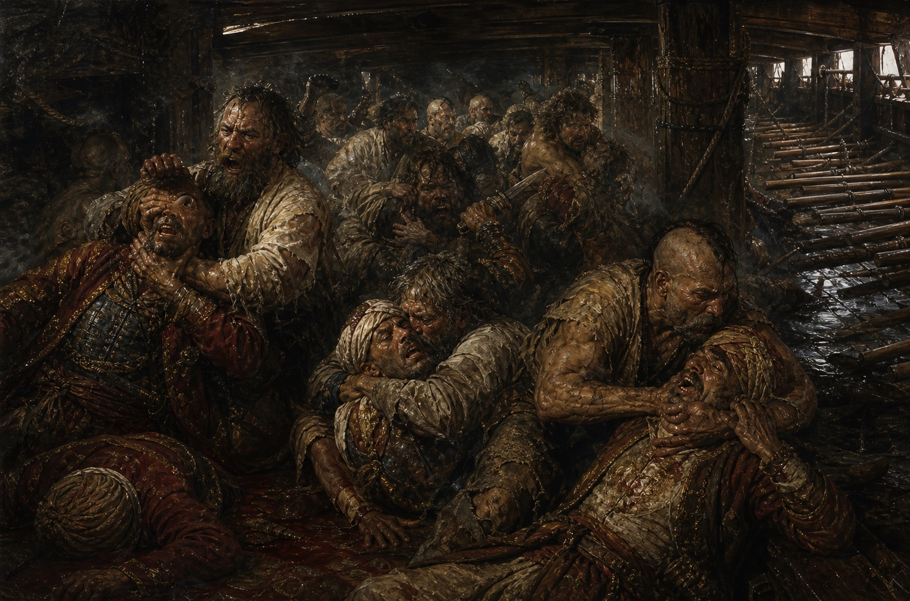

In -495 [[../../../History/Stellar Era|SE]] (1648 old style), the Zaporizhian Cossacks under Bohdan Zynovii Khmelnytskyi carried out a reconquest and retook the historic Rus lands on the right bank of the Borysfen, inflicting dozens of defeats on the armies of the Polish-Lithuanian Commonwealth. Cossack forces were reinforced by new units from liberated lands that had been occupied since the age of principalities. The Zaporizhian Cossacks themselves are direct descendants of the Kozar tribe, also called Khazars. As the Lithuanian principality expanded southward, the Kozars were pushed from their lands around Old Kyiv. In time, the Cossack-Kozars found a safe place beyond the Dnipro rapids, where Lithuanian and Polish troops feared to step. Instead, the Cossacks focused their wars against the Turks of [[../../../History/Old Earth|Old Earth]], especially through frequent campaigns against Tsargrad. To protect their possessions from Cossack sea raids, the Turks resettled several Tatar clans from Astrakhan to Crimea, hoping to stop the Cossacks from freely entering the Black Sea.

In the -550s SE, Dmytro Konashevych Sahaidachnyi was elected kosh otaman. In two campaigns he forced the Tatars into peace, capturing and plundering Kerch and Bakhchysarai. This reopened the path to naval campaigns. Thanks to him, Ottoman expansion along the Don and Kuban rivers was stopped, giving the Zaporizhians a secure rear.

## The Beginning of the End of the Old World

Twenty years later, in the -570s SE, the Ottomans made their last successful attempt to destroy the Cossack center in the floodplains of the Borysfen: the Sich. The Cossacks asked the Commonwealth and Lithuania for help, but were refused. Within half a century, that refusal would play a fatal role in the survival of both states. For the previous century the Cossacks had not touched their old lands on the right bank of the Dnipro, honoring peace agreements with their neighbors, and they remembered this betrayal. A 120,000-strong Ottoman army crossed the Danube and invaded the Wild Field. The Cossacks did not dare fight a direct battle with all armies, so they waged partisan war: mobile mounted detachments constantly prowled around the logistics routes that connected the main Ottoman forces with Danubian Bulgaria. The spring was very dry, leaving little grass for horses and elephants. With great effort the Ottomans reached the Borysfen, and their engineers began building a ferry crossing at the ford near Nova Kakhovka, taking advantage of the low water level in the Dnipro.

The Tatars called by the Turks left Crimea, but kept the peace treaty signed by Sahaidachnyi and Giray III and did not enter Zaporizhian lands. The Cossacks' position became catastrophic when janissary assault detachments crossed to the left Cossack bank and began ravaging Cossack stanitsas and winter settlements. Suddenly news came from the north: two armies, Lithuanian and Commonwealth, were marching to help. This greatly encouraged the Cossacks to keep fighting. Ivan Sulyma's detachments managed to cross to the right bank, fight a large Ottoman-Bulgarian patrol, destroy it completely, and then burn the Turkish crossing.

Sahaidachnyi expected a strike by the combined Polish and Lithuanian forces, so he also ordered the Cossacks to gather at one place on the Donets River so that the three forces could defeat the enormous Ottoman onslaught together. To his surprise, both allied armies crossed at Cherkasy to the left Cossack bank and began ravaging Zaporizhian lands. The Poles and Lithuanians slaughtered whole villages regardless of age or sex. Bohdan Khmelnytskyi's father, Colonel Mykhailo Lavrynovych Khmil, together with his young but already centurion son Bohdan, received Sahaidachnyi's order to stand with several thousand Cossacks as a screen against the Commonwealth forces. Khmelnytskyi's regiment stopped the traitors' advance and bought time for tens of thousands of families to escape east to the Don, beyond Savur-Mohyla.

Seeing enemies pressing from every side and knowing that the Tatars might join the Turks any day, Sahaidachnyi ordered the whole Cossack host and Cossack families to withdraw toward the Don. People gathered belongings and livestock; some even dragged mills with them. The migration was forced, and many did not want to leave their lands, still thinking the enemy might spare them or that they might somehow slip through the disaster. But the situation worsened, as large Polish and Turkish patrols pushed deeper into the steppe and attacked defenseless people.

It seemed that all Zaporizhian Cossackdom was doomed, until help came from an unexpected direction: the troops of the Muscovite prince crossed the border and, taking advantage of Lithuania's lack of forces, captured Smolensk and Vitebsk. The threat to the capital forced the Lithuanians to turn back, greatly easing pressure from the north on the war-torn Zaporizhian lands. The Cossacks gained a brief respite and managed to regroup.

Meanwhile, only a few hundred Cossacks remained in Mykhailo Lavrynovych Khmil's detachment. After confirming that all stanitsas and winter settlements had already been abandoned, they fought their way near Kremenchuk into the Wild Field but fell into an Ottoman trap while crossing the Samara River. In front of Ivan Sulyma, who was coming to help from the right bank, the Turks burst into the Cossack camp, tore apart the wagons and the chains that held them together, and defeated the Cossacks. Mykhailo Lavrynovych and his son Bohdan were captured. That evening Mykhailo was executed through terrible torture: a Turkish elephant stepped on his limbs, slowly crushing muscle and bone until Mykhailo released his spirit without a single cry. Bohdan-Zynovii was to be next; he had already been tied to the platform for execution by elephant. But Ivan Sulyma's artillery finally took position and began shelling the Turks from the right bank. To escape the fire, the Turks hurriedly broke camp and marched back to join their main forces, taking all captured Cossacks with them. That evening Bohdan Khmelnytskyi swore to avenge every wrong done to Zaporizhian land.

Almost all Cossack forces retreated beyond Savur-Mohyla, leaving their homes, fields, and rivers behind. The Poles and Turks spent nearly until winter finishing off the remaining detachments that had failed to withdraw in time. Ivan Sulyma's large detachment fought as far as Perekopsk, where the Tatars treacherously seized them and sold them to the Turks along with all surviving Cossacks.

Having destroyed almost all of the western and central Wild Field, the Turks did not dare go beyond Savur-Mohyla and withdrew to the Danube with the first cold. The Poles built a small fortress on the Kodak River, where it flowed into the Borysfen. From that fortress the Cossack reconquest would begin, lasting two long centuries and ending with a triumphant entry into the lands of the French in the far west.

## From Captivity to the Wild Field

Sahaidachnyi was wounded by an arrow in the neck in one battle and slowly died of sepsis. Only his iron health let him live another year after the wound, holding all Cossackdom together and preventing complete collapse. After his death, other Cossacks were elected otamans, but all ruled for less than a year, trying somehow to gather the scattered Cossacks. Some began returning to ravaged stanitsas and winter settlements, but Tatars and Poles kept garrisons in the old towns and constantly made sure the Cossacks could not return to their lands. It seemed the paradise lands had fallen forever and would never again see their native Cossacks. Yet five years later, the bud of a future superpower space empire, the [[../Hetmanate Federation|Hetmanate Federation]], would bloom here.

Ivan Sulyma, Bohdan-Zynovii Khmelnytskyi, and thousands of other captives were chained to galleys and spent five long years there. Eventually one galley, where Sulyma and Khmil rowed, moored at the estuary in Perekop. Using bad weather and rain, while the guards sat on shore hiding from the downpour, Sulyma knocked the rusted chains from his legs and freed the others. In complete silence, without any signal or flash of fire, three hundred rowers came onto the galley's deck: some Cossacks, some Venetians, some stray Christians from distant Spains. Their only weapons were iron nails and the shackles to which they had been chained for years. First they strangled three Turks sleeping near the strongbox. From there they grabbed whatever weapons they could. Then, one after another, some swimming and some in small dugouts, they reached shore and slaughtered the galley's crew and guards in their sleep. After taking food from a neighboring Tatar village and killing its inhabitants so no one could warn of the escape, they returned to the galley, pushed off, and headed west around half the peninsula, trying to reach the mouth of the Borysfen. Because of the great local holiday Bayram, when everyone was drinking, news of the missing crew and whole galley began to spread only after the Cossack galley struck an unsuspecting Turkish garrison at Zaliznyi Port, which was captured and plundered. Ships in the harbor were dismantled and remade into baidaky, since the large unwieldy galley could not handle the Dnipro. Two days later the Cossacks entered the Borysfen mouth with great spoils, dismantled their own galley, and rowed upstream in fifty baidaky. There they learned that the Poles had built a fortress on the Kodak River where it entered the Borysfen, using it to control all movement along the Dnipro and as a base for their troops. Meanwhile, rumors of the return of two otamans from captivity with several hundred Cossacks and foreigners spread through the rare hidden winter settlements and stanitsas on the left Cossack bank. Ivan Sulyma and Bohdan-Zynovii sent messengers from every place their band landed. Within days, several hundred more Cossacks joined them, having hidden all this time in deep ravines and dark places where Turk and Pole feared to go. It was decided to strike the fortress at once and destroy it, which they did.

## Capture of Kodak

The fortress rarely set a night watch, since for dozens of kilometers around there was not a trace of Cossacks. Suddenly several dozen baidaky appeared on the Borysfen. A favorable wind and the rowers instantly brought hundreds of battle-starved Cossacks to shore, and they began climbing the fortress palisade. Larger baidaky opened fire with cannons and hook guns taken from Turkish galleys. The Germans and Poles quartered in the fort hurried for their weapons, but it was already too late. One Cossack after another climbed over the high fence. Bohdan Zynovii was the first across. With one saber stroke he cut off the hand of a German raising a horn to warn the fortress. With spears, sabers, and pernach maces, the Cossacks forced their way forward. In half an hour it was over. Kodak fell under the blow of Sulyma and young Khmil. The entire garrison of several hundred blades was destroyed to the last man; even the old German captain who commanded the fortress was not spared, though he fought to the end. From Kodak, Khmil kept sending messengers in every direction.

The rumor became prophecy. It captured people's minds and, faster than fire across the steppe during a storm, reached Savur-Mohyla and Kyiv. Cossackdom, which had lived miserably between the Don and Savur-Mohyla, at last heard that its former leaders had escaped captivity and come to free them too. Within a month, thousands of Cossacks and their families began returning to their old homes. Some stood burned; others had fared better, their huts waiting as if they knew no one but Cossacks needed them. Polish forces in the region had been left only to terrorize isolated Cossacks and prevent them from settling or joining into large bands. After Kodak fell, the main base disappeared, and now the Cossacks hunted every invader and foreigner. Because of their betrayal, Poles were shown no mercy. Captives were punished by water: a loop was hung from a long pole, the filthy Polish head was pushed through, and the captive was led like on a lasso to the nearest river. They were shoved into the water and held down with the pole to the bottom. When they stopped twitching, the loop was untied and the next one put in. When asked why not simply cut their throats, the answer was simple: the holy land of the Wild Field had to stay clean, without the taste of invader or Pole. The much fewer Turks were taken captive for ransom.

Other Ukrainian-Cossacks living under the Commonwealth during the five years after the Sich was driven from the southern lands suffered mercilessly under Polish domination, with no one left to protect them. Feeling complete impunity, the Poles inflicted every kind of extortion and misery on Ukrainians-Rusyns. News that the Cossacks had returned beyond the rapids rose like a fiery typhoon and lifted the whole people against the occupiers. Kaniv, Cherkasy, Poltava, Kyiv: all the people rose against the Poles and beat them without mercy. Some roads were piled with Polish bodies as they tried to flee, but popular wrath found them behind every dam and around every bend in the forest.

The news of Cossack return and the expulsion of Polish forces from Ukraine and the Wild Field caught the Commonwealth army unprepared. The Muscovite prince, after taking Smolensk and Vitebsk, continued expanding westward and began threatening Vilnius. The Poles gathered an army to help the Lithuanians, and that army became bogged down for a long time in swamps and dark forests. The Commonwealth had nothing to send against the Cossacks except the private military companies of local oligarchs to whom former Cossack and Ukrainian lands had once been granted.

## Campaign to Crimea
