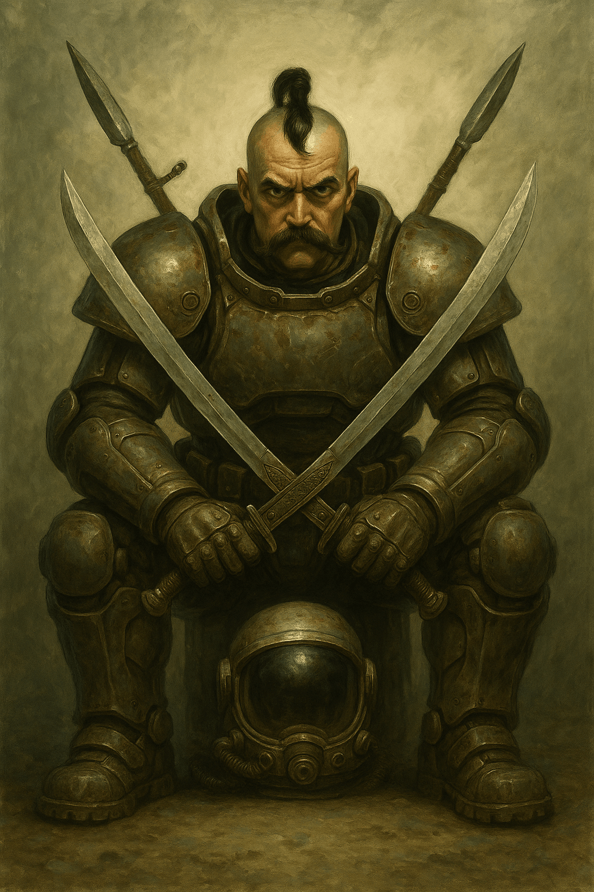

A Terminator is a super-heavy space assault trooper. The name comes from the equivalent infantry type in the [[../../Corporate Republic/Corporate Republic|Corporate Republic]] and means "one who destroys, one who kills."

Every Terminator has a heavy outer armored spacesuit that allows combat in open space, on airless bodies, and during boarding actions against other spacecraft.

Controlling a Terminator suit requires great strength, skill, and long training. Inside it, every Cossack sits in a personal spacesuit that protects him from depressurization, extreme temperatures, and vacuum if the main outer suit is breached.

## Terminator Specializations

There are several Terminator specializations.

### Bohatyrs

The bravest are trained for assault operations with "cold" weapons: their own sabers, spears, shields, and short plasma muskets. They lead groups of less armored Serdiuks or Haiduks. They also take part in spacecraft boardings and assaults on space, lunar, and asteroid fortresses. They are often used to screen their brothers-in-arms, the Rifleman-Terminators, from sudden hand-to-hand combat.

The name comes from the mythical warriors of the pre-Cossack age on [[../../../History/Old Earth|Old Earth]].

Analogues elsewhere: [[../../Empire of the Sun/Military Affairs/Samanaki|Samanaki]] in the [[../../Empire of the Sun/Empire of the Sun|Empire of the Sun]].

### Riflemen

The most common type of Terminator. They mainly use long-range personal laser firearms. Their only cold weapon is a power or plasma saber. They fight by covering the furious charges of the Bohatyrs. Such Terminator detachments can also operate heavy infantry systems such as machine guns, mortars, and plasma cannons.

