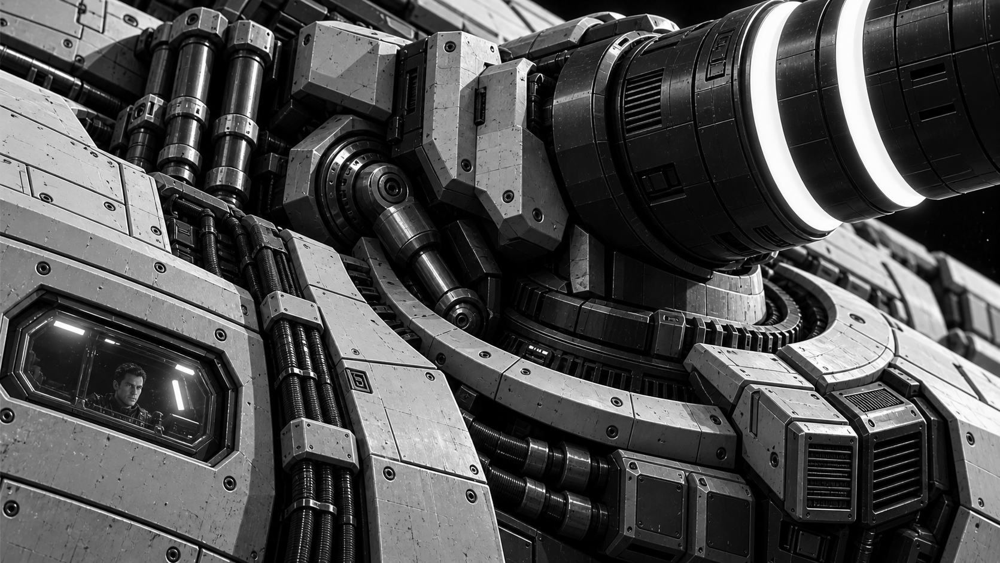
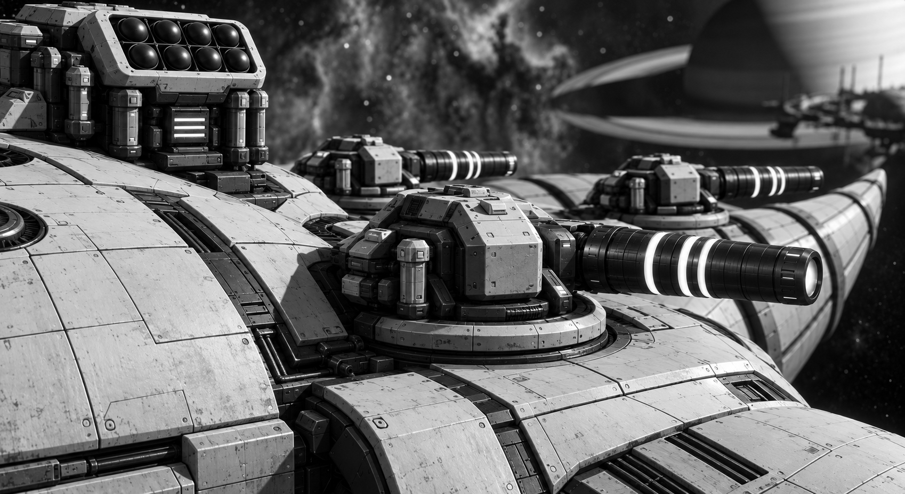
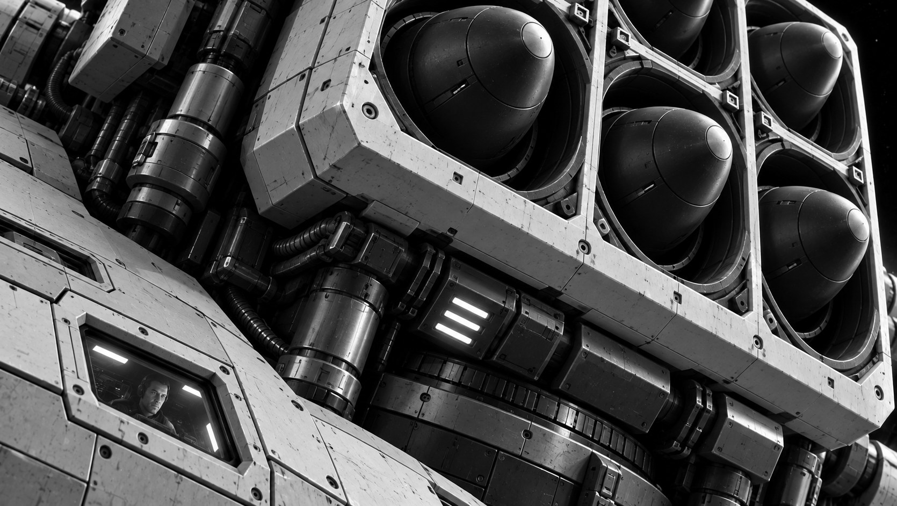
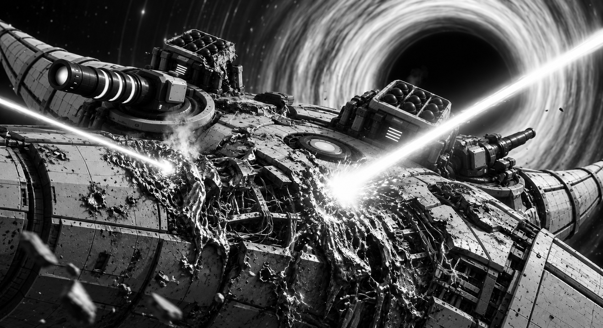

# Tavr-Class Combat Ship

*A lone Tavr showing its horned silhouette, armored hull, and heavy gun mounts.*

**"Tavr"** — the main combat ship of the Hetmanate Space Fleet. It is ships of this class that form the backbone of any strike squadron and carry out the majority of combat tasks in open space and in the orbits of planets, moons, and space stations. They combine high firepower, strong armor, and sufficient autonomy for prolonged combat campaigns.

Unlike light interceptors, which rely on speed, the "Tavr" is built for waging protracted space battles. Its multi-layered armor, reinforced structural frame, and redundant life-support systems allow the ship to withstand numerous hits while remaining combat-capable even after serious damage.

The primary tactic of the "Tavr" is long-range combat. Thanks to powerful sensor suites, it is capable of detecting an enemy at hundreds of thousands of kilometers, opening fire long before entering close range. Within a squadron, Tavr-class ships form the main line of the fleet, gradually destroying enemy ships with concentrated fire.

*A Tavr in deep space: high endurance and powerful sensor arrays allow for prolonged combat patrols far beyond friendly bases.*

## Armament

- **Four to sixteen "[[Ship Weapons/SHYLO Laser System|SHYLO]]" laser mounts.** They are the main striking force of the ship and are designed to penetrate the armor of cruisers, battleships, and orbital fortifications. Depending on the ship's modification, the mounts can operate independently or be combined into a single battery, concentrating their emission on a single point of the enemy hull. Such a salvo is capable of burning through several meters of composite armor within seconds and reaching the ship's internal systems.

- **A battery of "[[Ship Weapons/Shylo-M Laser System|Shylo-M]]" laser mounts.** Used to combat fighters, interceptors, torpedoes, and missiles. If necessary, they can also engage larger ships, disabling sensors, engines, and external equipment.

- **Guided space torpedoes.** Employed against particularly hardened targets or to finish an attack after lasers have weakened the enemy's armor.

## Defense

*A detail of the Tavr’s hull: a pilot behind a small armored viewport reveals the scale of the ship and its composite armor plating.*

The "Tavr's" armor consists of multi-layered composite plates, between which thermal insulation and damping layers are placed. This construction effectively resists both laser radiation and kinetic impacts from debris or torpedoes.

The most critical systems — the reactor, command center, energy storage units, and control systems — are situated deep within the hull and protected by separate armored capsules. Even after the loss of individual compartments, the ship can continue to carry out its combat mission.

## Combat Employment

*Damaged Tavr armor and a pilot behind a protected viewport: the ship retains combat readiness even after heavy breaches.*

"Tavrs" rarely operate alone. They are usually combined into battle lines, where dozens of ships concentrate the fire of their "Shylo" mounts on a single target. Such tactics allow even the armor of the heaviest enemy ships to be breached in a short time.

During an offensive, "Tavrs" are covered by squadrons of [[Sokil|"Sokil"]] interceptors, which destroy enemy fighters and torpedoes. The "Tavrs" themselves duel against large ships, leveraging their advantage in laser firepower and armor strength.

It is the Tavr-class ships that have become the symbol of the military might of the [[../../Hetmanate Federation|Hetmanate]]. Their appearance in a planet's orbit usually means that diplomacy has ended and war is beginning.

*A Tavr taking heavy laser damage during a protracted engagement while holding the line.*

Among fleet officers, it is said:

> **"As long as the 'Tavrs' hold the line — the Hetmanate holds the cosmos."**
