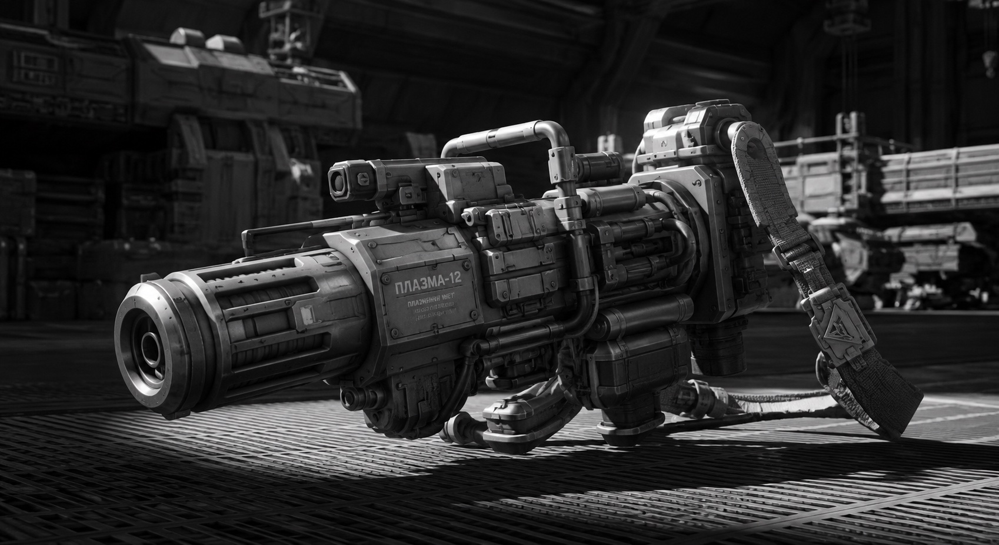
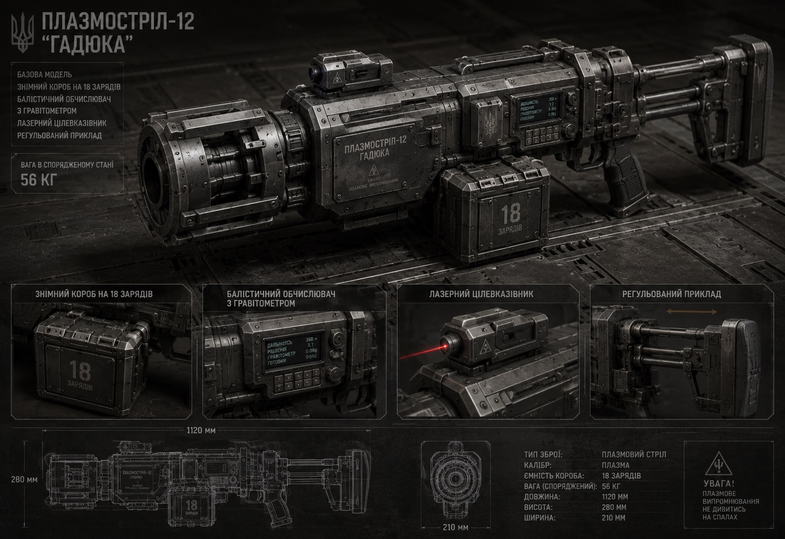
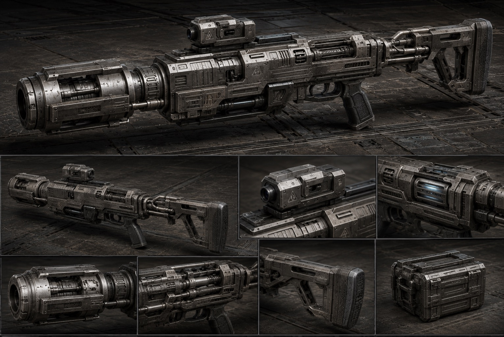
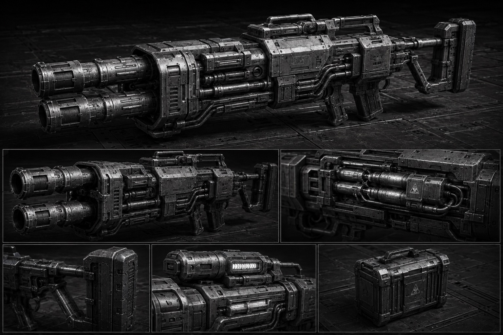
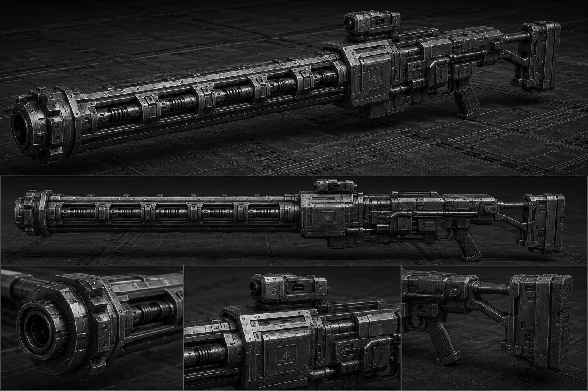

The heavy infantry plasma gun is one of the few heavy weapons that [[../Military Affairs/Terminator|Terminators]] are permitted to carry. Unlike the lightweight [[Short Plasma Handgun|short handgun]], this is a full-fledged assault support weapon, built for sustained engagements against heavy targets.

The plasma gun draws power from a backpack energy block or directly from the reactor of a combat exoskeleton. Each shot is formed inside the generation chamber, where the working gas is instantly converted into plasma, compressed by magnetic coils into a compact clot, and ejected at a velocity of several kilometers per second. At the muzzle, you hear the characteristic crack of superconducting coils — a sound that no one on the battlefield mistakes for anything else.

A hit from a heavy plasma charge is not just a thermal burn. Along with the temperature that instantly reaches the melting point of armor, the charge carries significant kinetic impulse. The enemy's armor doesn't simply burn through — it suffers thermal shock, cracks, and deforms. Internal mechanisms and crew can be knocked out even without full penetration. Light vehicles and infantry in exoskeletons are guaranteed to be destroyed in one or two hits.

Like any [[../../../Technologies/General Weapons/Plasma|plasma weapon]], the plasma gun is most effective at short and medium ranges. In atmosphere, the plasma clot gradually cools, so penetration capability drops at long distances. In vacuum, by contrast, the charge flies without losses — which is why the plasma gun is especially valued during boarding actions and combat on airless surfaces.

Rate of fire is limited by the cooling system. Most of the shot's energy converts into heat, which must be conducted away from the generation chamber and magnetic coils. After a series of five to six shots, the automation blocks the trigger and initiates a forced cooling cycle. Experienced gunners know this rhythm and can squeeze the maximum out of the weapon by alternating short bursts with pauses. In a critical situation, you can disable the safety and keep firing — but then you risk melting the barrel along with your hands.

## Modifications

### Plasma Gun-12 "Gadyuka" (Viper)

The base model. Features a detachable box for eighteen charges, a built-in ballistic computer with gravitometer, and a laser designator. The stock adjusts for an operator in or out of an exoskeleton. Weight in combat configuration is fifty-six kilograms, so without augmentation you're not carrying it anywhere.

### Plasma Gun-12S "Gurza"

A modernized version for [[../Military Affairs/Serdiuks|Serdiuks]]. Weight reduced to twenty-nine kilograms through the use of lightweight composite materials. Improved cooling system — allows up to ten consecutive shots without lockout. The trade-off is reduced charge mass: penetration is slightly lower, but it's more than enough for most targets.

### Plasma Gun-12Sh "Shershen" (Hornet)

An assault modification with two parallel generation chambers. Can fire two-round bursts — the first round heats and weakens the armor, while the second punches through the already-softened metal. Consumes twice the energy, so it's typically connected directly to a [[../Military Affairs/Terminator|Terminator]]'s reactor. Due to increased heat output, it requires specialized power armor with enhanced thermal protection on the operator's arms and thighs for better heat dissipation. In critical situations, it can be used without the specialized suit protection, but no more than two or three times.

### Plasma Gun-12D "Dzhmil" (Bumblebee)

A long-range variant. Sacrifices charge mass for better stabilization of the plasma clot in flight. Features an extended barrel with an additional row of magnetic coils that hold the clot together longer, delaying dispersion. Effective range in atmosphere is up to sixteen hundred meters — nearly three times that of the base model. The favorite weapon of plasma sniper-gunners, although being a sniper with plasma is no easy task: after the very first shot, everyone knows where you are.

## Combat Employment
Among [[../Military Affairs/Serdiuks|Serdiuks]], the plasma gun is the primary heavy weapon of the squad — typically one per six to eight troopers. [[../Military Affairs/Terminator|Terminators]] often take it as a secondary weapon, keeping their hands free for a [[Combat Hammer|hammer]] or [[Javelin Spear|spear]]. In formation, the plasma gunner is always under cover: while he fires, his brothers-in-arms hold the flanks. Because the plasma flash is visible from afar, and enemy [[../../../Technologies/General Weapons/Melta|melta]] or snipers always hunt him first.
