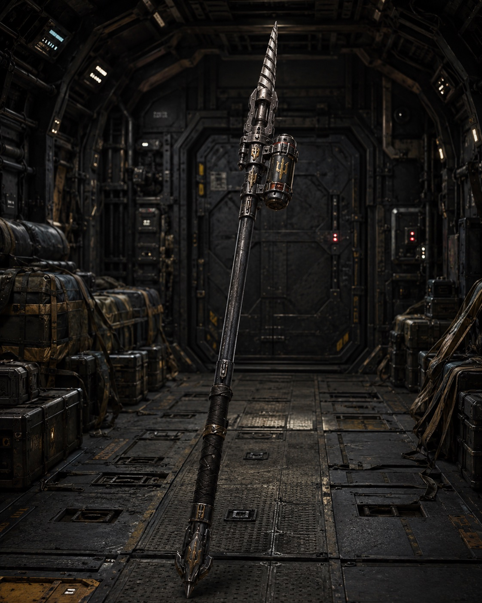

The javelin spear is widely used by [[../Military Affairs/Terminator|Terminators]], both [[../Military Affairs/Serdiuks|Serdiuks]] and [[../Military Affairs/Haiduks|Haiduks]]. It is well suited for close combat in combination with a shield.

The advantage of the javelin over simple spears is its head, onto which various standard infantry or anti-tank mines can be mounted and thrown at the enemy. When used as a simple cold weapon, the spearhead has a drill-like tip powered by a small built-in motor. If the spear sinks even slightly into enemy armor or flesh, the Terminator can activate the motor with a button and drill deeper into the armor. The battery-powered motor does not last long, but if the drilling succeeds it practically guarantees complete damage to the target, boring through 15-20 centimeters of standard space-armor plating.

## Use in Ranged Combat

The javelin can be thrown like an ordinary spear after its drill has been switched on. This tactic is used to damage or depressurize lightly armored transport or an enemy in a heavy protective suit.

Various melt-mines can also be attached to the spear. One of the most common is the [[Antipersonnel Mine 15 (AP-15)|AP-15]]. A Terminator can throw the javelin several dozen meters away and strike an enemy hiding behind a breastwork or some other cover. Thanks to its ballistic flight path, it hits the head, shoulders, or upper protective plates of vehicles, which are usually thinner. The AP-15 detonates on impact and scatters melt-substance in all directions, effectively burning out a circle up to twenty meters in radius.
