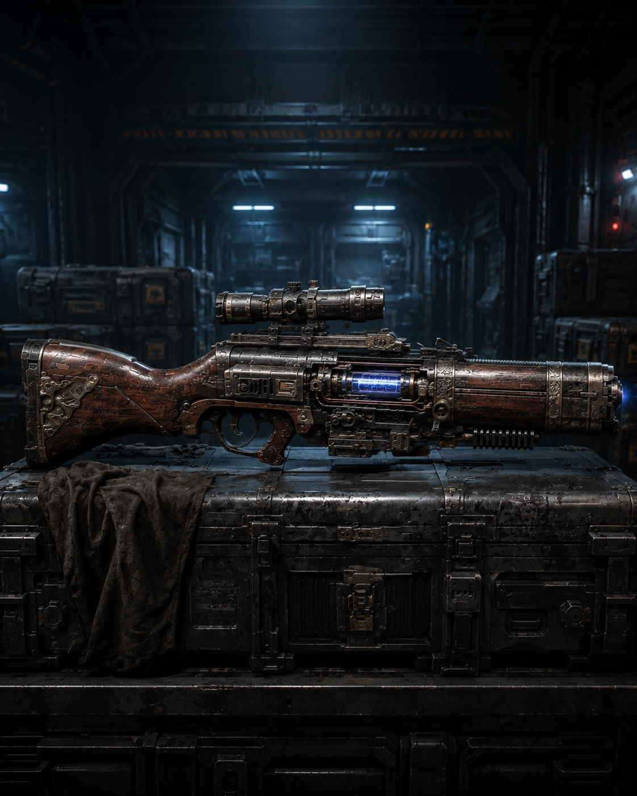

The short handgun is used as a secondary weapon by [[../Military Affairs/Terminator|Terminator]]-[[../Military Affairs/Serdiuks|Serdiuks]] and [[../Military Affairs/Haiduks|Haiduks]]. It fires pieces of plasma weighing up to 20-50 grams. They do not travel far, but they can burn through power armor and destroy a biological target.

There are different variations of this weapon. Since it is a Terminator's personal weapon, each one usually decorates it in his own way.

# Modifications

## Single-Shot Short Handgun

Extremely powerful in close combat. It fires the entire plasma charge from the flask in one shot. Because of the large mass of plasma fired, it must be reloaded every time. It is a favorite weapon of hand-to-hand Terminators.

