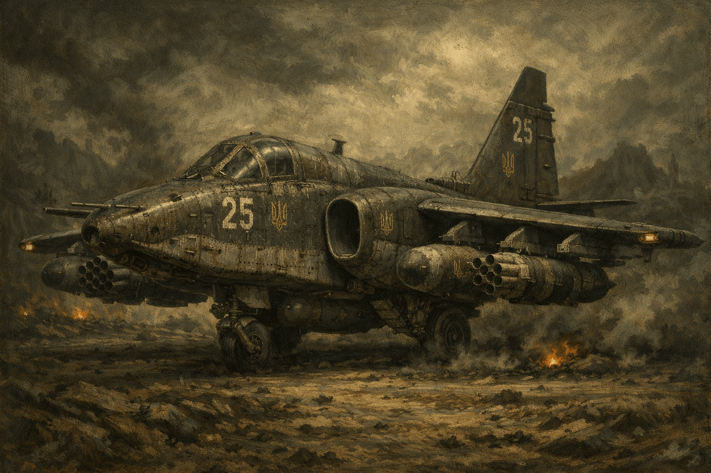

Among the oldest aircraft known to humanity. They can fly only within an atmosphere at different altitudes, depending on the density and composition of a planet's air. They are used for short flights of 1,000-2,000 kilometers. There are both civilian and military flyers. They are widely used to support the actions of ground invasion or defense forces.

