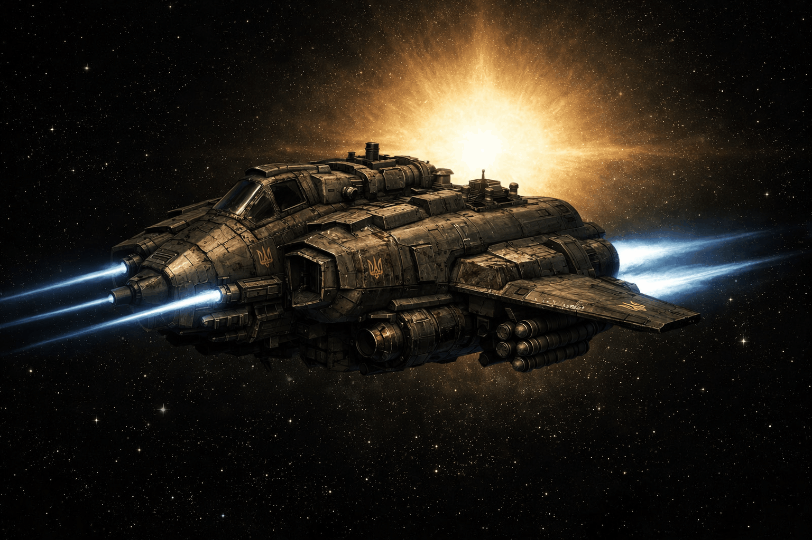

Unlike [[Atmospheric Flyers|atmospheric aviation]], orbital aviation can launch from a planet's surface and reach that same planet's orbit. It is used to secure planetary approaches and rapidly deploy weapons and troops from one side of a planet to another. It cannot make interplanetary transitions.

