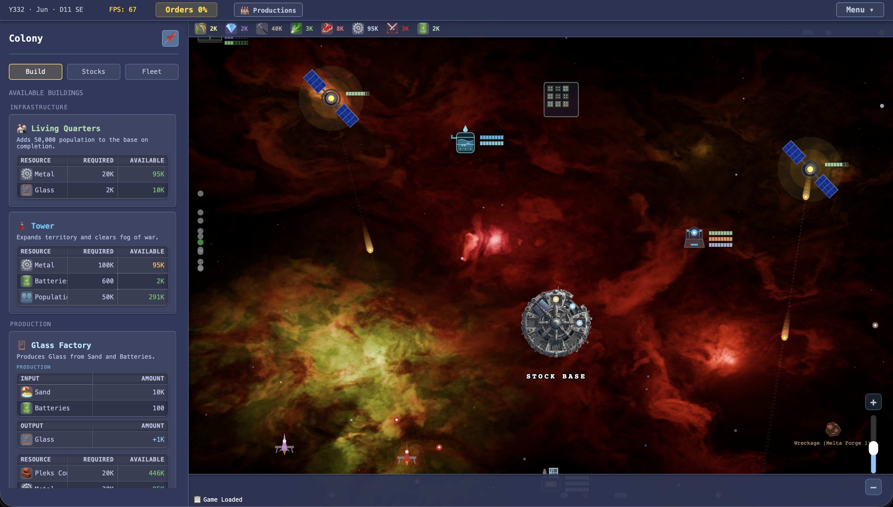
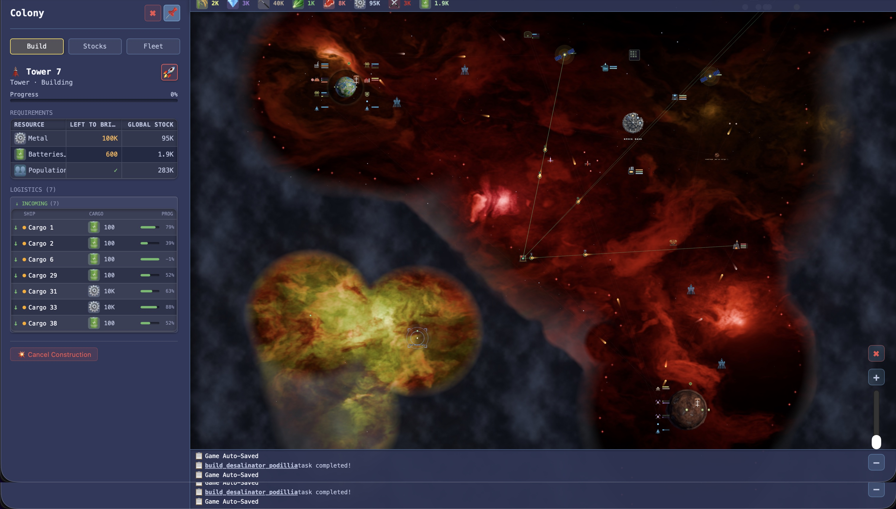

**Loca Deserta: Settlers** (Космічне Чумацтво) — космічна економічна стратегія-будівник, натхненна *The Settlers III* та *The Settlers IV*, що розгортається у всесвіті Loca Deserta.

- 🌐 [Грати у браузері](http://settlers.locadeserta.com/)
- ⬇️ [Завантажити збірки (Windows / macOS / Linux)](https://github.com/gladimdim/LocaDeserta_Settlers/releases)

Гравець керує Варп-Базою в незаселеній зоряній системі: видобуває ресурси, будує виробничі ланцюги, розширює територію Вежами та колонізує планети — назви яких відсилають до реальних українських місць (Поділля, Жовті Води, Кривбас). Назва гри — данина чумакам, українським купцям-візникам, які возили сіль та товари волами через степ; тут вони стали зорельотними перевізниками.

