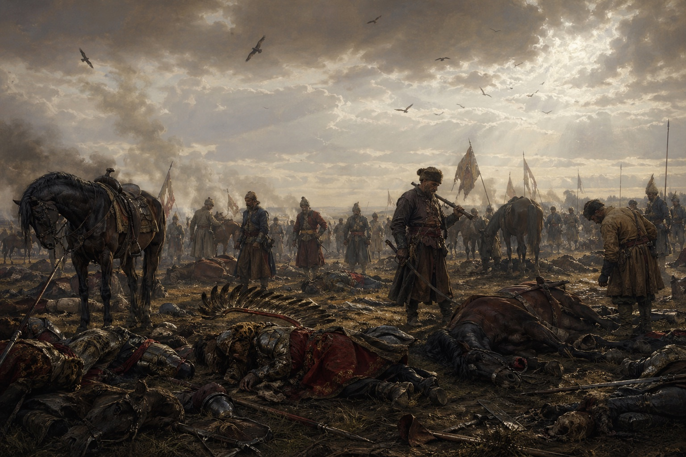
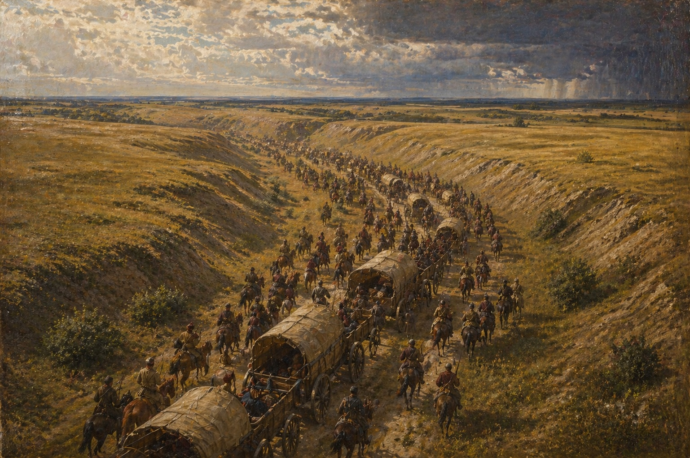
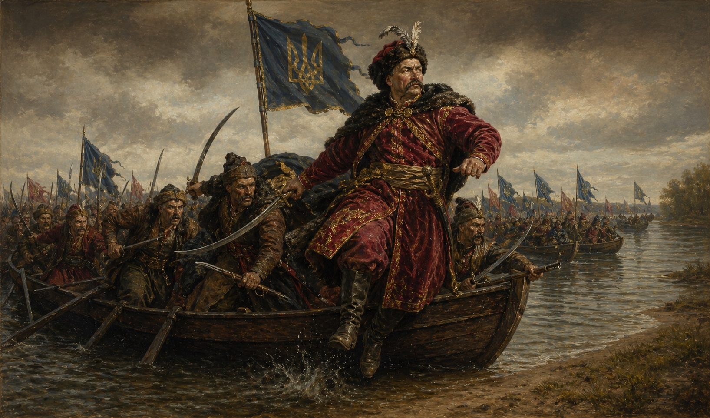

В -495 році [[../../../Історія/Зоряна Ера|Зоряної Ери]] (1648 році за старим стилем) запорожські козаки під очільництвом Богдана Зиновія Хмельницького здійснили реконкісту і відбили історичні руські землі на правому березі Борисфену, завдавши декілька десятків поразок військам Речі Посполитої. Війська козаків поповнювалися новими підрозділами з деокупованих земель, які були захоплені ще за часів князівств. Самі запорожські козаки є прямими нащадками племені козар або як їх ще називали хозар. Через експанісію литовського князівства на південь козар видавили з їх земель навколо Старого Києва та з часом козаки-козари знайшли спокійне місце за дніпровськими порогами, куди боялися ступати литовські та польські війська. Натомість козаки сфокусуввли свої військові дії проти турків Старої Землі, а саме здійснювали часті походи на Царград. Для захисту своїх володінь від морських атак козаків турки переселили декілька родів татар з Астрахані до Криму, щоб не дати можливості козакам вільно виходити в акваторію Чорного Моря.

Але в -550ті роки зе, кошовим був обраний Дмитро Конашевич Сагайдачний, який двома походами примучив татар до миру, захопивши та пограбувавши їх два міста - Керч та Бахчисарай. Це відкрило знову вільний шлях до морських військових походів. Завдяки йому експанія османів по річці Дон та Кубань була зупинена, що дало безпечний тил для запорожців.  

## Початок Кінця Старого Світу

За двадцять років в -570ті роки зе османи здійснили останню вдалу спробу знищити осередок козаків в плавнях Борисфену — Січ. Козаки просили про допомогу Річ Посполиту та Литву, але отримали відмову. В подальшому це зіграє фатальну роль в існуванні цих двох держав всього через пів століття. Козаки, які останнє століття не чіпали свої старі землі на правому березі Дніпра шануючи мирні угоди з сусідами закарбували це собі в памяті. Сто двадцяти тисячне військо турків-османів перейшло Дунай та вторглося в землі Дикого Поля. Козаки не наважувались на пряму велику битву всіма арміями, тому здійснювали партизанську війну - мобільні загони козаків на конях постійно рискали навколо логістичних шляхів, що з'єднували основні сили із дунайською болгарією. Та весна випала дуже сухою, тому трави для коней та слонів було обмаль, османи з великими зусиллями дійшли до Борисфену і їх інженери стали ладнати паромну переправу над бродом в Новій Каховці скориставшись низьким рівнем води в Дніпрі. 

Татари, яких турки викликали в цей похід, вийшли з-за меж Криму, але дотримались мирної угоди, яку заключив Сагайдачний та Герей ІІІ, і не вступали на землі запорожців. Становище запорожців стало катастрофічним, коли ударні загони яничар переправились на лівий Козацький берег та почали плюндрувати станиці та зимовники козаків. Раптом з півночі прийшла звістка: дві армії, литовська та речі посполитої ідуть на допомогу. Для козаків це стало великим стимулом продовжувати боротьбу. Загони Івана Сулими змогли переправитись на правий берег, дати бій великому роз'їзду османів та болгарів, розбити його вщент, а потім спалити переправу турок. 

Сагайдачний тим часом очікував на удар спільних сил поляків та литовців, тому теж наказав козакам збиратися в одному місці на річці Донець, щоб втрьох розбити величезну навалу турок-османів. На його подив, обидві союзні армії переправились в Черкасах на лівий козацький берег та почали плюндрувати землі запорожців. Поляки з литовцями вирізали цілі селища, незважаючи на вік та стать. Батько Богдана Хмельницького, полковник Михайло Лавринович Хміль разом із своїм ще молодим, але уже сотником, сином Богданом отримав наказ від Сагайдачного разом із декільками тисячами козаків стати заслоном проти військ Речі Посполитої. Полк Хмельницького зміг зупинити просування зрадників та дав час на порятунок десятків тисяч сімей, що змогли вийти з-під удару і перейти аж до Дону на виселки за Савур Могилу.

Сагайдачний, бачучи що ворог суне з усіх сторін і з дня-на-день татари теж перейдуть на сторону турка, дав наказ на вихід всього війська козацького та козацьких сімей до Дону. Люди збирали свої пожитки, господарство, деякі тягли навіть млини за собою. Переселення було примусове, багато хто не хотів уходити зі своїх земель, все ще думаючи, що ворог їх пожаліє і вони якось пропетляють цю навалу. Але ситуація з часом ставала все гіршою, великі розʼїзди поляків та турків все глибше заходили вглиб степу і нападали на беззахисних людей. 

Здавалось, що все запорожське козацтво приречене, як підмога прийшла звідки не чекали - війська московського князя перейшли кордон і скориставшись відсутністю сил в Литві захопили Смоленськ та Вітебськ. Загроза захоплення столиці змусила литовців повернути назад, що значно зменшило тиск з півночі на роздерті війною землі запорожців. Козаки отримали невеликий передих і змогли зібратися до купи.

Тим часом у загоні Михайла Лавриновича Хміля залишалося лише декілька сотень козаків. Вони, переконавшись, що всі станиці та зимовники уже полишені, прорвалися з боєм під Кременчугом до Дикого Поля, але потрапили у пастку до османів під час переправи річки Самари. На очах у Івана Сулими, який ішов на допомогу з правого берега, турки вдерлись до табору козаків, розірвали їх вози та ланцюги, якими вони були зкріплені, та розбили козаків. Ватажка Михайла Лавриновича та його сина Богдана було взято в полон. В той же вечір Михайла стратили через страшні муки - турецький слон наступав на його кінцівки, по-тихеньку роздрібнюючи мязи та кістки, аж поки Михайло не відпустив свій дух, не промовивши жодного зойку. Наступним мав бути і сам Богдан-Зиновій, його уже навіть привязали до помосту для страти слоном, але артилерія Івана Сулими нарешті виставила свої позиції і почала обстріл турків з правого берега. Щоб уйти з-під удару, турки поспіхом знялись з місця битви та пішли назад на возз'єднання із основними своїми силами, ведучи за собою всіх наловлених козаків-бранців. В цей вечір Богдан Хмельницький дав клятву помститися всім кривдникам землі запорожської. 

Майже всі сили козаків відступили за Савур Могилу, залишаючи рідні домівки, лани та річки. Поляки разом з турками майже до самої зими добивали рештки загонів козаків, які не змогли відійти вчасно за Савур Могилу. Великий загін же Івана Сулими зміг пробитися з боями до самого Перекопська, де був підступно схоплений татарами та проданий до турків разом з усіма козаками, що ще залишалися живими.

Турки, знищивши майже все західне та центральне Дике Поле, не наважились ідти далі за Савур Могилу і з першими холодами пішли назад до Дунаю. Поляки поставили свою фортечку на річці Кодак, яка впадала в Борисфен. Саме з цієї фортеці і почнеться реконкіста козаків, яка продовжиться довге два століття і завершиться тріумфальним входженням до земель французів на далекому заході.

## Із полону в Дике Поле

Сагайдачний в одній з битв був поранений стрілою в шию і по-тихеньку помирав від сепсису. Лише завдяки своєму тавровому здоров'ю він зміг ще рік прожити після поранення, не даючи повністю занепасти всьому козацтву і тримаючи все на собі. Після смерті отаманами були вибрані різні інші козаки, але всі вони головували менше року, намагаючись хоч якось зібрати до купи всіх розпорошених козаків. Деякі почали повертатися в сплюндровані станиці та зимовники, але татари з поляками тримали гарнізони в старих містечках та постійно контролювали, щоб козаки не змогли повернутися до своїх земель. Здавалось, що все, райські землі занепали та ніколи не побачать своїх рідних козаків, але за п'ять років саме тут розквітне бутон майбутньої надмогутньої космічної імперії - [[../Федерація Гетьманату|Федерації Гетьманату]].

Іван Сулима, Богдан-Зиновій Хмельницький та тисячі інших полонених були заковані на галери і провели там довгі п'ять років. Аж поки одна з галер, де гріб Сулима із Хмілем не пристала до лиману в Перекопі. Скориставшись поганою погодою та дощем, коли варта сиділа на березі і ховалась від дощу, Сулима зміг збити проржавілі ланцюги з ніг та звільнив інших. В повній тиші, не подаючи жодного сигналу чи проблеску вогню, триста гребців, хто був козаком, хто венеціанцем, хто просто випадковим християнином з далеких Іспаній, всі гребці вийшли на палубу галери, із зброєнь мали лише власні залізні цвяху та окови, до яких були прикуті роками. Першими задушили трьох турків, які спали біля скарбнички. Звідти взяли деяку зброю, хто яку встиг схопити. Потім, один за одним хто вплав самотужки, хто сівши на маленькі довбанки, дісталися берегу і так само зарізали у ві сні весь екіпаж та охорону галери. Набравши харчів в сусідньому татарському селі, попередньо убивши всіх їх жителів, щоб не сповістили нікого про втечу, повернулись на галеру, відійшли від берегу та рушили на захід, оминаючи пів острів і намагаючись дістатися до гирла Борисфену. Через велике місцеве свято кайрам-байрам, коли всі пиячили, звістка про пропажу екіпажу і цілої галери почала ширитись лише коли козацька галера налетіла на нічого не розуміючу турецьку залогу в Залізному Порту, який був захоплений та розграбований. Кораблі, що стояли в порту, розібрали та перербили на байдаки, бо велика і не віртка галера не могла вправно ходити Дніпром. Через два дні козаки з великою здобиччю увійшли в гирло Борисфену, де розібрали і свою галеру та на пів сотні байдаків пішли вверх на веслах. Там козаки дізналися, що на річці Кодак, прямо де вона впадає в Борисфен, ляхи поставили фортецю і звідти контролюють всі пересування Дніпром, а також використовують земляну фортецю як базу для своїх військ. Тим часом, чутки про повернення двох отаманів із неволі разом із декількома сотнями козаків та іноземців почали ширитися по рідким прихованим зимовникам та станицям на лівому козацькому березі Дніпра. Іван Сулима та Богдан-Зиновій почали розсилати своїх гонців з тих місць, де приставала їх ватага. За декілька днів до них пристало ще декілька сотень козаків, які весь цей час переховувалися в глибоких балках та темних місцях, куди турок з ляхом боялися заходити. Було вирішено тут же з ходу наскочити на фортецю та зруйнувати її, що і було зроблено.

## Захоплення Кодаку

Варта на фортеці рідко ставилася на ніч, адже в радіусі десятків кілометрів від фортеці і духу не було козаків. Як зненацька на Борисфені з'явилися кілька десятків байдаків. Попутний вітер разом із веслярами миттю приніс сотні зголоднілих до битви козаків, що висипались на берег та почали дертися на палісадник фортеці. З байдаків побільше заговорили гармати з гаківницями, які зняли з турецьких галер. Німота з ляхами, що була розквартирована в укріплені поспіхом взялася за зброю, але було уже пізно. Один за одним через високий паркан перелазив козак. Першим через паркан перескочив Богдан Зиновій. Одним ударом шаблі він відсік руку німцю, який підняв сурму, щоб сповістити про напад всю фортецю. Списом, шаблею та пірначем козаки пробивали собі шлях вперед. За пів години все було закінчено. Кодак пав під ударом Сулими з Хмілем молодшим. Вся залога в кількасот шабель була повністю вибита до останнього, не пожаліли навіть коменданта фортеці, старого німецького капітана, який бився до останнього. З Кодаку Хміль продовжив розсилати гонців в усі сторони.  

Ця чутка була як пророцтво, захопила голови людей та швидше за вогонь в степу під час грози дійшла до Савур-Могили та до Києва. Козацтво, що злидено жило між Доном та Савур Могилою, як якісь брудні цигани, нарешті почуло, що їхні колишні ватажки врятувалися з неволі та прийшли визволяти і їх. Всього за місяць тисячі козаків разом із сім'ями стали вертатися в свої старі домівки. Деякі стояли спаленими, іншим повезло більше - їх куренькі так і чекали на них, немов розуміючи, що нікому крім козаків вони тут і не потрібні. Ляших сил в регіоні було залишено лише щоб кошмарити окремих козаків, та не давати їм заселитися чи об'єднатися у великі ватаги. Але після падіння Кодаку, головна база зникла і тепер уже козаки вийшли на полювання на всіх басурман та іноземців. Ляхів, через їх зраду, не жаліли нікого. Всіх, хто попадав в полон, карали водою - на довгій палці вішали петлю, туди продівали брудну ляшу макітру та як на аркані вели до найближчої річки. Заштовхували у воду і опускали під палку до дня. Коли переставав смикаться - розв'язували петлю і засовували туди наступного. З повір'я, чому б просто не перерізати горлянку, відповідали просто - свята земля Дикого Поля має бути чистою, без присмаку басурман чи ляха. Турків же, яких було набагато менше, брали в полон для отримання викупу.

Інші ж українці-козаки, що мешкали під підданством Речі Посполитої останні пять років, як було вибито Січ з південних земель, нещадно потерпало під засиллям поляків, адже нікому не було захистити уже їх. А лях, відчувши повну безкарність творив всіляки здирства та злидні українцям-русинам. Звістка ж про повернення козаків за пороги як вогняний тайфун підняла весь народ проти окупантів. Канів, Черкаси, Полтава, Київ - весь люд піднявся проти ляхів та почав їх нещадно бити. Деякі дороги були завалені трупом ляхів, які намагалися втікти, але народний гнів знаходив їх за кожною греблею, за кожним поворотом в ліс. 

Звістка про повернення козацтва та вигнання польських сил з України та Дикого Поля застала військо Речі Посполитої без штанів. Московський князь, захопивши Смоленськ та Вітебськ, продовжив експансію на захід та почав загрожувати уже Вільнюсу. На допомогу литовцях поляки зібрали військо, яке і застрягло надовго в тих болотах та темних лісах. Річ Посполита не мала що виставити проти козаків, крім приватних військових компаній місцевих олігархів, яким роздали колись козацькі та українські землі.

## Похід на Україну

Все більше козаків поверталось разом із родинами в свої домівки. Кожен допомогав як міг оселитися, підлатати старі похилені курені та мазанки. Відбувся неймовірний стрибок бойового духу. Кожен жадав помсти за  образи та зраду. Козацька рада відбулась в Кодацькій фортеці. Кошовим отаманам було вибрано Богдана Зиновія Хмельницького. Іван Сулима отримав три новосформовані полки та одразу ж відправився до України, організовувати козацтво та вчити нових джур зі старих земель Русі. Також місцеві магнати уже збирали своє військо під Києвом і планували розбити козаків, поки основні війська Речі Посполитої вешталися в болотах Литви.

На цей раз козаки змінили тактику, замість суто військової операції вони захоплювали землі, містечка, вибивали ляхів та литовців, натомість тут же на раді вибирали козацьку старшину із місцевих українців-русинів, покозачували їх. Всі присягалися служити Січі, звільнялися від будь-яких поборів від інших магнатів, отримували назад свою відібрану землю. Всі, хто приєднався до козацтва, отримували рівні права та можливості. 

Під Полтаву Іван Сулима підійшов уже з п'ятнадцяти тисячним військом. Обороною керував охочий козак Іван Богун, якого найняли магнати охороняти кордон від турків та татар. Січове військо підійшло під мури фортеці. Деякі оборонці зі стін почали пізнавати своїх родичів, які уже покозачились. Багато з оборонців були колишніми козаками, який доля занесла подалі від Дикого Поля. Іван Сулима без збройно підійшов під мур, та став закликати жителів покозачитись та не чинити опору. 
"Нам немає що ділити чи за щось убивати одне одного. Я козак, ви - українці. Але чи не всі ми походимо від одного племені? Хіба не наші прадіди разом боронили хозарські землі? Хіба не нас всіх разом обманом було вигнано з Руськіх земель? Чи не ваші предки так само, як і мої тікали від кривди подалі від ляха та литвина? Молимося одному богу, балакаємо одну мову. Однакові кривди пережили. Лише ви осіли тут і стогнете під ляшим ярмом, яке ще і заставляє убивати подібних собі. Ви всі знаєте, як лях з литвином вчергове зрадив всіх нас та зруйнував Січ? А чи після цього вас не перевели в стан тварин? Черкаси, Канів — уже не знають як звати їхнього пана. То навіщо вам таке життя?"

Після цих слів, один з ляхів, що стояв на воротах клацнув замком самопала і вистрілив. Козацький кінь Сулими, почувши клацання мушкету встав на дибки та прийняв кулю своїми грудьми, і тут же спустив дух. Сулима ледь встиг зістрибнути з коня, щоб той його не задавив. Все козацтво, що стояло під муром затримало подих. 

Сулима встав, обтрусив жупан, накрутив вус на вухо та промовив:
— Тепер ви бачите хто ваш ворог? Хто підступно стріляє в беззбройного? 

