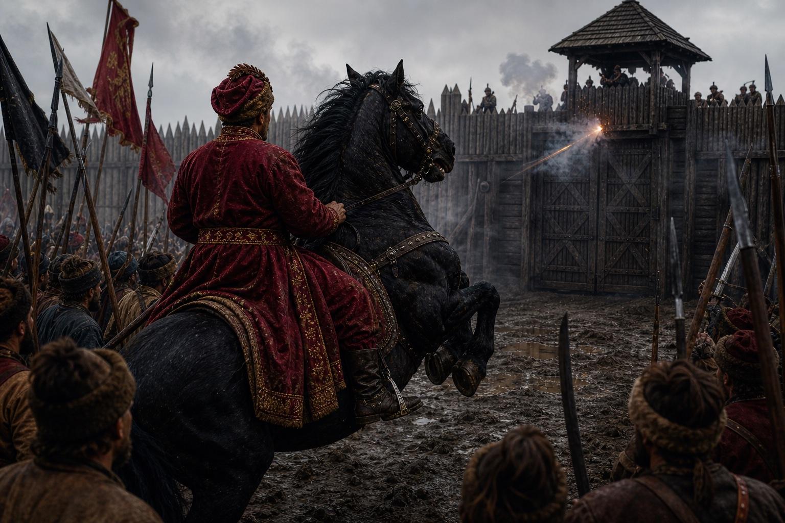

В -495 році [[../../../Історія/Зоряна Ера|Зоряної Ери]] (1648 році за старим стилем) запорозькі козаки під очільництвом Богдана Зиновія Хмельницького здійснили реконкісту і відбили історичні руські землі на правому березі Борисфену, завдавши декілька десятків поразок військам Речі Посполитої. Війська козаків поповнювалися новими підрозділами з деокупованих земель, які були захоплені ще за часів князівств. Самі запорозькі козаки є прямими нащадками племені козар, або, як їх ще називали, хозар. Через експансію литовського князівства на південь козар витіснили з їхніх земель навколо Старого Києва, та з часом козаки-козари знайшли спокійне місце за дніпровськими порогами, куди боялися ступати литовські та польські війська. Натомість козаки сфокусували свої військові дії проти турків Старої Землі, а саме здійснювали часті походи на Царград. Для захисту своїх володінь від морських атак козаків турки переселили декілька родів татар з Астрахані до Криму, щоб не дати можливості козакам вільно виходити в акваторію Чорного моря.

Але в -550-ті роки ЗЕ кошовим був обраний Дмитро Конашевич Сагайдачний, який двома походами примучив татар до миру, захопивши та пограбувавши їхні два міста — Керч та Бахчисарай. Це відкрило знову вільний шлях до морських військових походів. Завдяки йому експансія османів по річках Дон та Кубань була зупинена, що дало безпечний тил для запорожців. Разом із донськими козаками запорожці витіснили гарнізони турків з обох річок.

## Початок Кінця Старого Світу

За двадцять років, у -570-ті роки ЗЕ, османи здійснили останню вдалу спробу знищити осередок козаків у плавнях Борисфену — Січ. Козаки просили допомоги в Речі Посполитої та Литви, але отримали відмову. В подальшому це зіграє фатальну роль в існуванні цих двох держав всього через пів століття. Козаки, які останнє століття не чіпали свої старі землі на правому березі Дніпра, шануючи мирні угоди з сусідами, закарбували це собі в пам'яті. Сто двадцятитисячне військо турків-османів перейшло Дунай та вторглося в землі Дикого Поля. Козаки не наважувались на пряму велику битву всіма арміями, тому здійснювали партизанську війну — мобільні загони козаків на конях постійно рискали навколо логістичних шляхів, що з'єднували основні сили з дунайською Болгарією. Та весна випала дуже сухою, тому трави для коней та слонів було обмаль, османи з великими зусиллями дійшли до Борисфену, і їхні інженери стали ладнати паромну переправу над бродом у Новій Каховці, скориставшись низьким рівнем води в Дніпрі.

Татари, яких турки викликали в цей похід, вийшли з-за меж Криму, але дотримались мирної угоди, яку уклав Сагайдачний та Герей ІІІ, і не вступали на землі запорожців. Становище запорожців стало катастрофічним, коли ударні загони яничарів переправились на лівий Козацький берег та почали плюндрувати станиці та зимовники козаків. Раптом з півночі прийшла звістка: дві армії, литовська та Речі Посполитої, йдуть на допомогу. Для козаків це стало великим стимулом продовжувати боротьбу. Загони Івана Сулими змогли переправитись на правий берег, дати бій великому роз'їзду османів та болгарів, розбити його вщент, а потім спалити переправу турків.

Сагайдачний тим часом очікував на удар спільних сил поляків та литовців, тому теж наказав козакам збиратися в одному місці на річці Донець, щоб утрьох розбити величезну навалу турків-османів. На його подив, обидві союзні армії переправились у Черкасах на лівий козацький берег та почали плюндрувати землі запорожців. Поляки з литовцями вирізали цілі селища, незважаючи на вік та стать. Батько Богдана Хмельницького, полковник Михайло Лавринович Хміль, разом зі своїм ще молодим, але вже сотником, сином Богданом отримав наказ від Сагайдачного разом із декількома тисячами козаків стати заслоном проти військ Речі Посполитої. Полк Хмельницького зміг зупинити просування зрадників та дав час на порятунок десятків тисяч сімей, що змогли вийти з-під удару і перейти аж до Дону на виселки за Савур-Могилу.

Сагайдачний, бачачи, що ворог суне з усіх сторін і з дня-на-день татари теж перейдуть на сторону турка, дав наказ на вихід усього війська козацького та козацьких сімей до Дону. Люди збирали свої пожитки, господарство, деякі тягли навіть млини за собою. Переселення було примусове, багато хто не хотів уходити зі своїх земель, все ще думаючи, що ворог їх пожаліє і вони якось пропетляють цю навалу. Але ситуація з часом ставала все гіршою, великі роз'їзди поляків та турків все глибше заходили вглиб степу і нападали на беззахисних людей.

Здавалось, що все запорозьке козацтво приречене, коли підмога прийшла звідки не очікували — війська московського князя перейшли кордон і, скориставшись відсутністю сил у Литві, захопили Смоленськ та Вітебськ. Загроза захоплення столиці змусила литовців повернути назад, що значно зменшило тиск з півночі на роздерті війною землі запорожців. Козаки отримали невеликий передих і змогли зібратися докупи.

Тим часом у загоні Михайла Лавриновича Хміля залишалося лише декілька сотень козаків. Вони, переконавшись, що всі станиці та зимовники уже полишені, прорвалися з боєм під Кременчуком до Дикого Поля, але потрапили у пастку до османів під час переправи через річку Самару. На очах у Івана Сулими, який ішов на допомогу з правого берега, турки вдерлись до табору козаків, розірвали їхні вози та ланцюги, якими вони були скріплені, та розбили козаків. Ватажка Михайла Лавриновича та його сина Богдана було взято в полон. В той же вечір Михайла стратили через страшні муки — турецький слон наступав на його кінцівки, потихеньку роздрібнюючи м'язи та кістки, аж поки Михайло не відпустив свій дух, не промовивши жодного зойку. Наступним мав бути і сам Богдан-Зиновій, його уже навіть прив'язали до помосту для страти слоном, але артилерія Івана Сулими нарешті виставила свої позиції і почала обстріл турків з правого берега. Щоб уйти з-під удару, турки поспіхом знялись з місця битви та пішли назад на возз'єднання з основними своїми силами, ведучи за собою всіх наловлених козаків-бранців. В цей вечір Богдан Хмельницький дав клятву помститися всім кривдникам землі запорозької.

Майже всі сили козаків відступили за Савур-Могилу, залишаючи рідні домівки, лани та річки. Поляки разом з турками майже до самої зими добивали рештки загонів козаків, які не змогли відійти вчасно за Савур-Могилу. Великий загін же Івана Сулими зміг пробитися з боями до самого Перекопська, де був підступно схоплений татарами та проданий до турків разом з усіма козаками, що ще залишалися живими.

Турки, знищивши майже все західне та центральне Дике Поле, не наважились іти далі за Савур-Могилу і з першими холодами пішли назад до Дунаю. Поляки поставили свою фортечку на річці Кодак, яка впадає в Борисфен. Саме з цієї фортеці і почнеться реконкіста козаків, яка продовжиться довгі два століття і завершиться тріумфальним входженням до земель французів на далекому заході.

## Із полону в Дике Поле

Сагайдачний в одній з битв був поранений стрілою в шию і потихеньку помирав від сепсису. Лише завдяки своєму тавровому здоров'ю він зміг ще рік прожити після поранення, не даючи повністю занепасти всьому козацтву і тримаючи все на собі. Після смерті отаманами були обрані різні інші козаки, але всі вони головували менше року, намагаючись хоч якось зібрати докупи всіх розпорошених козаків. Деякі почали повертатися в сплюндровані станиці та зимовники, але татари з поляками тримали гарнізони в старих містечках та постійно контролювали, щоб козаки не змогли повернутися до своїх земель. Здавалось, що все, райські землі занепали та ніколи не побачать своїх рідних козаків, але за п'ять років саме тут розквітне бутон майбутньої надмогутньої космічної імперії — [[../Федерація Гетьманату|Федерації Гетьманату]].

Іван Сулима, Богдан-Зиновій Хмельницький та тисячі інших полонених були закуті на галери і провели там довгі п'ять років. Аж поки одна з галер, де гріб Сулима із Хмілем, не пристала до лиману в Перекопі. Скориставшись поганою погодою та дощем, коли варта сиділа на березі і ховалась від дощу, Сулима зміг збити проржавілі ланцюги з ніг та звільнив інших. В повній тиші, не подаючи жодного сигналу чи проблиску вогню, триста гребців — хто був козаком, хто венеціанцем, хто просто випадковим християнином з далеких Іспаній — всі гребці вийшли на палубу галери. Зі зброї мали лише власні залізні цвяхи та окови, до яких були прикуті роками. Першими задушили трьох турків, які спали біля скарбнички. Звідти взяли деяку зброю, хто яку встиг схопити. Потім один за одним, хто вплав самотужки, хто сівши на маленькі довбанки, дісталися берегу і так само зарізали уві сні весь екіпаж та охорону галери. Набравши харчів у сусідньому татарському селі, попередньо убивши всіх їхніх жителів, щоб не сповістили нікого про втечу, повернулись на галеру, відійшли від берегу та рушили на захід, оминаючи півострів і намагаючись дістатися до гирла Борисфену. Через велике місцеве свято курбан-байрам, коли всі пиячили, звістка про пропажу екіпажу і цілої галери почала ширитись лише коли козацька галера налетіла на нерозуміючу турецьку залогу в Залізному Порту, який був захоплений та розграбований. Кораблі, що стояли в порту, розібрали та переробили на байдаки, бо велика й незграбна галера не могла вправно ходити Дніпром. Через два дні козаки з великою здобиччю увійшли в гирло Борисфену, де розібрали і свою галеру та на пів сотні байдаків пішли вверх на веслах. Там козаки дізналися, що на річці Кодак, прямо де вона впадає в Борисфен, ляхи поставили фортецю і звідти контролюють всі пересування Дніпром, а також використовують земляну фортецю як базу для своїх військ. Тим часом чутки про повернення двох отаманів із неволі разом із декількома сотнями козаків та іноземців почали ширитися по рідких прихованих зимовниках та станицях на лівому козацькому березі Дніпра. Іван Сулима та Богдан-Зиновій почали розсилати своїх гонців з тих місць, де приставала їхня ватага. За декілька днів до них пристало ще декілька сотень козаків, які весь цей час переховувалися в глибоких балках та темних місцях, куди турок з ляхом боялися заходити. Було вирішено тут же з ходу наскочити на фортецю та зруйнувати її, що і було зроблено.

## Захоплення Кодаку

Варта на фортеці рідко ставилася на ніч, адже в радіусі десятків кілометрів від фортеці й духу не було козаків. Коли зненацька на Борисфені з'явилися кілька десятків байдаків. Попутний вітер разом із веслярами миттю приніс сотні зголоднілих до битви козаків, що висипались на берег та почали дертися на палісадник фортеці. З більших байдаків заговорили гармати з гаківницями, які зняли з турецьких галер. Німці з ляхами, що були розквартировані в укріпленні, поспіхом взялися за зброю, але було уже пізно. Один за одним через високий паркан перелазив козак. Першим через паркан перескочив Богдан Зиновій. Одним ударом шаблі він відсік руку німцю, який підняв сурму, щоб сповістити про напад всю фортецю. Списом, шаблею та пірначем козаки пробивали собі шлях уперед. За пів години все було закінчено. Кодак пав під ударом Сулими з Хмілем молодшим. Вся залога в кількасот шабель була повністю вибита до останнього, не пожаліли навіть коменданта фортеці, старого німецького капітана, який бився до останнього. З Кодаку Хміль продовжив розсилати гонців в усі сторони.

Ця чутка була як пророцтво, захопила голови людей та швидше за вогонь у степу під час грози дійшла до Савур-Могили та до Києва. Козацтво, що злиденно жило між Доном та Савур-Могилою, як якісь брудні цигани, нарешті почуло, що їхні колишні ватажки врятувалися з неволі та прийшли визволяти і їх. Всього за місяць тисячі козаків разом із сім'ями стали вертатися у свої старі домівки. Деякі стояли спаленими, іншим повезло більше — їхні курені так і чекали на них, немов розуміючи, що нікому, крім козаків, вони тут і не потрібні. Ляських сил у регіоні було залишено лише щоб кошмарити окремих козаків та не давати їм заселитися чи об'єднатися у великі ватаги. Але після падіння Кодаку головна база зникла, і тепер уже козаки вийшли на полювання на всіх басурманів та іноземців. Ляхів, через їхню зраду, не жаліли нікого. Всіх, хто потрапляв у полон, карали водою — на довгій палці вішали петлю, туди продівали брудну ляську макітру та як на аркані вели до найближчої річки. Заштовхували у воду й опускали під палку до дна. Коли переставав смикатись — розв'язували петлю і засовували туди наступного. На питання, чому б просто не перерізати горлянку, відповідали просто — свята земля Дикого Поля має бути чистою, без присмаку басурмана чи ляха. Турків же, яких було набагато менше, брали в полон для отримання викупу.

Інші ж українці-козаки, що мешкали під підданством Речі Посполитої останні п'ять років, як було вибито Січ з південних земель, нещадно потерпали під засиллям поляків, адже нікому не було захистити уже їх. А лях, відчувши повну безкарність, творив усілякі здирства та знущання українцям-русинам. Звістка ж про повернення козаків за пороги як вогняний тайфун підняла весь народ проти окупантів. Канів, Черкаси, Полтава, Київ — весь люд піднявся проти ляхів та почав їх нещадно бити. Деякі дороги були завалені трупом ляхів, які намагалися втікти, але народний гнів знаходив їх за кожною греблею, за кожним поворотом у ліс.

Звістка про повернення козацтва та вигнання польських сил з України та Дикого Поля застала військо Речі Посполитої без штанів. Московський князь, захопивши Смоленськ та Вітебськ, продовжив експансію на захід та почав загрожувати уже Вільнюсу. На допомогу литовцям поляки зібрали військо, яке і застрягло надовго в тих болотах та темних лісах. Річ Посполита не мала що виставити проти козаків, крім приватних військових компаній місцевих олігархів, яким роздали колись козацькі та українські землі.

## Похід на Україну

Все більше козаків поверталось разом із родинами у свої домівки. Кожен допомагав як міг оселитися, підлатати старі похилені курені та мазанки. Відбувся неймовірний стрибок бойового духу. Кожен жадав помсти за образи та зраду. Козацька рада відбулась у Кодацькій фортеці. Кошовим отаманом було обрано Богдана Зиновія Хмельницького. Іван Сулима отримав три новосформовані полки та одразу ж відправився до України — організовувати козацтво та вчити нових джур зі старих земель Русі. Також місцеві магнати уже збирали своє військо під Києвом і планували розбити козаків, поки основні війська Речі Посполитої вешталися в болотах Литви.

На цей раз козаки змінили тактику: замість суто військової операції вони захоплювали землі, містечка, вибивали ляхів та литовців, натомість тут же на раді вибирали козацьку старшину із місцевих українців-русинів, покозачували їх. Всі присягалися служити Січі, звільнялися від будь-яких поборів від інших магнатів, отримували назад свою відібрану землю. Всі, хто приєднався до козацтва, отримували рівні права та можливості.

Під Полтаву Іван Сулима підійшов уже з п'ятнадцятитисячним військом. Обороною керував охочий козак Іван Богун, якого найняли магнати охороняти кордон від турків та татар. Січове військо підійшло під мури фортеці. Деякі оборонці зі стін почали пізнавати своїх родичів, які уже покозачились. Багато з оборонців були колишніми козаками, яких доля занесла подалі від Дикого Поля. Іван Сулима беззбройно підійшов під мур та став закликати жителів покозачитись і не чинити опору.
"Нам немає що ділити чи за щось убивати одне одного. Я козак, ви — українці. Але чи не всі ми походимо від одного племені? Хіба не наші прадіди разом боронили хозарські землі? Хіба не нас всіх разом обманом було вигнано з Руських земель? Чи не ваші предки так само, як і мої, тікали від кривди подалі від ляха та литвина? Молимося одному богу, розмовляємо одну мову. Однакові кривди пережили. Лише ви осіли тут і стогнете під ляським ярмом, яке ще й змушує убивати подібних собі. Ви всі знаєте, як лях з литвином вчергове зрадив усіх нас та зруйнував Січ? А чи після цього вас не перевели в стан тварин? Черкаси, Канів — уже не знають, як звати їхнього пана. То навіщо вам таке життя?"

Після цих слів один із ляхів, що стояв на воротах, клацнув замком самопала і вистрілив. Козацький кінь Сулими, почувши клацання мушкету, встав на дибки та прийняв кулю своїми грудьми, і тут же спустив дух. Сулима ледь встиг зістрибнути з коня, щоб той його не задавив. Все козацтво, що стояло під муром, затримало подих.

Сулима встав, обтрусив жупан, накрутив вус на вухо та промовив до козаків на службі у магнатів, які стояли на стінах муру:
— Тепер ви бачите, хто ваш ворог? Хто підступно стріляє в беззбройного? Не стане нас — будете рабами довічно!

За воротами та за муром почався бешкет. Козаки-українці, русини, напали на ляхів, які стояли на варті воріт, та почали їх сікти шаблями. Козаки Сулими, побачивши, що їм хочуть допомогти зсередини, схопили драбини, і довгі ланцюги козацьких шапок потягнулися до мурів, де їх з кожною хвилиною ставало все більше і більше. Врешті-решт Іван Богун, весь у крові та з раною на голові, відкрив ворота, і козацька кіннота залетіла в місто. Першим пав мур. За ним внутрішній палісадник. Залишки ляхів зачинилися у фортечці. Їх обклали сирим листям, підпалили та живцем зварили в тісних тенетах дерев'яної вежі.

Захоплення Полтави поставило хрест на намаганнях магнатів якось змінити ситуацію. Від їхніх приватних компаній уходили тисячі козаків до Івана Сулими, хапаючи артилерію, коней, обози та всі пожитки. Деякі захоплювали містечка і проголошували владу Січі, не чекаючи на прихід Сулими. Тут же на раді в Полтаві Іван Богун був обраний Полтавським полковником та мав відповідати за воєнні дії проти лівобережних магнатів. Надалі Полтава стане одним із центрів козацтва на декілька десятиліть на всьому лівому березі Борисфену.

Сулима ж, віддавши декілька сотень своїх козаків Богуну, щоб ті навчали новоприбулих та покозачених селян, переправився в Переяславі на правий берег, чим підняв справжню хвилю паніки серед ляхів. Там він дізнався, що загін Нечая уже тиждень сидить в оточенні в Печерській Лаврі, куди він з наскоку забіг на байдаках та спершу мав великий успіх у вигнанні адміністрації та лихварів з Речі Посполитої. Але з півночі форсованим маршем прийшла армія шляхти, з ходу взяла штурмом вулиці Києва та загнала козаків за Печерські мури. Ситуація була критична, тож козацьке військо двома шляхами вирушило до давньої столиці Русі. Сулима йшов правим берегом, збільшуючи своє військо з кожним днем, Богун просувався лівим берегом і так само приймав загони охочих козаків, що були на службі у магнатів, до себе у військо.

У битві під Білою Церквою Сулима розбив основні сили шляхти, які виступили з Києва йому назустріч. У полон потрапив наказний гетьман — Стефан Потоцький. Звістка про перемогу дійшла й до самого Богдана Хмельницького, який весь цей час теж не сидів склавши руки.

## Примучення татар

Після розподілу козацьких сил на дві армії, одна з них пішла до України під проводом Сулими, іншу очолив Богдан Хмельницький, завданням якого стало вирішення питання кримських татар раз і назавжди. Через постійний перехід татар від статусу союзників до ворогів, плани з розширення впливу нової сили в Європі були під великим питанням. Хмельницький дав наказ збудувати байдаки для морського рейду південним Кримом та знищення портів, які могли бути використані турками для переправлення військ до Криму. Козаки за два тижні збудували сотні байдаків, як колись при морських походах Сагайдачного на Царград.
