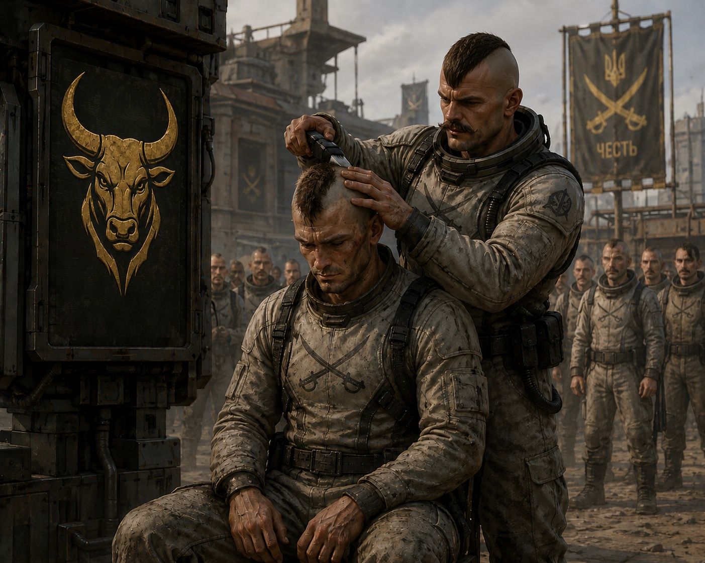

Обнулення — сурове покарання для [[Сердюків]] та [[Гайдуків]]. Покараний на обнулення втрачає своє козацьке військове звання, зазвичай переводиться до наймолодшого звання після джури. Також втрачає всі виплати за службу. Обнулений не може займати керівні посати у військових та паланкових радах. Фактично, людина починає свою службу з нуля.
Покарання виноситься за порушення козацьких звичаїв, поводження негідно під час бою, за залишення товариша в небезпеці, тощо.
Козак втрачає свій чуб та вуса.

