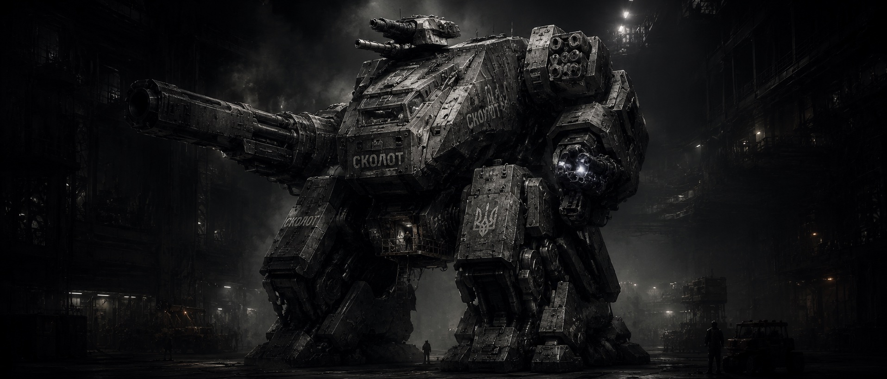

Сколот - надважкий механічний обладунок-панцирь-танк, всередині якого може сидіти один або декілька операторів, в залежності від розміру. Один з найбільших піхотних силових костюмів, розроблених в Федерації Гетьманату. На озброєні має важкі гармати, плазмоплюй, може мати установку проти дронів. Пересувається або на гусенях або на механічних ногах. Керується одним оператором, який сидить всередині в грудній частині меха. Можливі варіації з декількома додатковими операторами, які незалежно ведуть вогон із гармат та плазмоплюїв. По вогневій силі уступає лише танку.

