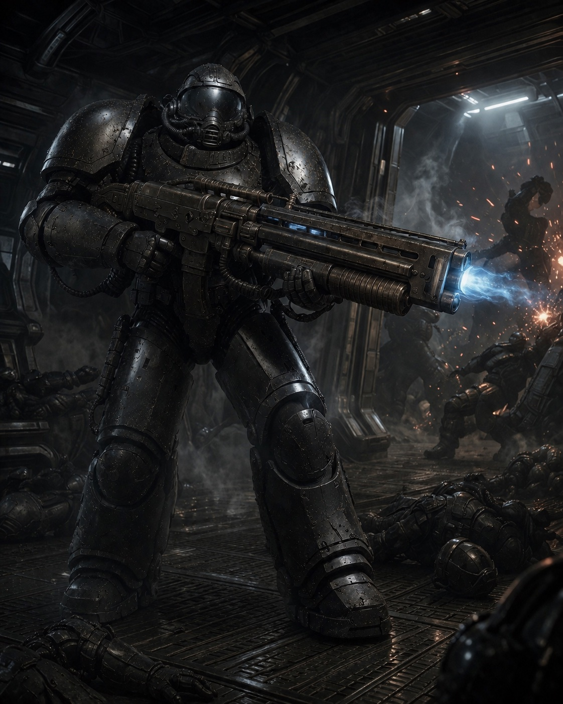
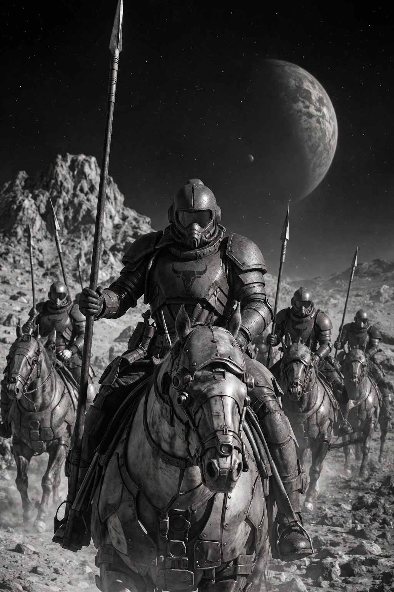

Термінатор — різновид піхотинця, який має надважку силову броню, озброєння. Призначений для ведення бойових дій в безатмосферних середовищах як-то космічні кораблі, поверхні планет, астероїдів, штучних супутників. Також дуже часто використовується для проведення штурмових дій в земних умовах, для швидкого подалання супротиву і прориву лінії оборони ворогів.

# Навчання
Служба термінатором спочатку вимагає проходження загальної військової підготовки у військах [[Сердюки|Сердюків]] або [[Гайдуки|Гайдуків]].  Все починається з того, що один із Термінаторів IV рівня вибирає собі особисту джуру, якого вчить своїй справі, допомогає в навчанні, ділиться досвідом. Термін "Джура" тут має не зменшувальний характер, адже щоб стати джурою, треба уже служити космічним гайдуком або сердюком в якості звичайного піхотинця. Відбір в джури відбувається у віці 17-20 років. За п'ять років джура проходить шлях від звичайного піхотинця до Термінатор І рівня.
Навчання фокусується на фізичній підготовці та згуртованості курення, сотні та десятка, в якому служать термінатори. Під час закінчення навчання джура зазвичай має з пів десятка бойових вильотів разом із своїм [[Атабай|Атабаєм]]. 

# Рівні підготовки

## Термінатор I
Після закінчення навчання джура переходить служити термінатором першого рівня. Це найнижча ланка в термінаторських лавах, але для інших піхотних спеціальностей вона являється уже недосяжною самою по собі. На цьому рівні козаку довзоляється мати свою власну особисту шаблю. Серед термінаторів доволі поширеним є придбання власних шабель з [[../Різне/Мюридська сталь|мюридської сталі]]. Один із найбільш поширених рівнів серед термінаторів. Із обладнання козакам на цьому рівні доступні лазерні самопали, короткі плазмові дробовики.
## Термінатор II
Після п'яти років служби термінатором першого рівня, козак переходить на наступний рівень. На цьому рівні кожен з термосів уже вибирає собі спеціальність, з якою хотів би служити до кінця свого терміну. Існують різні шляхи продовження служби: сапер, штурмовик-[[Термінатори-дуболоми|дуболом]], стрілок, кулеметник, [[Ударні реактивні сотні|ударна реактивна сотня]], надважкий кулеметник із мельт-ганом, тощо. Термін служби — п'ять років. За цей час термінатори можуть пробувати себе в різних ролях, як помічники Термінаторів III рівня згідно їх спеціалізацій. Напрямок розвитку можна змінювати по власному бажанню. Зазвичай, кожен термінатор за час служіння на другому рівні пробує кожну із спеціальностей.
## Термінатор III
Після закінчення п'ятирічного служіння на другому рівні кожен зобов'язаний вибрати свою спеціальність, яка закріплюється назавжди за ним. З цього рівня термінатор виходить на завдання суто по своїй спеціальності для того, щоб отримати якомога більше досвіду і перейняти його від четвертого рівня, найвищого. За статистикою, лише 30% від першопочаткових термінаторів з першого рівня доходять до цього рівня внаслідок поранень, нещасних випадків під час виконання завдань або смерті. 
Термінатори на цьому рівні має доступ до будь-якого озброєння, навіть надважкого як-то мобільні мельтомети та плазмові ручні гармати. Термін служби — п'ять років.

## Термінатор IV
Найвища і остання ланка служіння термінатором. Дозволяється взяти собі на навчання одного або двох джур для передачі їм досвіду і культури служіння термінатором. Термоси на цьому рівні можуть стати [[Термінатори-дуболоми|Дуболомами]] — неперевершеними воїнами ближнього бою, коли десяток дуболомів вирішує результат операції.

Термін служби — п'ять років. Після завершення служіння списуються в обшитовані козаки.

# Переваги
Служба в термінаторах являється доволі елітною, на рівні служби отаманом космічного корабля. Через величезні навантаження і ризики, відзнака за службу теж велика. По [[Обшитований козак|списуванню в запас]] козак на довічний термін отримує на вибір або наділ землі на будь-якій планеті, або грошове забезпечення на всю сім'ю від Січі. Після звільнення зі служби термінатор може повернутися лише за власним бажанням та лише якщо ведеться якась велика війна. В іншому випадку повернення не можливе. Це зроблене для того, щоб склад термінаторів був завжди молодим і не було "застарівання" дідів на службі. Після звільнення термінатор займається будь-чим, хоча з тією грошовою пенсією, яку видає Січ, можна нічим і не займатися уже. Також, як бонус для козака, він може відправити свого сина до навчання на пластунів абсолютно безоплатно. Держава утримує новака за свій рахунок. 

Зазвичай, термінатори заводять сім'ю якомога раніше через постійне підставляння під радіацію у відкритому космосі.

Серед термінаторів, особливо 3 і 4 рівня, існує справжнє братерство. По виходу на пенсію дуже часто вони оселяються на одних і тих самих планетах.

Під час служби голови сім'ї, або у випадку, якщо один із синів, який ще не одружився, служить термінатором, сім'я отримує грошову допомогу від Січі.

# Недоліки
Через те, що майже всі бойові дії термінаторів пов'язані із відкритим космосом, отримують доволі високу кількість радіації. Незважаючи на те, що на постійній основі приймають антирадіаційні засоби, все одно опромінюються та згодом втрачають репродуктивну функцію. Тому, якщо термінатор не має сім'ї на 2-3 рівнях, то списується старшиною в звичайні сердюки чи гайдуки. Хоча це і дуже рідкі випадки.

Через високу смертність та каліцтва не всі хочуть ідти в термінатори, хоча і винагорода за службу доволі висока. Багатьом термінаторам важко переходити до мирного життя після списання. Тому для них проводяться спеціальні курси по контролю агресії. У випадку важких психіатричних відхилень на грунті служби, можливе примусове хімічне пригнічення агресії.

Через постійні роз'їзди по різних кутках всесвіту термінатори на службі рідко бувають вдома.

Термінаторська служба завжди має статус "повна готовність", що дуже сильно зменшує час, який козак може проводити на власний розсуд.