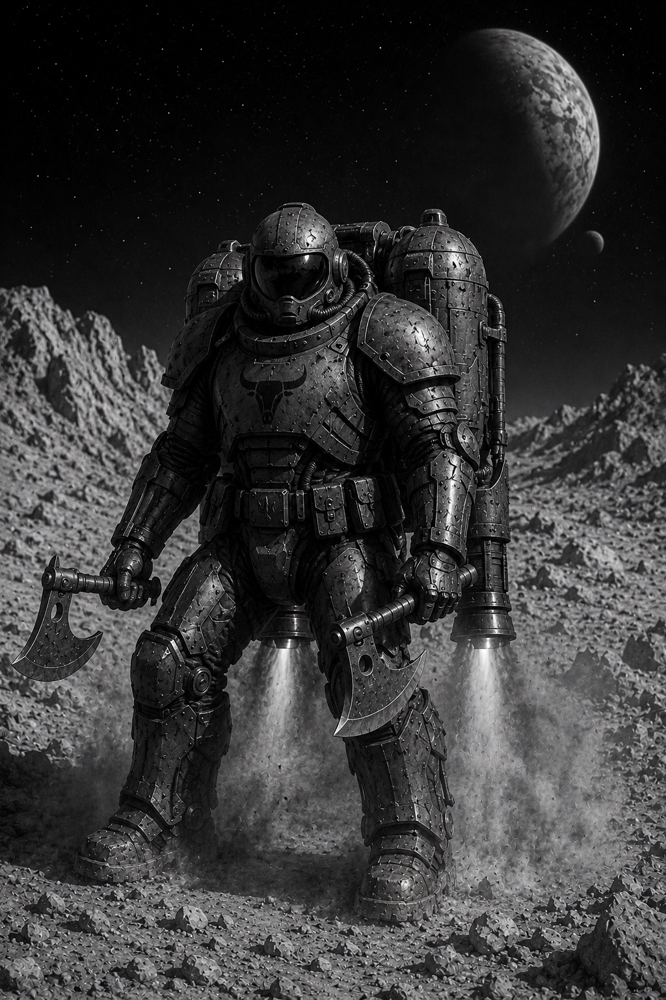
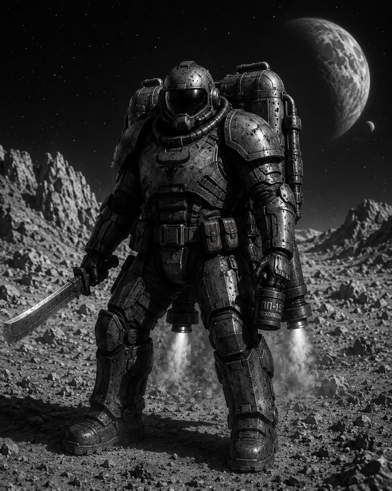

Ударні реактивні сотні (УРС) — високомобільні загони [[Термінатор|Термінаторів]], оснащені реактивними ранцями для швидкого переміщення по поверхні планет або для абордажних дій у відкритому космосі.

## Загальний опис

Спеціалізація УРС стає доступною на третьому рівні служіння у термінаторських військах. Основна задача у відкритому космосі — абордажні та диверсійні бої для ураження або захоплення кораблів противника. На поверхнях планет загони УРС здійснюють швидке просування в тил ворога з використанням реактивних ранців та проводять диверсійні заходи в тилу.

## Структура та організація

Базова одиниця УРС — десяток (10 термінаторів). Десяток поділяється на дві ланки по п'ять бійців: ударна ланка (прорив, зачистка) та ланка підтримки (прикриття, інженерна справа). Три десятки формують сотню під командуванням [[Термінатор|термінатора]] IV рівня. Сотня діє як автономна бойова одиниця, здатна виконувати завдання без підтримки основних сил протягом обмеженого часу.

У складі космічного флоту сотні УРС приписані до носіїв — спеціалізованих кораблів, обладнаних стартовими шлюзами для швидкого десантування. Один носій зазвичай несе на борту від двох до чотирьох сотень.

## Спорядження

### Реактивний ранець

Стандартний реактивний ранець УРС (модель РР-9 «Крила») забезпечує три режими роботи: маршовий (горизонтальне переміщення на дистанцію до 50 км у атмосфері), стрибковий (вертикальний підйом до 300 м або перестрибування перешкод) та маневровий (короткі імпульси для зміни позиції під час бою). У відкритому космосі ранець працює в режимі безперервної тяги, дозволяючи [[Термінатор|термінатору]] переміщуватися між кораблями або уламками на дистанціях до кількох кілометрів.

Живлення ранця здійснюється від батарей надвисокої щільності, суміщених із силовою установкою термінаторської броні. Повного заряду вистачає на 10–12 хвилин активної роботи в атмосфері або до 20 хвилин у космосі. Після вичерпання заряду потрібна заміна батарейного блока, що виконується на борту носія або в польових умовах за наявності інженерної підтримки.

### Броня

Термінатори УРС використовують полегшений варіант стандартної силової броні з демонтованими елементами пасивного захисту в нижній частині корпусу та на плечах. Це зроблено для зменшення загальної маси системи «стрілець + ранець» і покращення аеродинаміки під час атмосферних стрибків. Зменшення захисту компенсується високою мобільністю: нерухома ціль отримує більше влучань, ніж та, що постійно маневрує.

### Навігація

Кожен термінатор УРС оснащений інерціальною навігаційною системою, інтегрованою з тактичним дисплеєм шолома. Під час космічних операцій навігація синхронізується з корабельними сенсорами носія, що дозволяє відстежувати положення кожного бійця в реальному часі. В атмосфері система доповнюється альтиметром та допплерівським вимірювачем швидкості.

## Озброєння

Основним принципом підбору озброєння для УРС є компактність і можливість ведення вогню одразу після приземлення. Термінатори УРС надають перевагу зброї ближнього бою, коротким [[../Озброєння/Плазмовий Короткий Самопал|плазмовим самопалам]] або дробовикам. Плазмові та [[../Озброєння/Протипіхотна Міна 15 (ПП-15)|мельт-гранати]] є стандартним оснащенням кожного бійця: під час стрибка прицільний вогонь малоефективний, тому скидання гранат на позиції противника з наступним вступом у рукопашний бій одразу після приземлення є відпрацьованою тактикою.

Під час абордажних операцій кожен десяток отримує мельт-міни для пробиття зовнішньої обшивки ворожого корабля. Ударна ланка несе також інженерні заряди для розгерметизації відсіків і знищення внутрішніх перебірок. Ланка підтримки оснащується одним [[../Озброєння/Важкий Піхотний Мельтостріл|важким мельтострілом]] для пробиття броньованих дверей і придушення укріплених вогневих точок.

## Тактика застосування

### Космічний абордаж

Абордажна операція починається зі скидання сотні з носія. Термінатори рухаються розосередженим строєм, використовуючи маневрові імпульси для ухилення від вогню точкової оборони корабля-цілі. Першою до обшивки прибуває інженерна пара, яка закладає мельт-міни й прорізає прохід усередину. Після розгерметизації відсіку ударна ланка заходить першою, зачищаючи простір навколо пробоїни. Ланка підтримки заходить одразу за ними, закріплюючись у захопленому відсіку й забезпечуючи плацдарм для подальшого просування.

Пріоритетними цілями під час абордажу є: місток, реакторний відсік, системи життєзабезпечення та комунікаційні вузли. Сотня діє швидко — типова операція із захоплення корабля середнього класу триває від 15 до 30 хвилин. Якщо опір надто сильний, сотня переходить до диверсійної тактики: знищення критичних систем і відступ.

### Планетарне десантування

На поверхні планет УРС виконують роль передових штурмових груп. Скидання відбувається з низької орбіти або з атмосферного носія. Термінатори входять в атмосферу на маршовому режимі ранців, гасячи швидкість безпосередньо перед приземленням. Перша хвиля десанту розосереджується на місцевості, формуючи периметр, після чого починається просування до цілі серією послідовних стрибків.

Основна тактична перевага УРС на планетарному ТВД — здатність долати природні та штучні перешкоди (річки, урвища, мінні поля, лінії укріплень) без втрати темпу наступу. Сотня здатна пройти до 30 км у глибину ворожої території за один такт, якщо дозволяє заряд ранців.

### Рейдові дії

У режимі глибокого рейду сотня УРС завдає ударів по логістичних вузлах противника: складах боєприпасів, польових командних пунктах, вузлах зв'язку. Після виконання завдання сотня відходить стрибками до точки евакуації, де її забирає транспортний корабель або де вона з'єднується з основними силами. Тривалість автономного рейду обмежена зарядом ранців і запасом боєприпасів — зазвичай не більше 6 годин активних дій.

## Обмеження

Основним обмеженням УРС є енергозалежність. Після вичерпання заряду ранців [[Термінатор|термінатор]] втрачає головну тактичну перевагу — мобільність — і перетворюється на звичайного важкого піхотинця, щоправда, в полегшеній броні. З цієї причини командири сотень завжди планують операції з резервом заряду на відступ.

В атмосфері реактивний ранець створює значний тепловий і акустичний слід, що робить термінатора УРС помітним для сенсорів противника. Раптовість досягається не скритністю, а швидкістю: від моменту виявлення до моменту удару проходить надто мало часу для організованої протидії.

Полегшена броня робить термінаторів УРС більш уразливими до вогню важкої піхотної зброї та стаціонарних оборонних систем порівняно з термінаторами в стандартному спорядженні. Компенсацією слугує тактика масованого удару: сотня атакує компактною групою, не даючи противнику зосередити вогонь на окремих бійцях.