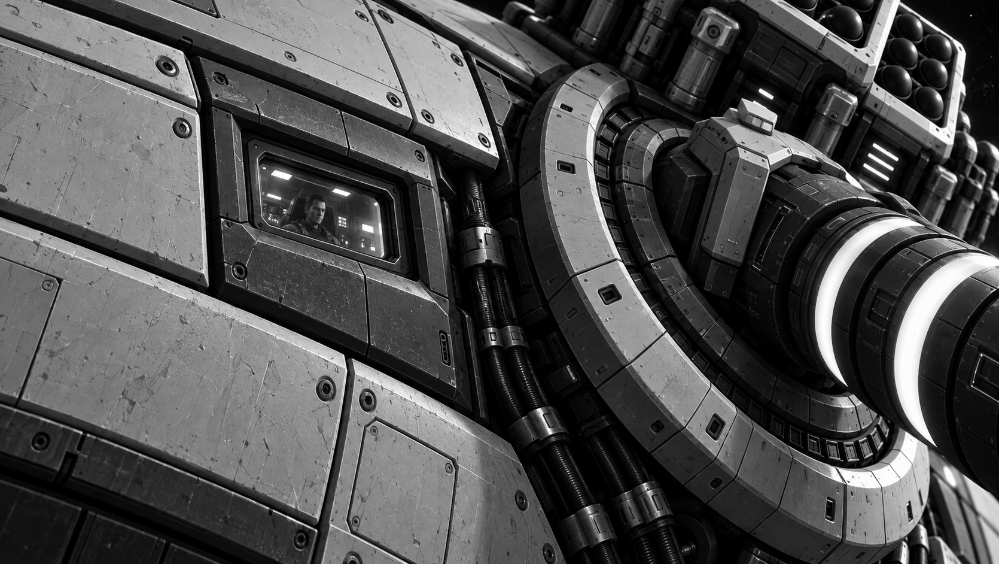
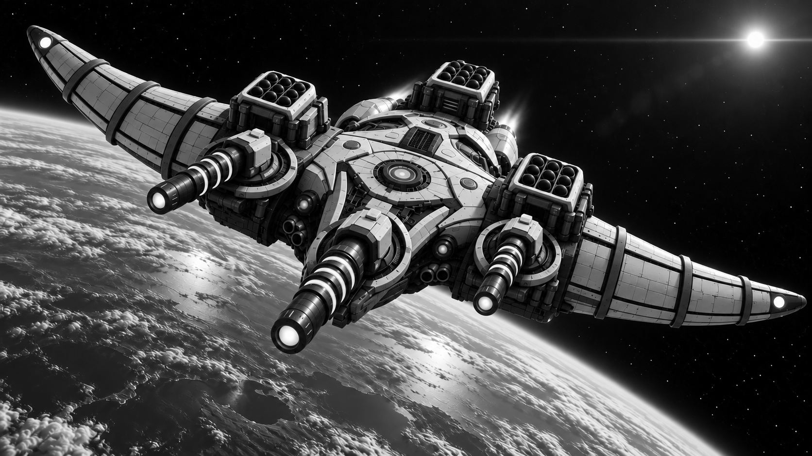
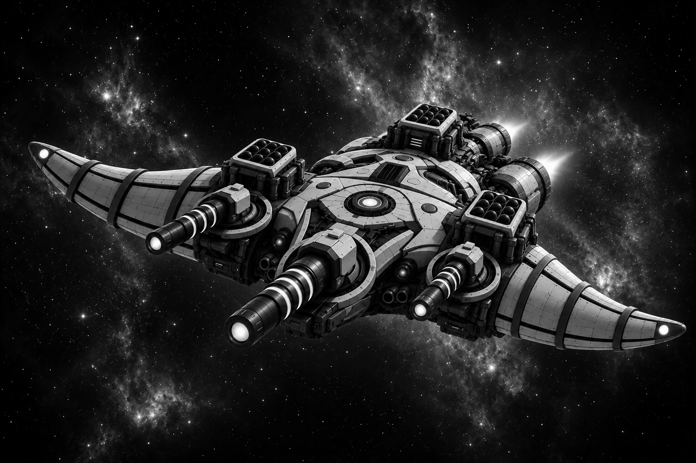
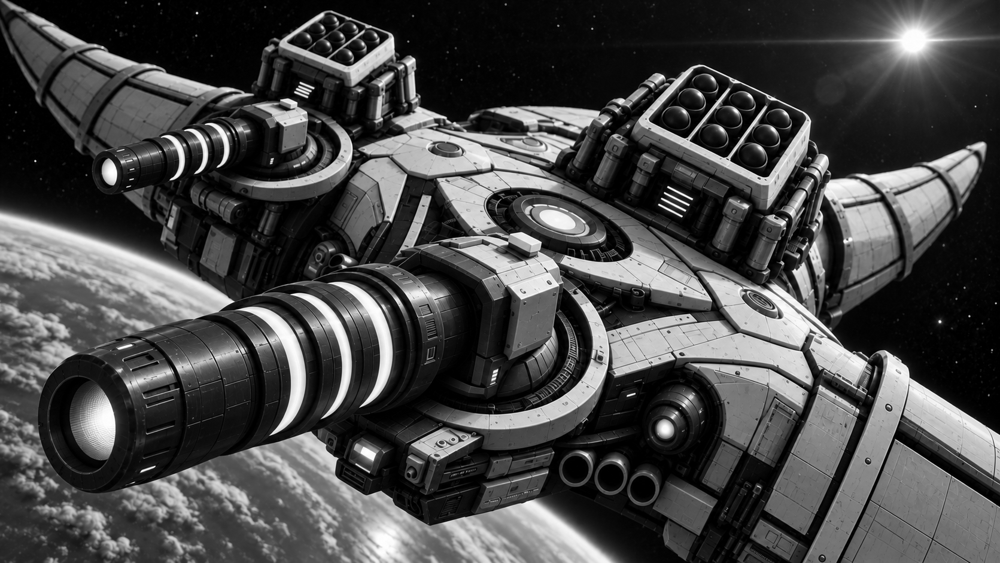
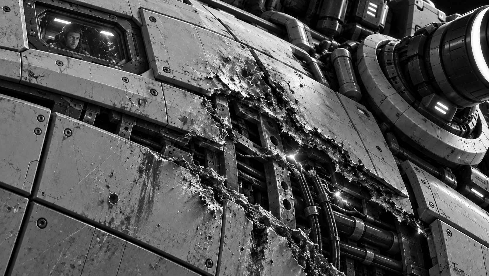

# Бойовий корабель класу «Тавр»

*Фрагмент корпусу «Тавра»: пілот за невеликим броньованим вікном дає відчути масштаб корабля та його озброєння.*

**«Тавр»** — основний бойовий корабель Космічного Флоту Гетьманату. Саме кораблі цього класу становлять основу будь-якої ударної ескадри та виконують більшість бойових завдань у відкритому космосі й на орбітах планет, супутників та космічних станцій. Вони поєднують високу вогневу міць, міцне бронювання та достатню автономність для тривалих бойових кампаній.

На відміну від легких перехоплювачів, які покладаються на швидкість, «Тавр» створений для ведення затяжних космічних боїв. Його багатошарова броня, посилений силовий каркас та дубльовані системи життєзабезпечення дозволяють кораблю витримувати численні влучання, зберігаючи боєздатність навіть після серйозних пошкоджень.

Основною тактикою «Тавра» є ведення далекобійного бою. Завдяки потужним сенсорним комплексам він здатний виявляти противника за сотні тисяч кілометрів, відкриваючи вогонь задовго до входження в ближню дистанцію. У складі ескадри кораблі класу «Тавр» формують основну лінію флоту, поступово знищуючи кораблі противника концентрованим вогнем.

![[../../../../../Images/Universe/Hetmanate-Federation/Ships/Tavr_Laser_Turret_Macro_Game.png|689]]

![[../../../../../Images/Universe/Hetmanate-Federation/Ships/Tavr_Missile_Launcher_Macro_Game.png]]

*Окремий «Тавр»: рогоподібний силует, броньований корпус і важкі гарматні установки.*

## Озброєння

- **Від чотирьох до шістнадцяти лазерних установок «[[Озброєння Кораблів/Лазерна установка ШИЛО|ШИЛО]]»** Вони є головною ударною силою корабля та призначені для пробиття броні крейсерів, лінкорів і орбітальних укріплень. Залежно від модифікації корабля установки можуть працювати незалежно або об'єднуватися в єдину батарею, концентруючи випромінювання в одну точку корпусу противника. Такий залп здатний за кілька секунд пропалити кілька метрів композитної броні та досягти внутрішніх систем корабля.

    ![[../../../../../Images/Universe/Hetmanate-Federation/Ships/Tavr_Laser_Impact_Game.png]]
    
- **Батарея лазерних установок «[[Озброєння Кораблів/Лазерна Установка Шило-М|Шило-М]].** Використовується для боротьби з винищувачами, перехоплювачами, торпедами та ракетами. У разі необхідності вони можуть вести вогонь і по більших кораблях, виводячи з ладу сенсори, двигуни та зовнішнє обладнання.
![[../../../../../Images/Universe/Hetmanate-Federation/Ships/Tavr_Weapon_Deck_Game.png]]
    
- **Керовані космічні торпеди.** Застосовуються проти особливо захищених цілей або для завершення атаки після того, як лазери послабили броню противника.
    

*Деталі художнього варіанта з посиленим озброєнням: великокаліберні гармати та ракетні пускові блоки.*

## Захист

Бронювання «Тавра» складається з багатошарових композитних плит, між якими розташовані теплоізоляційні та демпфувальні шари. Така конструкція ефективно протистоїть як лазерному випромінюванню, так і кінетичним ударам уламків чи торпед.

Найважливіші системи — реактор, командний центр, накопичувачі енергії та системи керування — розміщені глибоко всередині корпусу й захищені окремими бронекапсулами. Навіть після втрати окремих відсіків корабель може продовжувати виконувати бойове завдання.

## Бойове застосування

«Таври» рідко діють поодинці. Зазвичай вони об'єднуються у бойові лінії, де десятки кораблів концентрують вогонь своїх установок «Шило» по одній цілі. Така тактика дозволяє за короткий час пробити навіть броню найважчих кораблів противника.

Під час наступу «Таври» прикривають ескадрильї перехоплювачів «Сокіл», які знищують ворожі винищувачі та торпеди. Самі ж «Таври» ведуть дуель із великими кораблями, використовуючи свою перевагу у потужності лазерного озброєння та міцності броні.

Саме кораблі класу «Тавр» стали символом військової могутності Гетьманату. Їхня поява на орбіті планети зазвичай означає, що дипломатія завершилася і починається війна.

![[../../../../../Images/Universe/Hetmanate-Federation/Ships/Tavr_Laser_Impact_Game.png|698]]

Серед старшини флоту кажуть:

> **«Поки "Таври" тримають стрій — Гетьманат тримає космос.»**