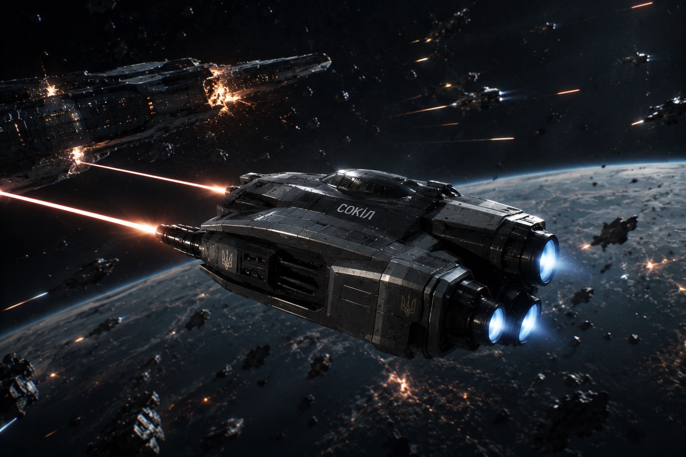

# Космічний перехоплювач «Сокіл»

**«Сокіл»** — одномісний космічний перехоплювач Гетьманату, призначений для завоювання переваги в космосі, супроводу ударних ескадр і захисту великих кораблів від винищувачів, торпед та малих ударних суден. Він є наймасовішим бойовим кораблем флоту і вважається стандартною машиною для більшості військових пілотів.

Конструктори пожертвували товщиною броні заради максимальної швидкості та прискорення. Легкий корпус із багатошарових композитів витримує лише уламки, мікрометеорити та вогонь легкої зброї. Основним захистом «Сокола» є не броня, а його маневреність, потужні маршові двигуни та система орієнтаційних двигунів, що дозволяє миттєво змінювати напрямок руху без втрати швидкості.

Головним озброєнням перехоплювача є **дві лазерні установки «[[Озброєння Кораблів/Лазерна Установка Шило-М|Шило-М]]»**, розташовані по обидва боки носової частини. Синхронізована система наведення зводить їхні промені в одну точку, значно підвищуючи ефективність ураження. Проти винищувачів достатньо короткої черги, тоді як для боротьби з більшими кораблями пілот концентрує вогонь на сенсорах, двигунах, радіаторах або інших критичних вузлах.

Допоміжне озброєння складається з касет мікроторпед або керованих ракет малої дальності. Вони використовуються для завершення атаки на пошкоджені цілі або перехоплення особливо маневрених противників, яких складно довго утримувати в лазерному прицілі.

Система керування вогнем значною мірою автоматизована. Бортовий комп'ютер прогнозує траєкторію руху цілі, компенсує відносні швидкості та керує мікрокорекціями випромінювачів «[[Озброєння Кораблів/Лазерна Установка Шило-М|Шило-М]]». Завдання пілота полягає не стільки у точному прицілюванні, скільки у виборі оптимальної позиції для атаки.

«Сокіл» має виняткове співвідношення тяги до маси, що дозволяє розганятися швидше за більшість кораблів свого класу. Водночас запас палива та робочого тіла для маневрових двигунів обмежує тривалість автономних операцій. Через це перехоплювачі зазвичай діють із борту авіаносців, дредноутів або орбітальних баз, де можуть швидко поповнити енергетичні комірки та запаси реактивної маси.

У тактиці Гетьманату «Соколи» рідко воюють поодинці. Вони діють ланками по чотири або вісім машин, атакуючи ціль одночасно з різних напрямків. Поки одні екіпажі виманюють противника на маневр, інші концентрують вогонь «Шило-М» по найбільш вразливих елементах корабля. Така тактика дозволяє навіть легким перехоплювачам поступово виводити з ладу значно більші кораблі.

Серед пілотів флоту існує правило:

> **«Якщо тебе бачать — ти вже запізнився. "Сокіл" перемагає ще до того, як ворог встигає навести гармати.»**