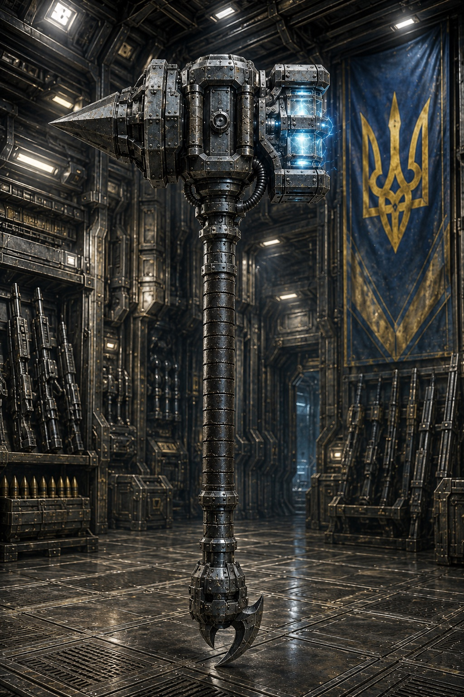
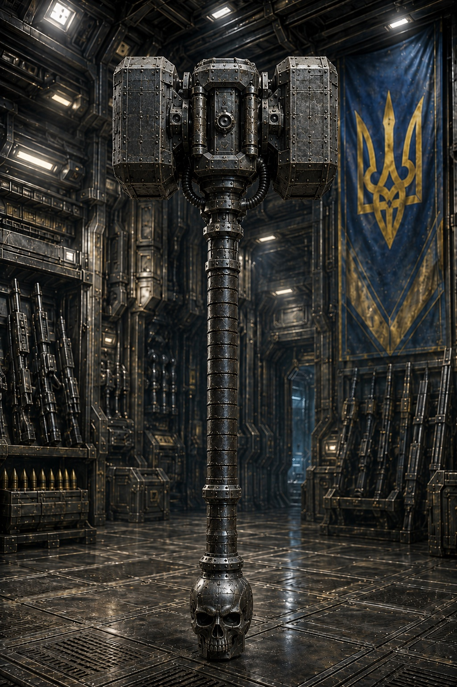
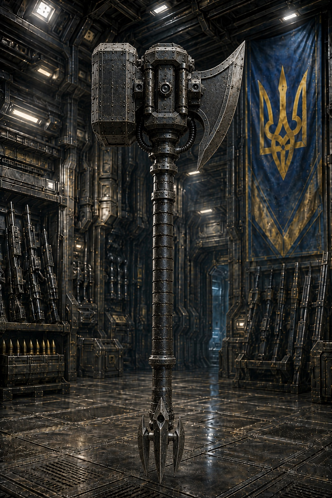

Застосовується переважно [[../Військова Справа/Термінатори-дуболоми|Дуболомами]] через свою велику вагу та руйнівними властивостями. Може мати різні насадки на одну або дві сторони молота. Зброя виготовляється ковалями з [[../Космічна Географія/Система Мюрид|Системи Мюридів]] під особисте замовлення козака-[[../Військова Справа/Термінатор|Термінатора]]

# Різновиди

## Бойовий молот із плазмовою ударною частиною
З однієї сторони має класичний шип для пробиття броні та легкої бронетехніки, з іншої - тупий ударний кінець із вбудованою подачею плазми для пропалювання сталевих захистів і знищення інженерних споруд та перешкод.

## Класичний тупий молот
Молот в класичному виконані. З обох боків має тупу важку ударну частину. Навершя руків'я може мати різні насадки, такі як сталевий кіготь, спис та інше.

## Молот із чеканом
Важкий термінаторський молот із чеканом-сокирою з однієї сторони. Гарно підходить для знищення легкоброньованої (в порівнянні з термінатором) піхоти або для вскриття обшиковк танків та бойових машин піхоти.

