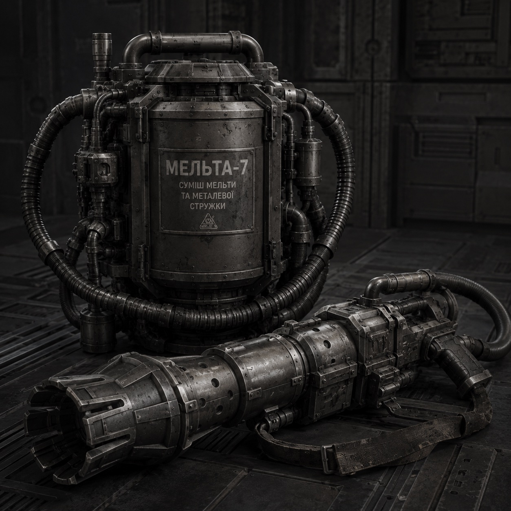
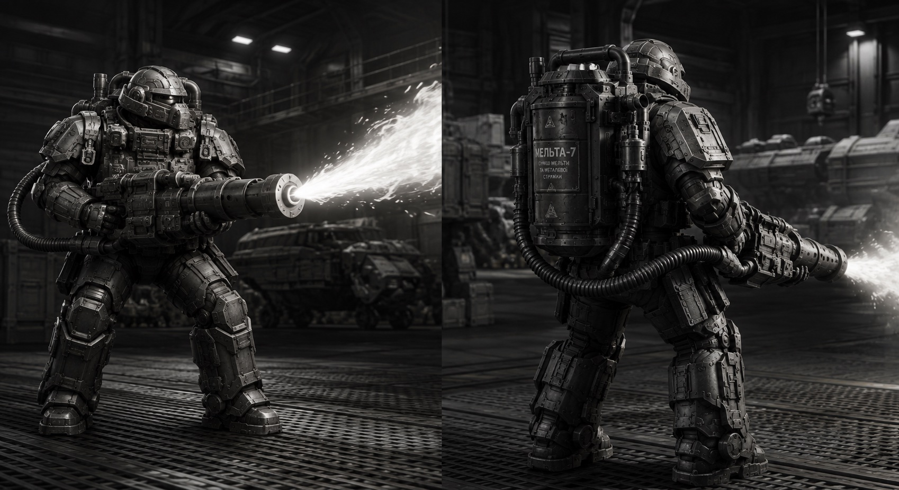
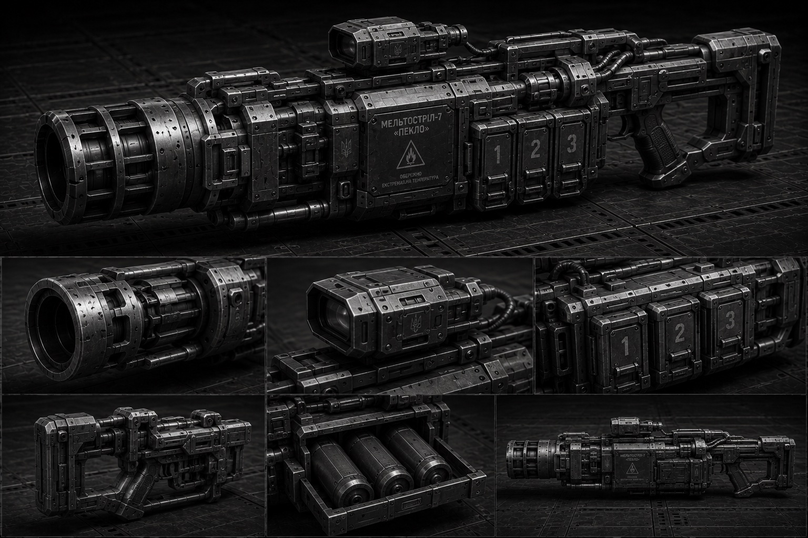
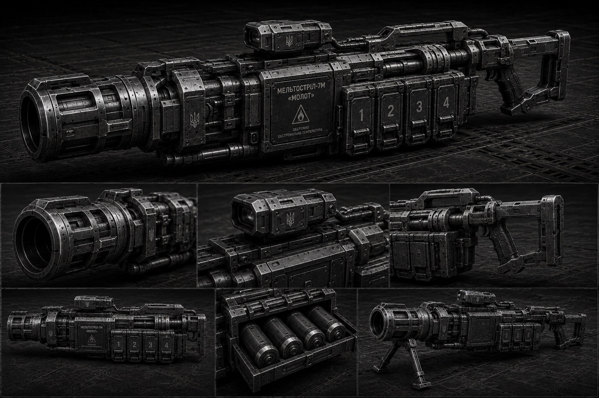
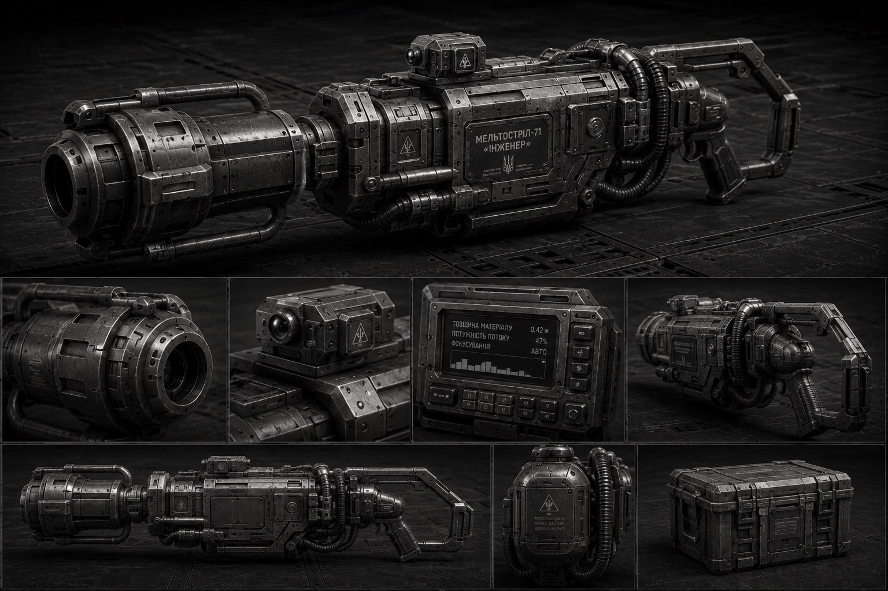
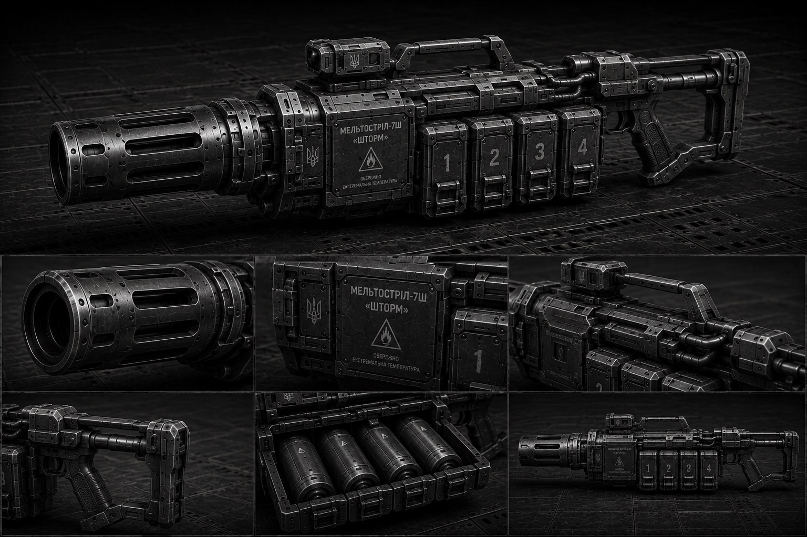

Важкий піхотний мельтостріл — найбільш вражаюча зброя, яка доступна [[../Військова Справа/Термінатор|термінаторам]] із відповідною стрілецькою спеціальністю. Застосовується для ураження великого скупчення сильно броньованої піхоти, ураження бункерів, легкої та середньої броньованої техніки. Наносить катастрофічний моральний урон ворогу. Були випадки, коли ворог здавався в полон лише через чутки про застосування цієї зброї проти них.

На відміну від [[../../../Технології/Загальне Озброєння/Плазма|плазмової зброї]], яка вражає ціль компактним згустком на відстані, [[../../../Технології/Загальне Озброєння/Мельта|мельта]] працює інакше: вона викидає вузький потік надрозігрітої плазми, зчепленої з перегрітими металевими аерозолями. Ця соплеподібна субстанція летить зі швидкістю кулі й пропалює все на своєму шляху. Чим ближче до цілі — тим гарячіший потік і тим глибше проникнення. На короткій дистанції жодна броня не вистоює.

Постріл із мельтостріла — це подія. Спочатку чути низький гул генератора, потім повітря перед стволом починає мерехтіти від спеки, і за долю секунди — надгучний вибух. Нагрів атмосфери створює ударну хвилю, яка сама по собі може збити з ніг незахищену піхоту поруч зі стрільцем. У місці влучання метал світиться білим, броня плавиться й стікає розпеченими краплями, залишаючи після себе акуратний проплавлений отвір або цілий пролом. Екіпаж бронетехніки всередині часто гине ще до того, як мельта повністю пройде крізь броню — просто від теплового удару.

Головний недолік — дальність. Потік мельти швидко розсіюється в атмосфері, тож уже на сотні метрів пробивна здатність різко падає. Це зброя ближнього бою, і стрілець завжди йде в перших рядах. У вакуумі мельта поводиться трохи краще — немає атмосфери, яка розсіювала б потік, — але все одно це не далекобійна зброя.

Енергоспоживання величезне. Більшість моделей живиться від змінних енергетичних комірок надвисокої щільності або під'єднується безпосередньо до ранцевого реактора. Після трьох-чотирьох пострілів автоматика блокує спуск — камера випромінювання розжарюється до критичних температур, і якщо не дати їй охолонути, зброя просто розплавиться в руках. Бувалі стрільці знають: мельта не прощає поспіху.

## Модифікації

### Мельтостріл-7 «Пекло»

Базова модель, від якої пішли всі інші. Вага в спорядженому стані — дев'яносто два кілограми, і це не просто цифра: «Пекло» є найважчим, найпотужнішим і найменш компромісним мельтострілом у арсеналі Гетьманату. Має три змінні енергокомірки в коробі, кожна на один постріл. Приціл — коліматорний із термальним сенсором, бо крізь мерехтливе від спеки повітря звичайна оптика майже безкорисна. Приклад фіксований, розрахований на оператора в силовому екзоскелеті.

«Пекло» — це чиста, не розбавлена компромісами міць. Усі наступні модифікації («Молот», «Інженер», «Шторм») жертвували або вагою, або пробивною здатністю, або щільністю потоку заради спеціалізації. «Пекло» нічим не жертвує. Його потік — найвужчий і найщільніший серед усіх мельтострілів, сфокусований майже в точку. На короткій дистанції він пробиває основний бойовий танк наскрізь — разом із двигуном, екіпажем і тим, що стоїть за танком. Броньовані двері, фортифікаційні стіни, силові щити — усе це перестає існувати після одного влучання.

Саме тому «Пекло» видають лише термінаторам із важкою стрілецькою спеціалізацією — і лише тоді, коли старшина точно знає, що на полі бою буде щось, із чим не впораються ані «Молоти» сердюків, ані плазмостріли. Основний бойовий танк, штурмова машина, ворожий термінатор у надважкій броні, укріплений ДОТ — ось цілі для «Пекла».

Розплата за цю потужність — тепловиділення. Після трьох пострілів камера випромінювання розжарюється до такого стану, що навіть автоматика не завжди встигає заблокувати спуск вчасно. Бувалі стрільці знають: після третього пострілу треба або міняти позицію, або міняти ствол. У найгарячіших ситуаціях термінатори свідомо йдуть на ризик і стріляють четвертий раз — після цього «Пекло» зазвичай можна списати, але ціль уже гарантовано не існує. Власне, назва «Пекло» — це не про те, куди потрапляє ворог після пострілу. Це про те, що відбувається навколо самого стрільця.

### Мельтостріл-7М «Молот»

Модернізована версія для [[../Військова Справа/Сердюки|Сердюків]]-штурмовиків. Вага зменшена до шістдесяти восьми кілограмів — це межа, яку дозволяє носити стандартний сердюцький екзоскелет без перевантаження сервоприводів. Короб розширений до чотирьох комірок замість трьох, що дає додатковий постріл перед зміною магазина.

Головна відмінність «Молота» від базового «Пекла» — це не просто зменшена вага. Інженери переробили систему фокусування потоку: заряд став ширшим і менш щільним, але на короткій дистанції це не вадить. Натомість сердюк отримує зброю, яка здатна випалити вхід у бункер, прорізати герметичні двері абордажної цілі чи знести опорну стіну — і після цього в нього ще лишаються заряди для бою всередині.

«Молот» спеціально спроектований під тактику сердюцьких штурмових груп: підійшли, проломили, залетіли, зачистили. Сердюк із «Молотом» іде другим номером у штурмовій двійці — перший несе силовий щит, другий валить усе, що за дверима. Після пролому мельтострілець скидає сошки й далі працює з плеча, випалюючи коридори й приміщення.

Недолік — менша глибина пробиття порівняно з «Пеклом». Проти основного бойового танка чи потужних фортифікацій «Молота» може не вистачити. Але Сердюки й не ходять на танки з мельтою — для цього є термінатори з «Пеклом». Їхня справа — двері, перебірки, ДОТи та все, що можна проломити з ходу й одразу зайти.

### Мельтостріл-7І «Інженер»

Спеціалізована версія для інженерних підрозділів. Вага — сімдесят п'ять кілограмів. На відміну від бойових модифікацій, «Інженер» — це насамперед інструмент, і лише потім зброя. Замість бойових енергокомірок використовує регульований потік зниженої потужності — достатньо, щоб прорізати герметичні шлюзи, перебірки космічних станцій або розчистити завали. Має додатковий лазерний далекомір, який автоматично підлаштовує фокусування потоку під товщину матеріалу.

Головна фішка «Інженера» — точність різу. Оператор виставляє глибину й ширину прорізу на наручному тактичному комп'ютері, після чого мельтостріл сам регулює щільність потоку. Можна акуратно вирізати дверний отвір у броньованій перебірці, не обваливши всю стіну. Можна перерізати несучу балку з точністю до сантиметра. Можна розчистити завал, не підпаливши всього навколо — хоча пожежна безпека поряд із мельтою все одно поняття відносне.

Під час абордажів «Інженер» — незамінна річ. Саме інженер із цією моделлю прорізає шлях усередину ворожого корабля, поки решта групи прикриває його від оборонців. Умілий оператор здатен вирізати акуратний колоподібний лаз у броньованому корпусі за лічені хвилини — швидше, ніж будь-який плазмовий різак. У крайньому разі «Інженер» може працювати і як бойова зброя, але для цього доведеться викрутити потужність на максимум вручну, а після двох-трьох таких пострілів точне фокусування летить у прірву й потребує заводського калібрування. Тому інженери бережуть свій інструмент і лізуть у бійку лише тоді, коли вже зовсім приперло.

### Мельтостріл-7Ш «Шторм»

Штурмовий варіант із полегшеним стволом і зменшеною вагою до п'ятдесяти п'яти кілограмів — найлегший у родині мельтострілів. Жертвує пробивною здатністю заради мобільності й швидкості перенесення вогню. Потік ширший, але менш сфокусований — на короткій дистанції випалює цілий сектор перед стрільцем. Улюблена зброя термінаторів, які спеціалізуються на зачистці приміщень: один постріл — і кімната чиста разом із дверима.

«Шторм» створювався не для пробиття танків, а для ближнього бою в тісних просторах — коридори, відсіки, каземати, печери. Широкий конус ураження дозволяє одним пострілом накрити одразу кількох ворожих бійців або цілий вузький прохід. На дистанції до десяти-п'ятнадцяти метрів «Шторм» не залишає нічого живого в секторі обстрілу — буквально випалює повітря разом із тими, хто в ньому стояв.

Через зменшену масу заряду й розширений потік «Шторм» має найменше тепловиділення серед усіх мельтострілів — це дозволяє зробити до п'яти пострілів поспіль без блокування. Для зачистки це критично: коли ти заходиш у ворожий бункер, у тебе немає часу чекати, поки ствол охолоне. Ти стріляєш, ідеш, стріляєш, ідеш — і так поки не скінчаться або заряди, або вороги.

Головний недолік — «Шторм» майже безсилий проти важкої броні. Основний бойовий танк інших імперій має достатню товщину броні, щоб не помітити пострілу зі "Шторму", тим паче, що прийдетьс стріляти майже впритул. ПАле для цього є «Пекло» й «Молот». «Шторм» — це зброя останнього ривка, коли треба залетіти всередину й вичистити все, що рухається, швидко й без зайвих розмов.

## Застосування у військах
У Гетьманаті мельтостріл — це не масова зброя. Його отримують лише термінатори зі стрілецькою спеціалізацією та окремі групи [[../Військова Справа/Сердюки|Сердюків]]-штурмовиків. У десятку зазвичай є один мельтострілець і то не завжди. Через складність у використанні та дуже вузької спеціалізації застосування (штурм приміщень та прорубка барикад, ще рідше — бій із технікою) сердюки не завжди беруть цю зброю в бій. 
